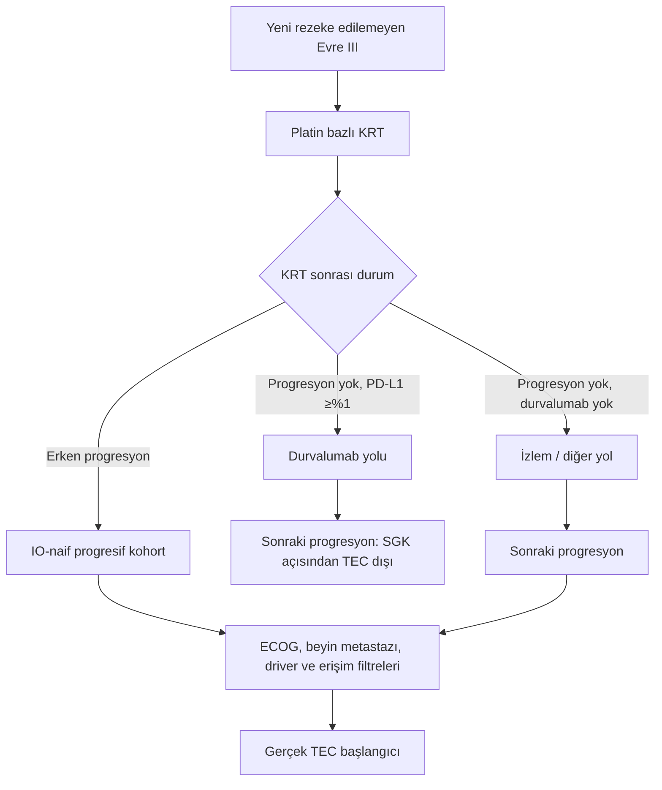

# Türkiye NSCLC BP27 Planı: Tedavi Süresi, ECOG, Pazar Payı ve İkinci Basamak Hasta Akışı

## Farid Bidgoli’nin İtirazlarına Türkiye Özelinde Kanıta Dayalı Yanıt ve Dinamik Modelleme Önerisi

**Rapor tarihi:** 24 Temmuz 2026  
**Kapsam:** Türkiye, küçük hücreli dışı akciğer kanseri (KHDAK/NSCLC), 1. basamak ve kemoterapi sonrası lokal ileri/metastatik tedavi akışları  
**Terminoloji varsayımı:** “TEC” = **Tecentriq (atezolizumab)**; “KEY” = **Keytruda (pembrolizumab)**  
**Amaç:** Farid Bidgoli’nin e-postasında ve bir ay önceki toplantıda yönelttiği soruları; klinik kanıt, Türkiye ruhsat/geri ödeme koşulları, pazar payı matematiği ve dinamik hasta-akış modellemesi açısından ayrıntılı olarak değerlendirmek

---

## 1. Yönetici özeti

Farid’in e-postası, sunulan BP27 planını bütünüyle reddetmemektedir. E-postanın temel mesajı, planın bazı kritik varsayımları **doğru payda, açık tanım, güvenilir kaynak ve dinamik hasta-akış mantığı olmadan** kullandığıdır.

Sorun yalnızca dört ayrı varsayımdan ibaret değildir. Planın altında daha temel beş metodolojik karışıklık bulunmaktadır:

1. **Medyan tedavi süresi ile hasta başına beklenen maruziyet süresi** birbirine karıştırılmıştır.
2. **Klinik olarak gözlenen hasta ile ruhsatça uygun ve SGK tarafından geri ödenebilir hasta** aynı kabul edilmiştir.
3. **Mevcut hasta stoku, yeni hasta akışı ve tedavide kalan aktif hasta stoku** birbirinden ayrılmamıştır.
4. **Toplam pazar payı ile monoterapi segmenti içindeki pazar payı** aynı yüzde diliyle sunulmuştur.
5. **Evre III hastalığın biyolojik progresyon havuzu ile TEC’e gerçekten dönüşebilen ticari hasta havuzu** eşitlenmiştir.

Bu nedenle dört ana konuya ilişkin nihai hüküm şöyledir:

| Konu | Farid’in itirazı | Kanıta dayalı hüküm | BP27’ye önerilen uygulama |
|---|---|---|---|
| 1L RWE DoT’nin 10 ayın altında olması | Güvenilir kaynakla doğrulanmalı | **Haklı.** Medyan DoT’nin 10 ayın altında olması yön olarak destekleniyor; ancak “medyan”, “restricted mean” ve ciroya esas beklenen maruziyet ayrılmalı | Tek sayı yerine rejim × ECOG × basamağa özgü tedavide kalma eğrisi |
| ECOG 3’ün ilave hasta havuzu olması | T0’da yoksa upside olabilir | **Türkiye için base case’te yanlış.** TEC KÜB ve SGK koşulu ECOG 0–1’dir | ECOG 3 geri ödemeli havuza eklenmemeli; yalnız ayrı, geri ödemesiz/off-label duyarlılık senaryosu |
| %30 Chemo/KEY sonrası %70 mono segmentte %35 pay | Mevcut performansın altında kalıyor | **Farid’in matematiği doğrudur**, paydalar aynıysa | Hold-share senaryosu yaklaşık %40 toplam pay; %35 toplam pay açıkça “erozyon senaryosu” olarak adlandırılmalı |
| İkinci basamak ve Evre IIIB potansiyeli | Mutlak hasta sayısı ve wash-out tarihi eksik | **Sorunun tanımında haklı; havuzun kapsamı konusunda kısmen hatalı.** Ruhsat, SGK ve tedavi basamağı karıştırılıyor | Legacy stok + aylık yeni progresyon + aktif tedavi kuyruğu şeklinde kohort modeli |

### Temel yönetim kararı

> “İkinci basamakta garanti havuz” ifadesi kullanılmamalıdır. Türkiye’de sürekli bir **biyolojik progresyon akışı** vardır; fakat TEC’e dönüşebilen havuz, progresyon anında hastanın IO-naif, ECOG 0–1, diğer KÜB/SGK kriterlerine uygun ve sistemik tedavi alabilecek durumda kalmasıyla belirlenir.

---

## 2. Problemin ayrıntılı tanımı

### 2.1. Farid’in e-postadaki dört sorgusu

Farid’in e-postası aşağıdaki dört varsayımı test etmektedir:

#### A. Birinci basamak tedavi süresi

Ekip, gerçek yaşam koşullarında 1L NSCLC tedavi süresinin 10 aydan kısa olabileceğini belirtmiştir. Farid, bu varsayımı kaynak gösterilmeden kabul etmemekte ve karşılaştırmalı pazar verileriyle doğrulanmasını istemektedir.

Buradaki asıl soru yalnızca “10 aydan kısa mı?” değildir:

- Hangi molekül ve rejim?
- Monoterapi mi, kemo-IO mu?
- ECOG 0–1 mi, daha kötü performanslı hasta karışımı mı?
- Medyan mı, aritmetik ortalama mı, restricted mean mi?
- DoT mi, time to discontinuation mı, PFS mi?
- Yeni başlayan hastalar mı, mevcut aktif hasta stoku mu?

Bu tanımlar verilmeden kullanılan “<10 ay” ifadesi, yön olarak doğru olsa bile bütçe modeli açısından yetersizdir.

#### B. ECOG 3 hastaları

Ekip, ECOG 3 hastalardaki erken tedavi bırakmayı kayıp olarak değerlendirmiştir. Farid ise bu hastaların T0 hasta akışında bulunmadığını, buna rağmen tedavi ediliyorlarsa teorik olarak ilave bir hasta havuzu yaratabileceklerini düşünmektedir.

Farid’in mantığı yalnızca şu koşullarda geçerli olabilir:

1. ECOG 3 hastalar gerçekten T0 paydasının dışında bırakılmışsa,
2. buna rağmen yeni ve ilave olarak tedavi başlatılıyorsa,
3. mevcut satış/hasta stoku içinde önceden sayılmamışsa,
4. ruhsat ve geri ödeme açısından uygulanabilirlerse.

Türkiye’de dördüncü koşul sağlanmamaktadır: atezolizumabın ilgili KÜB ve SGK kriterleri ECOG 0–1 ile sınırlıdır.

#### C. Pazar payı matematiği

Ekip, gelecekte pazarın %30’unun Chemo/KEY segmentine gideceğini, kalan %70 monoterapi havuzunda TEC’in %35 pay alacağını varsaymıştır. Farid, mevcut toplam pay ile monoterapi segmenti içindeki payı yeniden hesaplayarak bunun mevcut performansın altında kaldığını belirtmektedir.

Burada kritik problem, %35’in neyin payı olduğunun açık olmamasıdır:

- toplam pazarın mı,
- monoterapi segmentinin mi,
- yeni başlayan hastaların mı,
- aktif tedavi stokunun mu,
- hacim mi, değer mi?

#### D. İkinci basamak ve Evre IIIB potansiyeli

Farid, TEC’in lokal ileri hastalık bağlamındaki kullanımını ve bazı hekimlerin Evre IIIB’de kemo/radyoterapi uygulamasını ikinci basamak fırsatıyla ilişkilendirmektedir. Bir ay önceki toplantıda ise daha açık şekilde:

- ikinci basamaktaki mutlak hasta sayısını,
- ikinci basamak DoT’yi,
- 1L’de IO dışı tedavi alıp sonraki basamakta IO’ya uygun hale gelenleri,
- yıl sonuna kadar yapılacak aktivasyonun hasta ve gelir etkisinin ne zaman tükeneceğini

sormuştur.

Bu, yüzdesel ve statik bir pazar büyüklüğü tahmininden farklıdır. Farid’in istediği şey, **aylık kohort tabanlı stok-akış ve tedavide kalma modelidir**.

---

## 3. Metodolojik yaklaşım ve kanıt hiyerarşisi

Bu değerlendirme dört kanıt katmanını birbirinden ayırmaktadır:

1. **Türkiye’nin güncel KÜB ve SGK/SUT koşulları:** Uygun ve geri ödemeli ticari havuzun üst sınırını belirler.
2. **Türkiye epidemiyolojisi ve gerçek yaşam verileri:** Hasta havuzunun büyüklüğü ve yerel tedavi örüntüleri hakkında çerçeve sağlar.
3. **Uluslararası randomize ve gerçek yaşam çalışmaları:** DoT ve progresyon için başlangıç priörleri sağlar.
4. **Yerel hekim içgörüleri:** Hipotez ve senaryo oluşturur; tek başına doğrulanmış katsayı olarak kullanılamaz.

### 3.1. Kanıt sınıflaması

| İfade | Kanıt durumu |
|---|---|
| 1L IO medyan DoT çoğunlukla 10 ayın altındadır | Uluslararası RCT ve RWE ile destekli |
| ECOG 3’te erken drop-off yüksektir | Sınırlı ve heterojen RWE ile destekli |
| ECOG 3 Türkiye’de TEC için geri ödemeli upside’dır | Güncel KÜB/SUT ile desteklenmiyor |
| KRT sonrası ilk 6 ayda %20–25 progresyon olur | Uluslararası verilerle makul senaryo; Türkiye’de doğrulanmış sabit oran değil |
| Evre III kaynaklı progresyon 18–24 ay boyunca devam eder | RCT ve RWE ile yönsel olarak destekli |
| İkinci basamak havuzu Şubat veya Mart 2027’de tamamen biter | Mevcut verilerle hesaplanamaz |
| Güncel SUT’ta durvalumab için “6 ay kuralı” vardır | Desteklenmiyor |
| 2L atezolizumab için PD-L1 pozitifliği gerekir | Yanlış; ilgili 2L KÜB/SUT koşulunda PD-L1 eşiği yoktur |

---

## 4. Birinci basamak DoT varsayımının ayrıntılı değerlendirmesi

### 4.1. Dış kanıt

| Rejim/çalışma | Tasarım ve hasta grubu | Tedavi süresi bulgusu | Modelleme yorumu |
|---|---|---|---|
| 1L pembrolizumab monoterapi | ABD EHR/RWE; PD-L1 ≥%50; ECOG 0–1, n=807 | Medyan rwToT 7,4 ay; 24 aylık restricted mean 10,3 ay | Medyan <10 ay, fakat beklenen maruziyet 10 ayı aşabilir |
| Aynı çalışma, ECOG 2 | RWE, n=237 | Medyan 2,1 ay; 24 aylık restricted mean 5,9 ay | ECOG karışımı ticari sonucu ciddi değiştirir |
| 1L pembrolizumab + pemetrekset/karboplatin | ABD RWE, nonskuamöz, ECOG 0–1 | Pembrolizumab rwToT 5,6 ay; rwPFS 6,4 ay | DoT ve PFS aynı değildir |
| 1L pembrolizumab + karboplatin/(nab-)paklitaksel | ABD RWE, skuamöz, ECOG 0–1 | Medyan rwToT 6,5 ay; 12 ayda %29,3, 24 ayda %15,9 tedavide | Belirgin uzun sağ kuyruk vardır |
| 1L atezolizumab monoterapi, IMpower110 | Faz III; yüksek PD-L1, tedavi-naif | Medyan tedavi süresi 5,3 ay | RWE değil; atezolizumab için klinik çalışma priörüdür |

Kaynaklar: [Velcheti 2022](https://doi.org/10.3390/cancers14041041), [pembrolizumab+pemetrekset/karboplatin RWE](https://doi.org/10.1038/s41598-021-88453-8), [skuamöz kemo-pembrolizumab RWE](https://doi.org/10.1016/j.jtocrr.2022.100444), [IMpower110](https://doi.org/10.1056/NEJMoa1917346).

### 4.2. Neden medyan DoT ciro hesabı için yeterli değildir?

Medyan DoT, hastaların yarısının tedaviyi bıraktığı zamanı gösterir. Hasta başına beklenen tedavi ayını veya toplam maruziyeti doğrudan vermez. İmmünoterapilerde:

- erken progresyon/toksisite nedeniyle ilk aylarda yüksek drop-off,
- küçük bir hasta grubunda uzun süreli yanıt,
- veri kesiminde tedavisi devam eden sansürlü hastalar

aynı anda bulunur.

Bu nedenle örneğin 7,4 aylık medyan, 24 aylık ufukta 10,3 aylık restricted mean maruziyetle birlikte görülebilir. BP27 gelir tahmininde kullanılması gereken metrik:

\[
\operatorname{RMST}_{\tau}
=
\int_{0}^{\tau} S_{\text{DoT}}(t)\,dt
\]

Burada \(S_{\text{DoT}}(t)\), başlangıçtan \(t\) ay sonrasına kadar tedavide kalma olasılığı; \(\tau\) ise model ufkudur.

### 4.3. Önerilen Türkiye DoT analizi

Türkiye verisi şu şekilde analiz edilmelidir:

1. İndeks tarih: ilk ilaç uygulama tarihi.
2. Bitiş: son uygulama + rejime uygun kapsama süresi.
3. Ana boşluk tanımı: 60 gün.
4. Duyarlılık analizleri: 30 ve 90 gün.
5. Veri kesiminde tedavide olanlar: sağdan sansürlü.
6. Ölüm: ayrı sonlanım veya competing event.
7. Progresyon sonrası devam: mümkünse ayrıca işaretlenmeli.
8. Alt gruplar:
   - 1L mono / 1L kemo-IO / kemoterapi sonrası IO,
   - ECOG 0 / 1 / ≥2,
   - histoloji,
   - PD-L1,
   - beyin metastazı,
   - yaş ve komorbidite,
   - kamu/özel ödeme.

### 4.4. Hüküm

> “1L RWE DoT 10 ayın altındadır” ifadesi, **medyan** açısından savunulabilir. Ancak Farid haklı olarak bunun kaynaklandırılmasını istemektedir. Ciro modelinde medyanın doğrudan “hasta başına tedavi ayı” olarak kullanılması metodolojik olarak uygun değildir.

---

## 5. ECOG 3 tartışmasının ayrıntılı değerlendirmesi

### 5.1. Türkiye KÜB ve geri ödeme koşulu

24 Temmuz 2026 itibarıyla güncel TECENTRIQ KÜB ve Türkiye geri ödeme koşullarında kemoterapi sonrası lokal ileri/metastatik KHDAK kullanımı için başlıca kriterler şunlardır:

- ECOG performans durumu 0–1,
- semptomatik beyin metastazı olmaması,
- daha önce 1–2 basamak kemoterapi alınmış olması,
- sonrasında progresyon gelişmesi,
- non-skuamöz metastatik hastada EGFR/ALK/ROS negatifliğinin raporlanması,
- başka bir immünoterapinin tedavi öncesi veya sonrasında kullanılmaması.

Kaynaklar: [TECENTRIQ güncel KÜB sayfası](https://www.medikaynak.com/medikaynak/urunler/tecentriq/kub-kt/kub-kt.html), [TECENTRIQ geri ödeme koşulları](https://www.medikaynak.com/medikaynak/urunler/tecentriq/tecentriq-geri-odeme-detay.html), [güncel konsolide SUT](https://www.lexpera.com.tr/mevzuat/tebligler/sosyal-guvenlik-kurumu-saglik-uygulama-tebligi).

Bu nedenle TEC başlangıcında ECOG 3 olan hasta, Türkiye’de geri ödemeli BP27 base-case hasta havuzuna eklenemez.

### 5.2. ECOG ölçüm zamanının önemi

“ECOG 3 hasta” tek bir değişken değildir. En az dört zaman noktası ayrılmalıdır:

1. Tanı anındaki ECOG,
2. KRT/kemoterapi bitimindeki ECOG,
3. progresyon anındaki ECOG,
4. TEC başlangıcındaki ECOG.

Olası yorumlar:

| Gözlem | Doğru sınıflama |
|---|---|
| Tanıda ECOG 3, TEC başlangıcında ECOG 0–1 | Başlangıçta uygun hale gelmiş hasta; ECOG 3 olarak modellenmemeli |
| TEC’e ECOG 0–1 ile başlayıp sonra ECOG 3’e düşme | DoT/drop-off olayı |
| Başlangıçta ECOG 3 ve kamu geri ödemesi | Kodlama, raporlama tarihi veya uygulama uyumu denetlenmeli |
| Özel ödeme/off-label ECOG 3 başlangıcı | Base case dışı, ayrı senaryo |
| Mevcut satış/hasta verisinde zaten bulunan ECOG 3 | Hasta akışına tekrar eklenmemeli; çift sayım olur |

### 5.3. Klinik kanıt

ECOG 3 hastalarda kanıt sınırlı, retrospektif ve heterojendir. Karma ajan/basamak kohortunda yalnız 18 ECOG 3 hasta için:

- medyan PFS 1,3 ay,
- medyan OS 1,5 ay

bildirilmiştir. Bu sonuç, ECOG 3’te kısa maruziyet ve erken başarısızlık riskini destekler; fakat 1L atezolizumaba özgü bir tahmin değildir. [Ahmed ve ark.](https://doi.org/10.1016/j.cllc.2020.01.001)

ECOG 3–4 hastaları içeren küçük bir nivolumab çalışmasında sağkalım avantajı doğrulanmamış, kötü performans grubunda ağır pnömonit oranı yüksek bulunmuştur. [Katsura ve ark.](https://doi.org/10.7150/jca.31217)

### 5.4. Hüküm

Farid’in “T0’da yoksa ilave gross pool olabilir” mantığı veri muhasebesi açısından test edilebilir; fakat:

- ruhsat/SGK uygunluğu,
- klinik persistans,
- mevcut satışlarda zaten yer alıp almadığı

kontrol edilmeden ticari upside olarak sunulamaz.

> Türkiye geri ödemeli base case’inde ECOG 3 hasta sayısı **0** kabul edilmelidir. Gözlenen özel ödeme/off-label kullanım varsa “gross observed treated pool” olarak ayrıca raporlanabilir; “eligible pool” olarak adlandırılmamalıdır.

---

## 6. Pazar payı matematiğinin ayrıntılı rekonstrüksiyonu

### 6.1. Verilen varsayımlar

- Mevcut toplam pazar payı: %52
- Mevcut monoterapi segmentindeki TEC payı: %57
- Gelecekte Chemo/KEY segmenti: %30
- Gelecekte monoterapi segmenti: %70
- Ekibin önerdiği gelecek payı: %35

### 6.2. Mevcut monoterapi segmentinin ima edilen büyüklüğü

Mevcut toplam pazar payı, monoterapi segment büyüklüğü ile mono içi TEC payının çarpımıysa:

\[
\text{Mevcut mono segment ağırlığı}
=
\frac{52\%}{57\%}
=
91{,}2\%
\]

Bu, mevcut pazarın yaklaşık %91,2’sinin ilgili monoterapi havuzu, kalan yaklaşık %8,8’inin diğer segmentler olduğunu ima eder.

### 6.3. Segment payı korunursa

Gelecekte monoterapi segmenti %70’e düşerken TEC mono içi %57 payını korursa:

\[
\text{Gelecek toplam TEC payı}
=
70\%\times57\%
=
39{,}9\%
\]

Bu nedenle Farid’in yaklaşık %40 hesabı doğrudur.

### 6.4. %35 toplam pay ne anlama gelir?

Eğer %35 toplam pazar payıysa:

\[
\text{Mono içi TEC payı}
=
\frac{35\%}{70\%}
=
50\%
\]

Sonuç:

- mevcut %57’den %50’ye **7 yüzde puanı** kayıp,
- %39,9 hold-share beklentisine karşı **4,9 puan toplam pazar payı** kaybı,
- mono içi payda yaklaşık **%12,3 göreli erozyon**.

Eğer %35 monoterapi segment payı olarak kastedilmişse:

\[
70\%\times35\%=24{,}5\%
\]

toplam pay ortaya çıkar. Bu çok daha büyük bir kayıptır.

### 6.5. Yüzde kullanımı için zorunlu etiketler

Her pazar payı hücresinde aşağıdaki alanlar bulunmalıdır:

| Boyut | Seçenekler |
|---|---|
| Payda | Toplam uygun pazar / mono segment / tüm tedavi edilenler |
| Zaman mantığı | Yeni başlangıç akışı / aktif hasta stoku / belirli ay veya yıl |
| Ölçü | Hasta / kür / ünite / net satış değeri |
| Basamak | 1L / kemoterapi sonrası / rekürren-metastatik ilk rejim |
| Erişim | Ruhsatlı / SGK geri ödemeli / özel ödeme |

### 6.6. Önerilen senaryolar

| Senaryo | Mono içi pay | Toplam pay | Yönetim yorumu |
|---|---:|---:|---|
| Hold-share | %57 | %39,9 | Mevcut rekabet gücü korunur |
| Kontrollü erozyon | %50 | %35,0 | Ekibin mevcut varsayımı; pay kaybı açıkça kabul edilir |
| Daha yüksek erozyon | %45 | %31,5 | Downside |
| Mono içinde büyüme | %60 | %42,0 | Upside |

%35, nötr base case olarak değil, gerekçelendirilmiş bir **erozyon senaryosu** olarak sunulmalıdır.

---

## 7. Evre III/IIIB, KRT ve TEC endikasyonu: kritik kavramsal düzeltmeler

### 7.1. “TEC’in Evre IIIB ruhsatı var” ifadesi neden sorunludur?

Güncel TECENTRIQ KÜB’ünde “Evre IIIB” şeklinde bağımsız bir endikasyon ifadesi bulunmamaktadır. İlgili endikasyon:

> ECOG 0–1 olan, uygun moleküler ve klinik kriterleri sağlayan, daha önce 1–2 basamak kemoterapi almış ve progresyon gelişmiş lokal ileri ve/veya metastatik KHDAK

çerçevesindedir.

Bu nedenle “lokal ileri” ifadesi bazı Evre IIIB hastaları kapsayabilse de:

- progrese olmamış Evre III hastada KRT yerine atezolizumab verilebileceği,
- KRT sonrası konsolidasyonda atezolizumab kullanılabileceği,
- her Evre IIIB hastanın doğrudan TEC adayı olduğu

anlamına gelmez.

Doğru ifade:

> “Bazı Evre IIIB hastalar, kemoterapi/KRT sonrası progresyon göstermeleri ve progresyon anında KÜB/SGK kriterlerini karşılamaları halinde kemoterapi sonrası lokal ileri hastalık kapsamında TEC adayı olabilir.”

### 7.2. Durvalumab yolu

Güncel Türkiye geri ödeme düzenlemesinde rezeke edilemeyen Evre III KHDAK için durvalumabın ilgili yolu:

- PD-L1 ≥%1,
- platin bazlı KRT sonrası progresyon olmaması,
- monoterapi,
- hastalık progresyonu/kabul edilemez toksisiteye veya en fazla 12 aya kadar

şeklindedir. Durvalumab kullanan hastalarda sonraki basamak başka bir immünoterapinin geri ödenmemesi kritik bir dışlama faktörüdür. [10 Temmuz 2025 tarihli resmî SUT değişikliği](https://www.resmigazete.gov.tr/eskiler/2025/07/20250710-13.pdf)

### 7.3. “Altı ay kuralı” düzeltmesi

Güncel Evre III durvalumab KÜB/SUT hükümlerinde “altı ay içinde başlanmazsa alınamaz” veya “altı ay nedeniyle durvalumab kullanamaz” biçiminde bir uygunluk kuralı bulunmamaktadır.

Erken progresyon gösteren hasta durvalumabı:

- altı aylık süreyi kaçırdığı için değil,
- KRT sonrası **progresyonsuz olma koşulunu karşılamadığı için**

alamaz.

Bu nedenle mevcut modeldeki “PD-L1 pozitif olup altı ay kuralı nedeniyle durvalumab alamayan garanti TEC havuzu” ifadesi çıkarılmalıdır.

### 7.4. PD-L1 segmentasyonunun doğru rolü

PD-L1:

- Evre III durvalumab konsolidasyonuna yönlenme bakımından önemlidir,
- 1L atezolizumab monoterapi bakımından önemlidir,
- fakat kemoterapi sonrası lokal ileri/metastatik atezolizumab koşulunda zorunlu bir pozitiflik eşiği değildir.

Bu nedenle ikinci basamak hunisinde PD-L1, “TEC’e biyobelirteç uygunluğu” değil, daha çok **önceki durvalumab alma ve dolayısıyla sonraki TEC havuzundan çıkma olasılığını** modelleyen bir değişken olarak kullanılmalıdır.

---

## 8. Evre III kaynaklı doğru hasta yolu

### 8.1. Ticari olarak ayrılması gereken kohortlar

| Kohort | TEC bakımından değerlendirme |
|---|---|
| KRT-only → progresyon → IO-naif | Potansiyel; tüm klinik/SGK filtreleri uygulanmalı |
| KRT → durvalumab → progresyon | Ardışık IO kısıtı nedeniyle geri ödemeli TEC havuzunun dışında |
| PD-L1 <1 veya durvalumab almamış → geç progresyon | IO-naif ve diğer kriterlere uygunsa potansiyel |
| 1L kemoterapi-only metastatik → progresyon | Ana legacy/azalan 2L kaynaklarından biri |
| 1L IO veya kemo-IO → progresyon | Sonraki TEC geri ödemesi açısından genellikle dışarıda |
| Lokal/oligoprogresyon → yalnız lokal tedavi | Progresyon havuzunda görülür, TEC başlangıcına dönüşmez |
| Progresyonda ECOG ≥2 veya semptomatik beyin metastazı | Geri ödemeli TEC havuzunun dışında |

### 8.2. Basamak terminolojisi

KRT sonrası ilk rekürren/metastatik sistemik tedavi:

- bazı ticari raporlarda “2L”,
- bazı onkoloji veri setlerinde “rekürren/metastatik 1L”,
- bazı ödeme algoritmalarında “önceki kemoterapi sonrası tedavi”

olarak sınıflandırılabilir.

Bu nedenle raporda “2L” etiketi tek başına kullanılmamalı; aşağıdaki tanımlardan biri seçilmelidir:

- **post-platin progresyon TEC-eligible**,  
- **rekürren/metastatik ilk sistemik rejim**,  
- **metastatik 2L**,  
- **durvalumab sonrası salvage**.

Bu havuzlar birbirine eşit değildir.

---

## 9. Türkiye’de mutlak hasta havuzunun epidemiyolojik üst sınırı

### 9.1. GLOBOCAN 2024

IARC’nin Temmuz 2026 tarihli Türkiye fact sheet’inde 2024 için:

- yeni akciğer kanseri: **37.846**,
- akciğer kanseri ölümü: **31.674**,
- beş yıllık prevalans: **49.303**

olarak tahmin edilmiştir. Bunlar doğrudan gözlenmiş ulusal hasta sayıları değil, alt-ulusal kayıt hızlarının 2024 nüfusuna uygulanmasıyla elde edilen model tahminleridir. [IARC GLOBOCAN 2024 Türkiye](https://gco.iarc.who.int/media/globocan/factsheets/populations/792-turkiye-fact-sheet.pdf)

### 9.2. Kaba üst sınır hesabı

Uluslararası ve Türkiye literatüründeki yaklaşık %80–85 KHDAK ve %20–25 Evre III oranları kullanılırsa:

\[
37.846\times(0{,}80\text{–}0{,}85)
=
30.277\text{–}32.169
\]

yıllık KHDAK ve:

\[
(30.277\text{–}32.169)\times(0{,}20\text{–}0{,}25)
\approx
6.100\text{–}8.000
\]

yıllık kaba Evre III KHDAK üst sınırı elde edilir.

Bu sayı:

- rezeke edilebilir hastaları,
- KRT alamayanları,
- hiç tedavi alamayanları,
- durvalumab yoluna gidenleri,
- ECOG/driver/beyin metastazı nedeniyle dışlananları

henüz çıkarmamaktadır. Dolayısıyla BP27’ye “TEC hasta sayısı” olarak konulamaz.

### 9.3. STONE Türkiye çalışması

Türkiye STONE çalışması, 2013–2017 arasında 10 radyasyon onkolojisi merkezinde RT alan, cerrahi uygulanmamış 492 Evre III KHDAK hastasını içermektedir:

- %89,2 kemo+RT,
- takip boyunca %58,4 ilk progresyon,
- progresyon yaşayanlarda ilk tedavi bitiminden progresyona medyan 9,3 ay,
- tüm kohortta tanıdan itibaren medyan PFS 13,4 ay,
- progresörlerin %64,6’sında herhangi bir sonraki tedavi,
- progresörlerin 121/288’inde, yaklaşık %42,0’sinde sistemik tedavi,
- yalnız 3 hastada IO kullanımı.

[STONE tam makale](https://doi.org/10.4999/uhod.225876)

Kritik sınırlılıklar:

- pre-PACIFIC/pre-durvalumab dönemidir,
- ulusal insidans çalışması değildir,
- yalnız RT alan merkez hastalarını içerir,
- %58,4 oranı 6 veya 12 aylık progresyon oranı değildir,
- %64,6 TEC’e veya sistemik tedaviye dönüşüm oranı değildir,
- güncel IO sıralamasını temsil etmez.

STONE, Türkiye için tarihsel tedavi/progresyon baseline’ı sağlayabilir; güncel TEC potansiyel katsayısı olarak doğrudan kullanılamaz.

---

## 10. “İlk altı ayda %20–25 progresyon” varsayımı

### 10.1. Kanıtın yorumu

Uluslararası durvalumab-era kohortlarında ilk altı ay erken olay oranları yaklaşık:

- %18,0: seçilmiş Kore durvalumab starter kohortu,
- %31,2: İsrail iki merkez kohortu,
- N3/yüksek risk alt grubunda daha yüksek

bildirilmiştir. [Kore kohortu](https://doi.org/10.21037/tlcr-2024-1112), [İsrail kohortu](https://doi.org/10.1111/1759-7714.70130)

Dolayısıyla %20–25:

- klinik olarak makul bir **baz senaryo**,
- fakat doğrulanmış Türkiye parametresi değildir.

### 10.2. Önerilen senaryolar

| Senaryo | KRT bitiminden sonraki ilk 6 ayda progresyon/erken olay varsayımı | Kullanım |
|---|---:|---|
| Düşük | %15–18 | İyi risk, düşük N3/yük |
| Baz | %20–25 | Yerel veri gelene kadar çalışma priörü |
| Yüksek | %30–35 | Yüksek risk/heterojen gerçek yaşam |

Bu oranların paydası açıkça yazılmalıdır:

- KRT’ye başlayan mı,
- KRT’yi tamamlayan mı,
- KRT sonrası progresyonsuz olan mı,
- durvalumaba başlayan mı?

Bu paydalar değiştirildiğinde aynı yüzde tamamen farklı bir hasta sayısı üretir.

### 10.3. Zaman sıfırı

Türkiye hasta-akış modelinde zaman sıfırı:

> **definitif radyoterapinin bitiş tarihi**

olmalıdır.

Durvalumab başlangıcı zaman sıfırı yapılırsa, KRT ile durvalumab arasında progresyon gösteren hastalar veri setinden sistematik olarak kaybolur; bu “immortal time/selection” benzeri bir yanlılık yaratır.

---

## 11. Wash-out kavramının doğru tanımı

### 11.1. Neden tek bir wash-out tarihi yoktur?

“Havuz Şubat 2027’de mi, Mart 2027’de mi biter?” sorusu en az üç farklı olguyu tek tarih altında birleştirmektedir:

1. **Legacy hasta stokunun tükenmesi:** Bugün uygun olup henüz TEC başlamamış kemoterapi-only/IO-naif hastalar.
2. **Yeni uygun hasta akışının sürmesi:** Her ay KRT veya 1L kemoterapi kohortlarından yeni progresörlerin gelmesi.
3. **Aktif tedavi/gelir kuyruğu:** Kampanya veya yeni başlangıçlar sona erse bile daha önce başlayan hastaların tedavide kalması.

Yalnız birinci bileşen için “stok tükeniş ayı” hesaplanabilir. Biyolojik hastalık akışı, yeni insidan kohortlar geldikçe devam eder.

### 11.2. OAK ve 3 aylık drop-off

Kemoterapi sonrası atezolizumabın OAK çalışmasında:

- medyan tedavi süresi 3,4 ay,
- medyan PFS 2,8 ay,
- yaklaşık %21 hasta 12 aydan uzun tedavi,
- yaklaşık %40 hasta progresyon sonrasında da tedaviye devam

etmiştir. [OAK](https://doi.org/10.1016/S0140-6736(16)32517-X)

TAIL’de daha geniş gerçek yaşam-benzeri popülasyonda medyan atezolizumab süresi 3,2 ay, PFS 2,7 ay ve OS 11,1 ay bulunmuştur; ECOG 2 alt grubunda sonuçlar belirgin olarak daha kötüdür. [TAIL](https://doi.org/10.1136/jitc-2020-001865)

Bu veriler hekimin “ilk üç ay deneme/yanıt bariyeri” içgörüsüyle uyumludur; fakat tüm hastalara sabit üç aylık DoT atanmasını desteklemez.

Doğru yaklaşım:

- ilk 0–3 ay yüksek bırakma hazardı,
- 4–12 ay daha düşük hazard,
- 12 ay sonrasında küçük uzun yanıt kuyruğu.

### 11.3. Aralık 2026’da son yeni başlangıç örneği

Eğer son ilave başlangıçlar Aralık 2026’da gerçekleşirse:

- medyan 3,4 ay, kohortun yaklaşık yarısının tedavide kalma eşiğinin Mart–Nisan 2027 civarında geçileceğini düşündürür;
- fakat kesin Şubat/Mart aktif hasta sayısı yalnız tam Kaplan–Meier eğrisiyle hesaplanabilir;
- yaklaşık beşte birlik uzun kuyruk 12 ay ve ötesine uzanabilir.

Dolayısıyla “Mart 2027’de pazar biter” sonucu çıkarılamaz. En fazla:

> “Aralık başlangıç kohortunun erken bırakma ağırlıklı ana kısmı 2027 ilk yarısında azalırken, daha küçük bir uzun yanıt ve gelir kuyruğu yıl sonuna kadar devam eder.”

denebilir.

---

## 12. Önerilen dinamik hasta-akış modeli

### 12.1. Yeni progresyon akışı

Her KRT bitiş kohortu için aylık yeni progresyon:

\[
\text{Yeni progresyon}_t
=
\sum_{k=1}^{K}
\text{KRT bitiren}_{t-k}
\times f_{\text{prog}}(k)
\]

Burada \(f_{\text{prog}}(k)\), KRT bitiminden sonraki \(k\). ayda progresyonun koşulsuz olay-kütlesidir.

Hazard kullanılırsa:

\[
f_{\text{prog}}(k)
=
S_{\text{progresyonsuz}}(k-1)
\times h_{\text{prog}}(k)
\]

Ölüm, progresyondan önce gerçekleşebilen competing event olarak ayrıca modellenmelidir. PFS olayı zaten progresyon veya ölümü içeriyorsa, aynı hastaya sonradan ayrıca sağkalım katsayısı uygulanarak çift iskonto yapılmamalıdır.

### 12.2. Progresyondan TEC başlangıcına dönüşüm

\[
\begin{aligned}
\text{TEC başlangıcı}_t
=\;&
\text{Yeni progresyon}_t \\
&\times P(\text{IO-naif}) \\
&\times P(\text{ECOG 0–1}) \\
&\times P(\text{semptomatik beyin metastazı yok}) \\
&\times P(\text{driver uygun}) \\
&\times P(\text{KÜB/SUT uygun}) \\
&\times P(\text{sistemik tedavi alır}) \\
&\times P(\text{TEC seçilir})
\end{aligned}
\]

Lokal/oligoprogresyon nedeniyle yalnız lokal tedavi alan hastalar ayrıca çıkarılmalıdır.

### 12.3. Uygun fakat tedavi başlamamış stok

\[
\begin{aligned}
E_{t+1}
=\;&E_t
+\text{yeni uygun hasta}_t\\
&-\text{TEC başlangıcı}_t\\
&-\text{rakip/diğer tedavi başlangıcı}_t\\
&-\text{ölüm veya ECOG kaybı}_t\\
&-\text{takipten çıkış}_t
\end{aligned}
\]

### 12.4. Aktif tedavi stoku

\[
\text{OnTx}_t
=
\sum_{k=0}^{K}
\text{TEC başlangıcı}_{t-k}
\times S_{\text{tedavide}}(k)
\]

Bu denklem:

- erken üç aylık drop-off’u,
- sansürlü hastaları,
- uzun yanıt kuyruğunu

ortalama DoT ile yapılan basit çarpımdan daha doğru temsil eder.

### 12.5. Gelir

\[
\text{Net gelir}_t
=
\text{OnTx}_t
\times \text{aylık beklenen uygulama}
\times \text{doz yoğunluğu}
\times \text{net fiyat}
\]

Doz gecikmeleri, atlanan uygulamalar, uygulama takvimi ve fiyat/iskonto dönemi ayrıca modellenmelidir.

---

## 13. Mutlak hasta sayısı için gerekli Türkiye verileri

### 13.1. Kamu veya satış verisinin tek başına yanıtlayamayacağı alanlar

MEDULA/geri ödeme kayıtları:

- ilaç uygulama tarihlerini,
- bazı tanıları,
- rapor ve reçete akışını

gösterebilir; fakat progresyon, ECOG’nin gerçek ölçüm zamanı, PD-L1, moleküler durum veya KRT sonrası klinik karar gibi alanlar eksik olabilir.

Satış/ünite verisi ise:

- aktif hasta stokunu yaklaşık kalibre edebilir,
- ancak benzersiz hasta ve uygunluk hunisini doğrudan vermez.

Bu nedenle en az üç kaynak birleştirilmelidir:

1. SGK/MEDULA veya uygun hasta-bazlı claims verisi,
2. yüksek hacimli merkezlerin EHR/dosya verisi,
3. şirket içi ünite, sipariş ve hasta destek programı verisi.

### 13.2. Asgari veri sözlüğü

| Alan | Amaç |
|---|---|
| Anonim hasta kimliği | Tekilleştirme |
| Tanı ve evre tarihi | Kohort ve zaman sıfırı |
| TNM, rezeke edilebilirlik | Evre III alt grubu |
| Histoloji | Skuamöz/non-skuamöz |
| EGFR, ALK, ROS | Uygunluk filtresi |
| PD-L1 düzeyi ve test tarihi | Durvalumab/1L yol segmentasyonu |
| ECOG: tanı, KRT bitimi, progresyon, TEC başlangıcı | Uygunluk ve drop-off |
| Beyin metastazı ve semptom durumu | SGK filtresi |
| KRT başlangıç/bitiş | Evre III kohort zaman sıfırı |
| Durvalumab başlangıç/bitiş | Önceki IO ve ardışıklık |
| Tüm sistemik tedavi başlangıç/bitişleri | Line-of-therapy |
| Progresyon tarihi ve paterni | İnflow hesabı |
| TEC uygulama tarihleri | DoT/persistans |
| Ölüm/son takip tarihi | Competing risk ve sansür |
| Ödeme türü | SGK/özel/off-label ayrımı |

### 13.3. Önerilen merkez doğrulaması

Yerel tahmin için yalnız hekim görüşü değil, dosya doğrulaması yapılmalıdır:

- 8–12 yüksek hacimli merkez,
- ardışık hasta seçimi,
- son 24–36 ay,
- standart veri formu,
- KRT bitiren hasta paydası,
- progresyondan TEC başlangıcına kadar her kayıp nedeninin kodlanması.

Hekimlerin verdiği “%20–25” gibi oranlar, kendi dosyalarından türetilmiyorsa yalnız qualitative insight olarak saklanmalıdır.

---

## 14. Önerilen istatistiksel analiz planı

### 14.1. DoT ve persistans

- Kaplan–Meier: tedaviyi bırakmaya kadar süre.
- 3, 6, 12 ve 24 ay tedavide kalma olasılığı.
- 12 ve 24 aylık restricted mean treatment time.
- 30/60/90 günlük boşluk duyarlılık analizi.
- Rejim ve ECOG için stratifikasyon.

### 14.2. KRT sonrası progresyon

- KRT bitiminden progresyona kümülatif insidans.
- Progresyon öncesi ölüm competing risk ise Aalen–Johansen yaklaşımı.
- Durvalumab starter’larıyla sınırlandırılmış analiz ayrıca sunulmalı; all-comer analizinin yerine geçmemeli.

### 14.3. Çok durumlu model

Önerilen durumlar:

1. KRT tamamlandı,
2. progresyonsuz/durvalumab başlamadı,
3. durvalumab başladı,
4. progresyon,
5. TEC için uygun,
6. TEC başladı,
7. TEC bırakıldı,
8. ölüm.

Bu model, Farid’in “hangi hasta ne zaman ikinci basamak havuzuna düşüyor ve ne kadar tedavide kalıyor?” sorusuna statik Excel hunisinden daha doğru yanıt verir.

### 14.4. Belirsizlik

Her kritik parametre için:

- düşük/baz/yüksek nokta tahmini,
- mümkünse %95 güven veya olasılık aralığı,
- Monte Carlo simülasyonu,
- tek yönlü duyarlılık analizi

sunulmalıdır.

En etkili belirsizlik kaynakları büyük olasılıkla:

1. aylık kemoterapi-only/IO-naif progresör sayısı,
2. durvalumab kullanım oranı,
3. progresyonda ECOG 0–1 kalma oranı,
4. progresyondan sistemik tedaviye dönüşüm,
5. TEC seçim oranı,
6. uzun DoT kuyruğudur.

---

## 15. BP27 için geçici model priörleri

Yerel veri tamamlanana kadar aşağıdaki değerler yalnız başlangıç priörü olarak kullanılabilir:

| Parametre | Düşük | Baz | Yüksek | Not |
|---|---:|---:|---:|---|
| 1L mono, ECOG 0–1 medyan DoT | 5,5 ay | 7–7,5 ay | 9 ay | Gelir için RMST kullanılmalı |
| 1L kemo-IO medyan DoT | 5 ay | 5,5–6,5 ay | 8 ay | Rejim/histoloji ayrılmalı |
| Kemoterapi sonrası atezolizumab medyan DoT | 2,5 ay | 3,2–3,4 ay | 4,5 ay | Uzun kuyruk ayrıca korunmalı |
| KRT sonrası ilk 6 ay erken progresyon/olay | %15–18 | %20–25 | %30–35 | Türkiye parametresi değildir |
| ECOG 3 geri ödemeli TEC başlangıcı | 0 | 0 | 0 | Özel ödeme ayrı senaryo |
| Mevcut mono içi TEC payı korunursa toplam pay | — | %39,9 | — | Mono segment %70 varsayımı |
| %35 toplam pay | — | %50 mono içi pay | — | Erozyon senaryosu |

Progresyondan gerçek TEC başlangıcına dönüşüm oranı için güvenilir dış katsayı önerilmemektedir; bu değer yerel veriden hesaplanmalıdır.

---

## 16. Farid’in dört sorusuna doğrudan yanıt

### Soru 1 — 1L DoT gerçekten 10 ayın altında mı?

**Yanıt:** Medyan açısından büyük ölçüde evet. 1L IO gerçek yaşam/klinik çalışma verileri yaklaşık 5–8 aylık medyanları desteklemektedir. Fakat gelir projeksiyonu için medyan değil, tedavide kalma eğrisi ve restricted mean kullanılmalıdır. 7,4 aylık medyanın 24 aylık restricted mean’i 10,3 ay olabilir.

### Soru 2 — ECOG 3, T0’a ek bir upside mı?

**Yanıt:** Türkiye’de geri ödemeli TEC base case’i için hayır. KÜB ve SGK ECOG 0–1 aramaktadır. Başlangıçta ECOG 3 görünen hastalar kodlama, ölçüm zamanı ve ödeme türü açısından denetlenmelidir. Özel ödeme/off-label kullanım varsa ayrı ve yüksek iskonto uygulanmış senaryoda gösterilebilir.

### Soru 3 — %35 pazar payı fazla mı düşük?

**Yanıt:** Evet, mevcut mono içi %57 payın korunması hedefleniyorsa. Mono segment %70’e düştüğünde hold-share toplam pay yaklaşık %39,9 olur. %35 toplam pay, mono içi payın %50’ye düşmesi ve yaklaşık %12,3 göreli erozyon anlamına gelir.

### Soru 4 — İkinci basamakta kaç hasta var ve fırsat ne zaman biter?

**Yanıt:** Kamuya açık epidemiyolojiyle güvenilir kesin sayı ve tarih verilemez. Mutlak sayı, claims/EHR ve şirket içi ünite verisinin tekilleştirilmesiyle hesaplanmalıdır. “Wash-out” üçe ayrılmalıdır:

- mevcut legacy uygun stok,
- her ay gelen yeni progresyon akışı,
- tedavide kalan hasta/gelir kuyruğu.

Yalnız legacy stok için bir tükeniş ayı vardır. Yeni KRT kohortları progresyon ürettikçe biyolojik musluk devam eder; fakat durvalumab ve 1L IO kullanımının artması geri ödemeli IO-naif TEC musluğunu daraltır.

---

## 17. Farid’e sunulması önerilen yönetim çıktıları

Bir sonraki toplantıda statik pazar yüzdesi yerine aşağıdaki yedi çıktı sunulmalıdır:

1. **Assumption ledger:** Her varsayımın tanımı, paydası, kaynağı, tarihi, sahibi ve güven düzeyi.
2. **Türkiye uygunluk waterfall’ı:** Toplam hastadan gerçek TEC başlangıcına kadar mutlak hasta kayıpları.
3. **Aylık kohort akışı:** KRT bitiren, yeni progresyon, IO-naif uygun, TEC başlayan.
4. **DoT eğrileri:** 1L mono, kemo-IO ve kemoterapi sonrası TEC için ayrı.
5. **Üç wash-out eğrisi:** Legacy stok, incident inflow, aktif tedavi/gelir kuyruğu.
6. **Pazar payı köprüsü:** Mevcut %52 toplam → %57 mono içi → yeni segment yapısında %39,9 hold-share.
7. **Düşük/baz/yüksek senaryo ve veri boşlukları:** Tek nokta tahmin yerine aralık.

### Önerilen çalışma takvimi

| Gün | Çıktı |
|---|---|
| 0–1 | Tanım ve line-of-therapy sözlüğünün kilitlenmesi |
| 1–3 | Claims/uygulama ve iç satış verisi çekimi |
| 3–5 | Tekilleştirme, DoT ve aktif hasta stokunun hesaplanması |
| 4–7 | 8–12 merkezde dosya doğrulaması |
| 6–8 | Dinamik kohort ve wash-out modeli |
| 8–10 | Medical, market access, finance ve commercial sign-off |

---

## 18. Farid’e önerilen kısa Türkçe yönetim yanıtı

> DoT konusundaki itirazınızı kabul ediyoruz. Birinci basamakta 10 ayın altındaki medyan tedavi süresi dış kanıtla uyumludur; ancak bütçe modelini medyanla değil, Türkiye’ye kalibre edilmiş tedavide kalma eğrileri ve beklenen maruziyet süresiyle yeniden kuracağız.  
>
> Pazar payı matematiğinde de mevcut mono segment payı %57 korunursa, monoterapi havuzunun %70’e gerilediği senaryoda toplam payımız yaklaşık %40 olmalıdır. %35 toplam pay, mono segmentte yaklaşık 7 puanlık pay kaybı içerir ve bu nedenle nötr base case değil, erozyon senaryosu olarak gösterilecektir.  
>
> ECOG 3 hastaları Türkiye’de TEC için geri ödemeli ilave havuza eklemeyeceğiz; güncel KÜB ve SGK koşulu ECOG 0–1’dir. Gözlenen ECOG 3 kullanımlarını ölçüm zamanı, kodlama ve ödeme türü açısından ayrıca denetleyeceğiz.  
>
> İkinci basamak için yüzdesel değil, mutlak aylık hasta modeli kuracağız. Bu model mevcut legacy stok, her ay yeni progresyonla gelen hastalar ve tedavide kalan hasta kuyruğunu ayrı gösterecek. Evre III kaynaklı progresyon akışı devam etmekle birlikte, durvalumab veya başka IO kullanmış hastalar ile ECOG ve diğer SGK kriterlerini karşılamayan hastalar TEC havuzuna dahil edilmeyecektir. Güncel SUT’ta durvalumab için altı aylık bir uygunluk kuralı bulunmadığından bu varsayımı da modelden çıkaracağız.

---

## 19. Farid’e önerilen İngilizce e-posta taslağı

**Subject: BP27 NSCLC assumptions — Turkey evidence validation and dynamic 2L patient flow**

Hi Farid,

Thank you for challenging the assumptions and for clarifying the level of patient-flow detail required.

We agree that the first-line duration-of-treatment assumption needs to be evidence-based and defined more precisely. External real-world and trial evidence supports a median treatment duration below ten months for the relevant first-line IO regimens, generally in the range of approximately five to eight months. However, we will not use the median as a direct proxy for revenue-generating treatment months. We will rebuild the forecast using regimen- and ECOG-specific treatment-persistence curves and restricted mean exposure, which retain the long responder tail.

We also agree with the market-share arithmetic, provided the denominators are aligned. If the monotherapy segment represents 70% of the future market and we retain our current 57% share within that segment, the implied total market share is approximately 40%. A 35% total-share assumption would therefore imply a decline to 50% within monotherapy and should be presented as an erosion scenario rather than a neutral base case.

For ECOG 3, the Turkey-specific conclusion is different from the initial upside hypothesis. The current Tecentriq label and reimbursement conditions for the relevant NSCLC setting require ECOG 0–1. We will therefore exclude ECOG 3 patients from the reimbursed base-case pool and audit any observed ECOG 3 treatment for performance-status timing, coding and payer source. If such use is confirmed outside reimbursement, it will be shown separately and will not be double-counted in patient flow.

For the post-chemotherapy opportunity, we will provide an absolute monthly cohort model rather than a static market percentage. The model will separately quantify:

1. the current legacy chemotherapy-only/IO-naïve backlog;
2. new monthly progression from prior chemotherapy and stage III CRT cohorts;
3. the proportion remaining clinically and reimbursement eligible at progression;
4. actual Tecentriq starts; and
5. the on-treatment and revenue tail based on observed duration.

For stage III disease, we will distinguish early progressors who never start durvalumab, patients who remain IO-naïve and progress later, and patients previously treated with durvalumab. Under current Turkish reimbursement rules, prior durvalumab/IO materially narrows the later Tecentriq pool. We have also not found a six-month durvalumab eligibility rule in the current Turkish reimbursement text; early progressors are ineligible for consolidation because they have progressed, not because they missed a six-month window.

The final output will provide low, base and high scenarios, explicit denominators and a separately calculated legacy-stock wash-out, incident patient inflow and active-treatment revenue tail.

Best regards,

Merve / Gözde

---

## 20. Sonuç

Farid’in temel beklentisi daha yüksek bir pazar payı hedefi koymaktan ibaret değildir. Beklenti:

- mutlak hasta sayısı,
- ay bazında hasta akışı,
- klinik ve geri ödeme uygunluğu,
- tedavide kalma dağılımı,
- legacy stok ile devam eden yeni akışın ayrılması,
- satışın ne zaman ve hangi hızda azalacağının hesaplanmasıdır.

Sunulan ilk plan bu soruları statik yüzdelerle yanıtlamaya çalışmıştır. Doğru BP27 modeli ise:

1. **kohort tabanlı**,  
2. **zaman bağımlı**,  
3. **KÜB/SUT filtreli**,  
4. **competing-risk ve sansür mantığına uygun**,  
5. **medyan yerine tam DoT eğrisini kullanan**,  
6. **pazar payı paydalarını açıkça ayıran**  

bir model olmalıdır.

Nihai stratejik mesaj:

> Türkiye’de ikinci basamak hastalık biyolojik olarak ortadan kalkmayacaktır; ancak geri ödemeli, IO-naif ve ECOG 0–1 TEC havuzu zaman içinde daralabilir. Fırsatın büyüklüğü Evre III hastaların varlığından değil, progresyonda gerçek TEC uygunluğuna ve başlangıca dönüşümden hesaplanmalıdır.

---

## 21. Temel kaynaklar

### Türkiye mevzuatı ve ürün bilgisi

1. [Sosyal Güvenlik Kurumu Sağlık Uygulama Tebliği — konsolide metin, son değişiklik 1 Temmuz 2026](https://www.lexpera.com.tr/mevzuat/tebligler/sosyal-guvenlik-kurumu-saglik-uygulama-tebligi)
2. [10 Temmuz 2025 tarihli ve 32952 sayılı Resmî Gazete SUT değişikliği](https://www.resmigazete.gov.tr/eskiler/2025/07/20250710-13.pdf)
3. [TECENTRIQ güncel KÜB sayfası](https://www.medikaynak.com/medikaynak/urunler/tecentriq/kub-kt/kub-kt.html)
4. [TECENTRIQ Türkiye geri ödeme koşulları](https://www.medikaynak.com/medikaynak/urunler/tecentriq/tecentriq-geri-odeme-detay.html)
5. [IMFINZI güncel Türkiye KÜB](https://www.astrazeneca.com.tr/content/dam/az-tr/medicine/PDF/2026/imfinzi-120mg-temizkub.pdf)

### Türkiye epidemiyolojisi ve Evre III

6. [IARC GLOBOCAN 2024 Türkiye fact sheet](https://gco.iarc.who.int/media/globocan/factsheets/populations/792-turkiye-fact-sheet.pdf)
7. Cangır AK, et al. Lung Cancer in Turkey. *J Thorac Oncol.* 2022;17:1158–1170. [DOI](https://doi.org/10.1016/j.jtho.2022.06.001)
8. Onal C, et al. National Multi-Center Observational Retrospective Study to Understand Treatment Patterns and Outcomes for Stage III NSCLC Patients in Turkey: STONE Trial. *UHOD.* 2022;32:23–34. [DOI](https://doi.org/10.4999/uhod.225876)

### Birinci basamak DoT

9. Velcheti V, et al. Real-World Time on Treatment with First-Line Pembrolizumab Monotherapy for Advanced NSCLC with PD-L1 Expression ≥50%. *Cancers.* 2022;14:1041. [DOI](https://doi.org/10.3390/cancers14041041)
10. Velcheti V, et al. Real-world outcomes of first-line pembrolizumab plus pemetrexed-carboplatin. *Sci Rep.* 2021. [DOI](https://doi.org/10.1038/s41598-021-88453-8)
11. Liu SV, et al. First-line pembrolizumab plus carboplatin and taxane in squamous NSCLC: real-world outcomes. *JTO Clin Res Rep.* 2023. [DOI](https://doi.org/10.1016/j.jtocrr.2022.100444)
12. Herbst RS, et al. Atezolizumab for First-Line Treatment of PD-L1–Selected Patients with NSCLC. *N Engl J Med.* 2020;383:1328–1339. [DOI](https://doi.org/10.1056/NEJMoa1917346)

### Kemoterapi sonrası IO ve ECOG

13. Rittmeyer A, et al. Atezolizumab versus docetaxel in previously treated NSCLC: OAK. *Lancet.* 2017;389:255–265. [DOI](https://doi.org/10.1016/S0140-6736(16)32517-X)
14. Ardizzoni A, et al. TAIL: atezolizumab in a broad population of patients with previously treated NSCLC. *J Immunother Cancer.* 2021. [DOI](https://doi.org/10.1136/jitc-2020-001865)
15. Ahmed T, et al. Clinical outcomes with immune checkpoint inhibitors in patients with advanced NSCLC and poor performance status. *Clin Lung Cancer.* 2020. [DOI](https://doi.org/10.1016/j.cllc.2020.01.001)
16. Meyers DE, et al. Impact of performance status on outcomes and health-care utilization in advanced NSCLC treated with ICI. *JTO Clin Res Rep.* 2023. [DOI](https://doi.org/10.1016/j.jtocrr.2023.100482)

### Evre III, progresyon ve wash-out

17. Antonia SJ, et al. Durvalumab after Chemoradiotherapy in Stage III NSCLC. *N Engl J Med.* 2017;377:1919–1929. [DOI](https://doi.org/10.1056/NEJMoa1709937)
18. Spigel DR, et al. Five-Year Survival Outcomes From the PACIFIC Trial. *J Clin Oncol.* 2022;40:1301–1311. [DOI](https://doi.org/10.1200/JCO.21.01308)
19. Girard N, et al. PACIFIC-R real-world outcomes. *J Thorac Oncol.* 2023. [DOI](https://doi.org/10.1016/j.jtho.2022.10.003)
20. Early recurrence after durvalumab in a Korean real-world cohort. [DOI](https://doi.org/10.21037/tlcr-2024-1112)
21. Early recurrence/death after durvalumab in an Israeli cohort. [DOI](https://doi.org/10.1111/1759-7714.70130)

---

## 22. Araştırma ve araç erişimi notu

Literatür; Consensus, Sider Scholar, SciSpace, PubMed-indeksli kaynaklar ve Life Science Research yönlendirme yaklaşımıyla çapraz kontrol edilmiştir. Evidentia ve RxPraxis bu çalışma oturumunda teknik olarak çağrılabilir durumda olmadığından, rapor bu iki kaynaktan veri kullandığı veya doğrulama aldığı iddiasını taşımamaktadır.
