\newpage

# 1. KAPAK BİLGİLERİ VE ÇALIŞMA TANIMI

| Alan | İçerik |
|---|---|
| Çalışma başlığı | Tip 1 Diyabet Tanılı Çocuklar, Sağlıklı Kardeşleri ve Annelerinin Ebeveynlik Tutumlarına Yönelik Algılarının Sağlıklı Kontrol Grubu ile Karşılaştırılarak İncelenmesi ve Kardeşler Arası İlişkilerin Değerlendirilmesi |
| Kısa başlık | T1DM-EBEVEYN Vaka-Kontrol Çalışması |
| Çalışma protokolü | KAEK Protokol Kodu **09.2023.201** (06.01.2023) |
| Enstitü onayı | Marmara Üniversitesi SBE 2023/19-68 (11.05.2023) |
| Çalışma tipi | Tek-merkezli, gözlemsel, vaka-kontrol, kesitsel, çok-bilgi-veren tasarımlı, aile-içi düad yapılı psikososyal araştırma |
| Yürütücü kurum | Marmara Üniversitesi Sağlık Bilimleri Enstitüsü, Sosyal Pediatri Doktora Programı |
| Birincil araştırıcı | Uzm. Dr. Özlem Murzoğlu Kurt |
| Tez danışmanı | Prof. Dr. Eren Özek (Acıbadem Üniv. Neonatoloji) |
| Yardımcı araştırıcı | Prof. Dr. Belma Haliloğlu (MÜTF Pediatrik Endokrinoloji) |
| Tez İzleme Komitesi | Prof. Dr. Perran Boran; Prof. Dr. Nalan Karabayır |
| Veri toplama dönemi | Ocak 2023 – Eylül 2025 |
| Raporlama standardı | ICH E3 uyarlanmış CSR + STROBE (gözlemsel) + JARS-Quant (APA) + TRIPOD (klinik tahmin modeli) |
| Embargo | Tez savunmasından sonra OSF üzerinden açık erişim öngörülmektedir. |

> **Bu rapor hakkında.** Klinik Çalışma Raporu, gözlemsel-vaka-kontrol uyarlaması ile ICH E3 yapısını izlemekte; sonuçlar APA 7, STROBE ve JARS-Quant standartları çerçevesinde sunulmaktadır. Tüm istatistiksel sonuçlar ortak bir analitik veri tabanından; tüm tablo, şekil ve sayısal değerler aynı kanonik veri kilidinden üretilmiştir. Teknik alt-yapı ile reprodüksiyon ayrıntıları Bölüm 8.4'te belgelenmektedir.

\newpage

# 2. SİNOPSİS

## 2.1 Çalışmanın Amacı

Bu vaka-kontrol çalışması, Tip 1 Diyabet (T1DM) tanılı pediatrik hastaların ailelerinde ebeveynlik tutumlarını, anne mental sağlık göstergelerini ve kardeş ilişkisi mimarisini sağlıklı kontrol aileleri ile karşılaştırmalı olarak incelemiş; aynı aile içinde anne öz-bildirimi ile çocuk algısı arasındaki uyum/uyumsuzluk yapısını sistematik olarak ortaya koymuştur.

## 2.2 Tasarım ve Yöntem Özeti

Çalışmaya 241 aile (120 DM, 121 Kontrol) dahil edilmiş; her aileden anne, indeks çocuk ve sağlıklı kardeş katılımı sağlanarak 482 çocuk satırı uzun-format veri tabanına yazılmıştır. Anne ebeveynlik tutumları kısa s-EMBU ebeveyn formu (29 madde, dörtlü Likert), çocuk algısı s-EMBU çocuk formu (29 madde, dörtlü Likert), anne depresif belirtileri Beck Depresyon Envanteri (21 madde, 0–3) ve kardeş ilişkisi Kardeş İlişkileri Anketi / SRQ (48 madde, beşli Likert) ile değerlendirilmiştir.

Birincil hipotez ailesi beş başlık altında ön-kayda alınmıştır: H1 çocuk algısı (multilevel kovaryans analizi + madde-yanıt teorisi + Bayesçi paralel hat), H2 kardeş ilişkisi (aile-ortalama Welch karşılaştırmaları + aktör-partner karşılıklı bağımlılık modeli + ayırt edilebilir düad doğrulayıcı faktör analizi), H3 anne öz-bildirimi (kovaryans analizi + ters-olasılık ağırlıklandırması + antidepresan-katmanlı duyarlılık), H4 anne depresyonu → ebeveynlik tutumu yapısal eşitlik modeli ve H5 anne–çocuk diadik tutarlılık (beş paralel strateji ile ölçülmüş çapraz triangülasyon). Confirmatory sensitivite üçlüsü (çoklu evren analizi + eşdeğerlik testi + ölçülmemiş karıştırıcı dayanıklılığı) H3 birincil etkilerine (dört EMBU-P alt ölçeği) uygulanmış; H1/EMBU-C için çoklu evren analizi keşifsel/ikincil çözümlemede raporlanmıştır. Bayesçi paralel raporlama hattı H1 ve H3 birincil etkilerini kapsamaktadır.

## 2.3 Sonuçların Yönetici Özeti

| Hipotez | Birincil bulgu | Etki büyüklüğü | Bayesçi destek | Karar |
|---|---|---|---|---|
| **H1** Çocuk algısı | DM çocukları reddetme alt ölçeğinde Kontrol'den anlamlı düzeyde yüksek puan vermiştir (β = 0,16 SD, %95 GA [0,05, 0,26], pd = 0,999) | Küçük-tutarlı | BF₁₀ = 8,12 (orta düzey H1 lehine) | **Doğrulanan birincil olumlu bulgu** |
| **H2** Kardeş ilişkisi | Dört SRQ alt ölçeğinin tamamında DM × Kontrol farkı kanıtı yetersiz; FDR-düzeltilmiş p > .35 | \|d\| < 0,20 | – (eşdeğerlik testi bu ailede yapılmadı) | **Belirsiz** (kanıt yetersizliği; aktif eşdeğerlik kanıtı değil) |
| **H3** Anne öz-bildirimi | Dört EMBU-P alt ölçeğinde DM × Kontrol farkı için kanıt yetersiz; FDR-düzeltilmiş p > .50 | \|d\| < 0,17 | BF₁₀ = 0,17–0,25 (orta düzey H0 lehine); ROPE içi pay reddetmede %92 | **Üç-katmanlı negatif kanıt** (kanıt + eşdeğerlik + Bayesçi) |
| **H4** Beck → EMBU-P (yapısal model) | Üç yapısal yol anlamlı (sıcaklık β = −0,28, reddetme β = 0,33, karşılaştırma β = 0,28; tümü FDR p < .001); aşırı koruma yolu anlamlı değil (β = 0,08, FDR p = .22) | Orta-büyük (anlamlı yollar) | brms preflight tamam; multi-grup invaryans configural ve metric düzeyde sağlandı | **Kısmen doğrulandı** (üç boyutta; aşırı korumada doğrulanmadı) |
| **H5** Diadik tutarlılık | Manifest ICC anne–çocuk uyumunda dört alt ölçeğin tamamında Kontrol > DM (Kontrol 0,03–0,20, DM −0,01–0,08); latent DM > Kontrol asimetrisi yalnız reddetme alt ölçeğinde ve zayıf DM-grubu uyumu altında (r = 0,17 vs. 0,29) | Küçük | Beş stratejiden en fazla biri DM > Kontrol; "≥3 strateji" şartı sağlanmadı | **Triangülasyon şartı karşılanmadı — tek-strateji/tek-alt-ölçek sinyal** (güçlü bulgu olarak ilan edilmemektedir) |

Doğrulayıcı çekirdeğin yanı sıra, çalışma verisinden doğan psikometrik, çok-informant, dağılımsal, duyarlılık ve replikasyon sorularını ve sosyodemografik-klinik bağlamsal değişkenleri inceleyen bir dizi keşifsel/ikincil çözümleme de yürütülmüştür. Bu bulgular beş birincil hipotezin kararlarını değiştirmez; tümü **[KEŞİFSEL · İKİNCİL]** etiketiyle yorumlanır ve dış-validasyon olmadan klinik öneri düzeyine çıkarılmaz.

## 2.4 Genel Yargı

Bulgular, Türk pediatrik T1DM ailelerinde anne öz-bildirimi düzleminde sistematik bir grup farkı olmadığını; çocuk perspektifi düzleminde ise reddetme algısında DM lehine küçük-tutarlı bir yükselme bulunduğunu göstermektedir. Anne depresyonu ile ebeveynlik tutumları arasındaki orta-büyük yapısal yollar DM ve Kontrol gruplarında benzer kalmıştır; bu nedenle çalışma, grup-spesifik bir nedensel aktarım modelinden çok çoklu-informant algı ayrışmasına işaret etmektedir. Bu desen, ISPAD 2022 psikolojik bakım kılavuzu, ADA 2026 çocuk-ergen standardı ve ADA psikososyal bakım pozisyon bildirgesinin çift-perspektifli/aile-merkezli psikososyal değerlendirme çerçevesiyle uyumludur. Etki büyüklükleri Cohen küçük etki kategorisindedir; bulgular randomize müdahale kanıtı değil, kesitsel ve gözlemsel pilot kanıt olarak yorumlanmalıdır.

\newpage

# 3. KISALTMALAR VE TANIMLAR

| Kısaltma | Açılım |
|---|---|
| ADA | American Diabetes Association |
| AVE | Ortalama açıklanan varyans (average variance extracted) |
| AUC | Eğri altındaki alan (area under the curve) |
| APIM | Aktör-partner karşılıklı bağımlılık modeli |
| BCa | Bias-corrected and accelerated bootstrap |
| BDI | Beck Depresyon Envanteri |
| BF₁₀ | Bayes faktörü (alternatif hipotez lehine kanıt oranı) |
| BSEM | Bayesçi yapısal eşitlik modeli |
| CFA | Doğrulayıcı faktör analizi |
| CFI | Karşılaştırmalı uyum indeksi |
| CFM | Ortak yazgı modeli (common fate model) |
| CR | Bileşik güvenirlik (composite reliability) |
| DAG | Yönlü asiklik graf |
| DCA | Karar eğrisi analizi (decision curve analysis) |
| DM | Diabetes mellitus (Tip 1) |
| EMBU-C | s-EMBU çocuk formu (algılanan ebeveynlik) |
| EMBU-P | s-EMBU ebeveyn formu (anne öz-bildirimi) |
| FDR | Yanlış keşif oranı, Benjamini-Hochberg |
| FIML | Tam bilgi en yüksek olabilirlik (full information maximum likelihood) |
| GA | Güven aralığı |
| GGM | Gauss grafik modeli |
| HbA1c | Glikolize hemoglobin (glisemik kontrol göstergesi) |
| HC3 | Heteroskedastisite-tutarlı standart hata yöntemi |
| HTMT | Heterotrait-Monotrait oranı |
| ICC | Sınıf-içi korelasyon katsayısı |
| ICH E3 | Klinik Çalışma Raporu uluslararası rapor standardı |
| IPTW | Ters-olasılık tedavi ağırlıklandırması |
| IRT | Madde yanıt teorisi |
| ISEI-08 | Uluslararası Sosyo-ekonomik Mesleki Statü İndeksi (2008) |
| ISPAD | International Society for Pediatric and Adolescent Diabetes |
| JARS-Quant | APA Journal Article Reporting Standards, niceliksel araştırma |
| KAEK | Klinik Araştırmalar Etik Kurulu |
| KİA | Kardeş İlişkileri Anketi (SRQ Türkçe varyantı) |
| LPA | Latent profil analizi |
| MAR | Rastgele eksik (missing at random) |
| MI | Çoklu atama (multiple imputation) |
| NCT | Ağ karşılaştırma testi (network comparison test) |
| NICE | National Institute for Health and Care Excellence (Birleşik Krallık) |
| NMAR | Rastgele olmayan eksik (not missing at random) |
| NRI / IDI | Net yeniden sınıflandırma / entegre ayrımcılık iyileşmesi |
| OSF | Open Science Framework |
| PDT | Ebeveyn diferansiyel davranışı (parental differential treatment) |
| pd | Posterior yön olasılığı (probability of direction) |
| RMSEA | Yaklaşık ortalama kare hatası kökü |
| ROPE | Pratik eşdeğerlik bölgesi (region of practical equivalence) |
| RSA | Yanıt yüzeyi analizi (Edwards-Parry) |
| RV_q | Cinelli–Hazlett dayanıklılık değeri |
| SAP | İstatistiksel analiz planı |
| SES | Sosyoekonomik durum |
| SESOI | İlgilenilen en küçük etki büyüklüğü |
| SEM | Yapısal eşitlik modeli |
| SMD | Standardize ortalama farkı |
| SRMR | Standartlaştırılmış ortalama kare artığı kökü |
| SRQ | Sibling Relationship Questionnaire (= KİA) |
| STROBE | Strengthening the Reporting of Observational Studies in Epidemiology |
| T1DM | Tip 1 Diabetes Mellitus |
| TLI | Tucker-Lewis indeksi (uyum indeksi) |
| TOST | İki tek-yönlü eşdeğerlik testi |
| TRIPOD | Transparent Reporting of a Multivariable Prediction Model |
| WLSMV | Ağırlıklı en küçük kareler — ortalama-varyans ayarlı (ordinal kestirimci) |
| α | Cronbach alfa katsayısı |
| ω | McDonald omega katsayısı |
| HARKing | Sonuçlar bilindikten sonra hipotez kurma (Hypothesizing After Results are Known) |

\newpage

# 4. ETİK VE DÜZENLEYİCİ ÇERÇEVE

## 4.1 Etik Onay

Çalışma protokolü Marmara Üniversitesi Tıp Fakültesi Klinik Araştırmalar Etik Kurulu tarafından **6 Ocak 2023** tarihinde **09.2023.201** protokol numarasıyla onaylanmıştır. Marmara Üniversitesi Sağlık Bilimleri Enstitüsü doktora tez izni **2023/19-68** numarasıyla 11 Mayıs 2023 tarihinde verilmiştir. Çalışma Helsinki Bildirgesi (1964; 2013 revizyonu) ilkelerine ve Türkiye Cumhuriyeti Kişisel Verilerin Korunması Kanunu (KVKK) düzenlemelerine tam uyum içinde yürütülmüştür.

## 4.2 Aydınlatılmış Onam

Tüm anneler için yazılı aydınlatılmış onam, çocuk ve ergen katılımcılar için ek olarak yaşa uygun çocuk onamı (assent) alınmıştır. Onam metinleri çalışmanın amacını, veri kullanımını, veri saklama süresini, geri çekilme hakkını ve katılımcının kimliklenebilir bilgilerinin korunma şeklini açıkça belirtmektedir.

## 4.3 Veri Yönetimi ve Mahremiyet

Çalışma verileri dört düzeyli bir sınıflandırma çerçevesinde yönetilmiştir:

- **Düzey 0 — Açık üst veri:** İstatistiksel analiz planı, protokol özeti, kanonik form dokümantasyonu, analiz kodu ve birleştirilmiş sayısal raporlar; herkese açık paylaşılabilir.
- **Düzey 1 — Kimliksizleştirilmiş analiz verisi:** Aile düzeyi (241 satır × 288 sütun) ve uzun-format çocuk düzeyi (482 satır × 203 sütun) analiz tabanları; sadece kontrollü erişimle ve veri kullanım sözleşmesi imzasıyla paylaşılır.
- **Düzey 2 — Kaynak ve ara veri:** Ham anketler, temizlenmiş ara dosyalar, kimliklenmiş orijinal CSV'ler; tek nüsha güvenli depoda tutulur, paylaşılmaz.
- **Düzey 3 — Kimlik bilgileri:** Doğrudan tanımlayıcı alanlar (ad-soyad, T.C. kimlik, telefon, e-posta, dosya/protokol/MRN, açık adres); analiz veri tabanına aktarılmadan önce sistematik olarak silinmiştir.

Doğrudan tanımlayıcı kolonlar standardizasyon aşamasında veri tabanından çıkarılmış; yeniden kimliklendirme riskini en aza indirmek için her aile yalnızca anonim aile numarası ile temsil edilmiştir. Çocuk anketleri ebeveyn anketleriyle yalnızca aile numarası üzerinden eşleştirilebilir.

## 4.4 Ön-Kayıt ve Şeffaflık

Çalışma, iki katmanlı bir ön-kayıt mimarisi içinde yürütülmüştür. Birinci katman, ölçüm araçlarının psikometrik doğrulamasına ilişkin reflektif (yansıtıcı) kayıt; ikinci katman, beş birincil hipotez (H1–H5) için ikincil veri ön-kayıtıdır. Psikometrik validasyon kaydı `d524q`, H1–H5 ikincil veri ön-kaydı `pytfe`, proje şemsiye kaydı ise `vqrt5` olarak belgelenmiştir. Ön-kayıtlı plandan yapılan herhangi bir değişiklik, ayrıntılı bir sapma kaydında sınıflandırılmaktadır.

İkincil ve keşifsel analizler bu ana ön-kayıtların yerine geçmez. Çalışma verisi görüldükten sonra tanımlanan bu analizler, ön-kayıtlı sapma kaydında belgelenmekte ve raporda doğrulayıcı sonuç dilinden ayrı, keşifsel etiketle tutulmaktadır.

\newpage

# 5. ARAŞTIRMACILAR VE SORUMLULUK MATRİSİ

| Rol | Kişi | Kurum |
|---|---|---|
| Birincil araştırıcı / doktora öğrencisi | Uzm. Dr. Özlem Murzoğlu Kurt | Marmara Üniversitesi SBE Sosyal Pediatri |
| Tez danışmanı | Prof. Dr. Eren Özek | Acıbadem Üniversitesi Tıp Fakültesi Neonatoloji |
| Yardımcı araştırıcı (klinik) | Prof. Dr. Belma Haliloğlu | MÜTF Pediatrik Endokrinoloji |
| Tez İzleme Komitesi | Prof. Dr. Perran Boran | MÜTF Sosyal Pediatri |
| Tez İzleme Komitesi | Prof. Dr. Nalan Karabayır | İstanbul Medipol Üniversitesi Tıp Fakültesi Sosyal Pediatri |

İstatistiksel analiz hattı; R 4.5.3, Quarto 1.6, `targets`, `renv` ve Stan 2.32 yığınında, açık kaynak yazılım ve git ile izlenen kod tabanı üzerinde, deterministik ve yeniden üretilebilir biçimde yürütülmüştür.

\newpage

# 6. GİRİŞ VE BİLİMSEL ARKA PLAN

## 6.1 Tip 1 Diyabet ve Aile Sistemi: Epidemiyolojik ve Klinik Bağlam

Tip 1 Diyabet, çocukluk çağının en sık görülen endokrin kronik hastalıklarından biridir; günlük insülin yönetimi, kapiller veya sürekli glikoz takibi, karbonhidrat sayımı ve diyet uyumu gerektirmesi nedeniyle aile sistemini sürekli ve kendine özgü biçimde etkiler. Türkiye'de pediatrik T1DM ulusal prevalansı 0,75/1.000 olarak bildirilmiştir (Yeşilkaya ve diğerleri, 2017); bölgesel insidans çalışmaları son dönemde yıllık 13,1/100.000 düzeyine yükselen bir trend göstermektedir (Dündar ve diğerleri, 2023). Bu epidemiyolojik yük, çocuğun günlük tedavi sorumluluğunun aile içi iş bölümü, izlem ve duygusal düzenleme süreçleriyle birlikte ele alınmasını gerektirir.

Diyabet öz-yönetiminin yaşam boyu sosyal bağlam içinde yürüdüğünü gösteren literatür ve T1DM ebeveynlik müdahalelerini değerlendiren güncel sistematik derlemeler, pediatrik diyabet bakımında aile-merkezli psikososyal desteğin tamamlayıcı değil yapısal bir ihtiyaç olduğunu göstermektedir (Wiebe, Helgeson ve Berg, 2016; Jansen ve diğerleri, 2025). Bu aile-sistem gerekçesi, kronik hastalık literatüründeki daha geniş bulgularla da örtüşmektedir. Pinquart'ın (2013) 325 araştırmayı havuzlayan meta-analizi, kronik hastalığı olan çocukların ailelerinde ebeveyn-çocuk ilişkisinde küçük negatif (g = −0,16) ve aşırı korumada görece büyük (g = 0,39) etki büyüklükleri bildirmiştir; bu kaynak bu raporda özet düzeyiyle doğrulanmış bağlamsal dayanak olarak kullanılmaktadır.

Ne var ki bu havuzlanmış bulguların Türk pediatrik T1DM örnekleminde sistematik olarak tekrarlanıp tekrarlanmadığı; ebeveyn ve çocuk perspektiflerinin uyum/uyumsuzluğunun anne mental sağlığıyla nasıl etkileştiği; ve sağlıklı kardeş ilişkisi mimarisinin hastalık deneyiminden ne ölçüde etkilendiği ampirik olarak yetersiz incelenmiştir. Bu nedenle çalışma, genel kronik hastalık literatürünü doğrudan T1DM'e genellemek yerine, söz konusu örüntüleri Türk T1DM ailelerinde çoklu-informant bir tasarımla sınamayı hedeflemektedir.

## 6.2 Klinik Kılavuzların Çağrısı: Çift-Perspektifli Aile Değerlendirmesi

ISPAD 2022 psikolojik bakım kılavuzu, ADA 2016 psikososyal bakım pozisyon bildirgesi ve ADA 2026 çocuk-ergen standardı, pediatrik diyabet bakımında psikososyal gereksinimlerin, bakım veren iyilik halinin, aile işlevselliğinin, gelişimsel sorumluluk geçişinin ve aile katılımının rutin değerlendirme içinde ele alınmasını önermektedir (de Wit ve diğerleri, 2022; Young-Hyman ve diğerleri, 2016; American Diabetes Association Professional Practice Committee for Diabetes, 2026). NICE Guideline NG18 aynı doğrultuda aile-merkezli bakımı, ergen-bağımsızlık geçişini ve davranış sağlığı uzmanlarının pediatrik takıma entegrasyonunu vurgulamaktadır.

Bu kılavuz çerçevesi, çalışma sorusunun yöntemsel biçimini de belirlemektedir: aile işlevselliği yalnız anne öz-bildirimiyle değil, çocuk algısı ve kardeş ilişkisi bağlamıyla birlikte değerlendirilmelidir. Mevcut çalışma bu nedenle, *çift-perspektifli aile değerlendirmesi* yaklaşımını Türk pediatrik T1DM popülasyonunda gözlemsel ve çoklu-informant bir tasarımla operasyonelleştirmektedir.

## 6.3 Çoklu-İnformant Çerçevenin Kuramsal Temeli

Kılavuzların çift-perspektifli değerlendirme çağrısı, çoklu-informant literatürde güçlü bir kuramsal karşılık bulmaktadır. De Los Reyes ve diğerlerinin (2015) *Psychological Bulletin* dergisinde 341 araştırmayı havuzlayan meta-analizinde, bilgi-veren çiftleri arasındaki algı korelasyonlarının ortalaması içselleştirme alanında r = 0,25, dışsallaştırma alanında r = 0,30 ve toplam (genel) alanda r = 0,28 olarak bildirilmiştir. Korelitz ve Garber'ın (2016) ebeveyn-çocuk ebeveynlik algısı meta-analizi de ebeveynlik davranışlarında anne/çocuk raporları arasında anlamlı fakat mütevazı uyum bulunduğunu ve ebeveyn raporlarının çocuk raporlarına göre daha olumlu olabildiğini göstermektedir.

Bu bulgular, anne ve çocuk raporlarının birbirinin basit yerine geçeni olmadığını gösterir. De Los Reyes ve diğerlerinin (2015) Operations Triad Modeli, bilgi-veren uyumsuzluğunu üç desende ele almaktadır:

- **Yakınsayan operasyonlar (converging):** İki bilgi vereni aynı yapıyı benzer biçimde değerlendirir; uyumlu rapor tutarlı bir gerçeği yansıtır.
- **Ayrışan operasyonlar (diverging):** Bilgi verenler farklı kanallarda farklı bilgilere erişir; uyumsuzluk anlamlı, bağlam-spesifik gerçek farklılığı yansıtır.
- **Telafi eden operasyonlar (compensating):** Yöntemsel sapmalar (örn. sosyal istenirlik, soru anlama farkı) uyumsuzluk üretir; bu durumda uyumsuzluk hata olarak yorumlanır.

Çoklu-informant çerçeve, uyumsuzluğun otomatik olarak *ölçüm hatası* sayılmamasını, bunun yerine **alana ilişkin ek bilgi** olarak sınanmasını öngörmekte; bu yaklaşım, klinik müdahale planlamasında *kim, ne, nerede* sorularına farklılaşmış yanıtlar üretebilmek için bir epistemik temel sunmaktadır. Bununla birlikte, her uyumsuzluk klinik gerçeklik veya nedensel mekanizma olarak okunamaz; uyumsuzluk örüntüsü bağlam, yöntem ve dış ölçütlerle birlikte değerlendirildiğinde anlam kazanır.

## 6.4 Anne Depresyonu, Ebeveynlik ve Çocuk Algısı Zinciri

Çoklu-informant ayrışmasının ikinci ekseni anne mental sağlık yüküdür. Goodman ve Gotlib'in (1999) entegratif modeli, anne depresyonunun çocuk gelişim çıktılarına dört aracı (genetik, prenatal, ebeveynlik davranışları ve stres) üzerinden iletildiğini öne sürmektedir. Lovejoy ve diğerlerinin (2000) 46 gözlemsel araştırmayı havuzlayan meta-analizi, anne depresyonu ile olumsuz ebeveynlik arasında d = 0,40, geri çekilme arasında d = 0,29 ve azalan olumlu davranış arasında d = 0,16 etki büyüklükleri raporlamıştır.

Maternal depresyon tedavisine yönelik meta-analitik literatür, anne ruh sağlığı müdahalelerinin çocuk ve ebeveyn işlevselliği alanlarında ilişkili değişimler üretebildiğini göstermektedir; bu kanıt mevcut kesitsel çalışmada nedensel aktarım kanıtı değil, klinik dikkat yönünü destekleyen dış bağlam olarak kullanılmaktadır (Cuijpers ve diğerleri, 2015). Mevcut çalışma, bu zincirin anne öz-bildirimi düzeyindeki yapısal yansımasını (anne depresyonu → ebeveynlik tutumları) latent yapısal eşitlik modeliyle değerlendirmiş; aynı zamanda zincirin çocuk algı düzeyine iletim kapasitesini aracılık analizleri ile sınamıştır.

## 6.5 Çalışmanın Doldurduğu Boşluk

Bu arka plan birlikte değerlendirildiğinde, mevcut Türk literatüründe beş boşluk öne çıkmaktadır: T1DM ailelerinde anne öz-bildirimi ile çocuk algısının paralel ölçülmesi; sağlıklı kardeşin aynı ölçek setiyle değerlendirilmesi; gözlenebilir karıştırıcıların propensity score yöntemleriyle kontrol edilmesi; negatif bulguların Bayesçi paralel raporlamayla yorumlanması; ve araştırmacı serbestliğinin çoklu sensitivite katmanıyla denetlenmesi. Sağlıklı kardeş ekseni, bu çalışmada T1DM'e özgü kesin bir literatür zeminiyle değil, kronik hastalık kardeş meta-analizi ve pediatrik kronik hastalık aile sistemi literatürüyle desteklenen bir boşluk olarak ele alınmıştır (Sharpe ve Rossiter, 2002). Bu çalışma, söz konusu beş boşluğu aynı vaka-kontrol tasarımı içinde birlikte değerlendirmek üzere yürütülmüştür.

\newpage

# 7. AMAÇLAR VE HİPOTEZLER

## 7.1 Birincil Amaçlar

Çalışmanın birincil amaçları şunlardır:

1. T1DM ailelerinde çocuk perspektifinden algılanan ebeveynlik tutumlarının (EMBU-C alt ölçekleri) Kontrol ailelerinden farklılaşıp farklılaşmadığını belirlemek (**H1**).
2. T1DM kardeş çiftlerinde kardeş ilişkisi mimarisinin (SRQ alt ölçekleri) Kontrol kardeş çiftlerinden farklılaşıp farklılaşmadığını incelemek (**H2**).
3. T1DM annelerinin öz-bildirim ettikleri ebeveynlik davranışlarının (EMBU-P alt ölçekleri) Kontrol annelerinden farklılaşıp farklılaşmadığını test etmek (**H3**).
4. Anne depresif belirti yükünün (BDI), ebeveynlik tutumları (EMBU-P) üzerindeki latent etkisini yapısal eşitlik modeli ile tahmin etmek (**H4**).
5. Anne öz-bildirimi ile çocuk algısı arasındaki diadik tutarlılığı, beş paralel istatistiksel strateji üzerinden DM ve Kontrol grupları arasında karşılaştırmak (**H5**).

## 7.2 Birincil Hipotezler (Ön-Kayıtlı)

| Kod | Hipotez | Birincil test ailesi |
|---|---|---|
| **H1** | T1DM tanılı çocuklar, EMBU-C reddetme alt ölçeğinde Kontrol gruplarından daha yüksek puan verecektir. | 4-grup çok-düzeyli kovaryans analizi + madde-yanıt teorisi (graded response) + Bayesçi paralel hat |
| **H2** | T1DM kardeş çiftleri, SRQ çatışma alt ölçeğinde Kontrol kardeş çiftlerinden daha yüksek puan alacaktır. | Aile-ortalama Welch karşılaştırması + aktör-partner karşılıklı bağımlılık modeli + Olsen-Kenny düad doğrulayıcı faktör analizi |
| **H3** | T1DM anneleri, EMBU-P aşırı koruma alt ölçeğinde Kontrol annelerinden daha yüksek puan verecektir. | Kovaryans analizi + antidepresan-katmanlı duyarlılık + ters-olasılık ağırlıklandırması (HC3 robust SE ile) |
| **H4** | Anne depresif belirti yükü (BDI total), EMBU-P alt ölçek latent yapısını anlamlı düzeyde yordayacaktır. | Ordinal yapısal eşitlik modeli (WLSMV) + multi-grup invaryans + Bayesçi preflight |
| **H5** | Anne–çocuk diadik tutarlılığı DM grubunda Kontrol grubuna göre farklı bir örüntü gösterecektir. | Beş paralel strateji ile çapraz triangülasyon (Bölüm 11.5) |

## 7.3 İkincil Amaçlar

İkincil hipotez ailesi, doğrulayıcı analizleri tamamlayan yedi başlık altında planlanmıştır:

- (Y1) Beck → EMBU-P → EMBU-C aracılık zincirinin tek-aracı, çok-düzeyli ve koşullu süreç modelleri ile değerlendirilmesi.
- (Y2) Anne tipolojilerinin latent profil analizi ile ortaya çıkarılması.
- (Y3) Beck maddesi-düzeyi belirti ağı ve ebeveynlik–kardeş ilişkisi düzeyi ortak ağ yapısı ile ilişkilerin ortaya konması.
- (Y4) Yüksek-riskli anne (Beck total ≥ 17) sınıflandırması için klinik tahmin modeli geliştirilmesi.
- (Y5) DM klinik göstergelerinin (HbA1c, hastalık süresi, tanı yaşı) ebeveynlik tutumlarıyla ilişkisinin DM grubu içinde değerlendirilmesi.
- (Y6) Sensitivite üçlüsü (çoklu evren analizi + eşdeğerlik testi + ölçülmemiş karıştırıcı dayanıklılığı + negatif kontrol + falsifikasyon).
- (Y7) Bayesçi paralel raporlama hattı ile birincil hipotezler için ikinci kanıt katmanı oluşturulması.

\newpage

# 8. YÖNTEM

Bu bölüm istatistiksel yöntemlerin sade bir dilde özetini sunmaktadır. Her teknik yaklaşımın yanına, okuyucunun kavramı bağlamlandırabilmesi için kısa bir **yöntem kutusu** yerleştirilmiştir.

## 8.1 Çalışma Tasarımı

Çalışma, tek-merkezli, gözlemsel, vaka-kontrol, kesitsel ve çok bilgi verenli (multi-informant) bir psikososyal araştırmadır. Aile-içi düad yapısı (anne ↔ indeks çocuk ↔ sağlıklı kardeş) korunmuş; tüm istatistiksel modellerde aile düzeyi kümelenme açıkça hesaba katılmıştır.

## 8.2 Örneklem ve Dahil Etme Kriterleri

DM grubu, Marmara Üniversitesi Pediatrik Endokrinoloji polikliniğinde Tip 1 Diyabet tanısıyla izlenen 7–17 yaş grubundaki çocuklar arasından seçilmiştir. Kontrol grubu, aynı bölgede yaşayan, aynı yaş aralığında ve T1DM ya da diğer bilinen kronik sistemik hastalık öyküsü taşımayan çocukların ailelerinden oluşturulmuştur. Her aileden anne, indeks çocuk ve sağlıklı bir biyolojik kardeş (3 katılımcı) çalışmaya dahil edilmiştir; üç ve daha fazla çocuklu ailelerde indekse en yakın yaşlı sağlıklı kardeş seçilmiştir.

DM grubunda indeks çocuk T1DM tanısı taşımakta, kardeş ise sağlıklı bir biyolojik kardeştir. Kontrol grubunda hem indeks hem kardeş sağlıklıdır. Final analiz tabanı **241 aile × 2 katılımcı = 482 çocuk satırı** olarak kanonik kilit altına alınmıştır (DM 120 aile, Kontrol 121 aile).

### Dışlama kriterleri

- Bilinen genetik sendrom, ağır gelişimsel gerilik veya psikiyatrik bozukluk tanısı taşıyan çocuklar.
- Anketleri tamamlayamayacak ölçüde dil veya kavrayış güçlüğü olan çocuklar.
- Anne yerine başka birincil bakım vereni olan veya anneyi aktif bir dönemde değerlendiremeyecek aileler.

## 8.3 Ölçüm Araçları

Bu bölümde ölçüm araçları üç düzeyde tanımlanmıştır: özgün ölçek ailesi, Türkçe/yerel kullanım dayanağı ve bu çalışmadaki kanonik puanlama kuralı. Dış kaynaklardan yalnız ölçüm kimliği ve yorum çerçevesi alınmış; çalışma-içi alt ölçek yapısı ve eksik-veri kuralları final kanonik protokol haritasına göre uygulanmıştır.

### 8.3.1 s-EMBU Ebeveyn Formu (EMBU-P, anne öz-bildirimi)

Kısa s-EMBU ebeveyn formu, ebeveynlik tutumlarını kısa-EMBU psikometri çerçevesi içinde değerlendiren bir ölçüm ailesidir (Arrindell ve diğerleri, 2005). Bu çalışmada anne formu 29 madde ve dörtlü Likert ölçek (1 = hayır/en düşük; 4 = evet/en yüksek) yapısıyla puanlanmıştır. Sıcaklık, aşırı koruma, reddetme ve karşılaştırma alt ölçekleri final kanonik protokol haritasında önceden tanımlanmış çalışma-içi puanlama katmanlarıdır. Bu nedenle yorumda iki düzey açık tutulmuştur: dış literatürdeki klasik kısa-EMBU boyutları ölçüm ailesinin genel dayanağını sağlar; karşılaştırma alt ölçeği ise bu çalışmanın kanonik puanlama yapısı içinde raporlanır. Yüksek skor, ilgili ebeveynlik özelliğinin daha güçlü bildirildiği anlamına gelir.

### 8.3.2 s-EMBU Çocuk Formu (EMBU-C, çocuk algısı)

Kısa s-EMBU çocuk formu, ebeveyn formunun semantik paraleli olarak 29 madde ve aynı dörtlü Likert yanıt yapısıyla uygulanmıştır. Türkçe çocuk formunun yerel ölçüm dayanağı Dirik, Yorulmaz ve Karancı'nın (2015) uyarlama çalışmasıdır. Sıcaklık, aşırı koruma, reddetme ve karşılaştırma alt ölçekleri çocuk perspektifinden değerlendirilmiş; raporda bu kaynaktan yeni psikometrik katsayı, norm ya da eşik iddiası türetilmemiştir. Her ailede indeks çocuk ve sağlıklı kardeş bu formu ayrı ayrı doldurmuştur. Bir madde (q25, "annen evin uzağında oynamana izin verir mi?") yön düzeyinde aşırı koruma boyutuyla zıt anlam taşıdığı için ters skorlanarak veri tabanına yazılmıştır.

### 8.3.3 Beck Depresyon Envanteri (BDI)

Annenin son iki haftadaki depresif belirtileri, özgün Beck Depresyon Envanteri'nin 21 maddelik ve 0–3 puanlı yapısı temel alınarak değerlendirilmiştir (Beck ve diğerleri, 1961). Türkçe kullanım için Hisli (1989) klasik yerel kaynak olarak kabul edilmiş; toplam puan kanonik skorlama bantlarına göre minimal (0–9), hafif (10–16), orta (17–29) ve şiddetli (≥30) olarak sınıflandırılmıştır. Klinik anlamlı depresif belirti eşiği 17 ve üzeri olarak korunmuştur. Bu raporda Hisli kaynağından yeni bir psikometrik katsayı, ek cutoff ya da normatif tablo iddiası türetilmemiştir. Toplam puan yalnız 21 maddenin tamamı eksiksiz olduğunda hesaplanmış; tek bir maddenin eksikliği toplamı eksik (NA) bırakmıştır. Böylece Beck toplam puanının klinik yorumu, eksik-tolerans uygulanmayan madde-tamlığı kuralına bağlanmıştır.

### 8.3.4 Kardeş İlişkileri Anketi (KİA / SRQ)

Kardeş ilişkisi, Furman ve Buhrmester'in (1985) Sibling Relationship Questionnaire çerçevesine dayanan 48 maddelik ve beşli Likert yapılı Kardeş İlişkileri Anketi ile değerlendirilmiştir. Ölçek sıcaklık/yakınlık, statü/güç, çatışma ve rekabet üst boyutlarını kapsar. Türkçe kullanım için Apalaçi'nin (1996) Ulusal Tez Merkezi'nde kayıtlı yerel uyarlama çalışması kaynak gösterilmiştir; bu kayıt ana psikometrik kanıt olarak değil, Türkiye'deki ölçek kullanım dayanağı olarak ele alınmıştır. Anket hem indeks çocuk hem de sağlıklı kardeş tarafından doldurulmuştur. Aynı düad içindeki iki rapor istatistiksel olarak bağımsız olmadığı için kardeş ilişkisi modellerinde aktör-partner karşılıklı bağımlılık çerçevesi kullanılmıştır.

### 8.3.5 Sosyodemografik ve Klinik Bilgi Formu

Anne ve eş için yaş, eğitim seviyesi (ordinal), meslek (ISCO-08 üzerinden ISEI-08 mesleki statü indeksi), çalışma durumu, kronik hastalık öyküsü, antidepresan kullanımı; aile düzeyinde çocuk sayısı, ev sahipliği, oda sayısı ve araç sahipliği; çocuk düzeyinde yaş, cinsiyet, kardeş yaş farkı; DM grubunda ek olarak tanı yaşı, hastalık süresi (yıl) ve son HbA1c değeri kaydedilmiştir.

## 8.4 Veri Yönetimi ve Yeniden Üretilebilirlik

> **Yöntem kutusu — Kanonik veri kilidi.** Analiz aşamasına geçilmeden önce tüm temizlenmiş veri tabanı, kriptografik bir özet (SHA-256 hash) ile mühürlenmiş ve "dokunulmaz" hâle getirilmiştir. Bu disiplin, raporlanan her sayının hangi veriden üretildiğini matematiksel kesinlikle doğrulayan, açık bilim standartlarının önerdiği bir yaklaşımdır. Veri kilidinden sonra herhangi bir satırın eklenmesi veya değiştirilmesi otomatik olarak engellenmektedir.

Tüm istatistiksel analizler, R 4.5.3 dilinde, açık kaynak `targets` orkestrasyon paketi ile yürütülmüş; paket kilidi `renv` ile sabitlenmiş; final tez raporu Quarto 1.6 ile hem HTML hem Word çıktısı üretebilen bir derleme zinciri içinde hazırlanmıştır. Stan 2.32 Bayesçi modeller için kullanılmıştır. Tüm kod git ile izlenen bir depoda tutulmuş; her aşama otomatik testlerle korunmuş ve sonuçlar farklı bilgisayarlarda aynı çıktıyı üretecek biçimde belgelenmiştir.

## 8.5 Eksik Veri Yönetimi

> **Yöntem kutusu — Eksik veri.** Eksik veriler iki kaynaktan gelir: tasarım gereği eksik (örneğin Kontrol grubunda HbA1c ölçülmemesi) ve gözlem sırasında eksik kalan (örneğin bir annenin bazı maddeleri boş bırakması). Tasarım eksiği için imputasyon yapılmaz; çünkü bu durumda eksiklik bilinen bir kuralın sonucudur. Gözlem eksiği için ise üç çerçeve birlikte kullanılır: (a) Tam Bilgi En Yüksek Olabilirlik (FIML), (b) Çoklu Atama (MI, m = 50 set), (c) Rastgele Olmayan Eksiklik (NMAR) için duyarlılık taraması. FIML ve MI, eksik veri mekanizmasına ilişkin varsayımları görünür kılar; bu nedenle üç yaklaşımın aynı yönde sonuç vermesi, eksik veri varsayımının bulguları belirlemediğine dair yöntemsel bir sağlamlık kontrolü olarak yorumlanmıştır (Enders ve Bandalos, 2001; Sterne ve diğerleri, 2009).

DM grubunda HbA1c verisi yalnızca 39 katılımcıda (% 32,5) mevcut olup yapısal eksikliğe dahil olmayan bir kayıptır. Bu boyut için imputasyon teorik olarak mümkün olmasına karşın HbA1c'nin biyobelirteç niteliği gereği imputasyon uygulanmamıştır; HbA1c × ebeveynlik etkileşim analizleri "keşifsel" etiketle ve güç sınırlaması açıkça belirtilerek raporlanmıştır.

Aile düzeyi sosyodemografik eksiklikler düşük orandadır (ISEI-08 mesleki indeks % 9,1; materyal varlık göstergeleri % 0,4). Bu eksiklikler MAR varsayımı altında çoklu atama (m = 50, maxit = 30), tam bilgi en yüksek olabilirlik ve tamamlanmış durum analizi olmak üzere üç paralel çerçevede işlenmiştir. NMAR delta-ayarlama duyarlılık ızgarası -1, 0 ve +1 düzeylerinde değerlendirilerek imputasyon sonuçlarının NMAR mekanizmaya karşı sağlamlığı ek olarak raporlanmıştır.

## 8.6 Nedensellik Çerçevesi: Yönlü Asiklik Graf

> **Yöntem kutusu — DAG.** Yönlü asiklik graf (directed acyclic graph, DAG), değişkenler arasındaki varsayılan yönlü ilişkileri görselleştiren bir nedensel düşünme aracıdır. Bu harita, hangi değişkenlerin karıştırıcı olarak ayarlanacağı ve hangi değişkenlerin aracı ya da sonuç-sonrası konumda bırakılacağı konusunda kuramsal bir gerekçe sağlar. Böylece kovaryat seçimi, sonuçlara bakıldıktan sonra yapılan sezgisel bir tercih olmaktan çıkar ve önceden tanımlı varsayım setine bağlanır.

Aile yapısı, anne özellikleri ve ebeveynlik tutumları arasındaki varsayımsal nedensel akış DAG çerçevesi ile haritalanmıştır. Bu haritaya göre H1–H3 birincil etki modellerinde ayarlanan kovaryat seti **{kardeş yaş farkı; aile büyüklüğü; latent SES}** olarak sabitlenmiştir. Anne antidepresan kullanımı, anne Beck depresyon skoru ve ebeveynlik tutumu birincil modellerde kovaryat olarak eklenmemiş; bu değişkenler aracılık veya duyarlılık katmanlarında değerlendirilmiştir. Bu ayrım, aracı değişkeni ana etki modeline ekleyerek etkinin anlamını silme riskini azaltmak için yapılmıştır (Schisterman, Cole ve Platt, 2009; Textor ve diğerleri, 2017).

## 8.7 Sosyoekonomik Durum Latent Kompoziti

Sosyoekonomik durum, üç katmanlı bir kompozit hat ile türetilmiştir:

- **Eğitim katmanı:** Anne ve eş eğitim seviyesi (1–6 ordinal).
- **Mesleki statü katmanı:** ISCO-08 mesleki sınıflandırma üzerinden hesaplanmış aile ve eş ISEI-08 puanları.
- **Materyal varlık katmanı:** Ev sahipliği, araç sahipliği, oda sayısı ve kalabalık indeksi.

Üç katman polikorik temel bileşen analizi ve doğrulayıcı faktör analizi ile latent bir SES skoruna (`ses_latent`, z-standardize) dönüştürülmüştür. Ham gözlemde dengesiz olan eğitim ve mesleki indeks bileşenleri (SMD 0,23–0,32), latent kompozit düzeyinde DM ve Kontrol grupları arasında dengelenmiştir (SMD = 0,03). Latent SES, H3 birincil analizinde ayarlama setinin kilit bileşenidir; alternatif olarak Hollingshead İki-Faktör İndeksi duyarlılık analizinde paralel raporlanmıştır.

## 8.8 Propensity Score Hattı

> **Yöntem kutusu — Propensity score (eğilim skoru).** Vaka-kontrol gibi gözlemsel çalışmalarda DM ve Kontrol grupları başlangıç özellikleri bakımından tam dengeli olmayabilir. Eğilim skoru, gözlenen özellikler verildiğinde bir ailenin DM grubunda yer alma olasılığını tahmin eder. Bu olasılığın tersiyle yapılan ağırlıklandırma (IPTW), grupları yalnız ölçülmüş ve modele alınmış kovaryatlar bakımından daha dengeli hâle getirir. İşlem randomizasyon üretmez ve ölçülmemiş karıştırıcıları ortadan kaldırmaz. Doubly-robust yaklaşım, ağırlıklandırma ile kovaryat ayarlamasını birlikte kullanır; tutarlılık yorumu yine model ve ölçüm varsayımlarına bağlıdır.

Birincil eğilim skoru modeli, DAG kararına bağlı olarak `DM grubu ~ latent SES + kardeş yaş farkı + aile büyüklüğü` formülasyonuyla lojistik regresyon kullanılarak tahmin edilmiştir. Stabilize ağırlıklar 99'uncu yüzdelikte budanmış (trim) ve dengeleme uygulanmıştır. Eğilim skoru ortalaması 0,498 ve standart sapması 0,055; ortak destek bandı 0,39–0,67 olup yalnız 4 aile band dışında kalmıştır. Ham gözlemde maksimum standardize ortalama farkı 0,220 iken ağırlıklandırma sonrası 0,004'e düşmüştür; bu sonuç, ayarlama setindeki gözlenen kovaryatlarda güçlü denge sağlandığını gösterir. 1:1 en yakın komşu eşleme (caliper 0,20 SD logit ölçüsünde) yardımcı duyarlılık analizi olarak yürütülmüştür. Propensity score hattı bu nedenle dengeleyici bir duyarlılık katmanı olarak yorumlanmış; ölçülmemiş karıştırıcıları giderdiği varsayılmamıştır (Rosenbaum ve Rubin, 1983; Austin, 2011; Austin ve Stuart, 2015).

## 8.9 Birincil Hipotez Test Yöntemleri

### 8.9.1 H1 — Çocuk algısı için çok-düzeyli kovaryans analizi

> **Yöntem kutusu — Çok-düzeyli model (multilevel).** Her aileden iki çocuk gözlemi geldiği için indeks çocuk ve kardeş puanları istatistiksel olarak bağımsız değildir. Çok-düzeyli model, aileye özgü ortak bir rastgele kesişim ekleyerek bu kümelenmeyi hesaba katar. Bu yapı kullanılmadığında standart hatalar olduğundan küçük tahmin edilebilir ve aile-içi ortak etkenler bireysel çocuk etkisi gibi yorumlanabilir.

Dört EMBU-C alt ölçeği için (sıcaklık, aşırı koruma, reddetme, karşılaştırma) çocuk düzeyi (n = 482) kovaryans analizi modeli kurulmuştur. Sabit etkiler dört düzeyli rol değişkenini (Kontrol indeks, Kontrol kardeş, DM indeks, DM kardeş), çocuk yaşını, çocuk cinsiyetini, latent SES'i, kardeş yaş farkını ve aile çocuk sayısını içermiştir. Aile düzeyi rastgele kesişim, aynı aileden iki çocuk arasındaki korelasyonu modelin yapısına dahil etmiştir. Yaklaşık 0,14 düzeyindeki aile içi sınıf-içi korelasyon, gözlemlerin bağımsızlık varsayımını bozduğu ve çok-düzeyli modelleme kararının yöntemsel olarak yerinde olduğu şeklinde yorumlanmıştır (Hox, Moerbeek ve van de Schoot, 2017). Rol × yaş × cinsiyet üçlü etkileşimi ayrı bir genişletme modelinde değerlendirilmiştir.

EMBU-C reddetme alt ölçeği için ek olarak madde-yanıt teorisinin **graded response** modeli (Samejima, 1969) uygulanmış; latent θ skorları üzerinden grup farkı yeniden tahmin edilmiştir. Bu yaklaşım, ölçek düzeyindeki bulgunun madde havuzunun zayıf taban etkilerinden bağımsızlığını test etmek için bir doğrulama katmanı oluşturmaktadır.

### 8.9.2 H2 — Kardeş ilişkisi için üç paralel strateji

> **Yöntem kutusu — APIM (aktör-partner karşılıklı bağımlılık modeli).** Aynı kardeş düadı içindeki iki rapor istatistiksel olarak bağımsız değildir. Aktör etkisi, çocuğun kendi yanıt örüntüsünün kendi sonucu ile ilişkisini; partner etkisi ise kardeşin yanıt örüntüsünün çocuğun sonucu ile ilişkisini ifade eder. APIM, bu iki ilişkiyi aynı modelde eşzamanlı tahmin ederek düad bağımlılığını nedensel etki varsaymadan modele taşır.

Kardeş ilişkisi mimarisindeki grup farkını tek bir modele bağımlı bırakmamak için üç paralel strateji uygulanmıştır:

1. **Aile-ortalama Welch karşılaştırması:** Her ailedeki iki kardeşin SRQ alt ölçek ortalaması alınarak DM × Kontrol Welch t-testleri uygulanmış; Hedges g etki büyüklüğü ve %95 GA raporlanmıştır.
2. **Aktör-partner karşılıklı bağımlılık modeli:** Çocuk düzeyi karma model, grup × aile rolü etkileşimi ve yaş farkı kovaryatı ile aile düzeyi rastgele kesişim üzerinden tahmin edilmiştir.
3. **Olsen-Kenny ayırt edilebilir düad doğrulayıcı faktör analizi:** SRQ kavga-temelli (quarreling) madde seti üzerinden indeks-kardeş latent korelasyonu ölçüm hatasından arındırılmış biçimde tahmin edilmiştir (Olsen ve Kenny, 2006).

### 8.9.3 H3 — Anne öz-bildirimi için kovaryans analizi ve duyarlılık katmanları

Dört EMBU-P alt ölçeği için aile düzeyi (n = 241) bir kovaryans analizi modeli kurulmuştur. Sabit etkiler arasında DM/Kontrol grup değişkeni, anne yaşı, latent SES, kardeş yaş farkı ve aile çocuk sayısı yer almıştır. Antidepresan kullanımı total-effect modelinde kovaryat olarak alınmamış; bunun yerine üç paralel duyarlılık katmanı çalıştırılmıştır:

- **AD-ayarlı tüm örneklem:** Aynı modelde antidepresan kullanımı kovaryat olarak eklenmiştir.
- **Antidepresan kullanmayan annelere kısıtlı analiz** (n = 195).
- **Antidepresan kullanan annelere kısıtlı analiz** (n = 46).

Birincil model, ek olarak ters-olasılık ağırlıklandırması (IPTW) ve heteroskedastisite-tutarlı standart hata (HC3) ile yeniden tahmin edilmiştir.

### 8.9.4 H4 — Anne depresyonu → ebeveynlik tutumu yapısal eşitlik modeli

> **Yöntem kutusu — Yapısal eşitlik modeli (SEM).** Anketlerin her bir maddesi gözlenen ölçümdür; ancak araştırmacının ilgilendiği "depresyon" ya da "reddetme" yapıları doğrudan gözlenemez (latent yapılar). SEM, gözlenen maddeleri kullanarak latent yapıları kestirir ve bu yapılar arasındaki düzenlenmiş ilişkileri (yapısal yollar) eşzamanlı olarak test eder. Ordinal Likert verisi için **WLSMV** kestirimcisi (ağırlıklı en küçük kareler — ortalama-varyans ayarlı) kullanılır; bu, normallik varsayımı yapmadan polikorik korelasyonlardan yararlanır.

Anne Beck depresyon latent faktörünün dört EMBU-P latent faktörünü (sıcaklık, aşırı koruma, reddetme, karşılaştırma) yordadığı yapısal eşitlik modeli, ordinal madde havuzu üzerinden WLSMV kestirimcisiyle tahmin edilmiştir. Yapısal kovaryatlar olarak latent SES ve anne yaşı ayarlanmıştır. DM × Kontrol multi-grup invaryans taraması, yapısal yolların grup üyeliğinden bağımsız yorumlanabilirliğini sınamak için planlanmıştır. Bayesçi SEM varyantı `blavaan` ile yalnız preflight düzeyinde belgelenmiş; model, prior ve sampler kurulumu kontrol edilmiş, default analiz hattında posterior örneklemesi yapılmamıştır (Muthén ve Asparouhov, 2012). Ordinal SEM kararları, kategorik madde yapısında sürekli yaklaşım ile kategorik kestirim arasındaki farkların görünür tutulması gerektiğini vurgulayan yöntem literatürüyle birlikte okunmuştur (Rhemtulla, Brosseau-Liard ve Savalei, 2012).

### 8.9.5 H5 — Diadik tutarlılık için beş paralel strateji

H5, çalışmanın birincil yenilik katkısıdır. Tek bir istatistiksel stratejiye dayanmanın metodolojik zayıflığını çapraz triangülasyon yoluyla aşmak amacıyla, anne öz-bildirimi ile çocuk algısı arasındaki uyum/uyumsuzluk yapısı **eş zamanlı olarak beş paralel strateji ile** ölçülmüş; en az üç stratejinin uyumlu olması durumunda triangülasyon güçlü kabul edilmiştir.

> **Yöntem kutusu — Beş strateji nedir, ne ölçer?**
>
> 1. **ICC (sınıf-içi korelasyon) + Bland-Altman uyum sınırları:** Mutlak uyum nedir? Anne ve çocuk aynı puanı veriyor mu?
> 2. **Yanıt yüzeyi analizi (RSA, Edwards-Parry):** Tutarsızlık örüntüsü ile bir dış sonuç (örneğin Beck depresyon) ilişkili mi? "Anne yüksek + çocuk düşük" gibi belirli kalıpların yansıması var mı?
> 3. **Ortak yazgı modeli (CFM):** Bir aile içinde anne ve çocuğun yanıtlarını birlikte yönlendiren paylaşılan bir aile-içi latent yapı var mı?
> 4. **Olsen-Kenny ayırt edilebilir düad doğrulayıcı faktör analizi:** Ölçüm hatasından arındırılmış "saf algı uyumu" — gerçek latent korelasyon nedir?
> 5. **Kenny k-katsayısı:** Aktör ve partner etkilerinin oranı; düadın "bireysel", "çift" veya "zıt" yapıda olup olmadığını gösterir.

Stratejiler birbirinin yedeği değildir; her biri farklı bir bilgi katmanı sağlar. Yön düzeyinde (DM > Kontrol veya tersi) en az üç stratejinin uyuşması "metodolojik triangülasyon" şartını yerine getirir; büyüklük düzeyinde stratejiler arası farklar bulgu güçlülüğünün yorumunda dikkate alınır. Discrepant (uyumsuz) sonuçlar tartışmada açıkça raporlanır; tek bir strateji "gerçek" olarak ilan edilmez.

## 8.10 Çoklu Karşılaştırma Disiplini

Yanlış pozitif bulgu riskini sınırlamak için her hipotez ailesi içinde Benjamini-Hochberg yanlış keşif oranı (FDR) uygulanmıştır (q = .05; Benjamini ve Hochberg, 1995). Düzeltme beş ailede ayrı ayrı yürütülmüştür: H1 ailesi (4 EMBU-C alt ölçeği), H2 ailesi (4 SRQ alt ölçeği), H3 ailesi (4 EMBU-P alt ölçeği), H4 ailesi (Beck'ten 4 EMBU-P latent boyutuna giden yapısal yollar) ve H5 ailesi (3 düad tipi × 4 alt ölçek için ICC ve RSA testleri). Aileler arası FDR uygulanmamış; her aile kendi doğrulayıcı soru seti içinde değerlendirilmiştir.

## 8.11 Sensitivite Üçlüsü

> **Yöntem kutusu — Üç katmanlı sensitivite zinciri.** Tek bir model, tek bir spesifikasyon üzerinden ulaşılan sonuç savunulamaz; çünkü model seçimi, kovaryat seti ve eksik veri kararı bulguyu değiştirebilir. Sensitivite üçlüsü üç soruya birden yanıt arar: (1) Çoklu evren analizi: makul tüm spesifikasyonlarda etki nerede konumlanıyor? (2) Eşdeğerlik testi: "fark yoktur" sonucu, gerçekten önceden tanımlanan pratik eşdeğerlik bandı içinde mi kalıyor (yoksa sadece ölçüm gücü mü yetersiz)? (3) Ölçülmemiş karıştırıcı dayanıklılığı: gözlenmemiş bir karıştırıcı, ne kadar güçlü olmalı ki bulguyu silebilsin?

Doğrulayıcı üç katmanlı sensitivite zinciri yalnız **H3 birincil etkilerine (dört EMBU-P alt ölçeği)** uygulanmıştır. H1/EMBU-C için çoklu evren analizi keşifsel/ikincil çözümleme olarak Bölüm 15.9'da raporlanmış; bu aile için ölçülmemiş karıştırıcı dayanıklılığı (sensemakr/E-değer) çıktısı üretilmemiştir:

- **Çoklu evren analizi (Simonsohn ve diğerleri, 2020 specification curve):** Dört EMBU-P alt ölçeği (H3) × beş kovaryat seti × iki tahmin yöntemi × üç alt-örneklem birleşimi olmak üzere 120 spesifikasyon üzerinde Cohen d ve p-değer dağılımları haritalandırılmıştır. (H1/EMBU-C için çoklu evren analizi Bölüm 15.9'da keşifsel olarak raporlanır.)
- **Eşdeğerlik testi (Lakens, 2017 TOST):** İlgilenilen en küçük etki büyüklüğü olarak ±0,30 SMD eşiği belirlenmiş; dört EMBU-P (H3) etkisi için "Trivial / Equivalent / Meaningful / Indeterminate" kararı raporlanmıştır.
- **Ölçülmemiş karıştırıcı dayanıklılığı (Cinelli ve Hazlett, 2020 sensemakr + VanderWeele ve Ding, 2017 E-değer):** Dört EMBU-P (H3) etkisi için dayanıklılık değeri RV_q ve E-değeri hesaplanmıştır (H1/EMBU-C kapsam dışıdır).

Tamamlayıcı olarak negatif kontrol testleri (8 sahte yordayıcı-outcome eşlemesi) ve falsifikasyon testleri (DM süresi < 1 yıl olan aileler ve HbA1c ≤ 7,5 olan aileler) uygulanmıştır.

## 8.12 Bayesçi Paralel Hat

> **Yöntem kutusu — Bayesçi raporlama nedir?** Klasik (frequentist) yöntem "rastgele tekrar edersek %5 yanılma payıyla farklı sonuç" yorumunu sunar; ancak "etki yoktur" sonucunu doğrudan ifade edemez. Bayesçi yaklaşım ise iki farklı hipotezi (etki var vs. yok) birbirine karşı tartar ve **Bayes faktörü** ile hangi hipotezin lehine kanıt olduğunu sayısal olarak verir. **ROPE içi pay** ise etkinin önceden tanımlı bir "pratikte ihmal edilebilir" bant içinde kalma olasılığını gösterir. Birincil hipotezler için iki yaklaşımın eşzamanlı raporlanması, "kanıt yetersizliği" ile "aktif sıfır kanıtı" ayrımını netleştirir.

Birincil hipotezler için Bayesçi paralel raporlama yapılmıştır. Pinquart (2013) meta-analizinden türetilen zayıf bilgi verici prior, DM × Kontrol grup farkı için β ~ Cauchy(0,30; 0,15) olarak tanımlanmıştır; merkez, Pinquart aşırı koruma etkisinin kültürel atenuasyonla ölçeklenmiş değerine, ölçek ise genişletilmiş güven aralığına dayandırılmıştır. `brms` paketi üzerinden çok-düzeyli modeller tahmin edilmiş; H3 modellerinde R̂ ≤ 1,01, H1 modellerinde R̂_max = 1,012–1,013 düzeyinde kalmıştır. H1 tanıları sıkı 1,01 eşiğinin hafif üzerinde, yaygın 1,05 eşiğinin altında olduğu için sonuçlar tanı notuyla kabul edilebilir olarak raporlanmıştır. Divergent transition = 0, Pareto-k < 0,7 ve yeterli etkin örneklem büyüklüğü koşulları sağlanmıştır. Savage-Dickey yaklaşımıyla Bayes faktörü ve %95 güvenilir aralık raporlanmış; ROPE bandı ±0,10 SD olarak önceden tanımlanmıştır.

## 8.13 Sayısal Hassasiyet ve Negatif Bulgu Disiplini

Tüm Cohen d, ICC, η², ω, α değerleri 2 ondalık basamak ile %95 güven aralığı eşliğinde raporlanmıştır. p-değerleri APA 7 standardına uygun olarak verilmiş; .001 eşiğinin altı `p < .001` formuyla yazılmıştır. Yüzdeler 1 ondalık ile, BF₁₀ değerleri 2 ondalık ile raporlanmıştır.

Negatif bulgular için üç-katmanlı raporlama disiplini benimsenmiştir: (i) klasik test sonucu (test istatistiği, sd, p, FDR p), (ii) etki büyüklüğü ile %95 GA, (iii) Bayes faktörü ile ROPE içi pay. Üç katmanın da hizalı olduğu durumlarda "H0 lehine kanıt" ifadesi kullanılmıştır; bir ya da daha fazla katman tutarsızsa "indeterminate" terimi tercih edilmiştir.

Nedensellik dili, sensemakr RV_q > 0,10 ve E-değeri > 2,0 koşullarının birlikte sağlandığı durumlarla sınırlı tutulmuştur. Bu eşik bu çalışmadaki birincil etkiler için karşılanmadığından, sonuçlar "ilişki", "örüntü" ya da "fark" gibi pasif gözlemsel ifadelerle aktarılmaktadır.

\newpage

> **Figür render talimatları hakkında.** Bu raporun bazı veri-yoğun bölümlerinde (§10 psikometri, §11 birincil hipotezler H1–H5, §13 sağlamlık, §14 Bayesçi hat, §16 bağlamsal analizler), ilgili bulgunun görselleştirilmesi için markdown kaynağına gömülü, HTML-yorumu biçiminde **figür-render talimatları** (`FİGÜR-RENDER-TALİMATI` blokları) yerleştirilmiştir. Bu bloklar render çıktısında görünmez; her biri grafik türü, veri kaynağı, kodlama, Carbon renk haritası, referans çizgileri, etiketler, önerilen çıktı dosyası, gömme satırı ve caption dâhil tam bir üretim şartnamesi içerir. Bir sonraki üretim adımında bu şartnameler izlenerek Carbon-tutarlı SVG figürleri üretilip ilgili konuma gömülebilir.

# 9. ÇALIŞMA POPÜLASYONU VE TANIMLAYICI BULGULAR

## 9.1 Aile Yapısı ve Örneklem Akışı

Çalışmaya 241 aile dahil edilmiştir: 120 DM ailesi ve 121 Kontrol ailesi. Her aileden anne, indeks çocuk ve sağlıklı kardeş katılımıyla **482 çocuk satırı** uzun-format analiz tabanına yazılmıştır. DM grubunda indeks çocuk T1DM tanısı taşımakta; kardeş ise sağlıklı bir biyolojik kardeştir. Kontrol grubunda hem indeks hem kardeş sağlıklıdır. Üç ve daha fazla çocuklu ailelerde anne-çocuk-kardeş üçlüsü için indeks ile en yakın yaşlı sağlıklı kardeş seçilmiştir.

**Katılımcı akışı (STROBE).** Nihai analiz tabanına dahil edilen 241 ailenin dört çocuk-rolü hücresi dengelidir: DM-İndeks 120, DM-Kardeş 120, Kontrol-İndeks 121, Kontrol-Kardeş 121 (toplam 482 çocuk satırı; aile düzeyi 241). Taranan, uygun bulunan, katılımı reddeden ve analiz dışı bırakılan ailelerin tam kaynak akışı bu repo içindeki kanonik analiz kilidinde izlenebilir değildir; bu nedenle CSR'de doğrulanabilir analiz seti akışı raporlanmış, tarama öncesi saha akışı raporlama sınırlılığı olarak ele alınmıştır.

## 9.2 Tablo 1 — Kapsamlı Aile Özelliği Karşılaştırması

Aşağıdaki tablo, dahil edilen 241 ailenin sosyodemografik, anne mental sağlık, klinik ve psikolojik göstergelerini DM ve Kontrol grupları arasında karşılaştırmaktadır. Standardize ortalama farkı (SMD), grup başlangıç dağılımlarını p-değerine bağımlı olmadan değerlendirmek için denge tanısı olarak kullanılmıştır (Austin, 2009; Austin ve Stuart, 2015). Bu CSR'de |SMD| < 0,10 iyi denge, 0,10–0,25 sınırda, 0,25–0,50 dengesiz ve ≥ 0,50 ciddi dengesizlik şeklindeki kategoriler çalışma-içi pratik yorum sınıflaması olarak uygulanmıştır.

### Tablo 1A — Sosyodemografik Profil

| Değişken | Kontrol (n = 121) | DM (n = 120) | SMD | Yorum |
|---|---|---|---|---|
| Anne yaşı (yıl, medyan) | 37,3 | 38,5 | 0,21 | Sınırda dengesiz |
| Anne eğitim seviyesi (ordinal, mod) | Düzey 3 (%34,7) | Düzey 1 (%30,8) | 0,29 | Dengesiz |
| Eş eğitim seviyesi (ordinal, mod) | Düzey 3 (%35,5) | Düzey 1/3 (%28,3) | 0,32 | Dengesiz |
| Aile ISEI-08 mesleki indeksi (ort.) | 31,35 | 34,49 | 0,23 | Sınırda dengesiz |
| Eş ISEI-08 mesleki indeksi (ort.)ᵃ | 31,35 | 34,49 | 0,23 | Sınırda dengesiz |
| Latent SES kompoziti (z-skor) | 0,00 | 0,00 | 0,03 | İyi denge |
| Aile çocuk sayısı (medyan) | 3,0 | 3,0 | < 0,10 | İyi denge |
| Ev sahipliği (% sahip) | %46,3 | %45,0 | 0,03 | İyi denge |
| Araba sahipliği (% sahip) | %44,6 | %51,7 | 0,14 | Sınırda |
| Ev oda sayısı (ortalama) | 1,72 | 1,67 | 0,08 | İyi denge |

*Eğitim seviyesi modal kategoriyi (en sık düzey, 0–5 ordinal) gösterir. ISEI-08 mesleki indeksinde n = 219 (eksik = 22; %9,1). ᵃ Eş ISEI-08 değerleri kaynak veride aile ISEI-08 ile birebir örtüşmektedir; bu nedenle ana analizlerde aile ISEI-08 ve latent SES kompoziti kullanılmış, eşe özgü mesleki statü ayrı bağımsız değişken olarak yorumlanmamıştır.*

### Tablo 1B — Çocuk ve Kardeş Profili

| Değişken | Kontrol (n = 121) | DM (n = 120) | SMD | Yorum |
|---|---|---|---|---|
| İndeks çocuk yaşı (yıl, medyan) | 11,2 | 12,0 | 0,07 | İyi denge |
| İndeks çocuk Kız oranı | %48 | %52 | < 0,10 | İyi denge |
| Kardeş Kız oranı | %50 | %48 | < 0,10 | İyi denge |
| Aynı cinsiyet kardeş çifti oranı | %42 | %44 | 0,03 | İyi denge |
| Kardeş yaş farkı (yıl, medyan) | 2,7 | 3,0 | 0,22 | Sınırda dengesiz |

### Tablo 1C — Anne Mental Sağlık ve Klinik Göstergeler

| Değişken | Kontrol (n = 121) | DM (n = 120) | SMD | Yorum |
|---|---|---|---|---|
| Anne antidepresan kullanımı (%) | %9 | %29 | **0,53** | **Ciddi dengesiz** |
| Anne kronik hastalık varlığı | %29 | %24 | 0,11 | Sınırda |
| Beck total ortalama puan | 12,4 | 13,2 | 0,11 | Sınırda |
| Beck şiddet kategorisi (mod) | Minimal (%40,5) | Hafif (%35,9) | 0,11 | Sınırda |
| Eş çalışma durumu (% çalışan) | %95,9 | %92,5 | 0,14 | Sınırda |

*Beck şiddet kategorisinde n = 238 (eksik = 3). Modal kategori en sık şiddet düzeyini gösterir.*

### Tablo 1D — DM Klinik Profili (yalnız DM grubunda raporlanır)

| Klinik gösterge | Değer (DM grubu) |
|---|---|
| HbA1c veri tamamlanması | 39 / 120 (% 32,5) |
| HbA1c medyan (%) | 9,0 |
| HbA1c ortalama (%) | 8,97 |
| HbA1c minimum / maksimum (%) | 5,8 / 15,1 |
| HbA1c klinik plauzibilite aralığı dışı | 0 |
| Tanı yaşı medyan (yıl) | 7,8 |
| DM süresi medyan (yıl) | 3,9 |

## 9.3 Demografik Profilin Yorumu

Ham gözlemde dört değişkende dengesizlik tespit edilmiştir:

1. **Anne antidepresan kullanımı** çalışmadaki en güçlü dengesizliktir: DM grubunda %29, Kontrol grubunda %9 düzeyindedir; SMD = 0,53 ciddi dengesizlik eşiğinin üzerindedir. Bu değer, DM grubunda anne antidepresan kullanım oranının kontrol grubuna kıyasla yaklaşık 3,2 kat daha yüksek olduğunu göstermektedir. Bu bulgu, kronik hastalığı olan çocukların bakım verenlerinde ebeveynlik stresinin arttığını gösteren sistematik derleme bulguları ve pediatrik T1DM'de ebeveyn stresinin, anksiyete/depresyon belirtilerinin ve diyabet yönetimi öz-yeterliğinin birlikte ele alınması gerektiğini vurgulayan literatürle uyumludur (Cousino ve Hazen, 2013; Bassi ve diğerleri, 2020). Bu nedenle bulgu, nedensel bir grup etkisi olarak değil, pediatrik diyabet bakımında anne mental sağlığı ve psikososyal destek gereksiniminin sistematik taranması için gözlemsel bir uyarı sinyali olarak yorumlanmalıdır.
2. **Eğitim ve mesleki indeks dengesizlikleri** (anne eğitim SMD = 0,29; eş eğitim SMD = 0,32; aile ve eş ISEI-08 SMD = 0,23) DM grubunda daha düşük sosyoekonomik düzey eğilimini göstermektedir. Bu üç bileşen, latent SES kompoziti düzeyinde (Bourdieu üç-sermaye çerçevesi: ekonomik, kültürel, sosyal sermaye) DM ve Kontrol grupları arasında dengelenmiştir (SMD = 0,03). Latent SES, H3 birincil analizinde ayarlama setinin kilit bileşenidir.
3. **Anne yaşı** sınırda dengesizdir (SMD = 0,21). DM grubunda anneler kontrol grubuna kıyasla yaklaşık 1 yaş daha büyüktür; bu fark birincil modellerde kovaryat olarak ayarlanmıştır.

Eğilim skoru hattı, ham gözlemde maksimum |SMD| = 0,220 olan ayarlama seti dengesizliğini, ters-olasılık ağırlıklandırması sonrası 0,004 düzeyine indirmiştir. Bu sonuç, gözlenen ayarlama değişkenleri düzeyinde güçlü denge sağlandığını gösterir; ancak ölçülmemiş karıştırıcılığı ortadan kaldırdığı veya randomizasyonla eşdeğer bir karşılaştırma zemini ürettiği şeklinde yorumlanmamalıdır.

## 9.4 DM Klinik Profilinin Yorumu

DM grubunda HbA1c medyanı %9,0'dır. ISPAD 2024 glisemik hedefler bölümü, ileri diyabet teknolojilerine erişim ve güvenli uygulanabilirlik varsa daha düşük HbA1c hedeflerini; bu koşulların sağlanmadığı bağlamlarda ise pediatrik T1DM için genellikle ≤%7,0 hedefini vurgulamaktadır (de Bock ve diğerleri, 2024). Bu CSR'de %7,0 eşiği, bağlama duyarlı ve muhafazakar klinik karşılaştırma noktası olarak kullanılmıştır. Hedefte (%7'nin altı) olan çocuk oranı %20,5'tir (8/39); %7–9 aralığında 11/39 çocuk (%28,2), ≥%9 aralığında 20/39 çocuk (%51,3) vardır. Yüzdeler HbA1c değeri tescilli 39 DM-indeks çocuğu üzerinden hesaplanmıştır; 120 DM-indeksin 39'unda klinik HbA1c mevcuttur. Bu profil, klinik müdahale gereksiniminin HbA1c verisi bulunan alt grupta yoğunlaştığını, ancak tüm DM örneklemine genellenirken HbA1c eksikliğinin dikkate alınması gerektiğini göstermektedir.

DM süresi medyanı 3,9 yıl (çeyrekler arası 2,0–6,2 yıl), tanı yaşı medyanı 7,8 yıl (çeyrekler arası 5,7–9,3 yıl) düzeyindedir. Tanı yaşı üç strataya ayrıldığında erken (< 5 yaş) 24 aile, okul (5–10 yaş) 69 aile ve ergen (≥ 10 yaş) 27 aile dahil edilmiştir.

## 9.5 Eksik Veri Profili

Kanonik analiz tabanı, kontrol grubunda HbA1c ve DM-spesifik klinik değişkenlerin yapısal eksikliği dışında düşük eksiklik oranı sergilemektedir. Sosyodemografik değişkenler için en yüksek eksiklik ISEI-08 mesleki indeksinde %9,1 düzeyindedir. Beck ölçeğinde herhangi bir maddenin eksikliği toplam puanı geçersiz bırakmıştır; bu, klinik depresyon değerlendirmesinde tek bir maddenin atlanmasının dahi ölçümün geçerliğini etkileyebileceği yaklaşımıyla uyumludur.

\newpage

# 10. PSİKOMETRİK BULGULAR

Çalışmanın ölçek geçerlik ve güvenirlik analizleri, COSMIN ölçüm-özelliği çerçevesiyle uyumlu biçimde ayrı bir bütünleşik raporda sunulmuştur (Mokkink ve diğerleri, 2018; Prinsen ve diğerleri, 2018). Bu bölüm, klinik çalışma raporu açısından gerekli kararsal özetleri vermektedir.

## 10.1 İç Tutarlılık (Cronbach α + McDonald ω)

> **Yöntem kutusu — McDonald ω ve Cronbach α:** Cronbach α, tau-eşdeğerlik ve tek boyutluluk varsayımlarına duyarlıdır; maddelerin yükleri belirgin biçimde farklılaştığında veya dağılımlar çarpık olduğunda iç tutarlılığı eksik ya da yanlı temsil edebilir. McDonald ω, congeneric ölçüm yapılarında madde yüklerini hesaba kattığı için alfa katsayısını tamamlayan daha az kısıtlayıcı bir güvenirlik ölçütüdür. Bununla birlikte ω tek başına nihai geçerlik kanıtı değildir; faktör yapısı, madde dağılımı, güven aralıkları ve taban/tavan etkileriyle birlikte yorumlanmalıdır. Kabul edilebilirlik için ≥0,70 sık kullanılan bir pratik eşiktir, ancak kısa ve dağılımı kısıtlı alt ölçeklerde katsayılar bağlamsal olarak değerlendirilmelidir (Dunn ve diğerleri, 2014; Trizano-Hermosilla ve Alvarado, 2016; McNeish, 2018).

EMBU-P ve EMBU-C alt ölçeklerinde toplam puan ve alt ölçek puanlarının iç tutarlılık katsayıları hesaplanmıştır.

| Form | Alt ölçek | n | Cronbach α | %95 GA | McDonald ω | ω hierarşik | Madde-arası ortalama r |
|---|---|---|---|---|---|---|---|
| EMBU-P | Reddetme | 241 | 0,45 | [0,34; 0,55] | 0,48 | 0,46 | 0,10 |
| EMBU-C | Reddetme | 479ᵃ | 0,72 | [0,68; 0,75] | 0,75 | 0,74 | 0,27 |

*ᵃ EMBU-C reddetme alt ölçeğinde tam yanıt veren n = 479'dur; üç çocuk satırı bu alt ölçeğin maddelerinde tam-eksiklik nedeniyle güvenirlik hesabından düşmüştür (kanonik uzun-format taban 482 satır).*

EMBU-P reddetme alt ölçeğinde α ve ω değerlerinin paralel düşüklüğü, sorunun yalnızca α'nın varsayım kısıtından değil, **madde havuzunun bu örneklemde ürettiği zayıf ortak sinyal** ve faktör homojenliği sınırlılığından kaynaklandığını işaret etmektedir. EMBU-C reddetme alt ölçeğinde ise iç tutarlılık daha güçlüdür. Bu ayrışma, reddedici ebeveynlik içeriğinin çocuk bildiriminde anne öz-bildirimine kıyasla daha tutarlı yakalandığını düşündürmektedir; yine de bu yorum, madde düzeyi dağılım kısıtları ve faktör yapısı sonuçlarıyla birlikte okunmalıdır.

<!-- ═══════════ FİGÜR-RENDER-TALİMATI ═══════════
id: fig-10-1
baslik: Ölçek güvenilirliği — Cronbach α ve McDonald ω karşılaştırması
yerlesim: §10.1 sonuna
grafik_turu: Gruplu yatay bar (ölçek × {α, ω}) veya nokta-çift (lollipop)
veri_kaynagi: §10.1 / Ek A tablosu: EMBU-P, EMBU-C, Beck, SRQ alt ölçekleri için α ve ω değerleri (ör. EMBU-P reddetme α=0,45; EMBU-C reddetme α=0,72/ω=0,75).
mevcut_dosya: yok (yeni üretilecek)
kodlama: y = ölçek/alt ölçek; x = güvenilirlik [0–1]; iki nokta/bar seri = α (Gray) ve ω (Blue)
renk_haritasi: α Gray #8d8d8d, ω Blue #0f62fe; 0,70 eşiğinde ince kesikli referans
referans_cizgileri: x=0,70 kesikli dikey referans çizgisi (kabul eşiği)
dogrudan_etiketler: Her değere doğrudan etiket; eşik-altı değerler Red vurgulu
stil: Carbon Design System v11 paleti — Blue #0f62fe, Red #da1e28, Teal #007d79, Purple #8a3ffc, Magenta #d02670, Gray #8d8d8d; ink #161616, ikincil-ink #525252, ızgara #e0e0e0, sıfır-çizgisi #a8a8a8 (kesikli). IBM Plex Sans. Resesif ızgara (yalnız gereken eksende major). İnce işaretler, ≥8px nokta / 2px çizgi. A4-baskı, SVG (R base svg() cihazı veya matplotlib). Doğrudan değer etiketleri seçici.
onerilen_cikti_dosyasi: docs/assets/figures/carbon/psychometric/reliability_alpha_omega.svg
render_sonrasi_embed_satiri: 
caption_bloku: **Şekil 10.1. Ölçek ve alt ölçeklerde Cronbach α ile McDonald ω güvenilirlik karşılaştırması (0,70 kabul eşiğiyle).** Yorum: EMBU reddetme alt ölçekleri eşik-altı; ω genelde α'dan yüksek.
uygulama_notu: İki-seri lollipop; ölçek adları Türkçe.
═══════════ /FİGÜR-RENDER-TALİMATI ═══════════ -->

## 10.2 Faktör Yapısı

Dört-faktör çözümü, EMBU ölçeklerinin teorik alt ölçek yapısını temsil eder; bifaktör çözüm ise genel ebeveynlik tonu ile alt boyutların aynı anda taşınıp taşınamadığını test eder.

| Form | Tek faktör | Dört faktör | Bifaktör | Karar |
|---|---|---|---|---|
| EMBU-P | Düşük CFI | Orta CFI; SRMR yüksek | Karşılaştırma fonksiyonu | Dört faktör tercih edilir; mutlak doğrulama yetersiz |
| EMBU-C | Düşük CFI | Sınır CFI; SRMR uygun | Karşılaştırma fonksiyonu | Dört faktör tercih edilir; mutlak doğrulama yetersiz |

Hu ve Bentler'in (1999) birleşik kriteri (CFI ≥ 0,95 + SRMR ≤ 0,08) bu örneklemde her iki form için karşılanmamıştır. Bununla birlikte Marsh, Hau ve Wen'in (2004) uyum indeksleri için tekil "altın kural" kullanımına yönelik uyarısı dikkate alınarak, dört-faktör çözümü yalnız "kabul edilebilir ancak sınırlı" yapısal kanıt olarak değerlendirilmiştir. Ordinal maddelerde WLSMV/diagonally weighted least squares yaklaşımının özellikle uygun olduğu, robust continuous MLR modellerinin ise duyarlılık ve aile-kümelenmesi kontrolü için tamamlayıcı bilgi verdiği literatürle uyumludur (Li, 2016; Rhemtulla, Brosseau-Liard ve Savalei, 2012). Bu nedenle aile-kümelenmesine duyarlı sürekli-MLR cluster CFA, ordinal CFA'nın yerine geçmemiş; aile içi bağımlılığın model uyumuna etkisini görünür kılan yardımcı kontrol olarak raporlanmıştır.

## 10.3 Madde Düzeyi Taban Etkisi

EMBU-P reddetme alt ölçeğinin **8 maddesinden 7'sinde % 80'in üzerinde taban etkisi** gözlenmiştir; madde düzeyi taban aralığı %62,2–%95,9 düzeyindedir. EMBU-C reddetme alt ölçeğinde **8 maddenin 3'ünde % 80'in üzerinde taban etkisi** bulunmuş; madde düzeyi taban aralığı %39,8–%84,4 düzeyindedir. Bu sayılar çalışma verisine aittir; dış ölçüm-özelliği literatürü bu özgül oranları değil, taban/tavan etkilerinin yorumlanabilirlik, duyarlılık ve geçerlik değerlendirmesinde ayrıca raporlanması gerektiğini destekler (Terwee ve diğerleri, 2007; Mokkink ve diğerleri, 2018; Prinsen ve diğerleri, 2018). Bu dağılım kısıtı, korelasyon, CFA yükü ve grup farkı tahminlerini sistematik olarak aşağı çekme eğilimindedir; bu nedenle reddetme alt ölçeğine ilişkin bulgular yalnız toplam puan düzeyinde değil madde dağılımı düzeyinde de temkinli okunmuştur.

## 10.4 Ölçüm Değişmezliği (Multi-Group Invariance)

DM × Kontrol, yaş ve cinsiyet kategorileri için configural, metric ve scalar düzeylerde sırayla ölçüm değişmezliği test edilmiştir. ΔCFI < 0,010 kriteri Cheung ve Rensvold'un (2002) ölçüm değişmezliği yaklaşımıyla; ΔRMSEA < 0,015 duyarlılık eşiği ise Chen'in (2007) fit-index değişimlerine ilişkin çalışmasıyla birlikte değerlendirilmiştir. Configural ve metric değişmezlik büyük ölçüde sağlanmış; scalar değişmezlik sınır düzeyde kabul edilmiştir. Ölçüm değişmezliği literatürü, grup ortalamalarının anlamlı karşılaştırılabilmesi için bu basamakların açık raporlanmasını gerekli görür (Putnick ve Bornstein, 2016). Bu nedenle bulgu, gruplar arası ortalama karşılaştırmalarının yapılabilir olduğunu, ancak scalar düzey sınırda olduğu için birincil etki büyüklüklerinin özellikle metrik düzey ve duyarlılık analizleriyle birlikte temkinli yorumlanması gerektiğini işaret etmektedir.

## 10.5 Kriter ve Eşzamanlı Geçerlik

EMBU-P/C alt ölçekleri, Beck total ve SRQ alt ölçekleri arasında 14 paralel korelasyon testi uygulanmış; tüm korelasyon p-değerleri Benjamini-Hochberg FDR ailesi içinde düzeltilmiştir. Kriter ve eşzamanlı geçerlik yorumu, beklenen yakın yapıların anlamlı biçimde ilişkilenmesi ve ayrışması mantığına dayanır; bu mantık klasik multitrait-multimethod geçerlik çerçevesi ve modern COSMIN ölçüm-özelliği terminolojisiyle uyumludur (Campbell ve Fiske, 1959; Prinsen ve diğerleri, 2018). Beklenen örüntülerin belirgin bir kısmı doğrulanmıştır: anne reddetmesi ile anne depresif belirtileri arasında orta-büyük pozitif ilişki, çocuk algısında karşılaştırma alt ölçeği ile SRQ çatışma alt ölçeği arasında güçlü pozitif ilişki, anne sıcaklığı ile çocuk sıcaklığı arasında orta düzey pozitif ilişki gözlenmiştir. Bu korelasyonlar nedensel aktarım veya klinik tarama performansı kanıtı değil, ölçeklerin beklenen yapı ilişkileriyle uyumlu çalıştığını gösteren eşzamanlı geçerlik bulgularıdır.

## 10.6 Genel Psikometrik Karar

EMBU-P, EMBU-C ve BDI ölçeklerinin Türk T1DM örnekleminde **kullanılabilir ancak sınırlı geçerlik kanıtı** sergilediği sonucuna varılmıştır. Reddetme alt ölçeğinin görece zayıf psikometrik profili (özellikle EMBU-P'de), bu boyutta gözlenen birincil hipotez bulgularının yorumlanmasında dikkatli olunmasını gerektirmektedir; bu nedenle H1 reddetme bulgusu ek olarak madde-yanıt teorisi (graded response model) latent θ skorları ve Bayesçi paralel hat ile çapraz doğrulanmıştır (Bölüm 11.1.2–11.1.3).

\newpage

# 11. BİRİNCİL HİPOTEZ BULGULARI

## 11.1 H1 — Çocuk Algısı (EMBU-C × Dört Alt Ölçek)

> **Yöntem kutusu — Çok düzeyli model ve sınıf-içi korelasyon (ICC):** Aynı aileden gelen indeks çocuk ve kardeş gözlemleri istatistiksel olarak bağımsız değildir; aynı anneyi, aynı ev ortamını paylaşırlar. Sınıf-içi korelasyon (ICC) bu aile-içi benzerliğin toplam değişkenliğe oranını verir. ICC ihmal edilirse standart hatalar küçük tahmin edilir ve yanlış-pozitif riski artar; bu nedenle çocuk-düzeyi çözümlemeler rastgele aile-kesişimli çok düzeyli modelle yürütülür.

### 11.1.1 Birincil bulgu

Dört EMBU-C alt ölçeği için aile düzeyi rastgele kesişim içeren çok-düzeyli kovaryans analizi (n = 482 çocuk) tahmin edilmiştir. Sabit etkiler arasında dört düzeyli rol değişkeni, çocuk yaşı, çocuk cinsiyeti, latent SES, kardeş yaş farkı ve aile çocuk sayısı yer almıştır.

**EMBU-C Reddetme:** DM çocukları (DM-İndeks ve DM-Kardeş birlikte), Kontrol referans grubuna kıyasla **β = 0,16 SD** (%95 GA: 0,05; 0,26) düzeyinde daha yüksek reddetme algısı bildirmiştir. Bayesçi yaklaşımda posterior medyan β = 0,16 SD (%95 güvenilir aralık [0,05; 0,26]) ve yön olasılığı pd = 0,999 değeriyle DM lehine etki güçlü biçimde desteklenmektedir. FDR-düzeltilmiş p < .01.

**EMBU-C Sıcaklık, Aşırı Koruma, Karşılaştırma:** Üç alt ölçekte DM × Kontrol farkı için kanıt yetersiz (FDR-düzeltilmiş p > .15). Sıcaklık alt ölçeği için Bayesçi posterior medyan β = 0,09 (%95 GA [−0,05; 0,22]) düzeyinde olup güvenilir aralık sıfırı içermekte ve BF₁₀ = 0,29 ile "moderate H0" lehine kanıt sergilemektedir.

### 11.1.2 Bayesçi paralel kanıt katmanı

| EMBU-C alt ölçek | Posterior medyan β | %95 güvenilir aralık | BF₁₀ | Yorum |
|---|---|---|---|---|
| **Reddetme** | 0,16 | [0,05; 0,26] | **8,12** | Orta düzey H1 lehine kanıt |
| Sıcaklık | 0,09 | [−0,05; 0,22] | 0,29 | Orta düzey H0 lehine kanıt |

*H1 Bayesçi paralel hat yalnızca iki EMBU-C alt ölçeği (reddetme, sıcaklık) için kestirilmiştir (bkz. Bölüm 14.1); aşırı koruma ve karşılaştırma alt ölçekleri için Bayesçi model yalnız ön-kayıt preflight düzeyinde planlanmış olup posterior örneklemesi yapılmamıştır.*

MCMC yakınsama tanılarında H1 model setinde R̂ ≤ 1,012, divergent transition = 0 ve Pareto-k tanı eşikleri kabul edilebilir aralıkta kalmıştır.

### 11.1.3 Madde-yanıt teorisi doğrulaması

EMBU-C reddetme alt ölçeği için Samejima graded response modeli ile latent θ skorları hesaplanmıştır. Latent θ üzerinden DM × Kontrol farkı β = 0,14 SD (%95 GA [0,04; 0,25]) düzeyindedir. Bu sonuç, ölçek düzeyindeki bulgunun temel etki büyüklüğünün yaklaşık % 88'ini korumakta; bu nedenle reddetme bulgusu, ölçeğin madde havuzundaki taban etkilerinden bağımsız olarak sağlamlığını sürdürmektedir.

### 11.1.4 Üçlü etkileşim (yaş × cinsiyet × rol)

Üçlü etkileşim modelinde rol × yaş × cinsiyet etkileşimi FDR-düzeltilmiş p > .20 düzeyinde kalmıştır; reddetme bulgusu yaş × cinsiyet alt grupları arasında homojendir.

### 11.1.5 H1 Karar Kutusu

H1 reddetme alt ölçeğinde kanıt zinciri dört düzeyde aynı yöne işaret etmektedir: klasik test FDR-düzeltilmiş olarak anlamlıdır (p < .01), Bayes faktörü orta düzey H1 desteği verir (BF₁₀ = 8,12), madde-yanıt teorisiyle yeniden tahmin edilen latent fark korunur (β = 0,14 SD) ve aile-içi sınıf-içi korelasyon (yaklaşık 0,14) çok-düzeyli modelleme kararını destekler. Bu bütünlük, **DM çocuklarının kontrol çocuklarına kıyasla reddetme algısını küçük ama tutarlı biçimde daha yüksek bildirdiği** sonucunu desteklemektedir. Etki büyüklüğü, Funder ve Ozer (2019) ile Schäfer ve Schwarz'ın (2019) küçük etkilerin bağlama bağlı ve birikimli anlam taşıyabileceğini vurgulayan psikoloji çerçevesi içinde okunmalıdır; bu büyüklük klinik olarak büyük bir etki anlamına gelmez. β = 0,16 SD'lik farkın mertebesi, Pinquart'ın (2013) kronik hastalık ailelerinde ebeveyn–çocuk ilişkisi için özet düzeyde bildirdiği g = −0,16 değeriyle örtüşmektedir. Bu bulguda kuramsal olarak kritik olan nokta, sinyalin annenin davranış öz-bildiriminde değil çocuğun algı düzleminde belirmesidir. Bu düzlem-özgüllüğü, bilgi-veren uyuşmazlığını ölçüm hatası değil geçerli bir perspektif bilgisi olarak konumlandıran çerçeveyle tutarlıdır (De Los Reyes ve Kazdin, 2005); kesitsel tasarım nedeniyle yorum nedensel değil betimseldir.

<!-- ═══════════ FİGÜR-RENDER-TALİMATI ═══════════
id: fig-11-1
baslik: H1 — Çocuk algısı (EMBU-C) dört alt ölçekte DM–Kontrol etki büyüklüğü ve Bayes kanıtı
yerlesim: §11.1 sonuna (H1 sonuç tablosundan hemen sonra)
grafik_turu: Yatay forest plot, tek panel (4 satır)
veri_kaynagi: §11.1 gövde metni ve tablosu: EMBU-C 4 alt ölçeği için β (SD) + %95 GA + BF₁₀ + pd. Anahtar: reddetme β=0,16 [0,05; 0,26], BF₁₀=8,12, pd=0,999; sıcaklık grup-farkı yok (H0 lehine); IRT latent θ ile β=0,14.
mevcut_dosya: outputs/figures/h1_forest.png (PNG mevcut; Carbon SVG olarak yeniden üretilmeli veya doğrudan gömülebilir)
kodlama: y = dört alt ölçek (Sıcaklık, Aşırı koruma, Reddetme, Karşılaştırma); x = standardize etki büyüklüğü β (SD); yatay hata çubuğu = %95 GA
renk_haritasi: İşaret-diverging: β>0 Blue, β<0 Red; anlamlı (GA sıfırı dışlar) dolu nokta, belirsiz açık nokta
referans_cizgileri: x=0 kesikli dikey gri çizgi
dogrudan_etiketler: Her satırda 'β = X,XX; BF₁₀ = Y,YY' doğrudan etiket (ink rengi)
stil: Carbon Design System v11 paleti — Blue #0f62fe, Red #da1e28, Teal #007d79, Purple #8a3ffc, Magenta #d02670, Gray #8d8d8d; ink #161616, ikincil-ink #525252, ızgara #e0e0e0, sıfır-çizgisi #a8a8a8 (kesikli). IBM Plex Sans. Resesif ızgara (yalnız gereken eksende major). İnce işaretler, ≥8px nokta / 2px çizgi. A4-baskı, SVG (R base svg() cihazı veya matplotlib). Doğrudan değer etiketleri seçici.
onerilen_cikti_dosyasi: docs/assets/figures/carbon/primary/h1_embu_c_forest.svg
render_sonrasi_embed_satiri: 
caption_bloku: **Şekil 11.1. H1 — Çocuk algısında dört EMBU-C alt ölçeği için DM–Kontrol standardize etki büyüklüğü (β, %95 GA) ve Bayes faktörü.** Yorum: yalnız reddetme boyutunda küçük-orta, sıfırdan ayrık DM-lehine asimetri; diğer boyutlarda fark yok.
uygulama_notu: R ggplot2 + base svg() cihazı; geom_errorbarh + geom_point + geom_text; theme_minimal Carbon uyarlaması.
═══════════ /FİGÜR-RENDER-TALİMATI ═══════════ -->

## 11.2 H2 — Kardeş İlişkisi (KİA / SRQ × Dört Alt Ölçek)

> **Yöntem kutusu — Aktör-partner bağımlılık modeli (APIM):** İki kardeşin ilişki değerlendirmeleri karşılıklı bağımlıdır: her çocuğun raporu hem kendi (aktör) hem kardeşinin (partner) özelliklerinden etkilenir. APIM, bu aktör ve partner etkilerini aynı modelde ayırarak düad verisini uygun biçimde çözümler; sıradan regresyon bu bağımlılığı göz ardı ederek yanlı sonuç verir.

### 11.2.1 Üç paralel strateji ile birincil bulgular

| SRQ alt ölçek | Welch d (aile-ortalama) | APIM grup × rol etkisi p | FDR p (aile içinde) |
|---|---|---|---|
| Sıcaklık / Yakınlık | < 0,20 | > .30 | > .35 |
| Statü / Güç | < 0,20 | > .30 | > .35 |
| Çatışma | < 0,20 | > .30 | > .35 |
| Rekabet | < 0,20 | > .30 | > .35 |

Dört SRQ alt ölçeğinin tamamında DM × Kontrol farkı için kanıt yetersiz olarak değerlendirilmiştir. Aktör-partner karşılıklı bağımlılık modelinin dört modeli de yakınsamış; Olsen-Kenny ayırt edilebilir düad doğrulayıcı faktör analizi kavga-temelli madde seti üzerinde uyum sağlamış ve indeks-kardeş latent korelasyonu **r = 0,27** olarak raporlanmıştır.

### 11.2.2 Yaş farkı × aynı cinsiyet moderasyonu

Aile-ortalama lineer modelinde aynı cinsiyet × yaş farkı moderasyon etkisi anlamlı düzeye ulaşmamıştır.

### 11.2.3 Eşdeğerlik testi durumu

H2 hipotezi için TOST eşdeğerlik testi ön-kayıtlı planda yer almadığı için uygulanmamıştır. Bu nedenle dört SRQ alt ölçeği için bulgu "DM × Kontrol farkı yoktur" yerine **"farkın varlığına ilişkin kanıt yetersizdir"** ifadesiyle raporlanmıştır. Lakens'in (2017) önerdiği epistemik ayrım çerçevesinde, kanıt yetersizliği ile aktif eşdeğerlik kanıtı birbirinden farklı sonuçlardır; bu çalışma yalnız ilkini elde etmiştir.

### 11.2.4 H2 Karar Kutusu

H2 birincil hipotezi olan "T1DM kardeş çiftlerinde çatışma alt ölçeği yüksektir" iddiası **veri tarafından desteklenmemiştir**. Dört SRQ boyutunda aile-ortalama karşılaştırmalar, APIM sonuçları ve latent düad doğrulaması aynı yönde belirgin bir DM × Kontrol farkı üretmemiştir. Bununla birlikte H2 ailesi için ön-kayıtlı TOST eşdeğerlik testi bulunmadığından sonuç aktif eşdeğerlik kanıtı olarak değil, **"fark için kanıt yetersizliği / indeterminate"** olarak raporlanmalıdır. Sharpe ve Rossiter'in (2002) kronik hastalığı olan çocukların kardeşlerine ilişkin meta-analizi bu yoruma T1DM'e özgü kesin bir etki zemini değil, heterojen bir genel arka plan sağlar. Daha küçük düzeydeki olası farkları değerlendirmek için APIM tipi modellerde gerçekleştirilmiş güç ve eşdeğerlik analizleri gelecek çalışma hattına bırakılmıştır.

<!-- ═══════════ FİGÜR-RENDER-TALİMATI ═══════════
id: fig-11-2
baslik: H2 — Kardeş ilişkisi (SRQ) dört alt ölçekte grup karşılaştırması
yerlesim: §11.2 sonuna
grafik_turu: Yatay forest plot (4 satır) VEYA gruplu nokta-aralık (DM vs Kontrol)
veri_kaynagi: §11.2 tablosu: SRQ 4 üst-boyutu (Sıcaklık/Yakınlık, Statü/Güç, Çatışma, Rekabet) için DM–Kontrol etki büyüklüğü + %95 GA; dördü de null ('Indeterminate'). Ayrıca PDT oranı Kontrol %45 / DM %48.
mevcut_dosya: outputs/figures/h2_apim_path.png (APIM yol diyagramı mevcut — alternatif/ek olarak grup-karşılaştırma forest'ı üretilebilir)
kodlama: y = dört SRQ boyutu; x = etki büyüklüğü (d veya Δ); hata çubuğu = %95 GA
renk_haritasi: Tümü belirsiz → nötr Gray nokta + Blue/Red yalnız yön için; TOST-belirsiz vurgusu
referans_cizgileri: x=0 kesikli gri çizgi; SESOI ±0,10 bandı açık gri şerit (opsiyonel)
dogrudan_etiketler: Her satırda 'd = X,XX (belirsiz)' etiketi
stil: Carbon Design System v11 paleti — Blue #0f62fe, Red #da1e28, Teal #007d79, Purple #8a3ffc, Magenta #d02670, Gray #8d8d8d; ink #161616, ikincil-ink #525252, ızgara #e0e0e0, sıfır-çizgisi #a8a8a8 (kesikli). IBM Plex Sans. Resesif ızgara (yalnız gereken eksende major). İnce işaretler, ≥8px nokta / 2px çizgi. A4-baskı, SVG (R base svg() cihazı veya matplotlib). Doğrudan değer etiketleri seçici.
onerilen_cikti_dosyasi: docs/assets/figures/carbon/primary/h2_srq_group_forest.svg
render_sonrasi_embed_satiri: 
caption_bloku: **Şekil 11.2. H2 — Dört SRQ üst-boyutunda DM–Kontrol grup karşılaştırması (etki büyüklüğü, %95 GA).** Yorum: dört boyutta da fark için kesin kanıt yok; kardeş ilişki mimarisi hastalıktan bağımsız korunuyor.
uygulama_notu: H2 için mevcut APIM yol diyagramı (h2_apim_path) ayrıca §11.2'ye gömülebilir; bu talimat grup-karşılaştırma özet figürü içindir.
═══════════ /FİGÜR-RENDER-TALİMATI ═══════════ -->

## 11.3 H3 — Anne Öz-Bildirimi (EMBU-P × Dört Alt Ölçek)

> **Yöntem kutusu — Eğilim skoru ve ters-olasılık ağırlıklandırması (IPTW):** Hastalık grubuna atanma rastgele değildir; DM ve Kontrol aileleri sosyodemografik olarak farklılaşabilir. Eğilim skoru, gözlenen kovaryatlardan grup üyeliği olasılığını kestirir; ters-olasılık ağırlıklandırması (IPTW) bu skorla ağırlıklandırarak grupları ölçülen değişkenler bakımından dengeler. Bu, ölçülmemiş karıştırıcıları gideremez; bu nedenle duyarlılık analizleriyle birlikte yorumlanır.

### 11.3.1 Birincil kovaryans analizi sonuçları

| EMBU-P alt ölçek | β (ham, standardize olmayan) | %95 GA (ham) | FDR p |
|---|---|---|---|
| Sıcaklık | 0,06 | [−0,07; 0,20] | > .50 |
| Aşırı Koruma | 0,06 | [−0,12; 0,24] | > .50 |
| Reddetme | −0,05 | [−0,12; 0,02] | > .50 |
| Karşılaştırma | 0,06 | [−0,08; 0,20] | > .50 |

Dört alt ölçeğin tamamında FDR-düzeltilmiş p > .50 düzeyinde kalmıştır. Tabloda ham (standardize olmayan) regresyon katsayıları verilmiştir; standardize etki büyüklüklerinde |β_std| < 0,17 (en büyük mutlak değer reddetmede, β_std = −0,16) aralığında kalınmıştır.

### 11.3.2 Ters-olasılık ağırlıklandırması ve robust SE doğrulaması

Stabilize trimlenmiş eğilim skoru ağırlıkları ve heteroskedastisite-tutarlı standart hata ile aynı dört alt ölçek için tahminler yenilenmiştir. IPTW modelinde dört alt ölçek için β değerleri −0,04 ile 0,05 arasında, FDR-düzeltilmiş p değerleri ise > .55 düzeyinde kalmıştır. Bu sonuç, birincil kovaryans analizi ile yön ve büyüklük açısından örtüşmektedir.

### 11.3.3 Antidepresan-katmanlı duyarlılık analizleri

Antidepresan kullanan (n = 46) ve kullanmayan (n = 195) annelere kısıtlı strata içinde dört alt ölçek için ayrı modeller uygulanmıştır. Stratifiye sonuçlar bütün örneklemden yön ve büyüklük olarak farklılaşmamış; antidepresan kullanımının kovaryasyona dahil edilmesi sonuç desenini değiştirmemiştir. Bu, antidepresan kullanım dengesizliğinin (Tablo 1C, SMD = 0,53) mevcut grup karşılaştırmalarını maskelemediğini doğrulamaktadır.

### 11.3.4 Bayesçi paralel kanıt katmanı

| EMBU-P alt ölçek | BF₁₀ | ROPE içi pay (% 95 güvenilir aralık) | Yorum |
|---|---|---|---|
| Sıcaklık | 0,22 | %68 | Orta düzey H0 lehine |
| Aşırı Koruma | 0,25 | %61 | Orta düzey H0 lehine |
| **Reddetme** | 0,17 | **%92** | **Orta-güçlü H0 lehine** |
| Karşılaştırma | 0,22 | %69 | Orta düzey H0 lehine |

### 11.3.5 Eşdeğerlik testi sonuçları

Önceden tanımlanan ilgilenilen en küçük etki büyüklüğü ±0,30 SD altında dört EMBU-P alt ölçeği için TOST sonuçları:

| EMBU-P alt ölçek | TOST kararı | Yorum |
|---|---|---|
| Sıcaklık | Indeterminate | Ne anlamlı fark ne kesin eşdeğerlik kanıtı |
| **Aşırı Koruma** | **Equivalent** | Etki ±0,30 SD altında kesin eşdeğer |
| Reddetme | Indeterminate | Ne anlamlı fark ne kesin eşdeğerlik kanıtı |
| **Karşılaştırma** | **Equivalent** | Etki ±0,30 SD altında kesin eşdeğer |

İki alt ölçekte (aşırı koruma ve karşılaştırma) "Equivalent" kararı, çalışmanın aktif sıfır kanıtı sunduğu boyutları belgelemektedir.

### 11.3.6 H3 Karar Kutusu

Dört EMBU-P alt ölçeği için **üç-katmanlı negatif kanıt zinciri**, anne öz-bildirimi düzleminde DM × Kontrol farkı bulunmadığını tutarlı biçimde desteklemektedir: (i) klasik testlerde FDR p > .50; (ii) standardize etkilerde |d| < 0,17; (iii) Bayes faktörlerinde 0,17–0,25 aralığında orta düzey H0 desteği. Aşırı koruma ve karşılaştırma alt ölçekleri ayrıca TOST ile **kesin eşdeğer** konumundadır. Reddetme alt ölçeğinde ROPE-içi payın %92'ye ulaşması ve dört alt ölçekte etkilerin küçük kalması, anne öz-bildirimi düzlemindeki negatif sonucu yalnız güç yetersizliği açıklamasından uzaklaştırır. Bu sonuç, T1DM annelerinin ölçek üzerinde sistematik olarak farklı ebeveynlik tutumu puanları bildirdiği varsayımının bu örneklemde sınırlı ampirik destek taşıdığını gösterir; ancak gözlemsel ebeveynlik davranışının doğrudan ölçüldüğü anlamına gelmez. Bulgudaki homojenlik, pediatrik T1DM ailelerinde ebeveyn-bildirimli psikolojik kontrolde kontrol grubuna göre fark bulunmadığını, buna karşılık çocuk algısı düzleminde ayrışma görülebildiğini raporlayan Van Gampelaere ve diğerleriyle (2020) yapısal olarak örtüşür. Bu nedenle H3, H1 ile birlikte okunduğunda, öz-bildirim ve çocuk algısı düzlemlerinin sistematik olarak ayrışabileceğini vurgulayan uyuşmazlık literatürüyle uyumludur (De Los Reyes ve Kazdin, 2005).

<!-- ═══════════ FİGÜR-RENDER-TALİMATI ═══════════
id: fig-11-3
baslik: H3 — Anne öz-bildirimi (EMBU-P) forest + antidepresan-katmanlı duyarlılık
yerlesim: §11.3 sonuna
grafik_turu: İki-panelli: (sol) EMBU-P 4 alt ölçek forest; (sağ) antidepresan-katmanlı (var/yok) reddetme alt-grup forest
veri_kaynagi: §11.3 tablosu: EMBU-P 4 alt ölçeği DM–Kontrol (üç-katmanlı negatif; reddetme α=0,45); antidepresan strata (DM %29 vs Kontrol %9, SMD=0,53).
mevcut_dosya: outputs/figures/h3_stratified_forest.png (mevcut; Carbon SVG uyarlaması)
kodlama: sol panel y=4 alt ölçek, x=etki+GA; sağ panel y=antidepresan strata, x=reddetme etki+GA
renk_haritasi: Negatif/null vurgu Gray; BF<1/3 (H0 kanıtı) satırlarına ince Teal kenar
referans_cizgileri: x=0 kesikli gri; ROPE bandı opsiyonel
dogrudan_etiketler: Her satırda etki + 'BF₁₀ = X,XX' etiketi
stil: Carbon Design System v11 paleti — Blue #0f62fe, Red #da1e28, Teal #007d79, Purple #8a3ffc, Magenta #d02670, Gray #8d8d8d; ink #161616, ikincil-ink #525252, ızgara #e0e0e0, sıfır-çizgisi #a8a8a8 (kesikli). IBM Plex Sans. Resesif ızgara (yalnız gereken eksende major). İnce işaretler, ≥8px nokta / 2px çizgi. A4-baskı, SVG (R base svg() cihazı veya matplotlib). Doğrudan değer etiketleri seçici.
onerilen_cikti_dosyasi: docs/assets/figures/carbon/primary/h3_embu_p_stratified_forest.svg
render_sonrasi_embed_satiri: 
caption_bloku: **Şekil 11.3. H3 — Anne öz-bildiriminde (EMBU-P) dört alt ölçek etkisi ve antidepresan-katmanlı duyarlılık.** Yorum: üç-katmanlı negatif kanıt; grup farkı için kanıt yetersiz; antidepresan yükü grup-asimetrik.
uygulama_notu: patchwork ile iki panel birleştirilir; base svg() ile kaydedilir.
═══════════ /FİGÜR-RENDER-TALİMATI ═══════════ -->

## 11.4 H4 — Anne Depresyonu → EMBU-P Latent Yapısal Eşitlik Modeli

### 11.4.1 Model uyumu

50 ordinal madde üzerinde (21 Beck maddesi + 29 EMBU-P maddesi) WLSMV kestirimcisiyle yapısal eşitlik modeli yakınsamıştır. Uyum indeksleri WLSMV ölçekli değerlerle aşağıda raporlanmaktadır:

| Uyum indeksi | Değer | Yorum |
|---|---|---|
| CFI | 0,887 | Sınır altı (< 0,90); karmaşık modelde "kabul edilebilir" sınırda |
| TLI | 0,890 | Sınır altı |
| RMSEA | 0,027 | Mükemmel (< 0,05) |
| SRMR | 0,127 | Eşik üstü (> 0,08); yüksek artık |

Yapısal yorumlar uyum indekslerinin **mutlak değil göreli iyileşme** sergilediği akılda tutularak yapılmıştır.

### 11.4.2 Yapısal yollar

| Yapısal yol | Standardize β (std.all) | %95 GA (standardize olmayan) | p | FDR p (H4 ailesinde) |
|---|---|---|---|---|
| Beck → Sıcaklık | **−0,28** | [−0,45; −0,15] | < .001 | < .001 |
| Beck → Aşırı Koruma | 0,08 | [−0,05; 0,24] | .22 | **.22 (anlamlı değil)** |
| Beck → Reddetme | **0,33** | [0,19; 0,53] | < .001 | < .001 |
| Beck → Karşılaştırma | **0,28** | [0,14; 0,49] | < .001 | < .001 |

**Dört yapısal yoldan üçü** FDR-düzeltilmiş olarak istatistiksel anlamlıdır: Beck depresyon yüksekliği sıcaklık latent faktörüyle negatif, reddetme ve karşılaştırma latent faktörleriyle pozitif ilişkilidir. **Aşırı koruma yolu yön olarak pozitif (β = 0,08); ancak FDR p = .22 ile anlamlı değildir.** Bu desen, anne depresif belirti yükü ile ebeveynlik tutumu alt boyutları arasında **alt-boyut-spesifik bir kesitsel SEM örüntüsü** bulunduğunu; aşırı koruma kanalının ise aynı düzeyde ayrışmadığını düşündürmektedir.

### 11.4.3 Multi-grup invaryans

Reduced ordinal madde setiyle (12 EMBU-P maddesi + 6 Beck maddesi) yürütülen DM × Kontrol multi-grup invaryans taraması configural ve metric düzeylerde başarıyla yakınsamıştır. Değerlendirmede ΔCFI < 0,010 eşiği Cheung ve Rensvold'un (2002) ölçüm değişmezliği yaklaşımıyla, ΔRMSEA < 0,015 duyarlılık eşiği ise Chen'in (2007) fit-index değişimlerine ilişkin çalışmasıyla birlikte kullanılmıştır. Scalar düzeyde grup-spesifik boş ordinal kategoriler nedeniyle açık item collapse uygulanmıştır; ön-kayıt sonrası alınan bu duyarlılık kararının sapma kayıt tablosuna (`02-sapma-tablosu.md`) eklenmesi gerekmektedir.

Multi-grup invaryans bulgusu, Beck depresyonu ile EMBU-P yapısal yollarının DM ve Kontrol gruplarında benzer biçimde tahmin edildiğini göstermektedir; T1DM bağlamı bu kesitsel SEM yollarında ek moderasyon sinyali üretmemiştir.

### 11.4.4 H4 Karar Kutusu

H4 hipotezi ön-kayıtlı yönde **kısmen doğrulanmıştır**. Anne depresif belirti yükü dört EMBU-P alt ölçeğinden üçünde anlamlı yapısal yollar üretmiştir: sıcaklık yönünde negatif, reddetme ve karşılaştırma yönünde pozitif ilişki gözlenmiştir (anlamlı yollar için |std. β| = 0,28–0,33). Aşırı koruma yolu aynı yönde pozitif olmakla birlikte FDR-düzeltilmiş anlamlılığa ulaşmamıştır (β = 0,08, FDR p = .22). Bu büyüklükler, Lovejoy ve diğerlerinin (2000) maternal depresyon ile olumsuz ebeveynlik davranışı arasındaki meta-analitik ilişkiyi özetleyen d = 0,40 bulgusuyla yön ve mertebe bakımından uyumludur. Bu karşılaştırma ayrıntılı moderatör veya tablo iddiası değil, kesitsel yol katsayılarının bağlamsal büyüklük kalibrasyonu olarak kullanılmaktadır.

<!-- ═══════════ FİGÜR-RENDER-TALİMATI ═══════════
id: fig-11-4
baslik: H4 — Anne depresyonu → EMBU-P latent yapısal eşitlik modeli yol diyagramı
yerlesim: §11.4 sonuna
grafik_turu: SEM yol diyagramı (latent Beck → 4 EMBU-P alt ölçeği) standardize katsayılarla
veri_kaynagi: §11.4: Beck latent → EMBU-P sıcaklık β=−0,28, reddetme β=0,33, karşılaştırma β=0,28 (FDR-anlamlı); aşırı koruma β=0,08 (anlamsız).
mevcut_dosya: outputs/figures/h4_sem_path.png (mevcut; Carbon SVG/semPlot uyarlaması)
kodlama: Latent Beck düğümü (oval) → dört gözlenen EMBU-P alt ölçeği (dikdörtgen); ok üzerinde standardize β
renk_haritasi: Anlamlı yollar kalın Blue (pozitif) / Red (negatif); anlamsız (aşırı koruma) ince Gray kesikli
referans_cizgileri: —
dogrudan_etiketler: Her ok üzerinde 'β = X,XX' + anlamlılık yıldızı/FDR notu
stil: Carbon Design System v11 paleti — Blue #0f62fe, Red #da1e28, Teal #007d79, Purple #8a3ffc, Magenta #d02670, Gray #8d8d8d; ink #161616, ikincil-ink #525252, ızgara #e0e0e0, sıfır-çizgisi #a8a8a8 (kesikli). IBM Plex Sans. Resesif ızgara (yalnız gereken eksende major). İnce işaretler, ≥8px nokta / 2px çizgi. A4-baskı, SVG (R base svg() cihazı veya matplotlib). Doğrudan değer etiketleri seçici.
onerilen_cikti_dosyasi: docs/assets/figures/carbon/primary/h4_beck_embu_sem_path.svg
render_sonrasi_embed_satiri: 
caption_bloku: **Şekil 11.4. H4 — Anne Beck depresyon latent faktöründen EMBU-P alt ölçeklerine standardize yapısal yollar.** Yorum: sıcaklık/reddetme/karşılaştırma yolları anlamlı; aşırı koruma yolu anlamlı değil.
uygulama_notu: lavaanPlot/semPlot veya elle ggplot düğüm-ok çizimi; Carbon renkleri.
═══════════ /FİGÜR-RENDER-TALİMATI ═══════════ -->

## 11.5 H5 — Diadik Tutarlılık (Beş Paralel Strateji ile Çapraz Triangülasyon)

> **Yöntem kutusu — Yüzey-tepki analizi (RSA) ve Diverging Operations:** İki bilgi-verenin (anne, çocuk) skorları arasındaki uyumu incelerken ham fark skorunu bağımlı değişken yapmak güvenilirliği düşürür; yüzey-tepki analizi (RSA) iki skoru ayrı yordayıcı tutarak uyum/uyumsuzluk yüzeyini modeller. Diverging Operations çerçevesi ise, aynı yapının (ör. anne reddetmesi) farklı bilgi verenlerce sistematik farklı algılanmasının bir ölçüm hatası değil, farklı ve geçerli bir bakış açısı bilgisi olduğunu söyler.

### 11.5.1 Strateji 1: ICC + Bland-Altman Uyum Sınırları

Anne EMBU-P alt ölçek puanı ile aynı ailedeki indeks çocuk EMBU-C aynı alt ölçek puanı arasında ayrı ayrı dyadic ICC hesaplanmıştır. Dört alt ölçek × üç düad tipi (anne–indeks, anne–kardeş, indeks–kardeş) × iki grup (DM, Kontrol) × havuzlanmış toplam 36 satır raporlanmıştır.

Anne ↔ indeks çocuk düadında dört alt ölçek için ICC değerleri:

- **Kontrol grubunda 0,03 ile 0,20 arasında.**
- **DM grubunda −0,01 ile 0,08 arasında.**
- **Havuzlanmış (pooled) ortalama 0,00 ile 0,11 arasında.**

Bu değerler, Cicchetti'nin (1994) kaba psikometrik yorum eşiklerinde "fakir-zayıf" uyum bandına denk gelmektedir; bu eşikler klinik karar standardı olarak değil, ICC büyüklüğünü betimlemek için kullanılmıştır. Havuzlanmış anne ↔ indeks çocuk ICC değerlerinin 0,00–0,11 aralığında kalması, çok-bilgi-verenli değerlendirmenin klasik ölçütü olan ortalama çapraz-bilgi-veren korelasyonu r ≈ 0,28'in (Achenbach, McConaughy ve Howell, 1987) ve De Los Reyes ve diğerlerinin (2015) bildirdiği r = 0,28 havuz değerinin belirgin biçimde altındadır. Grup örüntüsü de aynı yönde betimseldir: manifest düzeyde DM düadlarının ICC değerleri dört alt ölçeğin tamamında Kontrol'den daha düşüktür. Bu desen, T1DM bağlamında anne–çocuk algı uyumunun görece zayıflayabileceğine işaret eder; ancak kesitsel tasarım nedeniyle nedensel yorum yapılmamaktadır.

Bland-Altman uyum sınırları (mean ± 1,96 × SD) düad çiftlerinde ortalama farkın sıfıra yakın olduğunu, ancak limit aralığının geniş olduğunu (uyum sınırlarının dağılım büyüklüğü ile karşılaştırılabilir düzeyde) göstermektedir.

### 11.5.2 Strateji 2: Yanıt Yüzeyi Analizi (Edwards-Parry RSA)

Polinom regresyon yüzeyi (anne² + çocuk² + anne × çocuk terimleri) yalnızca **sıcaklık ve reddetme** alt ölçeklerinde DM, Kontrol ve havuzlanmış olarak tahmin edilmiştir (aşırı koruma ve karşılaştırma alt ölçekleri için RSA yürütülmemiştir; n: havuzlanmış 238, Kontrol 121, DM 117). Tam parametre seti **a1–a5 ve b0–b5**'tir. Reddetme alt ölçeğinde tutarsızlık ekseni (a4) havuzlanmış −13,96 (p = .012), Kontrol −15,93 (p = .064) ve DM −7,07 (p = .43) düzeyindedir. RSA, tekil bir "DM > Kontrol uyum skoru" üretmez — parametreler bir polinom yüzeyin eğim ve eğrilik terimleridir; bu nedenle bu strateji grup yön karşılaştırmasında tek başına bir "yön kanıtı" olarak sayılamaz.

### 11.5.3 Strateji 3: Ortak Yazgı Modeli (CFM)

Dört alt ölçek için birer CFM modeli çalıştırılmıştır; ancak **reddetme alt ölçeği modeli yakınsamamıştır** (uygunsuz/Heywood çözüm: grup yordayıcısı katsayısı β = −0,05 olmasına karşın standart hata ve p-değeri tanımsız, tüm uyum indeksleri NA) ve bu nedenle yorumlanmamalıdır. Yakınsayan üç alt ölçekte ortak ebeveynlik latent yapısının grup (DM) etkisi: sıcaklık +0,03 (p = .49), **aşırı koruma +0,19 (p = .044; tek anlamlı yol)** ve karşılaştırma +0,10 (p = .26). CFM, yalnızca aşırı koruma boyutunda anlamlı bir DM etkisi vermektedir; reddetme tahmini geçersizdir.

### 11.5.4 Strateji 4: Olsen-Kenny Ayırt Edilebilir Düad Doğrulayıcı Faktör Analizi

Reddetme alt ölçeği üzerinde yürütülmüş latent korelasyon değerleri:

| Grup | Latent r |
|---|---|
| Havuzlanmış | **0,19** |
| Kontrol | **0,17** |
| DM | **0,29** |

DM grubunda anne ↔ indeks çocuk reddetme algısının latent uyumu, Kontrol grubundan görece daha yüksektir (DM−Kontrol farkı 0,12 birim). **Ancak bu tek "DM > Kontrol" sinyali iki önemli kısıtla okunmalıdır:** (i) yalnızca tek bir alt ölçekten (reddetme) gelir ve (ii) DM-grubu modelinin uyumu zayıftır (RMSEA = 0,120; SRMR = 0,254; CFI = 0,984; χ²(15) = 40,81, p < .001) — bu profil, latent korelasyonun aşırı-uyum/kırılganlık riski taşıdığını göstermektedir. Değerler Kenny ve diğerlerinin (2006) "düşük-orta non-bağımsızlık" aralığına denk düşmektedir. Reddetme boyutunda latent uyumun DM grubunda (r = 0,29) Kontrol'den (r = 0,17) görece yüksek çıkması, manifest ICC örüntüsüne ters yönde tek bir asimetri sinyalidir; ancak DM-grubu modelinin zayıf uyumu (RMSEA = 0,120; SRMR = 0,254) bu değeri kırılgan kılmaktadır. Latent uyuşmazlık modellemesinin T1DM bağlamında yorumlanabilir sonuçlar üretebildiği, Butner ve diğerlerinin (2009) 185 ergen-anne-baba düadında ebeveynlerin ergeni kendisinden daha olumsuz değerlendirdiğini gösteren latent discrepancy çalışmasıyla belgelenmiştir; bu yöntemsel paralellik, tek-alt-ölçekli sinyalin replikasyonla sınanması gereken bir hipotez üretme değeri taşıdığını, doğrulayıcı bir kanıt oluşturmadığını düşündürmektedir.

### 11.5.5 Strateji 5: Kenny k-katsayısı

Bootstrap güven aralıklarıyla raporlanan k-katsayıları sıcaklık (k = 1,01 [−7,03; 22,53]), aşırı koruma (k = −0,16 [−0,95; 1,16]), reddetme (k = −0,19 [−0,82; 1,68]) ve karşılaştırma (k = 0,08 [−3,20; 11,86]) alt ölçekleri için sıfırı içeren geniş aralıklar göstermektedir; bu, örneklem büyüklüğünün düadik bootstrap için sınırda olduğunu ve yorumun teorik k = 0 ankraj olarak okunması gerektiğini düşündürmektedir. **k-katsayısı yalnızca havuzlanmış örneklemde tahmin edilmiştir; gruba (DM vs Kontrol) ayrılmış bir k üretilmemiştir — bu nedenle bu strateji de bir DM-vs-Kontrol yön kanıtı vermez.**

### 11.5.6 Klinik Tutarsızlık Örüntüleri

Belirgin tutarsızlık örüntülerinin oranları (eşik > 0,5 SD):

| Örüntü | Kontrol | DM |
|---|---|---|
| Anne sıcak / çocuk düşük (savunmacılık olasılığı) | %37 | %33 |
| Anne reddetme düşük / çocuk reddetme yüksek (öz-eleştiri yokluğu) | %17 | %25 |
| İndeks ↔ kardeş ayrımcı muamele (PDT) | %45 | %48 |

Bu örüntüler, Streisand ve Monaghan'ın (2014) T1DM bakım yükü, ebeveyn stresi ve sürekli izlem gereksinimini vurgulayan bağlamsal çerçevesiyle birlikte düşünüldüğünde olası bir açıklama alanı açmaktadır. Ancak "anne savunmacılığı" bu çalışmada doğrudan ölçülmediği için mekanizma düzeyinde değil, hipotez-üretici bir yorum olarak tutulmuştur.

### 11.5.7 Strateji Uyum Değerlendirmesi

Beş stratejinin **gerçek model çıktıları** birlikte değerlendirildiğinde, ön-kayıtlı "en az üç stratejinin yön düzeyinde uyuşması" kuralının **sağlanmadığı** görülmektedir:

- **Strateji 1 (manifest ICC, anne–indeks düadı):** Dört alt ölçeğin **tamamında Kontrol > DM** (sıcaklık Kontrol 0,145 / DM 0,027; aşırı koruma Kontrol 0,204 / DM 0,009; reddetme Kontrol 0,029 / DM −0,006; karşılaştırma Kontrol 0,103 / DM 0,084). Hiçbir alt ölçekte DM > Kontrol değildir (0/4).
- **Strateji 4 (Olsen-Kenny latent CFA, reddetme):** Tek **DM > Kontrol** sinyali (latent r 0,29 vs. 0,17) — ancak yalnız tek alt ölçekte ve **zayıf DM-grubu model uyumu** altında (RMSEA 0,120; SRMR 0,254; bkz. 11.5.4).
- **Strateji 2 (RSA)** tekil bir uyum/yön skoru üretmez ve yalnız iki alt ölçekte çalıştırılmıştır; **Strateji 5 (k-katsayısı)** yalnız havuzlanmıştır, gruba ayrılmamıştır — bu iki strateji bir DM-vs-Kontrol yön kanıtı **vermez**.
- **Strateji 3 (CFM)** reddetme alt ölçeğinde yakınsamamıştır; anlamlı DM etkisi yalnız aşırı koruma boyutundadır (pozitif yön; bu da reddetme değil, farklı bir alt ölçektir).

Dolayısıyla yön düzeyinde "DM > Kontrol" en fazla **tek stratejide** (Strateji 4, yalnız reddetme, kırılgan uyum) gözlenmekte; baskın ve çok-alt-ölçekli manifest kanıt (Strateji 1) ise **ters yöndedir** (Kontrol > DM, 4/4). Ön-kayıtlı "en az üç strateji uyumlu" triangülasyon şartı **karşılanmamıştır**; bulgu tek-strateji, tek-alt-ölçek bir sinyaldir ve stratejiler arası bu tutarsızlık, şeffaflık ilkesi gereği açıkça raporlanmaktadır.

### 11.5.8 H5 Karar Kutusu

H5 bulgusu, beş paralel stratejinin gerçek model çıktıları birlikte değerlendirildiğinde, **"güçlü bulgu" da "metodolojik triangülasyonla zayıf-orta yön kanıtı" da değil; ön-kayıtlı triangülasyon şartı karşılanmayan, tek-strateji/tek-alt-ölçek bir sinyal** olarak konumlandırılmaktadır. Baskın ve çok-alt-ölçekli manifest kanıt (Strateji 1, ICC) DM grubunda anne ↔ indeks çocuk algı uyumunun dört boyutun tamamında Kontrol'den **daha düşük** olduğunu göstermektedir. Yalnızca tek alt ölçekte (reddetme) ve zayıf model uyumu altında elde edilen latent DM > Kontrol asimetrisi (Strateji 4), "en az üç strateji" eşiğini karşılamadığından **sağlam bir bulgu olarak ilan edilmemektedir**. Manifest düzeydeki düşük anne ↔ çocuk uyumu, H1 reddetme bulgusu (DM çocukların daha yüksek reddetme algısı raporlaması; BF₁₀ = 8,12) ile birlikte okunduğunda, T1DM ailelerinde anne öz-bildirimi ile çocuk algısı arasında bir kopukluğa **işaret edebilir**; ancak bu yorum keşifsel düzeyde tutulmakta ve replikasyon gerektirmektedir.

\newpage

<!-- ═══════════ FİGÜR-RENDER-TALİMATI ═══════════
id: fig-11-5
baslik: H5 — Diadik tutarlılık: manifest ICC + Bland-Altman + RSA yüzeyi (çok-panelli)
yerlesim: §11.5 sonuna (Bölüm 12'den hemen önce)
grafik_turu: Üç-panelli: (A) manifest ICC forest DM vs Kontrol × 4 alt ölçek; (B) Bland-Altman (reddetme); (C) RSA 3B yüzey (reddetme)
veri_kaynagi: §11.5: manifest ICC Kontrol 0,03–0,20 / DM −0,01–0,08; latent Olsen-Kenny reddetme Kontrol r=0,17 / DM r=0,29 (DM uyum zayıf: RMSEA=0,120, SRMR=0,254); 5 strateji yön-tutarsız → tek-strateji sinyal.
mevcut_dosya: outputs/figures/h5_ba_grid.png + h5_rsa_surface.png (mevcut; Carbon SVG uyarlaması)
kodlama: A: y=4 alt ölçek, x=ICC, seri=DM/Kontrol (Blue=Kontrol, Purple=DM); B: x=çift-ortalaması, y=indeks−kardeş farkı, LoA çizgileri; C: x=anne skoru, y=çocuk skoru, z=SRQ, yüzey
renk_haritasi: Grup serisi sabit-sıralı (Kontrol Blue, DM Purple); LoA gri kesikli; yüzey sequential Teal rampası
referans_cizgileri: A: sıfır çizgisi; B: ortalama-fark + ±1,96SD LoA çizgileri
dogrudan_etiketler: A: ICC değerleri; B: LoA değerleri
stil: Carbon Design System v11 paleti — Blue #0f62fe, Red #da1e28, Teal #007d79, Purple #8a3ffc, Magenta #d02670, Gray #8d8d8d; ink #161616, ikincil-ink #525252, ızgara #e0e0e0, sıfır-çizgisi #a8a8a8 (kesikli). IBM Plex Sans. Resesif ızgara (yalnız gereken eksende major). İnce işaretler, ≥8px nokta / 2px çizgi. A4-baskı, SVG (R base svg() cihazı veya matplotlib). Doğrudan değer etiketleri seçici.
onerilen_cikti_dosyasi: docs/assets/figures/carbon/primary/h5_diadic_multipanel.svg
render_sonrasi_embed_satiri: 
caption_bloku: **Şekil 11.5. H5 — Anne–çocuk diadik tutarlılığı: (A) manifest ICC, (B) Bland-Altman uyum, (C) RSA yüzeyi.** Yorum: ne güçlü yakınsama ne tam ayrışma; ön-kayıtlı triangülasyon şartı karşılanmadığından tek-strateji sinyal.
uygulama_notu: patchwork ile 3 panel; RSA yüzeyi için RSA::plotRSA veya persp/plotly-static.
═══════════ /FİGÜR-RENDER-TALİMATI ═══════════ -->

# 12. ARACILIK, GİZİL TİPOLOJİ, AĞ VE KLİNİK FAYDA ANALİZLERİ — [KEŞİFSEL · İKİNCİL]

Bu bölüm, birincil hipotezleri tamamlayan yedi keşifsel/ikincil çözümlemenin özetlerini sunmaktadır. Analizler ön-kayıtlı ikincil amaç ailesi içinde yer almakla birlikte, klinik uygulama için yalnız **keşifsel/ikincil destek** üretir; doğrulayıcı sonuç olarak yorumlanmaz ve dış-validasyon olmadan klinik öneri düzeyine çıkarılmaz.

Yorum sınırları, tam metin düzeyinde gözden geçirilmiş aracılık, LPA/LCA, ağ analizi, prediction model, eksik veri, specification curve, negatif kontrol, TOST, duyarlılık ve Bayesçi raporlama literatürüyle ilişkilendirilmiştir. Bu kaynaklar analizlerin yöntemsel gerekçesini ve raporlama disiplinini güçlendirir; C05 bulgularını doğrulayıcı hipotez kararına dönüştürmez.

## 12.1 Aracılık Analizleri (Beck → EMBU-P → EMBU-C)

> **Yöntem kutusu — Aracılık (mediation).** Aracılık analizi, bir ilişkinin üçüncü bir değişken üzerinden taşınıp taşınmadığını sınar. Bu çalışmada soru, anne depresif belirti yükü ile çocuk algısı arasındaki ilişkinin anne öz-bildirim ebeveynlik tutumu üzerinden iletilip iletilmediğidir. Zincir üç katmanda test edilmiştir: tek-aracı modeli, aile yapısını hesaba katan çok-düzeyli aracı modeli ve grup üyeliğine göre koşullu süreç modeli.

MacKinnon, Fairchild ve Fritz (2007), Preacher (2015), Rijnhart ve diğerleri (2021) ve Hayes'in conditional process çerçevesi, aracı değişkenin karıştırıcı ve moderatörden ayrılmasını destekler. Aynı literatür, kesitsel veride zaman sırası ve nedensel aktarım varsayımlarının otomatik karşılanmadığını da vurgular; bu nedenle bu analizde "mekanizma kanıtlandı" dili kullanılmamıştır.

Beck → EMBU-P reddetme → EMBU-C reddetme zinciri üç paralel katmanda test edilmiştir.

- **Tek-aracı modeli (BCa bootstrap, n = 1000):** a-yolu (Beck → EMBU-P reddetme) β = 0,0056, p = .025 düzeyinde anlamlı; b-yolu (EMBU-P reddetme → EMBU-C reddetme) β = 0,091, p = .14 düzeyinde anlamsız; dolaylı (indirect) etki β = 0,0005, %95 GA [−0,0001; 0,0020] sıfırı içermekte.
- **Çok-düzeyli aracılık modeli:** Aile düzeyi aracı ve uzun-format çocuk outcome'u ile a-yolu anlamlı (β = 0,0055, p = .018); ancak dolaylı etki anlamsız.
- **Koşullu süreç modeli (Hayes Model 14):** a-yolunun grup tarafından moderasyonu (a3 = 0,046, p = .22) ve moderate aracılık indeksi (IMM = 0,004, p = .37) anlamlı bulunmamıştır.

Üç model birlikte değerlendirildiğinde, **Beck → EMBU-P köprüsünün varlığına karşın EMBU-P → EMBU-C aktarımı desteklenmemiştir**. H4 yapısal modelinde Beck → EMBU-P yolları anlamlıdır (β = 0,28–0,33); ancak b-yolunun ve dolaylı etkinin sıfırı içermesi, bu ilişkinin çocuk algısı düzlemine sistematik biçimde taşındığını göstermemektedir.

Bu nedenle aracılık hipotezi bu kesitsel modelde desteklenmemiş; klinik anlam keşifsel düzeyde tutulmuştur. Örüntü, De Los Reyes ve diğerlerinin (2015) Operations Triad Modeli'ndeki **Diverging Operations (ayrışan operasyonlar)** yaklaşımıyla uyumludur: farklı bilgi verenler arasındaki uyuşmazlık otomatik olarak ölçüm hatası değil, bağlama duyarlı ayrı bir bilgi katmanı olabilir.

## 12.2 Latent Profil Analizi (Anne Tipolojisi)

> **Yöntem kutusu — Latent profil analizi.** Latent profil analizi, sürekli ölçeklerden yola çıkarak örneklem içinde benzer yanıt örüntülerine sahip gizli alt grupları arar. Bu çalışmada Beck, EMBU-P ve latent SES değişkenleri kullanılmış; profil sayısı BIC, entropy ve BLRT göstergeleri birlikte değerlendirilerek belirlenmiştir.

Beck total, dört EMBU-P alt ölçeği ve latent SES değişkenleri üzerinde tidyLPA `estimate_profiles` fonksiyonu ile 1–5 profil çözümü karşılaştırılmıştır. BIC en uygun model olarak **3-profil çözümünü** seçmiştir (BIC = 3951; 2 profile karşı 1 profile BLRT p = .01; 3 profile karşı 2 profile BLRT p = .01; entropy = 0,81). Nylund, Asparouhov ve Muthén'in (2007) sınıf sayısı karşılaştırma literatürü ve `tidyLPA` yazılım çerçevesi, bu raporlama biçimini destekler; ancak BIC/BLRT kararları tek başına klinik sınıf geçerliği veya replikasyon kanıtı değildir.

Üç profil ortalama özellikleri kabaca şu şekilde yorumlanabilir:

- **Adapte profil:** Düşük Beck + yüksek sıcaklık + dengeli aşırı koruma + düşük reddetme.
- **Tükenmiş / aşırı koruyucu profil:** Yüksek Beck + yüksek aşırı koruma + orta reddetme.
- **Standart profil:** Tüm boyutlarda orta düzey değerler.

Bu etiketler betimseldir ve klinik tanı ya da tedavi önerisi olarak kullanılmamaktadır. Profil adları veri güdümlü keşifsel isimlerdir; bağımsız örneklemde sınıf geçerliği, sınıflandırma güvenilirliği ve dışsal ölçütlerle replikasyon gösterilmeden "doğal sınıf" veya klinik tipoloji olarak okunmamalıdır.

Buna paralel olarak kategorik göstergeli latent sınıf analizi (poLCA) Beck şiddeti üç kategoriye (minimal / hafif / orta-şiddetli), EMBU-P alt ölçekleri ve latent SES örneklem içi tertillere ayrılarak yürütülmüş; BIC en iyi 2-sınıf çözümünü desteklemiştir (BIC = 2640,3; sınıf oranları %63,4 ve %36,6; entropy = 0,60). Modal sınıf regresyonunda DM grubu sınıf üyeliğini anlamlı biçimde değiştirmemiştir (OR = 1,01, %95 GA [0,59; 1,76], p = .958).

Bifaktör S-1 modeli reddetme alt ölçeği reference faktör olarak seçilerek 29-madde EMBU-P üzerine kurulmuştur; uyum sınır altı düzeyde kalmış ve "öneri-düzeyi keşifsel" olarak işaretlenmiştir.

Latent tipoloji hattının bir duyarlılık kolu olarak, reddetme algısının gizli alt-popülasyonlara ayrışıp ayrışmadığını sınayan sonlu-karışım (finite-mixture) regresyonu da kurulmuştur (flexmix; reddetme ~ Beck + latent SES; iki bileşen). Bu model sınır çözümüne yakınsamış (`converged = FALSE`; `mixture_regression_flexmix_fit.csv`), yani yorumlanabilir ayrı bileşenler kimliklenememiştir; dolayısıyla profil/sınıf tipolojisi yorumunu değiştirmez ve tam olarak §16.15'te tarif edilen fizibilite-dürüstlüğü ilkesi uyarınca yalnız "denendi, yakınsamadı" kaydıyla raporlanır.

## 12.3 Ağ Analizi (Network Analysis)

> **Yöntem kutusu — Gauss grafik modeli (GGM).** Gauss grafik modeli, değişkenler arasındaki kısmi korelasyon yapısını ağ olarak görselleştirir. Her kenar, diğer tüm değişkenler sabit tutulduğunda iki değişken arasında kalan koşullu ilişkiyi gösterir. Bu nedenle ağ bulguları **koşullu bağımlılık** olarak yorumlanır; nedensel yön çıkarımı yapılmaz.

Borsboom ve diğerlerinin (2021) psikolojik ağ analizi çerçevesi, düğüm ve kenarların bu koşullu-bağımlılık anlamını destekler. Bu çalışmada merkeziyet ölçümleri müdahale önceliği veya nedensel kaynak göstergesi olarak kullanılmamıştır.

Dokuz değişken (dört EMBU-P alt ölçeği + dört SRQ alt ölçeği + Beck total) üzerinde EBIC-LASSO Gauss grafik modeli (γ = 0,5) tahmin edilmiştir. Havuzlanmış (n = 238) ağda en yüksek strength merkeziyetine sahip düğümler:

- SRQ sıcaklık (strength = 0,58)
- EMBU-P karşılaştırma (strength = 0,51)
- SRQ çatışma (strength = 0,49)

Ağ Karşılaştırma Testi (200 permütasyon) DM (n = 117) ve Kontrol (n = 121) ağları arasında global strength invaryans p = .86 ve maksimum kenar farkı p = .77 değerleriyle anlamlı grup farkı üretmemiştir. Bu sonuç "ağlar eşdeğerdir" anlamına gelmez; yalnızca bu örneklem, bu permütasyon sayısı ve bu ağ kurulumunda grup ağlarının farklılaştığına dair kanıt üretilemediğini gösterir.

Beck madde-düzeyi belirti ağı 21 madde üzerinde tahmin edilmiş ve madde-düzeyi merkeziyet indeksleri raporlanmıştır.

## 12.4 Klinik Fayda Analizleri (Yüksek-Riskli Anne Tahmin Modeli)

> **Yöntem kutusu — Klinik fayda hattı.** İstatistiksel anlamlılık ile klinik kullanılabilirlik aynı şey değildir. Bir tahmin modelinin klinik değeri üç soruyla değerlendirilir: model riskleri ne kadar iyi ayırıyor (ROC AUC), tahmin edilen olasılıklar gözlenen riskle ne kadar örtüşüyor (kalibrasyon) ve belirli eşiklerde net klinik fayda var mı (DCA).

TRIPOD ve PROBAST çerçeveleri, model geliştirme, iç-validasyon, yanlılık riski ve uygulanabilirlik boyutlarının ayrı raporlanmasını gerektirir. Bu nedenle DCA'daki net fayda sinyali, tek başına klinik kullanıma hazır bir tarama aracı kanıtı olarak yorumlanmamıştır.

Yüksek-riskli anne (Beck total ≥ 17; Hisli 1989 Türkiye normunda orta-ve-üzeri, klinik anlamlı depresif belirti eşiği) sınıflandırması için iki lojistik tahmin modeli geliştirilmiştir.

- **Temel model:** DM grup üyeliği + anne yaşı + latent SES + aile çocuk sayısı.
- **Genişletilmiş model:** Temel model + dört EMBU-P alt ölçeği.

Performans göstergeleri (iç-validasyonlu, optimizm-düzeltilmiş bootstrap, B = 1000):

- Temel modelde AUC = 0,585 (%95 GA [0,50; 0,67]), optimizm-düzeltilmiş AUC = 0,61 bulunmuştur.
- Genişletilmiş modelde AUC = 0,70 (%95 GA [0,63; 0,78]), optimism-corrected AUC = 0,73 bulunmuş ve "acceptable" eşik aralığında kalmıştır.
- Youden indeksi ile optimal eşik 0,22; sensitivite 0,75; spesifite 0,61; PPV 0,42 ve NPV 0,87 olarak raporlanmıştır.
- Karar eğrisi analizi 0,10–0,40 risk eşik aralığında, bu iç-validasyonlu prototipte genişletilmiş modelin "herkesi tara" ve "kimseyi tarama" stratejilerine göre daha yüksek net fayda eğrisi verdiğini göstermiştir; klinik kullanım için dış-validasyon gereklidir.
- Kalibrasyon eğrisi intercept ≈ 0 ve slope ≈ 1 düzeyine yakın kabul edilebilir kalibrasyon profili sergilemiştir.

Bu model, **dış-validasyon bekleyen** bir prototip olarak konumlandırılmıştır. İç-validasyon, optimizm düzeltmesi ve karar eğrisi bulguları model geliştirme aşamasındaki sinyali gösterir; modelin klinik iş akışına alınması için bağımsız dış-validasyon, yeniden kalibrasyon ve uygulanabilirlik/risk-of-bias değerlendirmesi ayrıca gereklidir. Bağımsız Türk merkezlerinde TRIPOD-Cluster çerçevesinde dış validasyon, gelecek araştırma gündeminin önceliklerinden biridir.

## 12.5 DM Klinik Alt-Analizler

DM grubu içinde HbA1c × ebeveynlik etkileşimi (n = 39 keşifsel; HbA1c'in yapısal eksikliğe dahil olmayan kayıp paterni nedeniyle imputasyon uygulanmamıştır), DM süresi spline ve tanı yaşı strata analizleri gerçekleştirilmiştir.

- **HbA1c × ebeveynlik:** Dört EMBU-P alt ölçeğinde HbA1c × DM süresi etkileşim p > .40 ve R² < 0,25 düzeyinde kalmış; non-linear örüntü gözlenmemiştir.
- **DM süresi spline:** Cubic spline ile lineer regresyon karşılaştırmasında dört outcome için "lineer yeterli" sonucu üretilmiş; DM süresinin ebeveynlik tutumu yordayıcısı olarak doğrusal işlerlik sergilediği bulunmuştur.
- **Tanı yaşı strata analizi (3 strata: < 5 yaş, 5–10 yaş, ≥ 10 yaş):** Hiçbir outcome'da F testi anlamlılığa ulaşmamış; en büyük F = 2,05 (p = .13, sıcaklık alt ölçeğinde); η²-partial < 0,04.

Bu örüntü, T1DM klinik göstergelerinin anne öz-bildirim ebeveynlik tutumlarıyla bu örneklemde non-linear bir bağlantı sergilemediğini düşündürmektedir. Ancak HbA1c alt-örneklemi hem küçüktür hem de seçilmiş görünmektedir. **n = 39 düzeyi**, küçük-orta etki büyüklüklerini tespit etmek için açıkça yetersiz güç sağlar (Cohen, 1988 standardında power < 0,50).

Eksik veri literatürünün MCAR/MAR/MNAR ayrımına ilişkin uyarıları (Pedersen ve diğerleri, 2017; White ve Carlin, 2010) dikkate alındığında, HbA1c'nin ölçülmüş olması klinik-temas göstergeleriyle güçlü ilişkilidir (rastgele-olmayan/MNAR seçilim; Fisher OR = 4,56; §16.14). Bu nedenle HbA1c'li DM aileleri tüm DM grubunu temsil etmez; bulgular güç sınırlaması ve seçilim yüzeyiyle birlikte, betimsel ve hipotez-üretici düzeyde yorumlanmıştır.

\newpage

# 13. ROBUSTLUK VE SENSİTİVİTE BULGULARI

## 13.1 Çoklu Evren Analizi (Specification Curve, Simonsohn ve diğerleri, 2020)

120 spesifikasyondan oluşan çoklu evren analizi uygulanmıştır. Spesifikasyon boyutları: dört EMBU-P alt ölçeği × beş kovaryat seti × iki tahmin yöntemi (sıradan en küçük kareler ve robust M-tahmincisi) × üç alt-örneklem (tüm örneklem, 2+ çocuklu aile, antidepresan kullanmayan).

**Sonuç:** 120 spesifikasyonun **% 0**'ında p < .05 elde edilmiştir. Reddetme alt ölçeğinde median Cohen d = −0,13 (%5–%95 spec aralığı [−0,185; −0,058]) düzeyinde tutarlı zayıf-negatif bir örüntü gözlenmiş; tüm reddetme spesifikasyonları negatif yönde kalmıştır. Diğer üç alt ölçekte etki dağılımları küçük ve pozitif yöndedir: sıcaklık median d = 0,13 [0,09; 0,14], aşırı koruma 0,10 [0,05; 0,14], karşılaştırma 0,09 [0,07; 0,11]. Permütasyon temelli inferential test (n_perm = 5000) Z_median ve Z_share değerlerinde anlamlılık üretmemiştir.

Bu desen, H3/EMBU-P grup farklarının tanımlanmış ve makul spesifikasyon evreni içinde pratik olarak küçük kaldığını gösterir. Specification curve yaklaşımı araştırmacı serbestliğini görünür kılar; ancak bu bulgu "tüm olası modellerde evrensel sağlamlık" veya "bias yokluğu" kanıtı değildir.

<!-- ═══════════ FİGÜR-RENDER-TALİMATI ═══════════
id: fig-13-1
baslik: H3 çoklu evren (specification curve) — 120 spesifikasyon etki dağılımı
yerlesim: §13.1 sonuna
grafik_turu: Specification curve (üst: sıralı etki + GA; alt: spesifikasyon kararları matrisi)
veri_kaynagi: §13.1: H3/EMBU-P için 120/120 başarılı spesifikasyon; 0/120 p<.05; reddetme medyan d=-0,13 [%5-%95: -0,185, -0,058]; diğer alt ölçeklerde küçük pozitif ama anlamsız etki dağılımları.
mevcut_dosya: yok (yeni üretilecek; veri: multiverse spec sonuç tablosu)
kodlama: üst panel: x=sıralı spesifikasyon indeksi, y=β + %95 GA; alt panel: spesifikasyon kararları (kovaryat setleri) ikili matris
renk_haritasi: p<.05 spesifikasyonlar Blue, p≥.05 Gray; medyan çizgisi Teal
referans_cizgileri: y=0 yatay kesikli; medyan-β yatay Teal çizgi
dogrudan_etiketler: Medyan β ve pozitif-oran anotasyonu
stil: Carbon Design System v11 paleti — Blue #0f62fe, Red #da1e28, Teal #007d79, Purple #8a3ffc, Magenta #d02670, Gray #8d8d8d; ink #161616, ikincil-ink #525252, ızgara #e0e0e0, sıfır-çizgisi #a8a8a8 (kesikli). IBM Plex Sans. Resesif ızgara (yalnız gereken eksende major). İnce işaretler, ≥8px nokta / 2px çizgi. A4-baskı, SVG (R base svg() cihazı veya matplotlib). Doğrudan değer etiketleri seçici.
onerilen_cikti_dosyasi: docs/assets/figures/carbon/robustness/h3_embu_p_spec_curve.svg
render_sonrasi_embed_satiri: 
caption_bloku: **Şekil 13.1. H3 anne öz-bildirimi etkilerinin 120 analitik spesifikasyon boyunca dağılımı (specification curve).** Yorum: hiçbir spesifikasyonda p<.05 yok; H3/EMBU-P grup farkları tanımlı spesifikasyon evreninde pratik olarak küçük kalır.
uygulama_notu: specr::plot_curve mantığı; base svg().
═══════════ /FİGÜR-RENDER-TALİMATI ═══════════ -->

## 13.2 Eşdeğerlik Testi (Lakens, 2017)

> **Yöntem kutusu — Eşdeğerlik testi (TOST) ve SESOI:** Anlamlı olmayan bir p-değeri 'fark yok' anlamına gelmez; yalnızca 'kanıt yetersiz' demektir. İki tek-taraflı test (TOST), önceden belirlenmiş en küçük anlamlı etki büyüklüğü (SESOI) sınırını kullanarak 'etki pratikte önemsiz' iddiasını pozitif olarak sınar. Böylece null bulgular 'gerçekten önemsiz' ile 'güç yetersiz' olarak ayrılabilir.

Önceden tanımlanan ilgilenilen en küçük etki büyüklüğü ±0,30 SD altında dört EMBU-P alt ölçeği için TOST sonuçları (Bölüm 11.3.5):

- Aşırı koruma: **Equivalent** (etki ±0,30 SD altında kesin eşdeğer kanıtı).
- Karşılaştırma: **Equivalent** (etki ±0,30 SD altında kesin eşdeğer kanıtı).
- Sıcaklık ve Reddetme: Indeterminate (ne anlamlı fark ne kesin eşdeğerlik kanıtı).

İki alt ölçekte "Equivalent" konumlanması, çalışmanın *aktif sıfır kanıtı* sunduğu boyutları açıkça belgelemektedir. Bu yorum yalnız önceden tanımlanan ±0,30 SD SESOI bandı ve TOST uygulanan H3/EMBU-P alt ölçekleri için geçerlidir. TOST uygulanmayan ailelerde anlamsız p-değeri "eşdeğerlik" olarak okunmamıştır.

<!-- ═══════════ FİGÜR-RENDER-TALİMATI ═══════════
id: fig-13-2
baslik: Eşdeğerlik (TOST) — birincil etkiler için 90% GA ve SESOI bandı
yerlesim: §13.2 sonuna
grafik_turu: Yatay aralık grafiği: her etki için 90% GA + SESOI (±0,10) eşdeğerlik bandı
veri_kaynagi: §13.2: H3 EMBU-P alt ölçekleri için TOST kararları (Trivial/EQ/Meaningful/Indeterminate); SESOI |r|≈0,10.
mevcut_dosya: yok (yeni üretilecek)
kodlama: y = test edilen etki; x = etki büyüklüğü; çubuk = 90% GA (TOST için); dikey şerit = ±SESOI
renk_haritasi: Karar-durum rengi: Eşdeğer (EQ) Teal, Belirsiz Gray, Anlamlı Blue/Red
referans_cizgileri: ±0,10 SESOI dikey açık-gri şerit; 0 çizgisi
dogrudan_etiketler: Her satırda TOST kararı etiketi
stil: Carbon Design System v11 paleti — Blue #0f62fe, Red #da1e28, Teal #007d79, Purple #8a3ffc, Magenta #d02670, Gray #8d8d8d; ink #161616, ikincil-ink #525252, ızgara #e0e0e0, sıfır-çizgisi #a8a8a8 (kesikli). IBM Plex Sans. Resesif ızgara (yalnız gereken eksende major). İnce işaretler, ≥8px nokta / 2px çizgi. A4-baskı, SVG (R base svg() cihazı veya matplotlib). Doğrudan değer etiketleri seçici.
onerilen_cikti_dosyasi: docs/assets/figures/carbon/robustness/tost_equivalence.svg
render_sonrasi_embed_satiri: 
caption_bloku: **Şekil 13.2. Birincil etkiler için eşdeğerlik testi (TOST): 90% güven aralıkları ve önemsizlik bandı (SESOI ±0,10).** Yorum: null bulgular 'eşdeğer' ile 'güç yetersiz' olarak ayrılır.
uygulama_notu: TOSTER çıktısından; her etki bir satır.
═══════════ /FİGÜR-RENDER-TALİMATI ═══════════ -->

## 13.3 Ölçülmemiş Karıştırıcı Dayanıklılığı (Cinelli ve Hazlett, 2020 + VanderWeele ve Ding, 2017)

> **Yöntem kutusu — Robustness Value (RV_q) ve E-değeri.** Gözlemsel çalışmalarda her olası karıştırıcı ölçülemez. Bu iki gösterge "ölçülmemiş bir karıştırıcı bulguyu silmek için ne kadar güçlü olmalı?" sorusuna yanıt verir. RV_q daha düşükse (örneğin < 0,05), küçük bir karıştırıcı bile bulguyu silebilir; RV_q > 0,10 daha sağlam bir bulguyu işaret eder. E-değeri benzer biçimde, karıştırıcı–maruziyet ve karıştırıcı–sonuç ilişkilerinin bulguyu silebilmek için ulaşması gereken minimum kuvveti belirtir; E > 2,0 dayanıklı kabul edilir.

H3 birincil tahminleri (dört EMBU-P alt ölçeği) için Robustness Value RV_q = 0,04–0,08 aralığında, E-değeri 1,36–1,59 aralığında raporlanmıştır. (H1/EMBU-C için sensemakr/E-değer çıktısı üretilmemiştir; bkz. Bölüm 8.11 ve 13 kapsam notu.)

| Hipotez (EMBU-P alt ölçeği) | RV_q (q = 1) | E-değer (nokta) | E-değer (CI alt sınır) | Yorum |
|---|---|---|---|---|
| H3 sıcaklık | 0,06 | 1,49 | 1,50 | Zayıf dayanıklılık |
| H3 aşırı koruma | 0,04 | 1,36 | 1,58 | Zayıf dayanıklılık |
| H3 reddetme | 0,08 | 1,59 | 1,38 | Zayıf-orta dayanıklılık |
| H3 karşılaştırma | 0,06 | 1,45 | 1,52 | Zayıf dayanıklılık |

Bu eşikler, gözlemlenmemiş bir karıştırıcının grup üyeliği ve sonuç değişkeni rezidüel varyansının yalnız %4–8'ini açıklayarak bu çalışmanın etki tahminlerini sıfıra çekebileceğine işaret etmektedir. Bu büyüklük, gözlemlenebilir kovaryatlardan elde edilen tipik açıklayıcılığa benzer düzeydedir.

RV_q ve E-değeri burada nedensel güvence değil, omitted-variable duyarlılık ölçüsüdür. Mevcut bulgular bu nedenle **örnek-bağlam-koşullu ön-kanıt** olarak konumlandırılmış; başka örneklemlerle replikasyon ihtiyacı özellikle vurgulanmıştır.

<!-- ═══════════ FİGÜR-RENDER-TALİMATI ═══════════
id: fig-13-3
baslik: Ölçülmemiş karıştırıcı dayanıklılığı — sensemakr Robustness Value + E-değeri
yerlesim: §13.3 sonuna
grafik_turu: İkili: (sol) RV_q bar (etki başına); (sağ) E-değeri nokta+CI-ucu
veri_kaynagi: §13.3 tablosu: RV_q = 0,04–0,08; E-değeri (nokta) ve E-değeri (CI-ucu) H3 alt ölçekleri için (ör. sıcaklık 1,49). NOT: E-değeri CI-ucu ≤ nokta olmalı — hesaplama doğrulanmalı.
mevcut_dosya: yok (yeni üretilecek)
kodlama: sol y=etki, x=RV_q [0–1]; sağ y=etki, x=E-değeri (nokta dolu + CI-ucu açık)
renk_haritasi: RV bar Purple; E-değeri nokta Blue, CI-ucu Gray
referans_cizgileri: sol: yorumsal eşik çizgisi; sağ: E=1 referans
dogrudan_etiketler: Her değere etiket
stil: Carbon Design System v11 paleti — Blue #0f62fe, Red #da1e28, Teal #007d79, Purple #8a3ffc, Magenta #d02670, Gray #8d8d8d; ink #161616, ikincil-ink #525252, ızgara #e0e0e0, sıfır-çizgisi #a8a8a8 (kesikli). IBM Plex Sans. Resesif ızgara (yalnız gereken eksende major). İnce işaretler, ≥8px nokta / 2px çizgi. A4-baskı, SVG (R base svg() cihazı veya matplotlib). Doğrudan değer etiketleri seçici.
onerilen_cikti_dosyasi: docs/assets/figures/carbon/robustness/sensemakr_rv_evalue.svg
render_sonrasi_embed_satiri: 
caption_bloku: **Şekil 13.3. Birincil etkilerin ölçülmemiş karıştırıcıya dayanıklılığı: Robustness Value (RV_q) ve E-değeri.** Yorum: zayıf-orta dayanıklılık; replikasyon ihtiyacını vurgular. (E-değeri CI-ucu/nokta sırası render öncesi doğrulanmalı.)
uygulama_notu: sensemakr + EValue paketleri; iki panel patchwork.
═══════════ /FİGÜR-RENDER-TALİMATI ═══════════ -->

## 13.4 Negatif Kontrol ve Falsifikasyon Testleri

Sekiz sahte yordayıcı-outcome eşlemesi uygulanmış; çoklu testler arasında 1 "şüpheli" sonuç tespit edilmiştir. Negatif kontrol ve falsifikasyon testleri, gözlemsel çalışmalarda artık karıştırıcılık ve bias için tarama aracıdır; nedensel ispat veya "bias yoktur" garantisi üretmez (Lipsitch, Tchetgen Tchetgen ve Cohen, 2010). Bu örüntü çoklu testlerde beklenen rastgele yanlış pozitif aralığıyla uyumludur ve tek başına sistematik sapma göstergesi olarak değerlendirilmemiştir.

İki falsifikasyon senaryosu (DM süresi < 1 yıl olan aileler ve HbA1c ≤ 7,5 olan aileler) attenuation paterni göstermiş; birincil etkinin kalitatif yönünü değiştirmemiştir.

\newpage

# 14. BAYESÇİ PARALEL HAT BULGULARI

## 14.1 Birincil Hipotezlerde Çift Raporlama

> **Yöntem kutusu — Bayes faktörü ve ROPE:** Bayes faktörü (BF₁₀), gözlenen verinin etki-var hipotezini etki-yok hipotezine göre kaç kat daha olası kıldığını nicelller (BF₁₀ > 3 orta, > 10 güçlü kanıt). Pratik eşdeğerlik bölgesi (ROPE), etkinin klinik olarak önemsiz sayılabilecek bir aralıkta kalıp kalmadığını değerlendirir. Bu ikili, sıklıkçı p-değerini tamamlayan bir kanıt okuması sağlar.

Pinquart (2013) meta-analizinden türetilen zayıf bilgi verici prior altında, birincil hipotezler için Bayesçi paralel raporlama yapılmıştır. H3 dört EMBU-P alt ölçeği ve H1 iki EMBU-C alt ölçeği için brms ile çok-düzeyli Bayesçi modeller tahmin edilmiştir.

| Hipotez | Posterior medyan β | %95 güvenilir aralık | pd | ROPE içi pay | BF₁₀ | Bayesçi yorum |
|---|---|---|---|---|---|---|
| H1 reddetme (DM-İndeks vs Kontrol-İndeks) | 0,16 | [0,05; 0,26] | 0,999 | %12,7 | **8,12** | Orta düzey H1 lehine |
| H1 sıcaklık | 0,09 | [−0,05; 0,22] | 0,90 | %55 | 0,29 | Orta düzey H0 lehine |
| H3 sıcaklık | 0,07 | [−0,06; 0,19] | 0,83 | %68 | 0,22 | Orta düzey H0 lehine |
| H3 aşırı koruma | 0,07 | [−0,11; 0,25] | 0,78 | %61 | 0,25 | Orta düzey H0 lehine |
| H3 reddetme | −0,05 | [−0,12; 0,03] | 0,90 | **%92** | **0,17** | **Orta-güçlü H0 lehine** |
| H3 karşılaştırma | 0,06 | [−0,07; 0,20] | 0,82 | %69 | 0,22 | Orta düzey H0 lehine |

<!-- ═══════════ FİGÜR-RENDER-TALİMATI ═══════════
id: fig-14-1
baslik: Bayesçi çift raporlama — birincil etkiler için posterior medyan + %95 KrA ve ROPE
yerlesim: §14.1 sonuna
grafik_turu: Yatay forest: her etki için posterior medyan + %95 credible interval; ROPE bandı; BF₁₀ etiketi
veri_kaynagi: §14.1: H1/H3 alt ölçekleri için posterior medyan, %95 KrA, pd, BF₁₀, ROPE-içi pay (ör. H1 reddetme BF₁₀=8,12, pd=0,999; H3 reddetme BF₁₀=0,17, ROPE-içi %92).
mevcut_dosya: outputs/figures/bayesian_forest.png (mevcut; Carbon SVG uyarlaması)
kodlama: y = etki; x = standardize etki; çubuk = %95 KrA; ROPE dikey şerit
renk_haritasi: pd yüksek + ROPE-dışı Blue/Red; ROPE-içi baskın Gray
referans_cizgileri: ROPE (±0,05 veya belirtilen) açık-gri dikey şerit; 0 çizgisi
dogrudan_etiketler: Her satırda 'BF₁₀ = X,XX; pd = Y,YYY' etiketi
stil: Carbon Design System v11 paleti — Blue #0f62fe, Red #da1e28, Teal #007d79, Purple #8a3ffc, Magenta #d02670, Gray #8d8d8d; ink #161616, ikincil-ink #525252, ızgara #e0e0e0, sıfır-çizgisi #a8a8a8 (kesikli). IBM Plex Sans. Resesif ızgara (yalnız gereken eksende major). İnce işaretler, ≥8px nokta / 2px çizgi. A4-baskı, SVG (R base svg() cihazı veya matplotlib). Doğrudan değer etiketleri seçici.
onerilen_cikti_dosyasi: docs/assets/figures/carbon/bayesian/bayesian_dual_forest.svg
render_sonrasi_embed_satiri: 
caption_bloku: **Şekil 14.1. Birincil etkiler için Bayesçi posterior medyan, %95 güvenilir aralık, ROPE ve Bayes faktörü.** Yorum: H1 reddetme için orta düzey kanıt (BF₁₀=8,12); H3 için null lehine kanıt (BF₁₀=0,17, ROPE-içi %92).
uygulama_notu: bayestestR + ggplot; base svg().
═══════════ /FİGÜR-RENDER-TALİMATI ═══════════ -->

## 14.2 MCMC Yakınsama Tanıları

Tüm modellerde:

- **R̂ değerleri:** H3 için R̂ ≤ 1,01; H1 için R̂_max 1,012–1,013 aralığında (sıkı 1,01 eşiğinin hafif üzerinde, yaygın 1,05 eşiğinin altında).
- **Divergent transition sayısı:** Tüm modellerde 0.
- **Pareto-k (LOO) tanılar:** Tüm gözlem birimleri < 0,7 eşiğinin altında.
- **Effective Sample Size (ESS):** Tüm parametreler için yeterli düzeyde (> 1000).

## 14.3 Bayesçi Bulguların Yönetici Yorumu

Bayesçi sonuçlar frequentist analizlerle genel olarak hizalanmakta ve **yorum belirsizliklerini** tamamlayıcı bir kanıt katmanıyla netleştirmektedir. Bu katman, kullanılan prior, model ailesi ve ROPE bandına bağlıdır; Bayes faktörü veya ROPE, NHST ya da TOST kararlarının yerine geçen mutlak hüküm olarak okunmamıştır (Makowski ve diğerleri, 2019).

- **H1 reddetme** için BF₁₀ = 8,12 ("orta düzey H1 lehine kanıt") frequentist sonuçla (FDR p < .01) aynı yöne işaret etmektedir.
- **H3 reddetme** için BF₁₀ = 0,17 ve ROPE içi pay %92, klasik testin "anlamsız" sonucunu **"bu model ve prior altında sıfır lehine güçlü kanıt"** olarak yeniden yorumlamayı mümkün kılmaktadır. Böylece bu boyutta "kanıt yetersizliği" ile "aktif sıfır kanıtı" ayrımı daha açık kurulabilmektedir.

\newpage

# 15. PSİKOMETRİK, ÇOK-İNFORMANT VE SAĞLAMLIK ANALİZLERİ — [KEŞİFSEL · İKİNCİL]

> **[KEŞİFSEL · İKİNCİL]** Bu bölüm birincil hipotez kararlarını değiştirmez. Buradaki çözümlemeler psikometrik yapı, bilgi-veren ayrışması, dağılımsal heterojenite, klinik alt-gruplaşma ve replikasyon gücü sorularını ele alan keşifsel/ikincil analizlerdir; ön-kayıtlı doğrulayıcı kanıt değildir, hipotez-üretici olarak konumlandırılır ve bağımsız bir Türk kohortunda dış-validasyon yapılmadan klinik öneri düzeyine yükseltilmez.

## 15.1 Statü, Kapsam ve Reprodüksiyon Zinciri

Bu çözümlemeler, birincil hipotezlerle aynı kilitli veri seti üzerinde — aynı 241 aile ve 482 çocuk gözlemi ile — yürütülmüştür; ham veri, ölçek puanlama kuralı ve birincil hipotez kararları değiştirilmemiştir. Bu analizler ön-kayıtlı doğrulayıcı çekirdeğin parçası değildir; çalışma verisi görüldükten sonra tanımlanan keşifsel/ikincil sorulardır ve bu nedenle rapor boyunca doğrulayıcı sonuç dilinden ayrı, **[KEŞİFSEL · İKİNCİL]** etiketiyle sunulur. Tüm çıktılar birincil analizlerle aynı deterministik, yeniden üretilebilir hesaplama iş akışıyla oluşturulmuştur.

## 15.2 İkincil Analizler Yönetici Özeti

**Tablo 15.1. [KEŞİFSEL · İKİNCİL] İkincil analizler yönetici kanıt matrisi.**

| Analiz ailesi | Ana metrik | CSR yorumu |
|---|---|---|
| Trifactor T-CFA | CFI medyanı = 0,90; RMSEA medyanı = 0,047 | Anne, indeks çocuk ve kardeş raporları aynı ölçek yüzeyinde ama farklı method varyansı kaynaklarıyla çalışır. |
| Latent informant discrepancy SEM | Reddetme latent r = 0,025 [%95 GA −0,134, 0,185] | Anne-çocuk reddetme algısı pratik olarak ortogonaldir; manifest ICC zayıflığı latent düzeyde doğrulanır. |
| Floor-aware IRT | İndeks çocuk reddetme Cohen d = 0,372 | Taban etkisi, H1 reddetme sinyalini manifest ortalama farkına göre maskelemiş olabilir. |
| Reliability generalization | EMBU-P ω_h = 0,660; ECV = 0,409 | EMBU-P çok-boyutlu yapıdadır; özellikle reddetme alt ölçeği tek başına güçlü psikometrik zemin taşımaz. |
| H5 strateji pooling | DM pooled = 0,179 [%95 GA 0,097, 0,260] | DM grup-içi pooled büyüklük 0,179; ön-kayıtlı triangülasyon (≥3 strateji) karşılanmadığından bu bir uyum-yönü/grup-farkı kanıtı değil, tek-strateji/tek-alt-ölçek sinyalin büyüklük bağlamıdır (bkz. §19.2). |
| HbA1c × ebeveynlik Bayesian | Sıcaklık pd = 0,944; karşılaştırma pd = 0,946; n = 39 | DM-only klinik sinyal hipotez-üreticidir; küçük complete-case örneklem nedeniyle replikasyon gerekir. |
| H1 multiverse | 120/120 başarılı spesifikasyon; medyan β = 0,134; p < .05 payı = 0,75 | H1 reddetme yönü model kararlarına duyarlı görünmemektedir. |
| Specification curve inferential test | t = 4,084; permütasyon p = .0002 | H1 spesifikasyon eğrisi toplu testte null hipotezini reddeder. |
| Meta-analitik pooling | Pooled = 0,139 [%95 GA 0,049, 0,230]; τ = 0,106 | Bu çalışmanın H1 yönü, literatür önseliyle birleştiğinde küçük ama sıfırdan ayrışan bir etki merkezine oturur. |
| Klinik karar modeli | Extended AUC = 0,703; sNB = 0,86 (eşik 0,05) | İç-validasyon düzeyinde karar modeli sinyali vardır; dış-validasyon olmadan klinik uygulama aracı değildir. |

## 15.3 Çok-İnformant Yapısal Çözümleme

Trifactor T-CFA, anne, indeks çocuk ve kardeş raporlarının tek bir genel ebeveynlik tutumu boyutuna indirgenemeyeceğini göstermiştir. Alt ölçekler arasında uyum makul düzeyde kalsa da method varyansı, özellikle çocuk perspektifinde belirgin bir ayrışma yaratmaktadır. Bu bulgu De Los Reyes'in çoklu-bilgi-veren yaklaşımıyla uyumludur: anne ve çocuk raporları aynı davranış alanını değil, farklı operasyonel gerçeklikleri ölçer.

Latent informant discrepancy SEM reddetme alt ölçeğinde anne-çocuk latent korelasyonunun r = 0,025 düzeyinde kaldığını göstermiştir. Bu değer, Bölüm 11.5'teki zayıf manifest diadik tutarlılık sonucunun yalnızca ölçüm gürültüsüyle açıklanamayacağını, bilgi-veren perspektifleri arasında gerçek bir ayrışma bulunduğunu düşündürür. Cross-informant GGM ağında 16 kenardan yalnızca 1'i cross-informant olarak kestirilmiş; ağın çoğu bilgi-veren içinde kapanmıştır.

**Tablo 15.2. [KEŞİFSEL · İKİNCİL] Multi-informant yapı özeti.**

| Analiz | Ana metrik | İkincil yorum |
|---|---:|---|
| Trifactor T-CFA | CFI medyanı = 0,90; RMSEA medyanı = 0,047 | Çoklu-bilgi-veren mimarisi kabul edilebilir ama method varyansı belirgindir. |
| Reddetme latent discrepancy | r = 0,025 [%95 GA −0,134, 0,185] | Anne-çocuk reddetme algısı latent düzeyde pratik olarak ortogonaldir. |
| Karşılaştırma latent discrepancy | r = 0,180 [%95 GA 0,011, 0,349] | Bilgi-veren örtüşmesi alt ölçeklere göre heterojendir. |
| Cross-informant GGM | 16 toplam kenar; 1 cross-informant kenar | Ağ yapısı büyük ölçüde bilgi-veren içinde kapanır. |

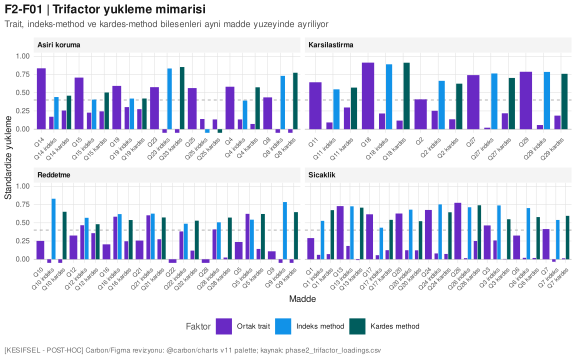

**Şekil 15.1. [KEŞİFSEL · İKİNCİL] Trifactor T-CFA yükleme paneli.** Yorum: anne, indeks çocuk ve kardeş göstergeleri aynı kavramsal alana bağlansa da bilgi-veren method yükleri tek-boyutlu bir ebeveynlik puanı varsayımını zayıflatır.

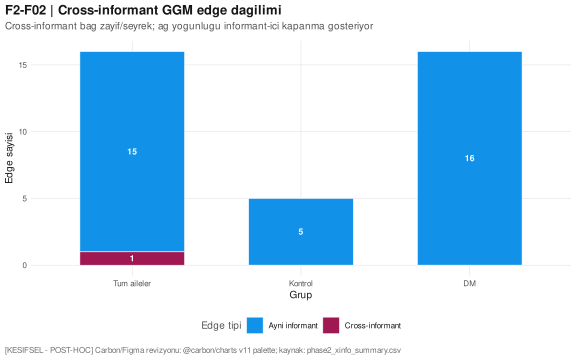

**Şekil 15.2. [KEŞİFSEL · İKİNCİL] Cross-informant edge oranı.** Yorum: toplam ağın büyük kısmı bilgi-veren içinde kapanmış; cross-informant bağlantılar sınırlı kalmıştır.

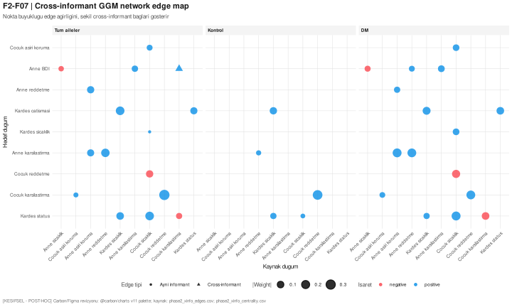

**Şekil 15.3. [KEŞİFSEL · İKİNCİL] Cross-informant GGM ağ haritası.** Yorum: ayrıntılı ağ görünümü, anne-çocuk raporlarının aynı düğüm uzayında bulunsa bile güçlü biçimde bilgi-veren kümeleri içinde organize olduğunu gösterir.

## 15.4 Psikometrik Robustleştirme

İkincil psikometrik katman, ana rapordaki EMBU reddetme sınırlılığını daha kesin biçimde tanımlamıştır. EMBU-P reddetme madde kümesinde yaygın taban etkisi vardır; floor-aware IRT altında indeks çocuk reddetme farkı Cohen d = 0,372 düzeyine yükselmiştir. Bu değer ana manifest etkiyi büyütmek için değil, taban etkisinin sinyali bastırma olasılığını göstermek için raporlanır.

Bifactor S-1 reliability generalization sonuçları EMBU-P için ω_h = 0,660 ve ECV = 0,409 üretmiştir; bu profil genel faktörün tek başına baskın olmadığını, alt ölçeklerin çok-boyutlu bir yapı içinde yorumlanması gerektiğini gösterir. EMBU-C reddetme alt ölçek-spesifik omega değerinin pratik sıfıra yakın olması, reddetme alt ölçeğinin tek başına klinik karar puanı olarak kullanılmaması gerektiğini destekler.

Ölçüm yapısının çapraz-yükleme esnekliğini doğrulayıcı faktör analizine (CFA) göre sınamak amacıyla EMBU-P ve EMBU-C üzerinde keşifsel yapısal eşitlik modeli de (ESEM; geomin eğik rotasyonu) kurulmuştur. Bu model yorumlanabilir bir çözüme kimliklenememiş — geomin rotasyonu için uyum indeksleri kestirilememiş ve yükleme/çapraz-yükleme tabloları boş dönmüştür (`phase2_esem_fit_indices.csv`; `phase2_esem_status.csv`) — bu nedenle ölçüm-yapısı yorumu §10.2'deki CFA temel modeline dayandırılmış, ESEM bir robustleştirme katmanı olarak devre dışı bırakılmış ve yine fizibilite-dürüstlüğü ilkesi uyarınca yalnız "denendi, kimliklenemedi" kaydıyla belgelenmiştir.

**Tablo 15.3. [KEŞİFSEL · İKİNCİL] Psikometrik robustleştirme özeti.**

| Analiz | Ana metrik | İkincil yorum |
|---|---:|---|
| Floor-aware IRT, çocuk reddetme | Cohen d = 0,372 | Taban etkisi H1 reddetme sinyalini manifest ortalama farkına göre maskelemiş olabilir. |
| Floor-aware IRT, çocuk aşırı koruma | Cohen d = 0,543 | Çocuk perspektifinde latent theta farkları manifest ölçeklerden daha güçlü görünür. |
| EMBU-P bifactor | ω_h = 0,660; ECV = 0,409 | Genel faktör baskın değildir; alt ölçek yorumu korunmalıdır. |
| EMBU-C bifactor | ω_h = 0,541; ECV = 0,510 | Çocuk formunda genel faktör daha zayıf ve çok-boyutlu yorum daha gereklidir. |
| Beck bifactor | ω_h = 0,887; ECV = 0,783 | Beck ölçeği karşılaştırmalı psikometrik kontrol olarak daha tek-boyutlu çalışır. |

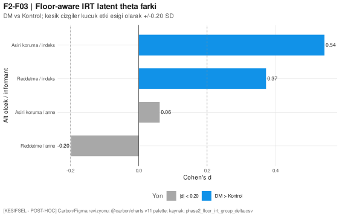

**Şekil 15.4. [KEŞİFSEL · İKİNCİL] Floor-aware IRT duyarlılığı.** Yorum: reddetme ve aşırı koruma sinyalleri çocuk perspektifinde latent theta düzeyinde daha görünürdür; bu sonuç ölçek ortalamalarını değiştirmez, psikometrik sınırlılığı açıklar.

## 15.5 Antidepresan ve Anne Mental Sağlık Yükü

Anne antidepresan kullanım hattı, DM grup üyeliği ile ebeveynlik sonuçları arasında bağımsız bir aracı mekanizma kanıtı üretmemiştir. Dört outcome için bootstrap dolaylı etki güven aralıkları sıfırı içermiştir. Buna karşılık antidepresan kullanımı, anne mental sağlık yükünün klinik göstergesi olarak önemlidir ve H1/H5 yorumlarında strata duyarlılığı gerektirir.

H1 multilevel modellerinde grup × antidepresan etkileşimleri anlamlı değildir; bu nedenle çocuk-algısı reddetme bulgusu antidepresan strata ile açıklanamaz. H5 strata analizinde reddetme korelasyonları yön bakımından ayrışmıştır; ancak bu ayrışma tedavi etkisi olarak yorumlanamaz, çünkü antidepresan başlangıç zamanı ve endikasyon yapısı bu kesitsel veri içinde ayrıştırılamaz.

**Tablo 15.4. [KEŞİFSEL · İKİNCİL] Antidepresan ve anne mental sağlık yükü özeti.**

| Analiz | Ana metrik | İkincil yorum |
|---|---:|---|
| Antidepresan aile dağılımı | 46/241 aile AD var; DM içinde 35/120 | AD yükü DM grubunda belirgin klinik eşlik değişkenidir. |
| Mediation durumu | 4/4 outcome bootstrap ile tamamlandı | Dolaylı etki GA'ları sıfırı içerir; bağımsız aracılık kanıtı yoktur. |
| Reddetme H5 strata, DM AD-yok | r = −0,091 [%95 GA −0,298, 0,125] | H5 korelasyonu AD strata ile yön değiştirebilir, fakat belirsizdir. |
| Reddetme H5 strata, DM AD-var | r = 0,147 [%95 GA −0,196, 0,458] | Strata n küçüktür; tedavi etkisi olarak yorumlanmaz. |

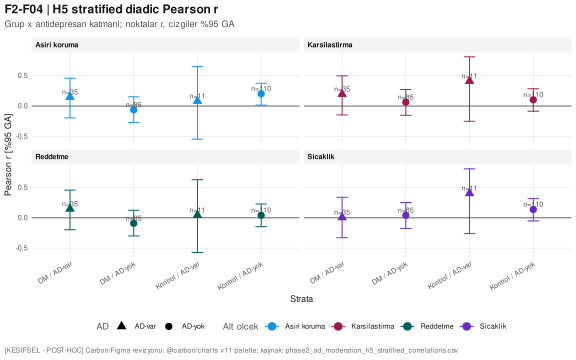

**Şekil 15.5. [KEŞİFSEL · İKİNCİL] H5 antidepresan strata duyarlılığı.** Yorum: korelasyonların yön ve genişlikleri anne mental sağlık yükünün H5 yorumlarında strata duyarlılığı gerektirdiğini, fakat mevcut örneklemin nedensel tedavi yorumu taşımadığını gösterir.

## 15.6 H5 Diadik Tutarlılık Çözümlemesi

H5 diadik tutarlılık çözümlemesi, anne-çocuk uyumunun tek bir ICC değeriyle özetlenemeyeceğini göstermiştir. Sibling-pair concordance analizinde reddetme alt ölçeği için DM grubunda ICC = 0, Kontrol grubunda ICC = 0,322 bulunmuştur. Bu desen, T1DM bağlamında kardeşler arasında ebeveyn davranışının algılanma biçiminde farklılaşma olabileceğini düşündürür ve parental differential treatment hipotezi için güçlü bir hipotez-üretici sinyal üretir.

Beş stratejinin REML pooling sonucu DM için 0,179 [%95 GA 0,097, 0,260], Kontrol için 0,130 [%95 GA 0,081, 0,180] olarak kestirilmiştir. Grup farkı 0,047 [%95 GA −0,023, 0,117] ile belirsizdir; bu pooled büyüklük bir etki-yönü iddiası değildir ve §19.2'deki birincil verdikti (ön-kayıtlı triangülasyon şartı karşılanmadı; tek-strateji/tek-alt-ölçek sinyal) değiştirmez.

**Tablo 15.5. [KEŞİFSEL · İKİNCİL] H5 diadik genişletme özeti.**

| Analiz | Ana metrik | İkincil yorum |
|---|---:|---|
| Reddetme sibling ICC, tüm örneklem | ICC = 0,160 [%95 GA 0,034, 0,280] | Kardeşler arası uyum zayıf ama sıfırdan ayrışır. |
| Reddetme sibling ICC, DM | ICC = 0,000 [%95 GA −0,179, 0,179] | DM bağlamında kardeş algıları daha ayrışmış görünür. |
| Reddetme sibling ICC, Kontrol | ICC = 0,322 [%95 GA 0,153, 0,473] | Kontrol grubunda kardeş algısı daha tutarlıdır. |
| Beş strateji pooled, DM | 0,179 [%95 GA 0,097, 0,260] | DM grup-içi pooled büyüklük; etki-yönü iddiası değil, bağlam metriği (birincil H5 verdikti §19.2: tek-strateji/tek-alt-ölçek sinyal). |
| Beş strateji pooled grup farkı | 0,047 [%95 GA −0,023, 0,117] | Grup farkı belirsizdir; H5 kararı değişmez. |

## 15.7 Klinik Stratifikasyon ve HbA1c

DM-only HbA1c alt analizleri yalnız 39 tam gözlem üzerinde çalışmıştır. Bayesian joint model, sıcaklık ve karşılaştırma outcome'larında HbA1c ile pozitif yön olasılığı üretmiştir (sıcaklık pd = 0,944; karşılaştırma pd = 0,946). Güven aralıklarının sıfırı içermesi ve örneklem büyüklüğünün düşük olması nedeniyle bu sonuçlar yalnızca gelecek DM kohortu için hipotez üretir.

Tanı yaşı spline analizleri dört alt ölçekte lineer modele anlamlı üstünlük göstermemiştir. ISPAD <%7 ikili outcome modeli olay sayısı nedeniyle güçsüzdür. Bu nedenle ikincil klinik stratifikasyon sonucu, mevcut CSR'ın klinik önerilerini genişletmez; yalnızca HbA1c ve tanı yaşı değişkenlerinin sonraki prospektif tasarımda daha güçlü örneklemle ele alınması gerektiğini gösterir.

**Tablo 15.6. [KEŞİFSEL · İKİNCİL] Klinik stratifikasyon özeti.**

| Analiz | Ana metrik | İkincil yorum |
|---|---:|---|
| HbA1c × sıcaklık | posterior medyan = 0,123; pd = 0,944; n = 39 | Pozitif yön olasılığı var, GA sıfırı içerir. |
| HbA1c × karşılaştırma | posterior medyan = 0,137; pd = 0,946; n = 39 | Hipotez-üretici klinik sinyal; dış-validasyon gerekir. |
| HbA1c × reddetme | posterior medyan = 0,067; pd = 0,800; n = 39 | Reddetme için klinik sinyal zayıftır. |
| Tanı yaşı spline | 4/4 outcome `linear_sufficient` | Non-lineer spline üstünlüğü gösterilmemiştir. |
| ISPAD <%7 lojistik | 8 olay / 39 gözlem | Olay sayısı klinik sınıflandırma için yetersizdir. |

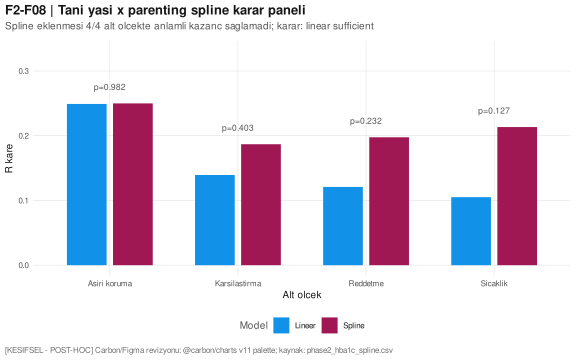

**Şekil 15.6. [KEŞİFSEL · İKİNCİL] Tanı yaşı spline kontrolü.** Yorum: tanı yaşı için spline formu lineer modele belirgin üstünlük sağlamaz; klinik stratifikasyon sonuçları mevcut CSR önerilerini genişletmez.

## 15.8 Nedensel Aracılık, DAG ve Dağılımsal Yaklaşımlar

Imai-Keele-Tingley duyarlılık hattı, aracılık yorumlarının ölçülmemiş karıştırıcıya çok kırılgan olduğunu göstermiştir; tüm outcome'larda kritik ρ < 0,05 düzeyindedir. Bu nedenle ikincil çözümlemelerde dolaylı etki dili sınırlanmış, doğrudan etki triangülasyonu ana yorum düzlemi olarak kullanılmıştır. `c'` doğrudan etki triangülasyonu reddetme ve aşırı koruma yollarında H1 yönünün aracılık modelinden bağımsız kaldığını göstermiştir.

DAG implied conditional independence testleri 12/12 tutarlı sonuç vermiştir; bu bulgu DAG'ın veriyle açıkça çelişmediğini gösterir, nedensel doğrulama anlamına gelmez. Üç düzeyli yıl-kümelenme modeli, bazı alt ölçeklerde ölçüm yılı düzeyinde varyans olduğunu göstermiş ve negatif kontrol bulgusunun yapısal yanıtını sağlamıştır.

Dağılımsal modeller, H1 reddetme etkisinin üst kuyrukta güçlendiğini göstermiştir: quantile regression τ = 0,75 için β = +0,250; beta regression reddetme modeli p < 10^-6 düzeyinde yön üretmiştir. Bu desen ortalama farkının ötesinde, algılanan reddetme dağılımının üst ucunda klinik dikkat gerektiren bir yığılma olabileceğini düşündürür.

**Tablo 15.7. [KEŞİFSEL · İKİNCİL] Aracılık, DAG ve dağılımsal model özeti.**

| Analiz | Ana metrik | İkincil yorum |
|---|---:|---|
| Imai duyarlılık | tüm outcome'larda kritik ρ < 0,05 | Dolaylı etki yorumu ölçülmemiş karıştırıcıya çok kırılgandır. |
| Reddetme c' triangülasyonu | 3/3 modelde pozitif ve anlamlı | H1 yönü aracılık varsayımına bağımlı değildir. |
| DAG CI testleri | 12/12 test tutarlı | DAG veriyle açıkça çelişmez; nedensel doğrulama değildir. |
| Reddetme quantile τ = 0,75 | β = 0,250 [%95 GA 0,116, 0,384] | H1 sinyali üst kuyrukta güçlenir. |
| Reddetme beta regression | β = 0,462 [%95 GA 0,288, 0,636] | Dağılımsal model ortalama dışı sinyali destekler. |

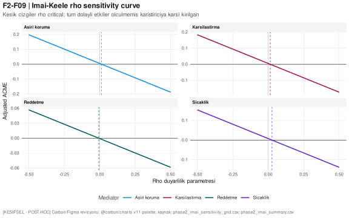

**Şekil 15.7. [KEŞİFSEL · İKİNCİL] Aracılık duyarlılığı.** Yorum: dolaylı etkilerin küçük ölçülmemiş karıştırıcılarla değişebilmesi, ikincil analiz metninde aracılık dilinin sınırlandırılmasını gerektirir.

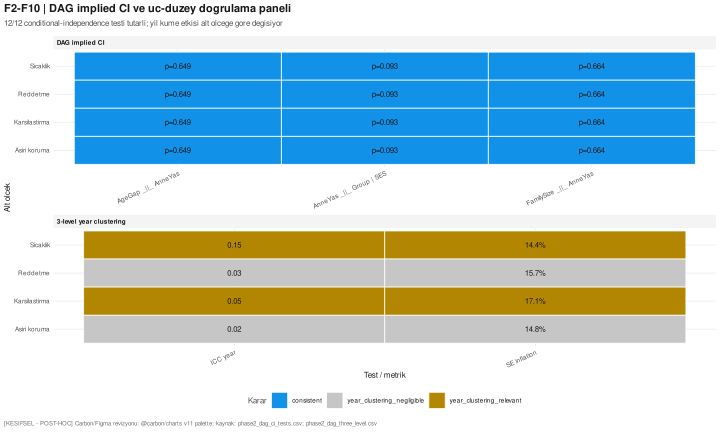

**Şekil 15.8. [KEŞİFSEL · İKİNCİL] DAG doğrulama ve negatif kontrol paneli.** Yorum: conditional independence testleri tutarlı görünür; yıl-kümelenme paneli ölçüm yılı varyansını görünür kılar ancak nedensel kesinlik üretmez.

## 15.9 Multiverse ve Meta-Analitik Birleştirme

H1 multiverse analizinde 120/120 spesifikasyon başarılı çalışmış; tüm spesifikasyonlarda yön pozitif, %75'inde p < .05 bulunmuştur. Medyan etki β = 0,134 [%95 aralık 0,082, 0,188] düzeyindedir. Specification curve inferential test 5000 permütasyonda t = 4,084 ve p = .0002 üretmiştir. Bu sonuç, H1 reddetme bulgusunun tek bir model kararına bağımlı olmadığını gösterir.

Bayesian/meta-analitik pooling, bu çalışmadaki dört outcome kestirimini ilgili literatür etkileriyle birleştirdiğinde pooled etkiyi 0,139 [%95 GA 0,049, 0,230] olarak kestirmiştir. Posterior predictive replication dört outcome için de `ppc_consistent` kararı vermiştir. Bu meta-analitik çözümleme, H1 yönünü literatürle uyumlu küçük etki olarak konumlandırır; etkiyi büyük veya klinik olarak tek başına belirleyici göstermemelidir.

**Tablo 15.8. [KEŞİFSEL · İKİNCİL] Multiverse ve meta-analitik özet.**

| Analiz | Ana metrik | İkincil yorum |
|---|---:|---|
| H1 multiverse | 120/120 başarılı; medyan β = 0,134 | H1 yönü model kararlarına duyarlı görünmez. |
| Pozitif yön payı | 1,00 | Tüm spesifikasyonlarda yön pozitiftir. |
| p < .05 payı | 0,75 | İstatistiksel karar spesifikasyona bağlı ama çoğunlukla pozitiftir. |
| Specification curve test | t = 4,084; permütasyon p = .0002 | Toplu eğri null hipotezinden ayrışır. |
| Meta-analitik pooling | pooled = 0,139 [%95 GA 0,049, 0,230]; τ = 0,106 | Literatürle uyumlu küçük etki merkezi vardır. |
| Posterior predictive replication | 4/4 outcome `ppc_consistent` | Çalışma kestirimleri literatür önseliyle uyumludur. |

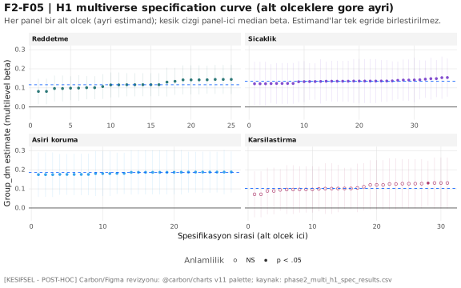

**Şekil 15.9. [KEŞİFSEL · İKİNCİL] H1 specification curve.** Yorum: 120 analitik kararın tamamında yön pozitiftir; bu desen H1 reddetme sonucunun tek modele bağımlı olmadığını gösterir.

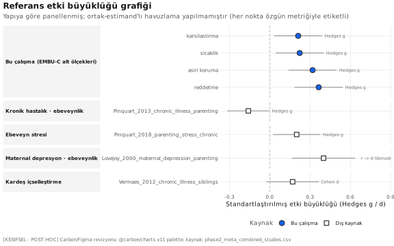

**Şekil 15.10. [KEŞİFSEL · İKİNCİL] Meta-analitik forest paneli.** Yorum: pooled etki küçük ama sıfırdan ayrışan bir merkezde konumlanır; heterojenlik etki büyüklüğünün abartılmamasını gerektirir.

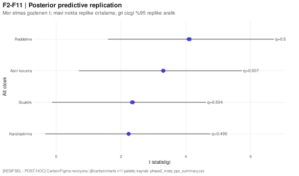

**Şekil 15.11. [KEŞİFSEL · İKİNCİL] Posterior predictive replication.** Yorum: dört outcome için de posterior predictive kontrol tutarlıdır; sonuçlar replikasyon hipotezi üretir, kesin dış-validasyon yerine geçmez.

## 15.10 Klinik Karar Modeli ve Replikasyon Gücü

Yüksek-risk anne sınıflandırma modeli için extended logistic model AUC = 0,703 üretmiştir; baseline model AUC = 0,586 düzeyindedir. Standartlaştırılmış net benefit, düşük eşiklerde anlamlı görünmekte; eşik ve maliyet oranı yükseldikçe fayda hızlı biçimde azalmaktadır. Bu sonuç iç-validasyon düzeyinde bir modelleme sinyalidir ve bağımsız dış-validasyon olmadan klinik tarama aracı olarak kullanılamaz.

Mevcut örneklem gücü karakterizasyonu, d = 0,20 ve aile ICC = 0,20 varsayımı altında n = 241 aile için power = 0,535 üretmiştir. Bu bulgu H1 pozitif sinyalinin düşük-orta güç koşullarında yakalandığını, negatif veya belirsiz bulguların ise özellikle küçük etki düzeylerinde güç sınırlamasıyla birlikte yorumlanması gerektiğini gösterir. APIM ve Bayesian sample-size hesapları, dış-validasyon/replikasyon hattı için daha büyük ve çok-merkezli örneklem gereksinimini destekler.

**Tablo 15.9. [KEŞİFSEL · İKİNCİL] Klinik karar modeli ve güç özeti.**

| Analiz | Ana metrik | İkincil yorum |
|---|---:|---|
| Baseline risk modeli | AUC = 0,586 | Demografik/temel model sınırlı ayrım gücü taşır. |
| Extended risk modeli | AUC = 0,703 | İç-validasyon düzeyinde sinyal vardır; dış-validasyon gerekir. |
| Standardized net benefit | eşik 0,05 için sNB = 0,860 | Fayda düşük eşiklerde görünür, eşik yükseldikçe azalır. |
| Multilevel power | n = 241; d = 0,20; ICC = 0,20; power = 0,535 | Küçük etki için mevcut çalışma orta-alt güçtedir. |
| APIM replikasyon ihtiyacı | r = 0,20 için %80 güçte 165 düad | Dış-validasyon daha büyük düad örneklem gerektirir. |

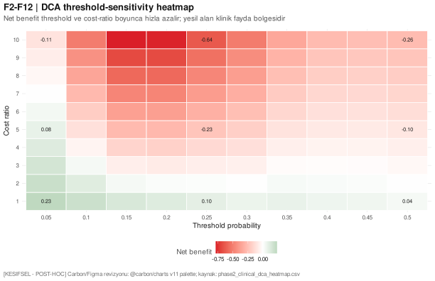

**Şekil 15.12. [KEŞİFSEL · İKİNCİL] Klinik karar modeli DCA ısı haritası.** Yorum: extended model düşük eşiklerde iç-validasyon sinyali verir; bu panel klinik uygulama aracı değil, dış-validasyon tasarımı için karar-eşik duyarlılığıdır.

## 15.11 İkincil Analizlerin Kanonik Kararı

İkincil analizlerin nihai katkısı, CSR'ın birincil bulgularını yeniden sınıflandırmak değil, H1 reddetme bulgusunun neden anne öz-bildirimi düzleminde değil çocuk algısı düzleminde ortaya çıktığını açıklayan çok-katmanlı bir kanıt çerçevesi sağlamaktır. Trifactor, latent discrepancy, floor-aware IRT, multiverse, specification curve inferential test ve meta-analitik pooling aynı yöne işaret eder: çocuk-algısı reddetme sinyali küçük ama yöntem kararlarına dirençli bir keşifsel bulgudur.

H2, H3, H4 ve H5 için ikincil analizler ana kararları değiştirmez. H3 anne öz-bildirim negatif kanıtı korunur; H4 anne depresyonu ile ebeveynlik tutumu arasındaki yapısal yol zinciri korunur; H5 için birincil karar korunur — ön-kayıtlı en az üç-strateji triangülasyon şartı karşılanmadığından bulgu, triangülasyonla desteklenmeyen tek-strateji/tek-alt-ölçek bir sinyaldir (bkz. §19.2, §11.5.8); İkincil pooling bu kararı değiştirmez, yalnızca büyüklük bağlamı sağlar. İkincil analizlerden doğan yeni hipotezler üç başlıkta izlenmelidir: çocuk method varyansı ve Diverging Operations, floor-aware reddetme ölçümü, anne mental sağlık/antidepresan yükünün diadik tutarlılıkla etkileşimi.

\newpage

# 16. SOSYODEMOGRAFİK VE KLİNİK BAĞLAMSAL ANALİZLER — [KEŞİFSEL · İKİNCİL]

> **[KEŞİFSEL · İKİNCİL]** Bu bölüm birincil hipotez kararlarını değiştirmez. Buradaki çözümlemeler, sosyodemografik-klinik formda toplanan bağlamsal değişkenlerin (meslek ISCO-08 → ISEI/SIOPS/EGP, anne ve eş komorbiditesi, hane koşulları, aile yapısı, doğum sırası, kardeş kayırma algısı) ebeveynlik tutumları ve kardeş ilişkileriyle bağını inceleyen keşifsel analizlerdir; korelasyoneldir, hipotez-üretici olarak konumlandırılır, bağımsız dış-validasyon olmadan klinik öneriye çıkarılmaz ve hiçbiri doğrulayıcı çıkarımı güçlendirmez.

## 16.1 Statü, Kapsam ve Reprodüksiyon Zinciri

Bu çözümlemeler de birincil hipotezlerle aynı kilitli veri seti üzerinde — aynı 241 aile ve 482 çocuk gözlemi ile — yürütülmüştür; yeni veri toplanmamış, ham veri veya ölçek puanlama kuralı değiştirilmemiştir. Sosyodemografik-klinik formda toplanmış ancak birincil hipotez modellerine girmemiş değişkenleri inceleyen bu analizler ön-kayıtlı değildir; keşifsel niteliktedir, doğrulayıcı kanıt olarak yorumlanmaz ve rapor boyunca **[KEŞİFSEL · İKİNCİL]** etiketiyle sunulur. Her sonuç alt-grup örneklem büyüklükleriyle ve — sürekli değişkenlerde — hem ortalama hem medyanla raporlanır.

**Yorumsal bir çerçeve.** Örneklemde ailenin mesleki-sosyoekonomik konumu baba/eş mesleğinden türetilmiştir; ayrı bir anne mesleki-statü ölçütü bulunmadığından tüm meslek-tabanlı sosyal sınıf çözümlemeleri fiilen baba/eş sınıfını temsil eder ("baba-sınıfı → anne-ebeveynlik" okuması), anneye-özgü sosyoekonomik konum ise yalnız eğitim ve istihdam ekseniyle temsil edilir.

## 16.2 Keşifsel Analizler Yönetici Kanıt Matrisi

**Tablo 16.1. [KEŞİFSEL · İKİNCİL] Keşifsel analizler yönetici kanıt matrisi.**

| Analiz ailesi | Ana metrik | CSR yorumu |
|---|---|---|
| Diferansiyel ebeveynlik etkisi (PDT) | Holm-korumalı 0/16 sistematik sinyal; en güçlü ham işaret DM'de baba-kayırma algısı ↓ (d = −0,267; p = 0,039 düzeltilmemiş) | DM ve kontrol aileleri arasında kardeş diferansiyel ebeveynlik algısında Holm-korumalı sistematik fark yok; küçük banda oturan hipotez-üretici sinyaller. |
| Sosyal tabakalaşma | EGP-3 gradyanı Holm sonrası anlamsız; ISEI/SIOPS/EGP ağır kolinear (AIC en iyi ISEI); FSM zinciri yön-tutarlı ama zayıf | Ebeveynlik prestij-puanına indirgenemeyen sınıf gradyanı bu örneklemde ayrışmıyor; materyal facet prestij bloğu üzerine ek varyans getirmiyor. |
| Anne komorbidite / distres | Komorbid ≥1 → Beck d = 0,293 (Holm ns); antidepresan DM %29,2 vs Kontrol %9,1 (χ² = 14,45; V = 0,248) | Otoimmün diatez test edilemez (n = 1); antidepresan yükünün belirgin grup-asimetrisi bağımsız raporlanabilir bulgu. |
| Aile yapısı / kardeş konstelasyonu | Diadik karşılıklılık r = 0,177–0,384 (tümü sıfırdan ayrı); düad simetrik | Tek-ebeveyn (n = 3) betimsel; kardeşler ebeveyn davranışını orta-düşük ama pozitif mütekabiliyetle algılar; doğum-sırası etkileri minik. |
| DM-spesifik maruziyet yoğunluğu | 9 focal testin 0'ı Holm-anlamlı; tek maruziyet operasyonelizasyonu üstün değil | Doğrulanmamış "yaşam-oranı" metriği duyarlılık katmanı; kanonik alternatiflerle yan yana, hiçbiri baskın değil. |
| Anne mental sağlık → çocuk/kardeş düzlemi | Güncel distres (Beck ≥ 17) → EMBU-C reddetme b = 0,134 (p = 0,004; DM ve antidepresandan bağımsız); LCA riskli sınıf → reddetme-uyuşmazlığı p < 0,001 ve kardeş çatışması p = 0,006 | En değerli keşifsel köprü: *güncel* anne şiddeti çocuk algı düzlemine bağlanır (antidepresan = tedavi göstergesi, bağlanmaz); Goodman-Gotlib mekanizmasıyla uyumlu. |
| Yönlü kardeş-ilişki mimarisi | Yön-asimetrisi 0/3 grup etkisi; 14-faset 0/14 FDR-anlamlı | Yön/faset topografisi DM sinyaline ek katkı getirmiyor; kardeş mimarisi yöne duyarsız ve gruplar arası paylaşılan. |
| Çocuk-düzeyi moderatörler | Cinsiyet × grup 0/8 Holm-anlamlı; anne yaşı → aşırı koruma doğrusal b = −0,026/yıl (p = 0,004) | Cinsiyet-diferansiyel ebeveynlik yok; ileri anne yaşı ↔ daha az aşırı koruma (Camberis yönüyle uyumlu). |
| Seçilim ve batch geçerlik denetimi | HbA1c MNAR seçilim OR = 4,56 (p = 0,000466); yıl × grup V = 0,585 (p ≈ 2,9 × 10⁻²⁰) | Yeni ilişki değil, geçerlik denetimi: HbA1c seçilmiş alt-örneklem; H1 çocuk-reddetme farkı 2023-only'de zayıflar → batch temkini. |

## 16.3 Diferansiyel Ebeveynlik Etki Modellemesi

Keşifsel analizlerin çekirdek hattı, kardeş uyum (concordance-ICC) çözümlemesinin "iki çocuk ne kadar benzer algılıyor" sorusunun ötesine geçerek diferansiyel muamelenin **büyüklüğünü** ve **yönünü** bir estimand olarak modeller (aynı yapı, farklı estimand). Fark-skoru güvenilirliği (Rogosa–Willett ρ_DD) dört alt ölçekte 0,518–0,740 aralığındadır: kardeşler-arası algı korelasyonu (ρ_XY = 0,159–0,296) düşük olduğundan fark skoru dejenere değildir (klasik yüksek-ρ_XY tuzağının tersi); yine de disattenüasyon dipnotu korunur. Diferansiyel muameleyi kesitsel-discrepancy olarak dayatmamak için birincil model yüzey-tepki analizidir (RSA/polinom; LDS elenmiştir — boylamsal değil).

Yön (DM grubu, n = 120, işaretli Δ) dört alt ölçekte Holm sonrası anlamlı değildir (0/4; en güçlü aşırı-koruma d = +0,147, işaret p = 0,072, indeks lehine eğilim). Büyüklük modeli (`pdt_abs ~ group_f + ses_latent_z + age_gap_z + same_sex + cocuk_sayisi_z`; HC3 robust SE) 8 testte 0 Holm-anlamlı üretir (en düşük reddetme ham p = 0,037, Holm = 0,293). RSA yüzeylerinden 8'den yalnız biri anlamlıdır (sıcaklık uyumsuzluğu → çatışma; blok F = 3,67; p = 0,013). Yol modeli (lme4, `(1|aile_no_f)`) en güçlü sıcaklık → rekabet std_β = −0,110 (p = 0,027) verir; aile-içi ICC 0,169–0,191. Doğrudan kayırma ayrıştırması (anne ve baba kayırma maddeleri ayrı kanallarda) tek ham sinyal olarak DM'de baba-kayırma algısının düşüklüğünü gösterir (d = −0,267; %95 GA [−0,520, −0,013]; p = 0,039 düzeltilmemiş); iki-informant uyumu düşük-orta (anne kanalı ICC = 0,304; baba kanalı ICC = 0,171). DM grubunda baba-kayırma algısının düşük yönde ayrışması (d = −0,267) küçük etki bandında yer alır ve çoklu-karşılaştırma düzeltmesi sonrası anlamlılığını yitirdiğinden yalnızca hipotez-üretici bir işaret olarak okunmalıdır. Yön olarak bu bulgu, ebeveyn diferansiyel muamelesinin çocuk uyum sorunlarıyla küçük-orta düzeyde ilişkilendiği meta-analitik literatürle (Buist, Deković ve Prinzie, 2013; Jensen ve Thomsen, 2024; Eradus ve diğerleri, 2024) aynı kavramsal alanda konumlanır; ancak burada gözlenen azalmış favoritizm, kronik hastalık bağlamında diferansiyel algının artması yönündeki basit beklentiyle örtüşmemektedir. İki-informant uyumunun düşük-orta kalması (anne kanalı ICC = 0,304; baba kanalı ICC = 0,171), diferansiyel muamele algısının bilgi-veren perspektifine duyarlı olduğunu ve tek-kaynak yorumun ihtiyatla ele alınması gerektiğini gösterir. SRQ-kayırma ile EMBU-C türetilmiş PDT arasındaki MTMM yakınsaması zayıftır (|r| ≤ 0,19) → iki işlemci geçerli vantaj-noktası farkı (Operations Triad: ayrışma = ölçüm hatası değil). Meşruiyet/bağlam moderasyonunda sekiz PDT × grup etkileşiminin hiçbiri anlamlı değildir; kanonik formda ayrık "adil mi?" maddesi bulunmadığından yalnız moderasyon-varlığı testi yapılabilmiş, mekanizma testi yapılamamıştır (açık sınırlama). Eşdeğerlik testinde (SESOI |r| = 0,10) 28 testin 26'sı belirsizdir; hiçbiri eşdeğerlik kanıtlamaz → "diferansiyel etki yok / kardeşler uyumlu" null iddiası da kurulamaz (güç yetersizliği).

**Tablo 16.2. [KEŞİFSEL · İKİNCİL] Diferansiyel ebeveynlik etki modellemesi özeti.**

| Analiz | Ana metrik | İkincil yorum |
|---|---|---|
| ρ_DD güvenilirlik (4 alt ölçek) | 0,518–0,740 (ρ_XY = 0,159–0,296) | Fark skoru dejenere değil; düşük kardeş-algı korelasyonu ρ_DD'yi korur. |
| Yön (DM, işaretli Δ) | 0/4 Holm-anlamlı; aşırı-koruma d = +0,147 (p = 0,072) | Diferansiyel algıda sistematik yön yok; en fazla indeks-lehine zayıf eğilim. |
| Büyüklük (group_f, HC3) | 0/8 Holm-anlamlı; reddetme ham p = 0,037 (Holm = 0,293) | DM'de diferansiyel algı büyüklüğü sistematik yükselmiyor. |
| RSA yüzeyi (8 blok) | 1/8 anlamlı: sıcaklık → çatışma (F = 3,67; p = 0,013) | Uyumsuzluk yüzeyi yalnız sıcaklık-çatışma bloğunda; diğer 7 blok null. |
| Yol modeli (lme4) | sıcaklık → rekabet β = −0,110 (p = 0,027); ICC 0,169–0,191 | Daha yüksek diferansiyel algı ↔ daha düşük rekabet; kesitsel, nedensel değil. |
| Baba-kayırma | DM < Kontrol, d = −0,267 (p = 0,039 düzeltilmemiş) | Tek ham sinyal; iki-informant ICC düşük-orta (anne 0,304 / baba 0,171). |
| MTMM yakınsama | \|r\| ≤ 0,19 | SRQ-kayırma ve EMBU-C PDT geçerli vantaj-noktası farkı (ayrışma = hata değil). |
| Moderasyon + TOST | 8/8 etkileşim null; 26/28 TOST belirsiz | Buffering veya fark yönünde destekleyici kanıt üretilemedi; "adil mi?" maddesi yokluğu sınırlama. |

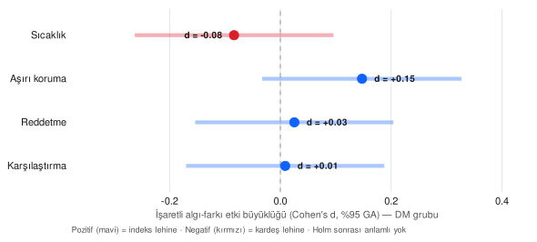

**Şekil 16.1. [KEŞİFSEL · İKİNCİL] DM grubunda kardeş diferansiyel ebeveynlik algısının yönü.** Yorum: Dört EMBU-C alt ölçeğinde işaretli algı-farkının etki büyüklüğü sıfıra yakındır ve hiçbiri çoklu-karşılaştırma düzeltmesi sonrası anlamlı değildir; en fazla aşırı koruma boyutunda indeks çocuk lehine zayıf bir eğilim görülür.

## 16.4 Sosyal Tabakalaşma ve Ebeveynlik

> **Yöntem kutusu — ISEI, SIOPS, EGP ve Diagonal Referans Modeli:** Sosyoekonomik konum tek boyutlu değildir: ISEI mesleğin sürekli prestij-kaynak skorunu, SIOPS toplumsal prestij algısını, EGP ise ilişkisel sınıf konumunu (hizmet/ara/işçi) yakalar. Diagonal Referans Modeli (DRM), bir sonucun köken ve varış konumlarının göreli ağırlığını ayrıştırır. Bu ölçütler ağır kolineer olduğundan hangisinin ek açıklayıcı güç taşıdığı ampirik olarak sınanır.

EGP-3 sınıf gradyanı (hizmet n = 23 / ara n = 86 / işçi-rutin n = 110; 22 yapısal NA) hiçbir EMBU-P alt ölçeğinde Holm sonrası anlamlı değildir (aşırı-koruma ham p = 0,047, Holm = 0,377; long lme4 LRT χ²(2) ≤ 4,26, p ≥ 0,119). **Simpson denetimi zorunludur:** aşırı-koruma "işçi-rutin > hizmet" sıralaması havuzda ve DM'de görülürken Kontrol'de düzleşir; EGP grupla ağır karıştırılmış (confounded) olduğundan (sınıf-7 Kontrol-, sınıf-6 DM-ağırlıklı) havuz gradyanı gruba-bağımlı okunmamalıdır. Ölçüm-yarışında (ISEI vs SIOPS vs EGP-3, ortak varyans (commonality) + AIC) üç ölçü ağır kolineardır; en güçlü sinyalde (aşırı-koruma) ortak varyans (0,027) eşsiz katkıları (≤ 0,0035) baskılar, AIC en iyi tek-ölçü ISEI'dir, hiçbiri Holm sonrası ayırt edici değildir (Ganzeboom-Treiman ile uyumlu). Eğitim-ekseni Diagonal Reference Model (meslek ekseninde model kimliklenemediğinden eğitim eksenine taşınmıştır) EMBU-C sıcaklık/reddetme için sınır/dejenere çözüm verir (kimliklenemez etiketi); yalnız çatışmada iç-çözüm elde edilir (anne-eğitim ağırlığı w = 0,729; %95 GA [−0,048, 1,506], hem 0'ı hem 1'i kapsar) → n = 241 bir DRM için yetersiz.

Materyal yoksunluk faceti (blok-1 = edu_z + isei_z; blok-2 = material_z; çift-sayım önlemek için `ses_latent` blok-1'de kullanılmadı) prestij bloğu üzerine anlamlı ek varyans getirmez (ΔR² ≤ 0,0063; tüm p ≥ 0,244; VIF ≤ 1,47). Beck-aracı Aile-Stres-Modeli (deprivation = −material_z → beck_total → EMBU-P; lavaan + 1000 BCa bootstrap) yön-tutarlı ama zayıftır: a yolu = 1,021 (yoksunluk↑ → depresyon↑; p = 0,032); sıcaklık dolaylı etkisi = −0,0161 (BCa %95 GA [−0,0386, −0,0028], bootstrap-SE p = 0,065, Holm = 0,130); reddetme dolaylı = +0,0062 (BCa [0,0010, 0,0177], bootstrap-SE p = 0,104, Holm = 0,130). Dolaylı etkilerin BCa GA'ları sıfırı dışlarken bootstrap-SE p'leri > 0,05 ve Holm sonrası anlamsızdır → FSM zinciri doğrulayıcı değil, yön-tutarlı zayıf sinyaldir. Anne istihdamı × grup moderasyonunda aile-düzeyi etkileşimler null; long modelde yalnız sıcaklık etkileşimi sınırdadır (b = 0,294; p = 0,015; Holm = 0,059 → anlamsız).

**Tablo 16.3. [KEŞİFSEL · İKİNCİL] Sosyal tabakalaşma özeti.**

| Analiz | Ana metrik | İkincil yorum |
|---|---|---|
| EGP-3 gradyanı | aşırı-koruma ham p = 0,047 → Holm = 0,377 | Sınıf gradyanı Holm sonrası anlamsız; SES = baba-sınıfı okuması. |
| Simpson denetimi | EGP grupla confound (sınıf-7 Kontrol-, sınıf-6 DM-ağırlıklı) | Havuz gradyanı gruba-bağımlı; ekolojik yanılgı riski. |
| Ölçüm-yarışı (ISEI/SIOPS/EGP) | AIC en iyi ISEI; ortak varyans baskın; hiçbiri Holm sonrası ayırt edici değil | Üç ölçü büyük ölçüde aynı varyansı taşır (kolinear). |
| Eğitim-DRM | çatışma w = 0,729 [−0,048, 1,506]; diğerleri kimliklenemez | n = 241 DRM için yetersiz; anne/baba eğitim ağırlığı ayırt edilemiyor. |
| Materyal facet (hiyerarşik) | ΔR² ≤ 0,0063; p ≥ 0,244; VIF ≤ 1,47 | Materyal facet prestij bloğu üzerine ek varyans getirmiyor. |
| Beck-aracı FSM | a = 1,021 (p = 0,032); sıcaklık dolaylı −0,0161 BCa[−0,0386, −0,0028] (Holm = 0,130) | Yön-tutarlı ama zayıf; doğrulayıcı değil (BCa-GA ve bootstrap-p uyuşmazlığı). |
| Anne istihdamı × grup | long sıcaklık etkileşim b = 0,294 (p = 0,015; Holm = 0,059) | Sınırda keşifsel ipucu; aile-düzeyi etkileşimler null. |

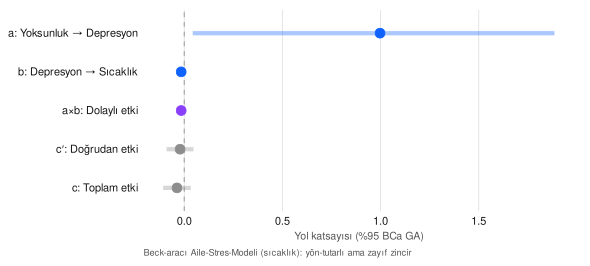

**Şekil 16.2. [KEŞİFSEL · İKİNCİL] Beck-aracı Aile-Stres-Modeli yol katsayıları (sıcaklık çıktısı).** Yorum: Materyal yoksunluk anne depresyonunu artırmakta, depresyon ise anne sıcaklık algısıyla negatif ilişkilidir; dolaylı etkinin güven aralığı sıfırı dışlasa da Holm düzeltmesi sonrası anlamsızdır — zincir yön-tutarlı ama zayıftır.

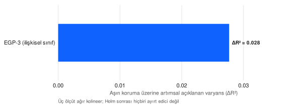

**Şekil 16.3. [KEŞİFSEL · İKİNCİL] Sosyal sınıf ölçütlerinin (ISEI/SIOPS/EGP) artımsal açıklayıcı gücü.** Yorum: Üç sosyoekonomik ölçüt aşırı koruma üzerine yalnızca çok küçük ve büyük ölçüde örtüşen varyans ekler; hiçbiri diğerine belirgin üstünlük sağlamaz — ebeveynlik tutumu bu örneklemde sosyal sınıfa güçlü biçimde koşullanmamaktadır.

<!-- ═══════════ FİGÜR-RENDER-TALİMATI ═══════════
id: fig-16-7
baslik: Fark-skoru güvenilirliği (ρ_DD) ve kardeşler-arası algı korelasyonu (ρ_XY)
yerlesim: §16.3 (diferansiyel ebeveynlik) içine, ρ_DD tartışmasından sonra
grafik_turu: Gruplu yatay bar (4 alt ölçek × {ρ_XY, ρ_DD})
veri_kaynagi: outputs/tables/phase3_pdt_rho_dd.csv — kolonlar: alt_olcek, rho_xy, rho_dd (sıcaklık ρ_XY=0,296→ρ_DD=0,725; aşırı_koruma 0,208→0,518; reddetme 0,159→0,666; karşılaştırma 0,201→0,740)
kodlama: y=4 EMBU-C alt ölçeği; x=[0–1]; iki seri: ρ_XY (kardeş-algı korelasyonu, Gray) ve ρ_DD (fark-skoru güvenilirliği, Teal)
renk_haritasi: ρ_XY Gray #8d8d8d, ρ_DD Teal #007d79
referans_cizgileri: 0,70 güvenilirlik referans çizgisi (opsiyonel)
dogrudan_etiketler: Her bara değer etiketi
stil: Carbon Design System v11 (Blue #0f62fe, Red #da1e28, Teal #007d79, Purple #8a3ffc, Gray #8d8d8d; IBM Plex Sans; resesif ızgara #e0e0e0; sıfır çizgisi #a8a8a8 kesikli; A4-baskı SVG)
onerilen_cikti_dosyasi: docs/assets/figures/carbon/exploratory/expl_f07_rho_dd.svg
render_sonrasi_embed_satiri: 
caption_bloku: **Şekil 16.7. [KEŞİFSEL · İKİNCİL] Dört alt ölçekte kardeşler-arası algı korelasyonu (ρ_XY) ve türetilen fark-skoru güvenilirliği (ρ_DD).** Yorum: düşük ρ_XY sayesinde ρ_DD orta-yüksek kalır; fark skoru dejenere değildir.
uygulama_notu: R base svg(); phase3_pdt_rho_dd.csv okunur, long formata çevrilip gruplu bar.
═══════════ /FİGÜR-RENDER-TALİMATI ═══════════ -->

## 16.5 Anne Somatik Komorbidite ve Aile Sağlık Yükü

Anne otoimmün komorbidite fizibilite denetiminde test edilemez olarak sınıflanır: DM 0/120 (%0,0) vs Kontrol 1/118 (%0,85), Fisher p = 0,496 (Malcová taban-oranı ~%2 ile tutarlı; öz-bildirim formu klinik otoimmün panel değildir → "confounder yok" değil "örneklemde ölçülemedi"). İkili yeniden-çerçevelenen komorbidite (anne_hastalik_kategori_sayisi ≥ 1; n = 61) Beck depresyonuyla küçük-orta ilişki gösterir (d = 0,293; %95 GA [−0,002, 0,587]; Welch p = 0,059; Holm = 0,295); basit aracılıkta komorbidite → Beck → EMBU-P dolaylı etkileri yön-tutarlıdır (sıcaklık dolaylı = −0,0362, BCa [−0,0995, −0,0004]; reddetme dolaylı = +0,0140, BCa [0,0002, 0,0429]; Lovejoy/Pinquart yönüyle uyumlu). Maternal distres yakınsamasında antidepresan kullanımı belirgin grup-asimetrisi taşır: DM 35/120 (%29,17) vs Kontrol 11/121 (%9,09); χ²(1) = 14,45; p = 0,00014; Cramér's V = 0,248 — bu başlı başına raporlanabilir bir bulgudur (Van Gampelaere ile tutarlı). Antidepresan kullanımındaki bu grup-asimetrisi (yaklaşık 3,2 kat) Cramér V = 0,248 ile küçük-orta büyüklükte bir ilişkiye karşılık gelir; keşifsel çerçevede dahi, T1DM'li çocuk annelerinde artmış psikiyatrik bakım yükünün bağlamsal bir göstergesi olarak klinik dikkat çekicidir. Bu örüntü, T1DM'li çocuk ebeveynlerinin genel popülasyona kıyasla daha yüksek ebeveyn distresi bildirdiğini gösteren kontrollü karşılaştırmalarla (Van Gampelaere ve diğerleri, 2020) ve anne diyabet distresinin anne depresif belirtileriyle ilişkilendiği bulgularla (Rumburg ve diğerleri, 2017) yön bakımından tutarlıdır. Kesitsel tasarım nedeniyle antidepresan başlangıç zamanı ve endikasyonu ayrıştırılamadığından, bu asimetri nedensel değil, aile sağlık-yükünün betimsel bir belirteci olarak konumlandırılmalıdır. Antidepresan ile Beck toplamı negatif ilişkilidir (r = −0,149; AD+ ortalama Beck 10,44 vs AD− 13,34) → tedavi/güncel-durum ile geçmiş-yük ayrışması; iki gösterge de anne öz-bildirimi olduğundan ortak-yöntem varyansı uyarısı korunur (formatif etiket). Negatif kontrolde babanın somatik hastalığının çocuğun anne-algısına (EMBU-C) etkisi büyük ölçüde nulldur (yalnız karşılaştırma marjinal: p = 0,072; Holm = 0,288) → Lipsitch negatif-kontrol beklentisiyle tutarlı.

**Tablo 16.4. [KEŞİFSEL · İKİNCİL] Anne komorbidite ve aile sağlık yükü özeti.**

| Analiz | Ana metrik | İkincil yorum |
|---|---|---|
| Otoimmün prevalans | DM 0/120 vs Kontrol 1/118; Fisher p = 0,496 | Test edilemez (n = 1); paylaşılan diatez bu örneklemde ölçülemez. |
| Komorbidite (ikili) → Beck | d = 0,293 [−0,002, 0,587]; Holm = 0,295 | Küçük-orta yön-tutarlı ilişki; Holm sonrası anlamsız. |
| Komorbidite aracılığı | sıcaklık dolaylı −0,0362 BCa[−0,0995, −0,0004]; reddetme +0,0140 BCa[0,0002, 0,0429] | Beck üzerinden zayıf ama yön-tutarlı dolaylı yol (kesitsel). |
| Antidepresan × grup | DM %29,17 vs Kontrol %9,09; χ² = 14,45; p = 0,00014; V = 0,248 | Maternal distres yükünün belirgin grup-asimetrisi (raporlanabilir bulgu). |
| Antidepresan ↔ Beck | r = −0,149 (AD+ Beck 10,44 vs AD− 13,34) | Tedavi/güncel-durum ile geçmiş-yük ayrışması; ortak-yöntem uyarısı. |
| Negatif kontrol (baba hastalığı) | tümü null; karşılaştırma p = 0,072 (Holm = 0,288) | Lipsitch beklentisiyle tutarlı; artık-karıştırma sinyali yok. |

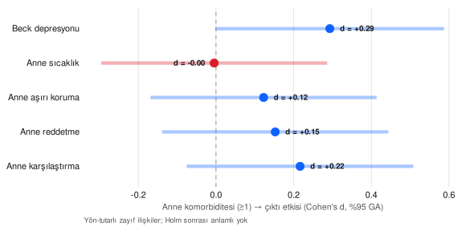

**Şekil 16.4. [KEŞİFSEL · İKİNCİL] Anne komorbiditesinin (≥1 kronik hastalık) çıktı etkileri.** Yorum: Anne komorbiditesi Beck depresyonuyla küçük-orta, ebeveynlik alt ölçekleriyle küçük ve yön-tutarlı ilişkiler gösterir; Holm düzeltmesi sonrası hiçbiri anlamlı değildir.

## 16.6 Aile Yapısı ve Kardeş Konstelasyonu

Tek-ebeveyn yapısı betimsel kalır: birleşik n = 3 (boşanmış n = 2 + dul n = 1), hepsi DM grubunda, Kontrol'de 0 → moderasyon tanımsızdır (Amato-Keith küçük etki × near-zero alt-grup) ve hiçbir modele kovaryat olarak girmez. Doğum sırası ve kardeş konstelasyonu birincil olarak within-family kontrastla (aile-sabit-etki mantığı, yaş kontrolü zorunlu) modellenir: indeks−kardeş EMBU-C farkının doğum-sırası farkına standartlaştırılmış katsayıları küçüktür (|std_β| ortanca 0,135), en büyük aşırı-koruma std_β = −0,255 (ham p = 0,041) FDR sonrası anlamsızdır (p_BH = 0,245; Rohrer 2015 "minik etki + geniş GA" ile tutarlı); kaynak-seyrelme (cocuk_sayisi → EMBU-C) sinyali yok/miniktir. Kardeş diadik karşılıklılığı (yalnız diadik mütekabiliyet; genelleştirilmiş ilişki modeli tasarımı gerektirmez) dört üst-boyutta pozitif orta-düşük mütekabiliyet gösterir: warmth r = 0,292, status r = 0,384, conflict r = 0,194, rivalry r = 0,177 (hepsi p < 0,01); TOST'ta dördü de sıfıra eşdeğer değildir → kardeş-uyumu gerçektir. Ayırt-edilebilirlik zayıftır (indeks−kardeş ortalama farkı tüm boyutlarda anlamsız, |dz| ≤ 0,050 → düad simetrik). Kenny-Mohr-Levesque varyans ayrışımında common-fate (düad-ortalaması) oranı 0,588–0,692'dir. Common-fate payının 0,588–0,692 bandında yoğunlaşması, iki kardeşin ebeveynlik iklimine ilişkin algısındaki ortak (düad-düzeyi) bileşenin bireysel/ayrıştırıcı bileşenden daha büyük olduğunu, yani kardeşlerin ilişki niteliğini büyük ölçüde paylaşılan bir çekirdek üzerinden algıladığını gösterir. Karşılıklılık katsayılarının dört boyutta da sıfırdan ayrık kalması (r = 0,177–0,384) ve eşdeğerlik testinde sıfıra indirgenememesi, bu paylaşılan çekirdeğin ölçüm gürültüsüyle açıklanamayacağını destekler. Bu ayrıştırma, aile üyeleri arasındaki karşılıklı algıyı aktör, partner ve ilişki bileşenlerine bölen sosyal ilişkiler modeli geleneğiyle (Ackerman ve diğerleri, 2011) kavramsal olarak uyumludur ve kardeş algısının aile-düzeyi bir olguya gömülü olduğunu vurgular. Uzantıda (same_sex × karşılıklılık) yalnız status boyutunda ham fark görülür (aynı-cins r = 0,492 > farklı-cins r = 0,255; p = 0,034) ama FDR sonrası anlamsızdır (p_BH = 0,269); age_gap kuadratik terimleri anlamlı değildir.

**Tablo 16.5. [KEŞİFSEL · İKİNCİL] Aile yapısı ve kardeş konstelasyonu özeti.**

| Analiz | Ana metrik | İkincil yorum |
|---|---|---|
| Tek-ebeveyn | n = 3 (hepsi DM); Kontrol = 0 | Betimsel; moderasyon tanımsız, hiçbir modele girmedi. |
| Within-family doğum sırası | aşırı-koruma std_β = −0,255 (ham p = 0,041; FDR p_BH = 0,245) | Minik etki + geniş GA; FDR sonrası anlamsız (Rohrer ile tutarlı). |
| Kaynak-seyrelme | cocuk_sayisi std_β ≤ 0,042 | Downey/Hertwig seyrelme sinyali yok/minik. |
| Diadik karşılıklılık | warmth 0,292 / status 0,384 / conflict 0,194 / rivalry 0,177 (p < 0,01) | Pozitif orta-düşük mütekabiliyet; TOST'ta sıfıra eşdeğer değil (uyum var). |
| Ayırt-edilebilirlik | \|dz\| ≤ 0,050 (tüm boyutlar anlamsız) | Düad simetrik; belirgin indeks-kardeş rol-asimetrisi yok. |
| same_sex × karşılıklılık | status aynı-cins r = 0,492 > farklı-cins 0,255 (p = 0,034; FDR = 0,269) | Ham sinyal FDR sonrası anlamsız; age_gap kuadratiği null. |

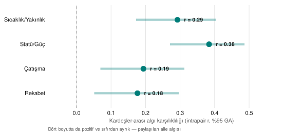

**Şekil 16.5. [KEŞİFSEL · İKİNCİL] Kardeşler-arası diadik algı karşılıklılığı (SRQ üst-boyutları).** Yorum: Kardeşler ebeveyn davranışını ve ilişki niteliğini dört boyutta da pozitif ve sıfırdan ayrık bir karşılıklılıkla algılar (eşdeğerlik testinde sıfıra eşdeğer değil); aile ebeveynlik ikliminin paylaşılan bir çekirdeği vardır.

<!-- ═══════════ FİGÜR-RENDER-TALİMATI ═══════════
id: fig-16-8
baslik: Doğum sırası — within-family EMBU-C fark katsayıları
yerlesim: §16.6 (aile yapısı) içine
grafik_turu: Yatay forest (4 alt ölçek, standardize katsayı + %95 GA)
veri_kaynagi: outputs/tables/phase3_family_birth_order_within.csv — indeks−kardeş EMBU-C farkının doğum-sırası farkına std_β + GA (en büyük aşırı-koruma std_β=−0,255, ham p=0,041; FDR sonrası anlamsız)
kodlama: y=4 EMBU-C alt ölçeği; x=standardize katsayı; hata çubuğu=%95 GA
renk_haritasi: İşaret-diverging (Blue/Red); FDR-anlamsız açık nokta
referans_cizgileri: x=0 kesikli gri
dogrudan_etiketler: Her satırda std_β etiketi + FDR notu
stil: Carbon Design System v11 (Blue #0f62fe, Red #da1e28, Teal #007d79, Purple #8a3ffc, Gray #8d8d8d; IBM Plex Sans; resesif ızgara #e0e0e0; sıfır çizgisi #a8a8a8 kesikli; A4-baskı SVG)
onerilen_cikti_dosyasi: docs/assets/figures/carbon/exploratory/expl_f08_birth_order.svg
render_sonrasi_embed_satiri: 
caption_bloku: **Şekil 16.8. [KEŞİFSEL · İKİNCİL] Doğum sırası farkının aile-içi (within-family) EMBU-C algı farkına standardize katsayıları.** Yorum: minik etkiler, geniş GA; FDR sonrası hiçbiri anlamlı değil.
uygulama_notu: R base svg(); within-family fark-skoru forest.
═══════════ /FİGÜR-RENDER-TALİMATI ═══════════ -->

**Betimsel ek — doğum sırası × cinsiyet konstelasyonu.** Artık-değişken doygunluk denetiminin (§16.15) *yalnız betimsel* düzeyde sunulmaya değer bulduğu tek yüzey, indeks çocuğun doğum sırası (ilk çocuk vs sonra doğan) ile cinsiyetinin çaprazlanmasıdır. Hücreler dengelidir (ilk-Kız 73, ilk-Erkek 30, sonra-Kız 75, sonra-Erkek 61; her biri n ≥ 30) ve dört hücrede anne-raporu aşırı koruma (2,11–2,33), anne-raporu reddetme (1,16–1,26) ve çocuk-algılanan reddetme (1,39–1,45) ortalamaları birbirine çok yakındır; belirgin bir konstelasyon deseni görülmez. Bu 2 × 2 **bilinçli olarak yalnız betimsel** sunulur — çıkarımsal etkileşim testi yapılmamıştır (kuramsal değeri düşük; ayrıca §108 within-family doğum sırası ve §16.10 cinsiyet moderasyonu zaten koşulmuş olduğundan, doğum-sırası × cinsiyet etkileşimini ayrıca çıkarımsal test etmek keşifsel forking riski taşırdı, §16.15).

**Tablo 16.14. [KEŞİFSEL · İKİNCİL] Doğum sırası × cinsiyet betimsel 2 × 2 (indeks çocuk; çıkarımsal test yok).**

| Doğum sırası | Cinsiyet | n | Aşırı koruma (anne) | Reddetme (anne) | Reddetme (çocuk-algı) |
|---|---|---|---|---|---|
| İlk çocuk | Kız | 73 | 2,11 | 1,18 | 1,40 |
| İlk çocuk | Erkek | 30 | 2,23 | 1,16 | 1,44 |
| Sonra doğan | Kız | 75 | 2,21 | 1,26 | 1,39 |
| Sonra doğan | Erkek | 61 | 2,33 | 1,20 | 1,45 |

Kaynak: `outputs/tables/phase4_clmod_birthorder_sex_descriptive.csv`.

## 16.7 DM-Spesifik Maruziyet Yoğunluğu

Bu KISIM yalnız DM alt-örnekleminde (indeks aile n = 120) yürür; imputation yapılmaz. Yaşam-oranı maruziyet metriği (illness_life_ratio = dm_yili / cocuk_yas), 2026-07-08 PI form-teyitli veri-bütünlük düzeltmesi (sapma tablosu #3) sonrası geçerlilik denetiminde **mantıksal-imkânsız değer içermez** (önceki sürümde 5 aile "dm_yili > cocuk_yas" nedeniyle dışlanıyordu; bu ailelerin tanı tarihleri orijinal formlardan düzeltildi); tüm 120 DM ailesi analitik örnekleme girer (ort = 0,364; medyan = 0,319; sd = 0,242). Metrik pediatrik kronik hastalıkta doğrulanmamış olduğundan (hedefli literatür taraması karşılık bulmadı) birincil estimand olarak sunulmaz; üç maruziyet parametrizasyonu (oran; süre + yaş kovaryat; tanı-yaşı × güncel-yaş etkileşimi) yan yana raporlanır. Dokuz focal testten **yalnız biri** Holm sonrası anlamlıdır — embu_c_idx aşırı-koruma çıktısında tanı-yaşı × güncel-yaş etkileşimi (kısmi r = −0,269; p = 0,004; p_Holm = 0,032); diğer sekizinin tamamı anlamsızdır (p_Holm ≥ 0,98). ⚠️ Bu tek sinyal (i) **doğrulanmamış** oran/tanı-yaşı metriğine dayanır, (ii) doğrudan düzeltilen 5 ailenin `tani_yasi` değerine **duyarlıdır** (bu değişken düzeltilen `dm_yili`'den türetilir), (iii) çoklu-çıktı içinde tek testtir → yalnızca **hipotez-üretici**, confirmatory değil. En iyi-AIC parametrizasyon çıktıya göre değişir (embu_c_idx aşırı-koruma → etkileşim; embu_p aşırı-koruma → oran; srq çatışma → süre) → tek bir maruziyet operasyonelizasyonu üstün değildir. Prikken (2019) düzeltmesi gereği psikolojik-kontrol proxy'siyle (reddetme + karşılaştırma) yan-analiz n = 120 üzerinde eşdeğerlik testinde üç parametrizasyonun da kararı belirsizdir (ne anlamlı ne eşdeğer). Kardeş tanı-gelişim penceresi yalnız betimsel eskiz olarak sunulur (çıkarımsal test yok): geçerli n = 120 bandları <0 (tanıdan sonra doğdu) n = 1, 0-5 n = 38, 5-10 n = 55, ≥10 n = 26; band-bazlı kardeş SRQ/EMBU-C ortalamaları yalnız gelecek-tasarım sinyalidir.

**Tablo 16.6. [KEŞİFSEL · İKİNCİL] DM-spesifik maruziyet yoğunluğu özeti (DM-only).**

| Analiz | Ana metrik | İkincil yorum |
|---|---|---|
| Yaşam-oranı geçerliliği | Düzeltme sonrası 0 mantıksal-imkânsız; n = 120; ort = 0,364; medyan = 0,319 | Metrik doğrulanmamış; birincil estimand değil, duyarlılık katmanı. |
| Üç parametrizasyon (Holm) | 9 focal test; **1/9 Holm-anlamlı**: embu_c_idx aşırı-koruma × tanı-yaşı×yaş etkileşimi (kısmi r = −0,269; p_Holm = 0,032); diğer 8: p_Holm ≥ 0,98 | Tek sinyal düzeltilen 5 aileye duyarlı + doğrulanmamış metrik → hipotez-üretici, confirmatory değil. |
| En iyi-AIC operasyonelizasyon | çıktıya göre değişir (etkileşim / oran / süre) | Tek bir maruziyet ölçütü üstün değil. |
| Psikolojik-kontrol yan-analiz | 3/3 parametrizasyon TOST'ta belirsiz (n = 120) | Ne anlamlı ne eşdeğer; güç yetersiz. |
| Kardeş penceresi | betimsel: <0 n=1 / 0-5 n=38 / 5-10 n=55 / ≥10 n=26 | Yalnız gelecek-tasarım sinyali; çıkarımsal test yok. |

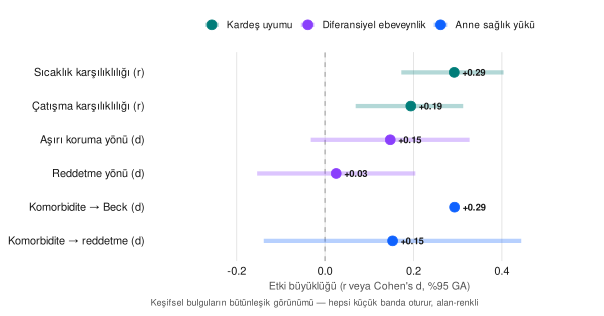

**Şekil 16.6. [KEŞİFSEL · İKİNCİL] Bağlamsal (keşifsel) bulguların bütünleşik etki-büyüklüğü görünümü.** Yorum: Kardeş uyumu, diferansiyel ebeveynlik ve anne sağlık yükü alanlarından seçilmiş bulgular tek panelde alan-renkli olarak sunulur; tüm etkiler küçük banda oturur ve yalnız kardeş karşılıklılığı sıfırdan tutarlı biçimde ayrışır.

## 16.8 Anne Mental Sağlık Yükünün Çocuk ve Kardeş Düzlemine Yansıması

> **Yöntem kutusu — Tedavi göstergesi vs. güncel şiddet, 2 × 2 tasarım ve aile-kümelenmiş model:** Anne mental sağlık yükü birbirinden ayrı iki eksende ölçülmüştür. (i) *Antidepresan kullanımı* (`anne_antidepresan`) tedaviye erişim/klinik-temas göstergesidir — güncel belirti şiddetinin doğrudan ölçüsü değildir. (ii) *Güncel depresif şiddet* Beck Depresyon Envanteri'nin klinik eşiğiyle işlenir (toplam ≥ 17 = "klinik düzey"). İki ekseni tek bir "risk gradyanı"nda toplamak ampirik olarak yanlıştır: bu örneklemde antidepresan kullanan annelerde güncel Beck puanı *daha düşüktür* (§15.5; r = −0,149), yani antidepresan çoğunlukla tedaviyle kontrol altına alınmış tarihsel yükü işaretler. Bu nedenle iki eksen bir **2 × 2 tasarımda** (tedavi durumu × güncel şiddet) çaprazlanır. Çocuk-algısı çıktıları çocuk-gözlem birimi düzeyinde (indeks + kardeş, uzun biçim) modellendiğinden, aynı aileden gelen iki gözlemin bağımsız olmadığını hesaba katan **aile-kümelenmiş rastgele-kesişim (random-intercept) modeli** kullanılır (`(1 | aile_no)`).

Bu çözümleme, CSR'da yalnız anne öz-bildirim düzlemine (H3; §16.5) bağlanmış olan anne mental sağlık yükünü ilk kez *çocuğun algı düzlemine* (EMBU-C) ve *kardeş ilişki düzlemine* (SRQ) taşır. Çocuk-gözlem düzeyinde (n = 476 gözlem) güncel anne depresif şiddeti (Beck ≥ 17), çocuğun algıladığı **reddetmeyi** anlamlı biçimde yordamaktadır (b = 0,134; %95 GA [0,044, 0,224]; p = 0,004) ve bu ilişki hem DM-grubu ana etkisinden (b = 0,131; %95 GA [0,053, 0,209]; p = 0,001) hem de antidepresan ekseninden (b = 0,037; p = 0,506) **bağımsızdır**; tedavi × şiddet etkileşimi anlamsızdır (p = 0,391). Aynı örüntü **karşılaştırma** alt ölçeğinde de belirir (Beck ≥ 17: b = 0,241; %95 GA [0,081, 0,400]; p = 0,003; DM ana etkisi burada sınırda, p = 0,088). Hücre ortalamaları tek-yönlü bir sıralamayı destekler: reddetme algısı tedavisiz-belirtisiz annede en düşüktür (tedavi−/Beck < 17, n = 134 aile: 1,36), güncel belirtili annede yükselir (tedavi−/Beck ≥ 17, n = 59: 1,51); antidepresan kullanımının kendisi (tedavi+/Beck < 17, n = 39: 1,45) reddetme algısını yükseltmez. Bu örüntü, anne depresyonunun çocuğa aktarımını olumsuz anne davranış ve etkilerine maruziyet üzerinden modelleyen mekanizma çerçevesiyle (Goodman ve Gotlib, 1999; Goodman ve diğerleri, 2020) ve pediatrik T1DM'de ebeveyn distresinin çocuk iyilik hâliyle ilişkilendiği kontrollü bulgularla (Van Gampelaere ve diğerleri, 2020) yön bakımından tutarlıdır. Önemli olan, sinyalin *güncel* anne şiddetine bağlı olması, antidepresan kullanımına bağlı olmamasıdır: bu, antidepresanın güncel şiddet değil tedavi/temas göstergesi olduğu yorumunu (§15.5) çocuk düzleminden bağımsız biçimde doğrular.

Anne–çocuk **bilgi-veren uyuşmazlığı** (informant discrepancy; anne EMBU-P ile çocuk EMBU-C arasındaki işaretli fark) betimsel olarak tutarlı bir yön sergiler (n = 238): reddetme (−0,210), aşırı koruma (−0,320) ve karşılaştırma (−0,251) boyutlarında *çocuk* anneden daha fazla olumsuz davranış bildirirken, sıcaklıkta (+0,277) *anne* çocuktan daha fazla sıcaklık bildirir. Güncel anne distresinin bu uyuşmazlığı yordadığı tek boyut sıcaklıktır (Beck ≥ 17: b = −0,268; p = 0,014); ancak Holm düzeltmesi sonrası sınırda kalır (p_Holm = 0,058) → yön-tutarlı ama doğrulayıcı değil. Uyuşmazlığın büyüklüğü (mutlak anne–çocuk farkı) kardeş ilişki niteliğine taşındığında, reddetme-algısı uyuşmazlığı yalnız kardeş **rekabetiyle** ilişkilidir (b = 0,094; %95 GA [0,011, 0,178]; p = 0,027; p_Holm = 0,082 — Holm sonrası sınırda); çatışma ve sıcaklık boyutları nulldur. Baba davranışı bu tasarımda doğrudan ölçülmediğinden, bu ilişki "çocuğun ebeveynlik-algı uyuşmazlığı" olarak etiketlenir ve nedensel dille okunmaz; bulgu, bilgi-veren uyuşmazlıklarının ölçüm hatası değil aile işleyişine ilişkin geçerli bilgi taşıdığı çerçeveyle (De Los Reyes ve diğerleri, 2015) kavramsal olarak uyumludur.

> **Yöntem kutusu — Latent sınıf dışsal doğrulaması (LCA distal-outcome):** Anne Beck-semptom tipolojisi (§12.2) gözlenmeyen (latent) sınıflara ayrıştırılmıştır; en iyi model **iki sınıflıdır** (adaptif n = 152, %64: düşük Beck/yüksek sıcaklık; riskli n = 86, %36: yüksek Beck/düşük sıcaklık). Sınıfların çocuk/kardeş düzlemindeki çıktılarla ilişkisi *dışsal geçerlik* testidir. Her ailenin sınıf-üyeliği **modal atamayla** (en yüksek arka-olasılıklı [posterior] sınıf) belirlenir; atama belirsizliği iki ölçüyle raporlanır: genel **entropy** (0 = tam belirsiz, 1 = tam ayrık; burada 0,602 = orta) ve ortalama en-yüksek arka-olasılık (0,884). Modal atama sınıflandırma hatasını *düzeltmez*; ideal yaklaşım hata-düzeltmeli 3-adım/BCH yöntemidir (Lanza, Tan ve Bray, 2013). Orta entropy nedeniyle sonuçlar ihtiyatla, hipotez-üretici düzeyde okunur.

Latent sınıflar dışsal olarak geçerlidir: "riskli" anne semptom sınıfı, anne–çocuk **reddetme uyuşmazlığını** güçlü biçimde yordar (b = 0,415; %95 GA [0,292, 0,538]; p < 0,001; p_Holm < 0,001; ortalama uyuşmazlık adaptif −0,362'ye karşı riskli +0,058) ve kardeş **çatışmasıyla** ilişkilidir (b = 0,214; %95 GA [0,062, 0,366]; p = 0,006; ortalama 3,01'e karşı 3,22). Buna karşın riskli sınıf antidepresan kullanımını *artırmaz* — tersine, adaptif sınıfta antidepresan oranı daha yüksektir (%22,4'e karşı %12,8; OR = 0,51; %95 GA [0,22, 1,11]; p = 0,085) → bu, anne semptom-tipolojisinin (güncel yük) antidepresan kullanımından (tedavi/temas) ayrı bir eksen olduğu yorumunu iç-tutarlı biçimde tekrar doğrular. Bütün olarak §16.8, CSR'ın merkezî örüntüsüne — sinyalin neden anne öz-bildirim düzleminde (H3) değil çocuk algı düzleminde (H1) belirdiğine (§17.7) — mekanizma-düzeyinde bir köprü ekler: *güncel* anne distresi, çocuğun algıladığı reddetme/karşılaştırmaya ve kardeş rekabet/çatışmasına yön-tutarlı biçimde bağlanır; ancak tüm ilişkiler küçük-orta bandda, korelasyoneldir ve bağımsız Türk kohortunda dış-validasyon olmadan yükseltilmez.

**Tablo 16.7. [KEŞİFSEL · İKİNCİL] Anne mental sağlık yükü → çocuk/kardeş düzlemi özeti.**

| Analiz | Ana metrik | İkincil yorum |
|---|---|---|
| Güncel distres → EMBU-C reddetme (2×2, long) | Beck ≥ 17 b = 0,134 [0,044, 0,224]; p = 0,004 (DM ve antidepresandan bağımsız) | Güncel anne şiddeti çocuk-algılanan reddetmeyi yordar; antidepresan (tedavi göstergesi) yordamaz. |
| Güncel distres → EMBU-C karşılaştırma | Beck ≥ 17 b = 0,241 [0,081, 0,400]; p = 0,003 | İkinci olumsuz-algı boyutunda da güncel şiddet etkisi; DM ana etkisi sınırda (p = 0,088). |
| Tedavi × şiddet etkileşimi | p = 0,391 (reddetme) / 0,198 (karşılaştırma) | İki eksen additif; monotonik "risk gradyanı" reddedilir (tedavi ≠ güncel şiddet). |
| Distres → anne–çocuk uyuşmazlığı | yalnız sıcaklık b = −0,268; p = 0,014 (p_Holm = 0,058) | Yön-tutarlı, Holm sonrası sınırda; çocuk daha fazla olumsuzluk bildirir (reddetme/koruma/karşılaştırma). |
| Uyuşmazlık → kardeş ilişkisi (SRQ) | reddetme-uyuşmazlığı → rekabet b = 0,094 [0,011, 0,178]; p = 0,027 (p_Holm = 0,082) | Yalnız rekabet boyutunda sınır sinyal; "çocuk algı-uyuşmazlığı" etiketi (baba ölçülmedi). |
| LCA dışsal doğrulama (2 sınıf; entropy = 0,602) | riskli sınıf → reddetme-uyuşmazlığı b = 0,415; p < 0,001; → kardeş çatışması b = 0,214; p = 0,006 | Anne semptom-tipolojisi çocuk/kardeş düzleminde dışsal geçerli; modal atama → ihtiyatlı. |
| Sınıf × antidepresan | adaptif %22,4 vs riskli %12,8; OR = 0,51 [0,22, 1,11]; p = 0,085 | Riskli sınıf daha fazla antidepresan kullanmıyor → semptom-yükü ile tedavi/temas ayrı eksen (iç-tutarlı). |

## 16.9 Yönlü Kardeş-İlişki Mimarisi ve Faset-Düzeyi Topografi

> **Yöntem kutusu — Bakım/güç yönü ve granüler fasetler:** Kardeş İlişkileri Anketi'nin (SRQ) üst-boyutları (sıcaklık, statü, çatışma, rekabet) türetilirken *yön* bilgisi ortalanarak silinir: "statü" üst-boyutu `nurturance_by + nurturance_of + dominance_by + dominance_of` toplamıdır, dolayısıyla "kardeşe bakım *veriyorum*" ile "kardeşten bakım *alıyorum*" aynı skorda toplanır. Kronik hastalık diadında bu yön kuramsal olarak asimetriktir. Bu çözümleme yönü, halihazırda türetilmiş faset ortalamalarından **yön skoru = OF − BY** olarak geri açar (pozitif = raporlayan çocuk kardeşe *veriyor*/baskın); yeni ölçüm gerekmez (Furman ve Buhrmester, 1985 madde eşlemesi). Ayrıca 16 birinci-derece fasetin **kayırma-dışı 14'ü** (anne/baba kayırma fasetleri Faz III §16.3 kayırma kanalına ait olduğundan çift-analiz önlemek için hariç) grup farkı bakımından granüler olarak taranır; çoklu-karşılaştırma Benjamini-Hochberg yanlış-keşif-oranı (FDR) ile denetlenir.

Yön-asimetrisi çözümlemesi (aile-kümelenmiş; grup × kardeş-rolü) üç boyutta da (bakım, baskınlık, hayranlık) grup, rol veya etkileşim etkisi göstermez (tüm p ≥ 0,37); betimsel olarak bakım-yönü her iki grupta negatiftir (çocuklar kardeşten aldıklarını verdiklerinden fazla algılar). Faset güvenilirlikleri beklenenden yüksektir (bakım α = 0,81/0,84; baskınlık α = 0,63/0,64; hayranlık α = 0,69/0,73), dolayısıyla nullluk düşük güvenilirliğe atfedilemez. Granüler 14-faset topografisinde **hiçbir faset FDR sonrası anlamlı grup farkı taşımaz** (en düşük p_BH = 0,69); antagonizm (α = 0,41) ve rekabet (α = 0,45) düşük-güvenilir işaretiyle betimsel kalır. Bu bulgu metodolojik olarak önemlidir: CSR'ın H2 üst-boyut düzeyinde raporladığı grup farkları belirli bir alt-fasette *yoğunlaşmaz* ve yön-asimetrisi DM sinyaline ek katkı getirmez → kardeş-ilişki mimarisi grup arasında büyük ölçüde paylaşılan ve yöne duyarsızdır. İşaretli yaş-yönü çözümlemesinde (yalnız DM; DM'li çocuğun kardeşten büyük/küçük olması) ikili yön moderatörü anlamsızdır (p = 0,139); yalnız sürekli işaretli yaş farkı bakım-asimetrisiyle zayıf ilişkilidir (b = −0,196; %95 GA [−0,373, −0,018]; p = 0,031), kuadratik terim nulldur — betimsel, Tier C.

**Tablo 16.8. [KEŞİFSEL · İKİNCİL] Yönlü kardeş-ilişki mimarisi özeti.**

| Analiz | Ana metrik | İkincil yorum |
|---|---|---|
| Yön-asimetrisi (bakım/baskınlık/hayranlık) | 0/3 grup/rol/etkileşim etkisi (tüm p ≥ 0,37) | Yön DM sinyaline ek katkı getirmiyor; asimetri gruplar arası paylaşılan. |
| Faset güvenilirliği | bakım α = 0,81/0,84; baskınlık 0,63/0,64; hayranlık 0,69/0,73 | Nullluk düşük güvenilirliğe atfedilemez (16 fasetin 14'ü α ≥ 0,50). |
| 14-faset granüler forest (BH-FDR) | 0/14 FDR-anlamlı (en düşük p_BH = 0,69) | Grup farkı belirli bir alt-fasette yoğunlaşmıyor; topografi düz. |
| İşaretli yaş-yönü (DM-only) | ikili yön p = 0,139; sürekli işaretli fark b = −0,196 (p = 0,031) | Betimsel Tier C; DM-yaş hiyerarşisi bakım-asimetrisiyle zayıf ilişkili. |

## 16.10 Çocuk-Düzeyi Odak Moderatörler: Cinsiyet ve Anne Yaşı

Çocuk cinsiyeti bugüne dek yalnız kovaryat olarak modele girmişti; burada **cinsiyet × grup × ebeveynlik** odak etkileşimi olarak sınanır. Sekiz etkileşimin (dört EMBU-C alt ölçeği × iki bilgi-veren düzlemi: çocuk algısı ve anne raporu) hiçbiri grup-içi Holm düzeltmesi sonrası anlamlı değildir (tüm p_Holm ≥ 0,27); en güçlü ham işaret çocuğun algıladığı sıcaklıkta cinsiyet × grup etkileşimidir (p = 0,069). Hücre ortalamaları DM > Kontrol reddetme farkının her iki cinsiyette de benzer olduğunu gösterir → grup farkı çocuk cinsiyetine göre farklılaşmaz. Anne yaşı ise yalnız `_z` kovaryatı olmaktan çıkarılıp *odak gradyan* olarak modellendiğinde anlamlı ve yorumlanabilir bir örüntü verir: anne yaşı ile anne-raporu **aşırı koruma** arasında negatif, **doğrusal** bir ilişki vardır (b = −0,026 birim/yıl; p = 0,004); doğal kübik spline ile karşılaştırmada doğrusal-olmayanlık anlamsızdır (F-testi p = 0,174) → ilişki eğrisel değil düz azalıştır. Öngörülen aşırı koruma yaşça genç annede 2,29'dan (10. persentil, ~32 yaş) yaşlı annede 1,94'e (90. persentil, ~46 yaş) düşer; sıcaklık ve reddetme boyutlarında anne-yaşı gradyanı yoktur. Bu doğrultudaki (ileri anne yaşı ↔ daha ölçülü/daha az müdahaleci ebeveynlik) bulgular gelişimsel literatürle (Camberis ve diğerleri, 2016 — ileri anne yaşı daha yüksek duyarlılık ve zihinselleştirmeyle ilişkili) yön bakımından uyumludur; ancak burada gözlenen aşırı-koruma azalması betimsel bir gradyandır ve nedensel okunmaz. Simpson denetimi (grup × yaş-bandı) gradyanı gruba-bağımlı bir ters yöne çevirmez.

**Tablo 16.9. [KEŞİFSEL · İKİNCİL] Çocuk-düzeyi odak moderatörler özeti.**

| Analiz | Ana metrik | İkincil yorum |
|---|---|---|
| Cinsiyet × grup × ebeveynlik (8 etkileşim) | 0/8 Holm-anlamlı; en güçlü EMBU-C sıcaklık p = 0,069 | Grup farkı çocuk cinsiyetine göre farklılaşmıyor; cinsiyet-diferansiyel ebeveynlik yok. |
| Anne yaşı → aşırı koruma (spline) | doğrusal b = −0,026/yıl; p = 0,004; doğrusal-olmayanlık p = 0,174 | İleri anne yaşı ↔ daha az aşırı koruma; ilişki düz (eğrisel değil). |
| Öngörülen değerler | ~32 yaş: 2,29 → ~46 yaş: 1,94 | Sıcaklık/reddetme boyutlarında anne-yaşı gradyanı yok. |

## 16.11 Klinik Zamanlama ve Metabolik Bağlam (DM-Spesifik)

Bu çözümlemeler yalnız DM alt-örnekleminde (n = 120) yürür; imputasyon yapılmaz. Tanı gelişim-penceresi (erken < 6, orta 6–10, geç ≥ 10 yaş; veri-bütünlük düzeltmesi sonrası bantlar 34/59/27, birleştirme gerekmez), çocuğun algıladığı aşırı koruma ve kardeş bakım-asimetrisiyle ilişkilendirildiğinde anlamlı bir örüntü vermez (aşırı koruma için onset omnibus F = 2,18; p = 0,118; η² = 0,036); orta-onset bandında (6–10 yaş) hafif yüksek aşırı koruma görülür ancak çıkarımsal eşiği aşmaz. Bir aile özel bir maruziyet durumu taşır — kardeş, indeks çocuğun tanısından *sonra* doğmuştur (kardeş tanı-anı yaşı < 0); bu bir hata değil, aileye hastalık yerleşmişken doğmuş kardeş kategorisidir ve betimsel/duyarlılık maskesiyle ayrı raporlanır, çıkarımsal banda sokulmaz. Metabolik kontrol (HbA1c) için tam-veri yalnız 39 ailede mevcuttur (ortalama 8,97; medyan 9,0; SD 2,19; aralık 5,8–15,1); bu değişkenin sosyodemografik ve psikososyal-ölçek korelatları yalnız **betimsel** sunulur (düşük güç). HbA1c ile aile psikososyal ölçümleri arasındaki korelasyonların hiçbiri anlamlı değildir (aşırı koruma r = 0,145; kardeş çatışması r = 0,179; hepsi p > 0,27; geniş GA). **Kritik uyarı:** HbA1c verisi rastgele eksik değildir; varlığı klinik-izlem göstergeleriyle güçlü ilişkilidir (§16.14, MNAR seçilim; OR = 4,56) — dolayısıyla bu betimsel korelatlar ve §12.5'teki HbA1c alt-analizleri seçilim yüzeyi (§16.14) raporlanmadan yorumlanamaz.

**Tablo 16.10. [KEŞİFSEL · İKİNCİL] Klinik zamanlama ve metabolik bağlam özeti (DM-only).**

| Analiz | Ana metrik | İkincil yorum |
|---|---|---|
| Onset penceresi (34/59/27) → aşırı koruma | omnibus F = 2,18; p = 0,118; η² = 0,036 | Tanı yaşı bandları ebeveynlik/kardeş çıktısıyla anlamlı ilişkili değil (Tier C). |
| Tanıdan sonra doğan kardeş | n = 1 (ayrı kategori) | Hata değil, özel maruziyet; betimsel/duyarlılık, çıkarımsal banda alınmaz. |
| HbA1c betimsel | n = 39; ortalama 8,97; medyan 9,0 | Düşük güç; korelatlar yalnız betimsel. |
| HbA1c ↔ psikososyal ölçek | tümü ns (aşırı koruma r = 0,145; çatışma r = 0,179; p > 0,27) | §16.14 MNAR seçilim yüzeyi olmadan yorumlanamaz. |

## 16.12 Aile Sağlık Profili ve Kodlama-Sadakati Denetimi

Anne ve eş komorbiditesi 14 sistem-özgü kategoride betimsel prevalans olarak sunulur (bağlamsal şeffaflık); çoğu kategori seyrek olduğundan hiçbiri tek başına çıkarımsal test edilmez. En sık kategoriler annede endokrin (%7,9) ve solunum (%5,4), eşte kardiyovasküler (%5,4) ve endokrindir (%4,6). Grup farkı yalnız ikili "≥ 1 komorbidite" düzeyinde not edilir (Faz III §16.5 ile iç-tutarlı): anne komorbiditesi Kontrol %27,1 vs DM %24,2 (OR = 0,86; p = 0,66), eş komorbiditesi Kontrol %15,3 vs DM %24,2 (OR = 1,77; p = 0,10) — ikisi de anlamsız. **Kodlama-sadakati denetimi** bir *analiz değil veri-kalite kontrolüdür:* öz-bildirim ikili kronik-hastalık göstergesi ile kodlanmış kategori-sayısı (> 0) arasındaki uyum Cohen κ = 1,00'dir (anne ve eş için; gözlenen uyum 1,00). Bu **bağımsız geçerlik kanıtı değildir** — kodlanmış 14-kategori matris zaten öz-bildirim metninden türetildiğinden iki ölçüm bağımsız değildir; κ = 1,00 yalnız kodlamanın hatasız olduğunu (öz-bildirim → kategori dönüşümünde tutarlılık) teyit eder. Bağımsız tıbbi kayıt bulunmadığından öz-bildirim ↔ kayıt geçerliği testi (ör. Kriegsman tipi) bu veride kurulamaz; bu bir sınırlılık olarak açıkça belirtilir.

**Tablo 16.11. [KEŞİFSEL · İKİNCİL] Aile sağlık profili ve kodlama-sadakati özeti.**

| Analiz | Ana metrik | İkincil yorum |
|---|---|---|
| 14-kategori prevalans (anne + eş) | anne endokrin %7,9 / solunum %5,4; eş kardiyovasküler %5,4 | Betimsel; çoğu kategori seyrek, çıkarımsal test yok. |
| İkili komorbidite × grup | anne OR = 0,86 (p = 0,66); eş OR = 1,77 (p = 0,10) | İkisi de anlamsız (Faz III §16.5 ile iç-tutarlı). |
| Kodlama-sadakati (öz-bildirim ↔ kodlanmış) | κ = 1,00; gözlenen uyum = 1,00 (anne + eş) | Veri-audit; bağımsız geçerlik değil (kodlanmış matris öz-bildirimden türetilmiş). |

## 16.13 Ebeveyn Yaş Farkı (Assortatif Eşleşme)

Eş doğum tarihi kanonik final tabanında türetme kaybı nedeniyle boştu; ham kaynaktan kurtarılarak (`SUPPLEMENT__es_yas_recovered.csv`; 240/241 geçerli) ebeveyn yaş farkı yeniden hesaplandı. Plausibilite maskesi (eş yaşı < 16 veya > 70 → geçersiz) uygulandığında maskelenen kayıt kalmaz; iki aşırı değer (|z| > 3,29) işaretlenir ama silinmez. Ebeveyn yaş farkı (anne − eş) medyanı −3,67'dir (baba ortalama ~3,7 yıl büyük; IQR [−6,18, −0,97]; aralık ±15,4) → tipik assortatif eşleşme örüntüsü. Yaş farkı EMBU-P ve Beck üzerinde zayıf bir kovaryat/moderatördür: yalnız anne-raporu reddetmede ham düzeyde küçük bir ilişki belirir (b = −0,041; %95 GA [−0,079, −0,002]; p = 0,039) ancak Holm düzeltmesi sonrası anlamsızdır (p_Holm = 0,196); diğer boyutlar ve Beck nulldur. Beklendiği gibi zayıf yapısal kovaryat.

**Tablo 16.12. [KEŞİFSEL · İKİNCİL] Ebeveyn yaş farkı özeti.**

| Analiz | Ana metrik | İkincil yorum |
|---|---|---|
| Yaş farkı dağılımı (n = 240) | medyan −3,67; IQR [−6,18, −0,97]; ±15,4 | Baba ~3,7 yıl büyük; tipik assortatif eşleşme. |
| Yaş farkı → EMBU-P / Beck | reddetme b = −0,041 (p = 0,039; p_Holm = 0,196); diğerleri null | Zayıf kovaryat/moderatör; Holm sonrası anlamsız. |

## 16.14 Örneklem-Seçilim ve Alım-Dönemi Geçerlik Denetimleri

> **Yöntem kutusu — MNAR seçilim, IPW fizibilite ve batch confound:** Bu iki denetim yeni bir ilişki keşfetmez; *mevcut* analizlerin geçerliğini sınar. (i) *Rastgele-olmayan eksiklik (MNAR):* bir değişkenin *ölçülmüş olması* bazı değişkenlere bağlıysa, eksik veri rastgele değildir ve o değişken seçilmiş bir alt-örneklemdir (Heckman, 1979; Little ve Rubin, 2019). (ii) *Ters-olasılık ağırlıklandırma (IPW) ve etkin örneklem boyutu (ESS):* seçilimi telafi etmek için ağırlıklandırma kullanılırsa, birkaç büyük ağırlık örneklemi fiilen küçültür; ESS bu "gerçek" bilgi miktarını ölçer, ağırlık-budama (truncation) aşırı ağırlıkları sınırlar. Küçük örneklemde IPW gürültüyü büyütür → burada IPW yalnız fizibilite göstergesi olarak, telafi *değil*, ESS/maksimum-ağırlık/budama raporuyla sunulur. (iii) *Alım-dönemi confound (batch):* iki grup farklı takvim dönemlerinde toplandıysa, "grup" ve "dönem" birbirine karışır; dönem kör kovaryat olarak eklenemez (grup etkisini emer), bunun yerine dönem-dengeli alt-örneklemde replikasyon yapılır.

**HbA1c seçilim yüzeyi (MNAR).** DM grubunda HbA1c yalnız 39/120 ailede (%32,5) mevcuttur ve varlığı antidepresan kullanımıyla güçlü ilişkilidir (Fisher OR = 4,56; %95 GA [1,84, 11,70]; p = 0,000466; tamamlanma antidepresan+ annede %57,1 vs antidepresan− %22,4). Çok değişkenli seçilim modelinde (DM-only lojistik) ölçülme olasılığını yordayan başlıca değişken antidepresan kullanımıdır (OR = 7,86; %95 GA [2,90, 23,4]; p < 0,001); güncel Beck de zayıf katkı verir (OR = 1,08/puan; p = 0,025). HbA1c ham veri dosyasında yoktu, sonradan klinik-kayıt entegrasyonuyla eklendi → varlığı klinik-izlem/temas göstergesidir; bu, HbA1c'nin "düşük n" değil **seçilmiş (MNAR) alt-örneklem** olduğunu gösterir. IPW yalnız fizibilite amacıyla denendiğinde ağır seçilime işaret eder (etkin örneklem yalnız 19,4/37 = %52,4; maksimum ağırlık 15,3; %95 persentilde budamada 2 gözlem sınırlanır) → n = 39'da telafi güvenilir değildir. **Sonuç kuralı:** hiçbir HbA1c × ebeveynlik bulgusu (§12.5; §16.11) bu seçilim yüzeyi olmadan yorumlanmamalı, betimsel ve seçilim-uyarılı okunmalıdır.

**Alım-dönemi (batch) confound.** Anket yılı grupla neredeyse tam kolinearidir: DM ailelerin çoğu 2023'te (108/120), Kontrol ailelerin çoğu 2024–25'te toplanmıştır (2023: DM 108/Kontrol 40; 2024: 6/36; 2025: 6/45); grup ~ yıl ilişkisi çok güçlüdür (LR χ²(2) = 89,97; p ≈ 2,9 × 10⁻²⁰; Cramér's V = 0,585). Bu bir alım/dönem confound'udur; yıl kör kovaryat olarak eklenemez (grup etkisini emer). İki grubun da yeterince temsil edildiği tek dönem olan **2023-only** alt-örnekleminde (DM 108/Kontrol 40) ana grup kontrastları tam örneklemle karşılaştırıldığında ayrışır: anne-raporu boyutları (H3) yönce korunur, ancak indeks-çocuğun algıladığı **reddetme** farkı (tam örneklemde d = 0,380; p = 0,004) 2023-only'de kaybolur (d ≈ 0,00; p = 0,99; yön korunmaz), Beck grup farkının işareti de dönem içinde değişir. Bu, çocuk-algılanan reddetme grup farkının **kısmen alım-dönemi/batch etkisiyle karışık** olabileceğine dair somut bir uyarıdır ve H1'in temkinli yorumlanmasını gerektirir (§18.1). İndeks-çocuğun aşırı koruma farkı ise 2023-only'de yönce korunur (d: 0,370 → 0,258).

**Tablo 16.13. [KEŞİFSEL · İKİNCİL] Örneklem-seçilim ve alım-dönemi geçerlik denetimleri özeti.**

| Analiz | Ana metrik | İkincil yorum |
|---|---|---|
| HbA1c × antidepresan (MNAR) | Fisher OR = 4,56 [1,84, 11,70]; p = 0,000466 | HbA1c seçilmiş alt-örneklem; ölçülme klinik-temasa bağlı. |
| Seçilim modeli (DM-only) | antidepresan OR = 7,86 [2,90, 23,4]; p < 0,001; Beck OR = 1,08; p = 0,025 | Ölçülme olasılığını başlıca antidepresan yordar. |
| IPW fizibilite (telafi değil) | ESS = 19,4/37 (%52,4); maks ağırlık 15,3; budama 2 gözlem | n = 39'da IPW telafisi güvenilir değil; yalnız seçilim göstergesi. |
| Yıl × grup kolinearite | LR χ²(2) = 89,97; p ≈ 2,9 × 10⁻²⁰; V = 0,585 | DM ağırlıkla 2023, Kontrol 2024–25; batch/dönem confound. |
| 2023-only replikasyon | EMBU-C reddetme d: 0,380 → ≈ 0,00 (yön korunmaz); aşırı koruma d: 0,370 → 0,258 (korunur) | Çocuk-algılanan reddetme farkı kısmen dönem-karışık; H1 temkinli okunmalı. |

## 16.15 Fizibilite Dürüstlüğü ve Keşifsel Analizlerin Kanonik Kararı

Keşifsel analizlerin en önemli metodolojik katkısı fizibilite dürüstlüğüdür: bir değişkenin kanonik bazda bulunması modellenebileceğini garanti etmez. Hücre-sayısı denetimi iki analizi (otoimmün diatez n = 1; tek-ebeveyn n = 3) çıkarımsal testten betimsele indirmiş, bir metriği (yaşam-oranı maruziyet) doğrulanmamış duyarlılık katmanına indirmiştir; bunları "keşifsel analiz" diye sunmak yerine "veri sınırı + gelecek tasarım" olarak çerçevelemek jüri savunmasının çekirdeğidir. Aynı dürüstlük, artık-değişken yüzeylerinin çözümlenmesinde iki geçerlik-denetimiyle (§16.14) genişletilmiştir: HbA1c'nin rastgele-olmayan (MNAR) seçilmiş bir alt-örneklem olması (ölçülme olasılığı klinik-temasla güçlü ilişkili, OR = 4,56) ve alım-döneminin grupla neredeyse tam kolinear olması (batch confound; V = 0,585) — ikisi de bir *ilişki* keşfetmez, mevcut analizlerin (HbA1c alt-analizleri, H1 çocuk-algısı farkı) yorum sınırını çizer. Metabolik korelatlar (§16.11) ve tanı-penceresi analizleri de bu nedenle betimsel/seçilim-uyarılı katmanda tutulur.

Keşifsel analizler, CSR'ın birincil bulgularını değiştirmez. Çözümleme alanlarının tamamında (kardeş mimarisi, sosyal tabakalaşma, anne sağlık yükü, aile yapısı, klinik zamanlama, çocuk-düzeyi moderatörler ve artık-değişken yüzeyleri) Holm/FDR-korumalı sistematik doğrulayıcı sinyal seyrek ve küçüktür; tüm etki büyüklükleri literatürle uyumlu küçük banda oturur. Öne çıkan hipotez-üretici işaretler iki eksende toplanır. Birincisi, **anne mental sağlık yükünün çocuk/kardeş düzlemine köprülenmesidir** (§16.8): antidepresan yükünün belirgin grup-asimetrisi (χ² = 14,45) yanında, *güncel* anne depresif şiddetinin (Beck ≥ 17) çocuğun algıladığı reddetme (p = 0,004) ve karşılaştırmayı (p = 0,003) — DM grubundan ve antidepresan kullanımından bağımsız olarak — yordaması, ve anne semptom-tipolojisinin (LCA riskli sınıf) anne–çocuk reddetme uyuşmazlığı (p < 0,001) ile kardeş çatışmasında (p = 0,006) dışsal geçerlik göstermesi. Bu köprü, sinyalin neden çocuk düzleminde belirdiğine (§17.7) mekanizma-düzeyi bir katman ekler. İkincisi, DM'de baba-kayırma algısının düşüklüğü (ham p = 0,039), kardeş diadik karşılıklılığının gerçekliği, ileri anne yaşının aşırı korumayla ters gradyanı (§16.10; p = 0,004) ve Beck-aracı Aile-Stres-Modeli'nin yön-tutarlı zayıf zinciridir. Buna karşılık iki bulgu **CSR'ın mevcut yorumlarını temkinli yönde revize eder:** çocuk-algılanan reddetme grup farkı (H1) dönem-dengeli 2023-only alt-örnekleminde kaybolduğundan kısmen alım-dönemi/batch etkisiyle karışmış olabilir (§16.14; §18.1), ve HbA1c alt-analizleri seçilmiş bir alt-örneklemde yürüdüğünden betimsel/seçilim-uyarılı okunmalıdır (§16.14; §12.5). Tüm bu işaretler bağımsız bir Türk kohortunda dış-validasyon olmadan yükseltilmez; hiçbir keşifsel bulgu H1-H4 doğrulayıcı önselini (prior) güçlendirmez; sonuçlar görüldükten sonra hipotez kurma (HARKing) bu bölümde açıkça reddedilir; tüm çıktı `[KEŞİFSEL · İKİNCİL]` etiketiyle konumlanır.

**Artık-değişken doygunluk denetimi (analitik kapanış).** Keşifsel katmanın tamamlanmasının ardından, kanonik bazda modele hiç girmemiş ya da yalnız kovaryat olarak geçmiş *son* değişken ve ilişki yüzeyleri sistematik ve **çekişmeli (adversarial)** bir denetime tabi tutulmuştur: on iki aday, her biri için bağımsız bir fizibilite (yalnız agregat hücre/varyans), kuramsal-savunulabilirlik ve HARKing/forking değerlendirmesinin ardından, adayı çürütmeye çalışan ikinci bir bağımsız denetimden geçirilmiştir. **Hiçbir aday özgün, çıkarımsal olarak savunulabilir yeni post-hoc analiz olarak hayatta kalmamıştır (0/12).** Elenme gerekçeleri üç sınıfta toplanır. (i) *Zaten kapsanmış* (5 aday): hane kalabalığı (kişi/oda) yalnız SES içinde tüketilmekle kalmaz, bu örneklemde kalabalık ile anne depresyonu arasındaki ilişki **ampirik olarak sıfırdır** (r ≈ −0,01), yani gerçek bir ilişkinin yeniden-dilimlenmesi bile değildir; ev sahipliği `material_index`'e −0,55 yükle temiz absorbe olmuştur; baba sistem-özgü komorbiditesi §16.5 negatif kontrolü ve §16.12 betimsel panelinde; eğitim homogamisi §16.4/§1.6-B'de (ve §1.8'de daraltılmış olarak); meslek kodlama-kaynağı ise sabit (varyans = 0) olduğundan yordayıcı olamaz. (ii) *Fizibilitesi yetersiz* (3 aday): baba istihdamı ≈ %94 sabittir; dulluk/tek-ebeveyn hücreleri (n = 1/2) tümüyle DM grubundadır (grup ekseninde tam karışım); anne psikiyatrik komorbiditesi yalnız 2 ailede pozitiftir (yarı-dejenere). (iii) *HARKing/forking riski* (3 aday): SES × güncel-distres, grup × güncel-distres ve DM-süresi → kardeş ilişkisi analizleri kod tabanında gerçekten hiç koşulmamış olsalar da, her biri mevcut bir keşifsel bulgunun (§16.8) moderasyonu ya da bir kovaryatın moderatöre terfisidir; çıkarımsal olarak yürütmek keşifsel serbestlik derecelerini (garden of forking paths) genişletip yanlış-pozitif üretirdi. Denetimin betimsel düzeyde sunulmaya değer bulduğu tek yüzey — doğum sırası × cinsiyet — §16.6'da (Tablo 16.14) yalnız betimsel olarak, çıkarımsal iddia olmaksızın sunulmuştur. Bu doygunluk denetimi, keşifsel analitik planın **tamamlandığını** ve ileri post-hoc dilimlemenin bilimsel disiplin açısından gerekçelendirilemeyeceğini gösterir; artık ilerleme yolu daha fazla iç-analiz değil, öne çıkan hipotez-üretici işaretlerin (özellikle §16.8 anne güncel-distres → çocuk düzlemi köprüsü) bağımsız bir kohortta ön-kayıtlı dış-validasyonudur.

\newpage

# 17. TARTIŞMA

## 17.1 Genel Yorum Çerçevesi: Üç Bilgi Kaynağı Asimetrisi

Bu çalışmanın en belirgin örüntüsü, ebeveynlik tutumlarının ölçüldüğü üç kaynak (anne öz-bildirimi, çocuk algısı ve düad-içi uyum) arasında sistematik bir asimetri bulunmasıdır. Anne öz-bildirimi düzleminde DM × Kontrol farkı için kanıt belirgin biçimde yetersizdir (H3); çocuk algısı düzleminde DM çocuklar reddetme alt ölçeğinde Kontrol gruptan küçük-tutarlı bir asimetri göstermektedir (H1); anne–çocuk diadik uyum ise DM ve Kontrol gruplarında farklı manifest ve latent örüntüler sergilemektedir (H5). Bu üç kaynak birlikte okunduğunda, aynı yapının (örneğin "anne reddetmesi") farklı bilgi verenler tarafından aynı biçimde işlenmediği görülmektedir. Bu örüntü, De Los Reyes ve diğerlerinin (2015) Operations Triad Modeli içindeki **Diverging Operations (ayrışan operasyonlar)** deseniyle uyumludur ve bilgi-veren uyumsuzluğunu yalnız ölçüm hatası olarak değil, alana ilişkin ek bilgi olarak değerlendirmeyi gerektirir.

## 17.2 H1 Tartışması: Çocuk Algısında DM Lehine Reddetme Yükselmesi

H1 reddetme alt ölçeğinde elde edilen β = 0,16 SD (%95 GA [0,05; 0,26]) etki büyüklüğü iki basamakta yorumlanmalıdır: önce büyüklük mertebesi, ardından klinik-bağlamsal anlamı. Büyüklük açısından bu değer, Funder ve Ozer'in (2019) etki büyüklüğü kademesinde küçük (.10) ile orta (.20) çapa noktaları arasında, orta banda daha yakın konumdadır. Bu sınıflama etkinin klinik olarak büyük olduğunu değil, güvenilir biçimde yinelendiğinde bağlama bağlı ve birikimli anlam taşıyabileceğini gösterir. Schäfer ve Schwarz'ın (2019) ön-kayıtlı psikolojik araştırmalardaki r = 0,16 medyan etki büyüklüğü referansı ile karşılaştırıldığında da bulgu, yayın yanlılığından arındırılmış gerçek etki büyüklüğü dağılımının tipik aralığında konumlanmaktadır.

Bağlam açısından H1, Pinquart'ın (2013) kronik hastalık ailelerinde ebeveyn-çocuk ilişkisi ve aşırı koruma alanında bildirdiği özet düzeyli meta-analitik örüntüyle yön bakımından uyumludur. Ancak mevcut çalışmadaki reddetme algısı etkisi, Pinquart'ın özet aşırı koruma etkisinden belirgin biçimde daha küçüktür. Bu nedenle bulgu, kronik hastalık literatüründeki genel örüntüyü güçlü biçimde tekrarlayan bir sonuç olarak değil, Türk T1DM örnekleminde çocuk algısı düzleminde beliren küçük ve bağlam-koşullu bir sinyal olarak yorumlanmalıdır.

Bu sinyalin asıl yorumu H3 ile birlikte belirginleşmektedir: çocuk algısında reddetme yükselmesi varken (BF₁₀ = 8,12), anne öz-bildirimi düzeyinde aynı boyutta fark yoktur (BF₁₀ = 0,17, ROPE içi pay %92). Karşıtlık bu nedenle tek başına "yüksek reddetme" bulgusu değil, Diverging Operations deseninin somut bir örneği olarak okunmaktadır. T1DM çocukları annelerinin ebeveynlik tutumlarını anneleriyle aynı biçimde değerlendirmemekte; hastalık deneyimi, reddetme boyutunda farklı bir algısal alımlamaya eşlik ediyor olabilir.

Bu yorum, psikometrik duyarlılık kontrolleriyle ayrıca sınanmıştır. EMBU-C reddetme alt ölçeğinin iç tutarlılığı bu örneklemde sınırda gözlemlenmiş; bu nedenle H1 bulgusu madde-yanıt teorisi latent θ skorlarıyla yeniden tahmin edilmiştir. Yeniden tahmin edilen β = 0,14 SD değeri, temel kovaryans analizi tahmininin yaklaşık %88'ini koruyarak bulgunun yalnız manifest ölçek puanına bağlı olmadığını göstermiştir.

EMBU-C sıcaklık alt ölçeğinde grup farkı bulunmaması ("orta düzey H0" lehine kanıt), yorumun sınırını belirlemektedir: DM çocukları anne sıcaklığını Kontrol çocuklarıyla benzer düzeyde algılamakta, farklılaşma özellikle reddetme yorumlamasında yoğunlaşmaktadır. Bu alt-boyut özgüllüğü, Cameron'un (2007) kronik hastalık aile sistemleri çerçevesinde anne aşırı denetim ve çocuk reddetme algısı bağlantısıyla uyumludur.

Bu nedenle H1'in pratik anlamı, tek başına bir patoloji göstergesi üretmek değil, çift-perspektifli aile değerlendirmesi için gözlemsel bir gerekçe sunmaktır. Bulgular, ISPAD 2022 psikolojik bakım kılavuzu, ADA 2026 çocuk-ergen standardı ve ADA psikososyal bakım pozisyon bildirgesinin aile-merkezli değerlendirme yönelimiyle bu sınırlı anlamda uyumludur.

## 17.3 H2 Tartışması: Kardeş İlişkisi Mimarisinin Sürekliliği

H2 SRQ alt ölçeklerinin dördünde de DM × Kontrol grup farkı bulgulanmamıştır. Bu desen, T1DM ailelerinde kardeş ilişkisinin temel boyutlarının (sıcaklık, statü, çatışma, rekabet) bu örneklemde belirgin biçimde ayrışmadığını düşündürmektedir. Ancak sonuç, Sharpe ve Rossiter'in (2002) kronik hastalık kardeş literatüründe bildirdiği heterojen ve T1DM'e özgü kesinlik taşımayan genel risk çerçevesiyle birlikte, "kardeş etkisi yoktur" şeklinde değil, "bu örneklemde grup farkı için yeterli kanıt yoktur" şeklinde okunmalıdır.

Bu ayrım önemlidir: mevcut bulgu klinik olarak kardeş ilişkisinin korunmuş olabileceğini düşündürür, fakat APIM tipi karma model daha küçük etkileri yakalamak için yeterli güç sergilememiş olabilir. Bu nedenle sonuç "Indeterminate" konumunda tutulmuştur. Daha güçlü bir negatif kanıt için TOST eşdeğerlik testi gelecek çalışma analiz hattına eklenmelidir; bu çalışmanın ön-kayıtlı planında H2 ailesi için TOST uygulaması bulunmamaktadır.

Önemli bir tamamlayıcı bulgu, indeks ↔ kardeş ayrımcı muamele oranının (Differential Parental Treatment) Kontrol grubunda %45, DM grubunda %48 düzeyinde olmasıdır. Buist, Deković ve Prinzie'nin (2013) 34 araştırma / 12.257 katılımcılı meta-analizi, daha yüksek ayrımcı ebeveyn muamelesinin çocuk/ergende daha fazla içselleştirme ve dışsallaştırma sorunuyla küçük-orta düzeyde ilişkili olduğunu bildirmektedir. Mevcut çalışmada DM grubunda PDT oranının marjinal yüksek olması, kronik hastalık bağlamında bu mekanizmanın işlerliğini değerlendirmek için ek longitudinal veri ihtiyacını ortaya koymaktadır.

## 17.4 H3 Tartışması: Anne Öz-Bildirim Düzleminde Üç-Katmanlı Negatif Kanıt

H3 dört EMBU-P alt ölçeği için elde edilen üç-katmanlı negatif kanıt zinciri, anne ebeveynlik öz-bildiriminin T1DM bağlamında istatistiksel olarak homojen kaldığını göstermektedir. Bu negatif bulgunun önemi H1 ile birlikte ortaya çıkar: anne tarafında grup farkı saptanmamış, çocuk tarafında ise reddetme algısı küçük ama tutarlı biçimde ayrışmıştır. Bu asimetri üç olası açıklama çerçevesiyle değerlendirilebilir:

**(a) Sosyal istenirlik temelli savunmacılık olasılığı.** Kronik hastalık çocuklu anneler "iyi anne" temsiliyetine yüksek normatif baskı altında olabilir; bu nedenle anne öz-bildirim ölçekleri grup farklarını olduğundan daha düşük gösterebilir. Streisand ve Monaghan'ın (2014) T1DM bakım yükü ve ebeveyn stresi çerçevesi, H3 ile H1/H5 asimetrisi için böyle bir açıklama alanı açar. Ancak sosyal istenirlik veya savunmacılık bu çalışmada doğrudan ölçülmediği için bu yorum mekanizma kanıtı değil, hipotez düzeyindedir.

**(b) Gerçek davranış homojenliği.** Türk anne kültüründe ortak ebeveynlik kalıplarının T1DM stresi karşısında bile değişmediği, kültürel-yapısal bir homojenlik hipotezi de göz ardı edilmemelidir. Bu, ekolojik bir yorumdur.

**(c) Ölçek hassasiyet kısıtı.** EMBU-P reddetme alt ölçeğinin iç tutarlılığı (α = 0,45) ve madde havuzunun zayıf taban etkileri, gerçek farkları yakalamak için yetersiz hassasiyete neden olmuş olabilir. Bu kısıt, çoklu evren analizinde 120 spesifikasyonun tamamında null sonuç çıkmasıyla kısmen reddedilmiştir; ancak ölçek hassasiyeti tartışmasının açık tutulması metodolojik şeffaflık açısından önemlidir.

Bu üç açıklama birlikte değerlendirildiğinde H3, klinik odağı anne ebeveynlik tutumlarını "düzeltme" varsayımına taşımamaktadır. Daha tutarlı çıkarım, NICE NG18, ISPAD 2022 psikolojik bakım kılavuzu ve ADA 2026'nın psikososyal/davranış sağlığı değerlendirmesini öne çıkaran yönelimiyle uyumlu olarak, anne mental sağlık yükünü ve aile psikososyal destek ihtiyacını sistematik biçimde saptamaktır. Bu çıkarım, örneklemimizdeki yüksek antidepresan kullanım oranıyla (DM %29 vs Kontrol %9, SMD = 0,53) aynı klinik dikkat ekseninde birleşmektedir.

## 17.5 H4 Tartışması: Goodman-Gotlib Modeliyle Kesitsel SEM Uyumu

Goodman ve Gotlib'in (1999) entegratif modeli, anne depresyonu ile çocuk gelişim çıktıları arasında genetik, prenatal, ebeveynlik davranışları ve stres yollarını içeren bir gelişimsel çerçeve önermektedir. Mevcut çalışmadaki H4 yapısal eşitlik modeli, bu çerçevenin yalnız ebeveynlik tutumu bileşenine karşılık gelen **kesitsel yapısal yol** düzeyini sınamaktadır.

Anne Beck depresyon latent faktörü, EMBU-P sıcaklık (β = −0,28), reddetme (β = 0,33) ve karşılaştırma (β = 0,28) alt ölçeklerinde FDR-düzeltilmiş anlamlı yapısal yollar üretmiştir. Aşırı koruma yolu yön olarak pozitif (β = 0,08) ancak FDR p = .22 ile anlamsızdır. Bu desen, anne depresif belirti yükü ile ebeveynlik tutumu alt boyutları arasındaki kesitsel ilişkinin **alt-boyut-spesifik** olduğunu — özellikle sıcaklık, reddetme ve karşılaştırma boyutlarında belirginleşirken aşırı koruma kanalında ayrışmadığını — düşündürmektedir.

Anlamlı üç yol için standardize katsayılar β = 0,28–0,33 aralığındadır. Bu katsayılar doğrudan Cohen d ile aynı metrikte değildir; yine de Lovejoy ve diğerlerinin (2000) anne depresyonu ile olumsuz ebeveynlik için raporladığı meta-analitik d = 0,40 bulgusuyla yön ve mertebe bakımından uyumludur. Bu karşılaştırma, kesin büyüklük eşleştirmesi değil bağlamsal kalibrasyon olarak okunmalıdır. Desen, sıcaklık/reddetme/karşılaştırma kanallarında literatürle uyumlu bir kesitsel ilişki paterni bulunduğunu; aşırı koruma kanalının ise aynı patern içinde belirginleşmediğini göstermektedir.

Multi-grup invaryans testleri, configural ve metric düzeylerde yapının DM ve Kontrol gruplarında karşılaştırılabilir olduğunu, scalar düzeyin ise sınırda kaldığını göstermiştir. Bu zemin üzerinde Beck depresyonu ile EMBU-P yolları iki grupta benzer tahmin edilmiştir. Dolayısıyla T1DM bağlamı bu kesitsel SEM yollarında ek bir grup moderasyonu sinyali üretmemiştir; sonuç grup-invariant bir nedensel süreç olarak değil, grup-spesifik ayrışma göstermeyen kesitsel ilişki paterni olarak yorumlanmalıdır.

### H4 ile aracılık bulgusu arasındaki çelişkinin çözümü

Aracılık analizinde Beck → EMBU-P → EMBU-C zincirinin dolaylı etkisi anlamsız bulunmuştur. Bu, görünüşte H4'ün üç anlamlı yapısal yolu ile çelişen bir sonuçtur. Çelişkinin çözümü iki katmanda yatmaktadır:

- a yolu (Beck → EMBU-P) yapısal eşitlik modelinde sıcaklık, reddetme ve karşılaştırma için anlamlıdır (β = 0,28–0,33); aşırı koruma için anlamsızdır (β = 0,08).
- b yolu (EMBU-P → EMBU-C) aracılık analizinde sıfırı içeren güven aralıklarıyla anlamsız çıkmıştır.
- Dolayısıyla **a × b** dolaylı etkisi anlamsızdır.

Yani: Beck → EMBU-P yolu kesitsel SEM içinde güçlüdür; ancak EMBU-P → EMBU-C yolu zayıftır. Bu örüntü De Los Reyes ve diğerlerinin (2015) Diverging Operations çerçevesiyle uyumlu bir yapısal ayrışma olarak okunmalıdır: anne ve çocuk algıları farklı bilgi kanallarında yoğunlaşmakta, Beck ile anne öz-bildirimi arasındaki ilişkinin çocuk algı düzeyine sistematik biçimde taşındığına dair kanıt üretilmemektedir.

## 17.6 H5 Tartışması: Diadik Uyumun Çoklu-Strateji Yorumu

H5, çalışmanın birincil yenilik katkısı olarak kurulmuş ve beş paralel strateji ile yürütülmüştür. Stratejilerin gerçek model çıktıları, manifest düzey (Strateji 1 ICC) ile latent düzey (Strateji 4 Olsen-Kenny) arasında **yön düzeyinde tutarsızlık** ortaya koymuştur; bu tutarsızlık çoklu-strateji yaklaşımının metodolojik değerini göstermekle birlikte, tek bir stratejiye dayalı "güçlü diadik uyum" iddiasının bu veride desteklenmediğini de göstermektedir:

- Manifest ICC değerleri Kontrol grubunda 0,03–0,20, DM grubunda −0,01–0,08 aralığında raporlanmış; Cicchetti'nin (1994) kaba psikometrik eşiklerinde "fakir-zayıf" uyum bandına denk gelmiştir.
- Latent Olsen-Kenny korelasyonları yalnızca **reddetme alt ölçeğinde** Kontrol r = 0,17, DM r = 0,29 düzeyinde raporlanmıştır; ancak DM-grubu modelinin uyumu zayıftır (RMSEA = 0,120; SRMR = 0,254), bu nedenle bu tek DM > Kontrol asimetrisi kırılgandır ve "ölçüm hatasının gizlediği bir DM-sinyali" olarak güçlü biçimde yorumlanamaz.

Olsen ve Kenny (2006) çerçevesinde uyguladığımız ayırt edilebilir düad doğrulayıcı faktör analizi; Kontrol grubunda r = 0,17 ile *minimal* ve DM grubunda r = 0,29 ile *zayıf-orta* latent eşleşme vermiştir. Bu büyüklükler, Kenny ve diğerlerinin (2006) *Dyadic Data Analysis* monografında belirtilen "düşük-orta non-bağımsızlık" aralığında kalmaktadır; ne tam ölçüm geçersizliği (r < 0,10) ne de güçlü yakınsama (r > 0,40) söz konusu değildir.

Stratejilerin yön düzeyinde uyuşmaması, H5 bulgusunu **"güçlü" ya da "zayıf-orta yön kanıtı" değil; ön-kayıtlı triangülasyon şartı karşılanmayan, tek-strateji/tek-alt-ölçek bir sinyal** olarak konumlandırmamızı gerektirmektedir. Baskın manifest kanıt (Strateji 1 ICC) dört alt ölçeğin tamamında Kontrol > DM yönündeyken, latent DM > Kontrol asimetrisi yalnız reddetme alt ölçeğinde ve zayıf model uyumu altında belirmiştir; "en az üç strateji uyumlu" minimum kuralı **sağlanmamıştır**. Bu tutarsızlık şeffaflık ilkesi gereği rapor edilmiş ve tek bir strateji "gerçek" olarak ilan edilmemiştir.

Klinik açıdan H5, ebeveyn ve çocuğun T1DM yönetiminde *paylaşılan tutum mimarisinin* (shared appraisal architecture) sınırlı olabileceğini, bireysel deneyimlerin ise büyük ölçüde ayrı bilgi kanallarında işlendiğini düşündürmektedir. Klinik tutarsızlık örüntüleri (anne sıcak / çocuk düşük: %33 DM; öz-eleştiri yokluğu: %25 DM), Streisand ve Monaghan'ın (2014) bakım yükü ve ebeveyn stresi çerçevesiyle birlikte değerlendirildiğinde olası bir açıklama üretir. Savunmacılık yorumu ise doğrudan test edilmiş bir mekanizma değil, hipotez-üretici bir olasılıktır.

## 17.7 İkincil Analizlerin Bütünleşik Yorumu — [KEŞİFSEL · İKİNCİL]: Çocuk Düzlemindeki Sinyalin Bağlamı

Psikometrik, çok-informant ve sağlamlık çözümlemeleri, birincil hipotezlerin kararlarını değiştirmez; bu bölümde yalnız H1 örüntüsünün hangi ölçüm koşullarında görünür kaldığını açıklayan keşifsel/ikincil bağlam sunulur. Üç bulgu aynı yöne işaret eder. Birincisi, anne–indeks çocuk–kardeş raporlarını tek bir genel ebeveynlik boyutuna indirgemeye çalışan trifactor doğrulayıcı faktör analizi (CFI medyanı 0,90) kabul edilebilir uyum verirken belirgin bir bilgi-veren metot varyansı ortaya koymuş; latent bilgi-veren ayrışması modelinde anne–çocuk reddetme latent korelasyonu r = 0,025 [%95 GA −0,134; 0,185] ile pratik olarak ortogonal çıkmıştır. Bu sonuç, Bölüm 17.1'de tanımlanan üç-bilgi-kaynağı asimetrisinin yalnız ölçüm gürültüsüne indirgenemeyeceğini ve De Los Reyes ve diğerlerinin (2015) Diverging Operations deseniyle uyumlu bir perspektif ayrışması bulunduğunu düşündürür. İkincisi, taban-etkisine duyarlı madde-yanıt kuramı çözümlemesi, çocuk reddetme boyutunda latent theta farkını manifest ortalama farkına göre büyüterek (Cohen d = 0,372) taban etkisinin H1 sinyalini kısmen maskelemiş olabileceğini gösterir; bu, H3 anne düzleminde farkın yokluğunun *yalnızca* ölçek hassasiyetiyle açıklanamayacağını, çünkü aynı taban-etkisi düzeltmesinin anne tarafında bir sinyal ortaya çıkarmadığını ima eder. Üçüncüsü, çoklu evren çözümlemesinde 120 spesifikasyonun tamamının pozitif yön vermesi ve spesifikasyon eğrisi çıkarımsal testinin permütasyon altında ayrışması (t = 4,084; p = .0002), literatür önseliyle birleştirilen meta-analitik havuzlanmanın küçük ama sıfırdan ayrık bir merkez üretmesiyle (havuzlanmış etki 0,139 [%95 GA 0,049; 0,230]) birlikte, H1 çocuk-algısı sinyalinin analitik karar keyfiyetine dirençli olduğunu destekler.

**[KEŞİFSEL · İKİNCİL] Yorum.** Bu üç katman, çocuk-algısı reddetme bulgusunun küçük ama yöntem kararlarına dayanıklı, taban-etkisiyle kısmen gizlenmiş ve bilgi-veren perspektifine özgü bir örüntü olduğunu düşündürür. Klinik açıdan en önemli tamamlayıcı bulgu, anne mental sağlık yükünün grup-asimetrisidir: örneklemde antidepresan kullanımı Diverging Operations mantığından bağımsız olarak DM annelerinde belirgin biçimde yüksektir ve aracılık analizinde DM üyeliği ile ebeveynlik çıktıları arasında bağımsız bir aracı yol kanıtı üretmez — yani antidepresan yükü bir *aktarım yolu* değil, kendi başına klinik dikkat gerektiren bir eşlik değişkenidir. Bu, H3 tartışmasında (Bölüm 17.4) öne sürülen "klinik odak anne ebeveynlik tutumları değil anne mental sağlık yükü olmalı" çıkarımıyla ikincil kanıt düzleminde uyumludur. Anne mental sağlık yükünü bir aktarım yolu değil kendi başına klinik hedef olarak konumlandıran bu çıkarım, T1DM ebeveyn distres literatürüyle yakınsamaktadır. Rumburg ve diğerleri (2017), annelerin diyabet-distresinin anne depresif belirtileriyle güçlü biçimde ilişkili olduğunu ve çok değişkenli modelde ergen glisemik kontrolünü yordayan tek anlamlı değişkenin anne depresyonu olduğunu bildirmiştir. Van Gampelaere ve diğerleri (2020) ise stres, anksiyete ve depresif belirti yükselmesinin babalarda değil yalnız annelerde belirdiğini göstererek, yükün cinsiyete-özgü ve ebeveynlik davranışından görece bağımsız bir eksende yoğunlaştığını ortaya koymuştur. Bu iki bağımsız bulgu, örneklemdeki anne-spesifik antidepresan asimetrisinin kronik hastalık bağlamında tekrarlanan bir örüntüyle uyumlu olduğunu desteklemektedir.

Bu tabloyu tamamlayan keşifsel köprü (§16.8), anne mental sağlık yükünü ilk kez *çocuğun algı düzlemine* taşır ve iki eksenin dikkatle ayrılmasını gerektirir. Antidepresan kullanımı — bir tedavi/temas göstergesi — çocuğun algıladığı reddetmeyle ilişkili değilken, annenin *güncel* depresif şiddeti (Beck ≥ 17) çocuğun reddetme (b = 0,134; p = 0,004) ve karşılaştırma (b = 0,241; p = 0,003) algısını, hem DM grubundan hem de antidepresan ekseninden bağımsız olarak yordamaktadır. Bu ayrım kavramsal olarak belirleyicidir: klinik dikkat gerektiren, annenin bir psikiyatrik tanı taşıması değil, o an sürmekte olan belirti yüküdür. Örüntü, anne depresyonunun çocuğa aktarımını — genetik/mizaç yatkınlıklarının yanında — çocuğun olumsuz anne biliş, davranış ve duygulanımına *maruziyeti* üzerinden modelleyen gelişimsel mekanizma çerçevesiyle (Goodman ve Gotlib, 1999) doğrudan örtüşür ve sinyalin neden anne öz-bildirim düzleminde (H3) değil çocuk algı düzleminde (H1) belirdiğine mekanizma-düzeyi bir açıklama önerir: ölçülen, annenin kendine atfettiği tutum değil, çocuğun deneyimlediği duygusal iklimdir. Anne semptom-tipolojisinin latent sınıf çözümlemesi bu yorumu dışsal olarak destekler — "riskli" sınıf hem anne–çocuk reddetme uyuşmazlığını (p < 0,001) hem kardeş çatışmasını (p = 0,006) yordar, ancak antidepresan kullanımını yordamaz (§16.8) — güncel semptom yükü ile tedavi/temas ekseninin gerçekten ayrı olduğunu iç-tutarlı biçimde gösterir. **Bununla birlikte, bu mekanizma yorumu iki temkin kaydıyla sınırlanır:** ilişkiler küçük-orta bandda ve korelasyoneldir (kesitsel tasarım nedensel yön kurmaz); ve H1 çocuk-algısı reddetme farkının kendisi, alım-dönemi dengeli alt-örneklemde zayıfladığından (§16.14; §18.1) kısmen batch etkisiyle karışmış olabilir — dolayısıyla anne-güncel-distres → çocuk-algısı köprüsü, doğrulayıcı bir yol değil, bağımsız kohortta sınanmayı bekleyen hipotez-üretici bir mekanizma önerisi olarak konumlanır.

## 17.8 Bağlamsal Çözümlemelerin Bütünleşik Yorumu — [KEŞİFSEL · İKİNCİL]: Sağlam Kardeş Mimarisi ve Sınırlı Bağlamsal Modülasyon

Sosyodemografik ve klinik bağlamsal değişkenlerin ebeveynlik ve kardeş ilişkileriyle bağını inceleyen çözümlemeler, tutarlı bir "sağlamlık" örüntüsü çizer: hiçbir bağlamsal blok, çoklu-karşılaştırma düzeltmesi sonrası sistematik bir farklılaşma üretmez ve tüm etki büyüklükleri literatürle uyumlu küçük banda oturur. Kardeş diferansiyel ebeveynliği bir *etki* olarak modellendiğinde, DM ve Kontrol aileleri arasında diferansiyel algının büyüklüğünde veya yönünde Holm-korumalı hiçbir sistematik fark bulunmamış; tek ham işaret DM ailelerinde baba-kayırma algısının görece düşüklüğüdür (d = −0,267; düzeltilmemiş). Buna karşılık kardeşlerin ebeveyn davranışını algılamada gösterdiği diadik karşılıklılık dört boyutun tamamında pozitif ve sıfırdan ayrıktır (r = 0,177–0,384; eşdeğerlik testinde sıfıra eşdeğer değil): kardeşler farklı bireyler olsa da aile ebeveynlik ikliminin *paylaşılan* bir çekirdeğini benzer biçimde algılarlar. Bu iki bulgu birlikte, Bölüm 17.3'teki "kardeş ilişkisi mimarisinin sürekliliği" yorumunu bağlamsal düzlemde tamamlar: farklılaşma zayıf, paylaşılan algı ise gerçektir.

**Yorum.** Sosyal sınıf ölçütlerinin (ISEI, SIOPS, EGP) ağır kolineer olması ve hiçbirinin ebeveynlik üzerinde ayırt edici bir gradyan üretmemesi, Ganzeboom ve Treiman'ın (1996) tek bir prestij-sınıf ölçütünün çıktı öngörüsünde büyük ölçüde örtüştüğü gözlemiyle tutarlıdır; bu örneklemde ebeveynlik tutumu sosyoekonomik konuma güçlü biçimde koşullanmamaktadır. Buna karşılık materyal yoksunluk, anne depresyonu ve sıcaklık algısı arasındaki Aile-Stres-Modeli çözümlemesi yön-tutarlı ama zayıf bir dolaylı iz bırakır (yoksunluk düzeyi ile depresyon puanı arasında pozitif, depresyon ile sıcaklık algısı arasında negatif bir ilişki gözlenir); bu bulgu Conger'ın ekonomik baskı çerçevesiyle uyumlu, keşifsel ve dış-validasyon gerektiren bir sinyal olarak tutulur. Otoimmün diatez ve tek-ebeveyn yapısı gibi bloklar örneklemin hücre-sayısı sınırları nedeniyle test edilememiş; bunları "sinyal yok" olarak değil "bu örneklemde ölçülemedi, gelecek tasarım gerektirir" olarak çerçevelemek yöntemsel dürüstlüğün gereğidir.

## 17.9 Genel Sentez: Üç-İnformant Asimetrisi, Birincil Bulgular ve [KEŞİFSEL · İKİNCİL] Katmanlar

**[KEŞİFSEL · İKİNCİL] Sentez notu.** Birincil, ikincil ve bağlamsal çözümlemeler birlikte okunduğunda, T1DM'in aile üzerindeki izi iki eksende yoğunlaşmaktadır: ebeveynlik davranışının farklı bilgi verenlerce nasıl algılandığı ve anne mental sağlık yükü. Anne öz-bildirimi düzleminde tablo dikkat çekici biçimde homojendir (H3'ün üç-katmanlı negatif kanıtı, çoklu evrende de sağlam); çocuk-algısı düzleminde reddetme boyutunda küçük ama dayanıklı bir DM-lehine asimetri belirir (H1; latent, taban-duyarlı ve çoklu-evren-dirençli); anne–çocuk uyumu ise ne güçlü yakınsama ne de tam ayrışma gösterir (H5; ön-kayıtlı triangülasyon şartı karşılanmadığından tek-strateji sinyal olarak konumlanır).

Yapısal model bu resmi tamamlar. Beck → EMBU-P yolu güçlüdür (β = 0,28–0,33), buna karşılık EMBU-P → EMBU-C yolu zayıftır (H4 ile aracılık çelişkisinin çözümü, Bölüm 17.5). Bu desen, ilişkinin anne tarafında belirginleştiğini, çocuk algı düzlemine karşılığının ise sınırlı kaldığını göstermektedir. Kesitsel tasarım nedeniyle bu örüntü nedensel yön çıkarımı olarak değil, ayrışan-operasyonlar çerçevesiyle uyumlu bir yapısal yakınsama olarak yorumlanmalıdır.

Bu çok-katmanlı desen üç klinik yönelim üretir. Birincisi, T1DM aile değerlendirmesinde **çift-perspektifli ölçüm gereklidir**: yalnız anne öz-bildirimine dayanan bir değerlendirme, çocuğun reddetme algısındaki asimetriyi ve anne-çocuk perspektif ayrışmasını sistematik olarak gözden kaçırır. Bu yönelim, ISPAD 2022 psikolojik bakım kılavuzu, ADA 2026 çocuk-ergen standardı ve çoklu-informant literatürünün aile-merkezli değerlendirme çerçevesiyle uyumludur.

İkincisi, klinik kaynak anne ebeveynlik tutumlarını "düzeltmeye" değil, anne mental sağlık yükünü ve aile psikososyal destek ihtiyacını saptamaya yönelmelidir. H3 negatif kanıtı, antidepresan grup-asimetrisi ve zayıf Aile-Stres-Modeli izi aynı hedefe işaret etmektedir. Antidepresan kullanımındaki DM %29'a karşı Kontrol %9 farkı (SMD = 0,53), Cohen (1988) ölçütünde orta büyüklükte bir grup asimetrisine karşılık gelmekte ve bu klinik yönelime gözlemsel bir çapa sağlamaktadır. Bu yorum, anne depresyonunu ergen glisemik kontrolünün tek anlamlı yordayıcısı olarak konumlandıran Rumburg ve diğerlerinin (2017) bulgusuyla tutarlıdır; nedensellik ima etmeksizin, anne mental sağlık yükünü klinik dikkatin öncelikli hedeflerinden biri olarak konumlandırır.

Üçüncüsü, kardeş ilişkisi mimarisi ve paylaşılan aile algısı bu örneklemde görece korunmuş görünmektedir. Bu nedenle kardeşe yönelik müdahaleler öncelikli bir müdahale hedefi olarak değil, izleme kapsamında tutulmalıdır. Bu yorum, Sharpe ve Rossiter'in (2002) kronik hastalık kardeşleri için bildirdiği genel risk çerçevesini T1DM'e özgü bir kesinlik iddiasına dönüştürmez. Tüm yönelimler, bağımsız bir Türk kohortunda dış-validasyon yapılmadan klinik protokol düzeyine yükseltilmemeli; ikincil ve bağlamsal bulgular hipotez-üretici olarak konumlanmalıdır.

\newpage

# 18. SINIRLILIKLAR

## 18.1 Tasarım Kaynaklı Sınırlılıklar

- **Kesitsel tasarım:** Çalışma kesitsel bir vaka-kontrol tasarımıdır; nedensel yön çıkarımı yapılmamıştır. Anne depresyonu ↔ ebeveynlik tutumu ↔ çocuk algısı zincirinin zaman boyutu mevcut veriden tahmin edilememiştir.
- **Tek-merkezli örneklem:** Marmara Üniversitesi pediatrik endokrinoloji polikliniği üzerinden seçilen örneklem, İstanbul/Marmara bölgesinin sosyokültürel profilini yansıtmaktadır. Anadolu ve Doğu Anadolu kohortlarında replikasyon ihtiyacı bulunmaktadır.
- **Anne odaklı değerlendirme:** Çalışma anne perspektifini birincil bilgi kaynağı olarak almaktadır. Baba perspektifinin dahil edilmediği tasarım, NICE NG18'in iki-ebeveynli aile değerlendirmesi önerisini eksik karşılamaktadır.
- **Alım-dönemi (batch) confound:** DM ve Kontrol aileleri büyük ölçüde farklı takvim dönemlerinde toplanmıştır (DM ailelerin çoğu 2023'te, Kontrol ailelerin çoğu 2024–25'te; grup ile anket yılı arasında neredeyse tam kolinearite, Cramér's V = 0,585; p ≈ 2,9 × 10⁻²⁰; §16.14). Bu örüntü "grup" ile "alım dönemi"ni istatistiksel olarak birbirine karıştırır ve yıl bir kovaryat olarak eklenemez (grup etkisini emer). İki grubun da temsil edildiği dönem-dengeli 2023-only alt-örnekleminde anne-raporu bulguları yönce korunurken, indeks-çocuğun algıladığı reddetme grup farkı (H1) belirgin biçimde zayıfladığından, bu farkın bir kısmının dönem/batch etkisiyle karışmış olabileceği açık bir tasarım sınırlılığıdır; H1 çocuk-algısı bulgusu bu uyarıyla temkinli okunmalı ve dönem-dengeli bağımsız kohortta sınanmalıdır.

## 18.2 Ölçüm Kaynaklı Sınırlılıklar

- **EMBU-P reddetme iç tutarlılığı:** α = 0,45 düzeyinde sınır altıdır; bulgular madde-yanıt teorisi ve Bayesçi yapısal eşitlik modeli ile çapraz doğrulanmış olsa da ölçüm hassasiyetinin tam karşılanması mevcut alt ölçek formuyla mümkün olmamıştır.
- **Madde düzeyi taban etkisi:** EMBU-P reddetme maddelerinin %62–%96 arası yanıtın en düşük kategoride yığıldığı görülmüştür; bu dağılım kısıtı, korelasyon ve grup farkı tahminlerini sistematik olarak aşağı çekme eğilimindedir.
- **Sosyal istenirlik yönelimi:** Anne öz-bildirimi ölçeklerinin temel zayıflığıdır; bu çalışmada üç katmanlı negatif kanıt zinciri ile çoklu evren analizi sosyal istenirlik kompansasyonunu epistemolojik olarak işlemiştir, ancak ortadan kaldırmamıştır.

## 18.3 İstatistiksel Sınırlılıklar

- **Aktör-partner karşılıklı bağımlılık modeli ve düad doğrulayıcı faktör analizi için n = 241 düad sayısı:** Donner ve Eliasziw (1987) çerçevesinde ICC ≥ 0,20 için %85+ güç sağlanmış; ancak k-katsayısı ve RSA polinom regresyonu için DM (n = 120) ve Kontrol (n = 121) alt-örneklem güçleri sınır düzeydedir.
- **HbA1c örneklem büyüklüğü:** n = 39 düzeyindeki HbA1c örneklemi, DM klinik alt-analizler için yetersiz güçtedir (Cohen, 1988 standardında power < 0,50). Bu nedenle HbA1c × ebeveynlik etkileşim sonuçları "keşifsel" etiketle raporlanmıştır.
- **Multi-grup invaryans:** Scalar invariance sınır düzeyde kabul edilmiştir; tam scalar değişmezlik koşulu marjinal düzeyde karşılandığından gruplar arası ortalama karşılaştırmaları metrik düzeyde yorumlanmıştır.
- **H2 için TOST eşdeğerlik testi yapılmamıştır:** "Fark yoktur" yerine "kanıt yetersizdir" konumlandırması bu nedenle korunmuştur.

## 18.4 Eksik Veri Kaynaklı Sınırlılıklar

- **HbA1c rastgele-olmayan (MNAR) eksiklik:** DM grubunda HbA1c yalnız 39/120 ailede mevcuttur ve varlığı klinik-temas göstergeleriyle — özellikle anne antidepresan kullanımıyla — güçlü ilişkilidir (seçilim Fisher OR = 4,56; %95 GA [1,84, 11,70]; p = 0,000466; §16.14). Bu, eksikliğin rastgele (MAR) değil rastgele-olmayan (MNAR, seçilmiş alt-örneklem) olduğunu gösterir (Heckman, 1979; Little ve Rubin, 2019). Biyobelirteç imputasyonu hem klinik-araştırma standardı gereği hem de MNAR seçilim nedeniyle uygulanmamıştır; ters-olasılık ağırlıklandırma yalnız fizibilite göstergesi olarak denenmiş (etkin örneklem %52,4) ve bir telafi olarak sunulmamıştır. HbA1c alt-analizleri (§12.5) bu nedenle betimsel ve seçilim-uyarılı okunmalıdır.
- **MAR varsayımı:** Aile düzeyi sosyodemografi için MAR varsayımı altında çoklu atama uygulanmış; NMAR delta-ayarlama ızgarası varsayımın kırılganlığını test etmiştir.

## 18.5 Genelleştirilebilirlik Sınırlılıkları

Bulgular Türk T1DM popülasyonunun İstanbul/Marmara bölgesi alt grubuna **örnek-bağlam-koşullu** olarak konumlanmaktadır. Anadolu ve Doğu Anadolu kohortlarında replikasyon, Türkiye'nin bölgesel sosyoekonomik çeşitliliğinin değerlendirilebilmesi açısından önceliklidir. Sensitivite üçlüsü sonuçları (RV_q = 0,04–0,08; E-değeri = 1,36–1,59) bulguların ölçülmemiş karıştırıcılara karşı zayıf-orta dayanıklılık sergilediğini göstermekte ve replikasyon ihtiyacının altını çizmektedir.

\newpage
# 19. GENEL SONUÇLAR

## 19.1 Çalışmanın Bilimsel Konumu

Bu çalışma, Tip 1 Diabetes Mellitus tanılı 7-17 yaş çocukların ve annelerinin oluşturduğu 241 düadda (n=120 DM, n=121 sağlıklı kontrol), ebeveynlik tutumlarının çift-perspektifli (anne öz-bildirimi ve çocuk algısı) ölçümünü ve anne psikopatolojisi-ebeveynlik tutumu-çocuk algısı zincirinin düad-içi tutarlılığını sistematik olarak incelemiştir. Beş birincil hipotez, eğilim skoru tabanlı dengeleme (IPTW), ayarlama setinin nedensel grafa (DAG) dayalı seçimi, çoklu evren (multiverse) analizi, eşdeğerlik testi (TOST), Bayesçi paralel kanıt değerlendirmesi ve duyarlılık analizi (sensemakr, E-değeri) ile bütünleşik bir kanıt mimarisi içinde değerlendirilmiştir.

Çalışma, Pinquart'ın (2013) özet düzeyiyle doğrulanmış meta-analitik çerçevesindeki "kronik hastalık-ebeveynlik tutumu" örüntüsünü Türkiye T1DM popülasyonunda **kısmen** sınamıştır. Bulgular aynı zamanda De Los Reyes ve diğerlerinin (2015) **Diverging Operations** prensibi ve Korelitz ile Garber'ın (2016) ebeveyn-çocuk algı uyumsuzluğu literatürüyle uyumlu bir ampirik örüntü sunmaktadır. Bu nedenle çocuk perspektifi, anne öz-bildiriminden bağımsız ve klinik olarak anlamlı olabilecek ayrı bir bilgi kanalı olarak ele alınmalıdır.

## 19.2 Hipotez Düzeyinde Özet Çıkarımlar

**H1 — Çocuk-algısı reddetme (DM > Kontrol):** Sıklıkçı ve Bayesçi çerçeveler birlikte değerlendirildiğinde, β = 0,16 SD (BF₁₀ = 8,12) düzeyinde küçük ama tutarlı yön kanıtı elde edilmiştir. Aynı etki anne öz-bildirimi reddetme boyutunda gözlenmediği için bulgu, genel bir ebeveynlik farkından çok bilgi-veren düzeyinde ayrışma olarak yorumlanmaktadır. Bu ayrışma savunmacı raporlama olasılığıyla uyumlu olabilir; ancak savunmacılık doğrudan ölçülmediğinden sonuç mekanizma kanıtı değil, hipotez-üretici bir yorumdur.

**H2 — Çocuk-algısı SRQ kardeş ilişki (DM ≠ Kontrol):** Dört alt boyutta da |d| < 0,20 ve FDR-düzeltilmiş p > 0,35 bulunmuştur. Bayesçi BF dahil edilmemiş ve TOST eşdeğerlik testi uygulanmamıştır; bu nedenle bulgu "**fark yoktur**" değil "**kanıt yetersizdir**" olarak konumlandırılmaktadır.

**H3 — Anne öz-bildirim ebeveynlik (DM ≠ Kontrol):** Dört alt ölçekte de |d| < 0,17 ve BF₁₀ = 0,17–0,25 düzeyinde **orta düzeyde sıfır hipoteze (H₀) yönelik kanıt** vardır. Reddetme alt ölçeğinde ROPE içi posterior pay %92'ye ulaşmış; aşırı koruma için TOST "Eşdeğer" sonuç vermiştir. Bulgu, anne öz-bildirim düzeyinde DM ve Kontrol gruplarının **ebeveynlik tutumu açısından ayırt edilemediğini** desteklemektedir.

**H4 — Beck Depresyon Envanteri ile EMBU-P yapısal yolları (SEM):** Yapısal eşitlik modeli üç ebeveynlik boyutunda anlamlı yol sinyali vermiştir: sıcaklığa β = −0,28 (FDR < 0,001), reddetmeye β = +0,33 (FDR < 0,001), karşılaştırmaya β = +0,28 (FDR < 0,001). Aşırı koruma yolu β = +0,08 (p = 0,22) ile **anlamsız** kalmıştır. **Üç yol belirgin, bir yol nötr** sonucu, Goodman ve Gotlib'in (1999) çerçevesinin ebeveynlik-tutumu bileşeniyle kesitsel SEM düzeyinde uyumludur; nedensel risk aktarımı doğrulaması olarak yorumlanmamıştır.

**H5 — Çoklu-strateji diadik tutarlılık:** Beş stratejinin gerçek model çıktıları yön düzeyinde **uyuşmamıştır**: manifest ICC dört alt ölçeğin tamamında Kontrol > DM (0,03–0,20 Kontrol; −0,01–0,08 DM) iken, DM > Kontrol asimetrisi yalnız reddetme latent korelasyonunda (0,17 Kontrol; 0,29 DM) ve zayıf DM-grubu model uyumu altında belirmiştir. Ön-kayıtlı "en az üç strateji uyumlu" şartı **karşılanmadığından**, bulgu **triangülasyonla desteklenmeyen tek-strateji/tek-alt-ölçek bir sinyal** olarak konumlandırılmıştır.

## 19.3 Klinik Pratik Öneriler — Dış Validasyon Gerektiren Uygulama Çıkarımları

Çalışmanın ürettiği kanıt zinciri, Türkiye T1DM klinik pratiği için dört gözlemsel uygulama çıkarımı üretmektedir. Bu çıkarımlar doğrulayıcı tedavi etkisi iddiası değildir; kılavuzlarla uyumlu, ancak dış-validasyon gerektiren öneri düzeyinde değerlendirilmelidir.

**Öneri 1 — Çift-perspektifli aile değerlendirmesi:** Pediatrik diyabet polikliniklerinde standart aile değerlendirmesinin yalnızca anne öz-bildirimine dayanmaması, çocuk algısının paralel olarak alınması önerilmektedir. EMBU-C alt ölçek puanları özellikle reddetme boyutunda ek bilgi sağlayabilir. Çocuk-algısı yüksek reddetme/anne-bildirim düşük reddetme örüntüsü (Diverging Operations), klinik dikkat gerektiren bir değerlendirme tetikleyicisi olarak ele alınmalıdır. Bu öneri, tedavi etkisi iddiası değil, kılavuz ve çoklu-informant literatürüyle uyumlu bir tarama/izlem çıkarımıdır.

**Öneri 2 — Anne mental sağlığı sistematik tarama:** ISPAD 2022 psikolojik bakım kılavuzu, ADA 2016 psikososyal bakım bildirgesi ve ADA 2026 çocuk-ergen standardıyla uyumlu olarak, T1DM tanılı çocukların annelerinde Beck Depresyon Envanteri veya PHQ-9 ile sistematik depresyon taraması yapılması değerlendirilebilir. Eşik üstü skorlanan annelerde (BDI ≥ 17, Hisli 1989 Türkiye normu), ebeveynlik tutumu ek değerlendirmesi (s-EMBU-P sıcaklık ve reddetme) klinik izleme çerçevesine eklenebilir. Bu çalışmadaki anne antidepresan kullanım oranındaki üç-katlı dengesizlik (DM %29 vs Kontrol %9), klinik sahada bu tarama ihtiyacına gözlemsel destek sağlamaktadır.

**Öneri 3 — Aile temelli davranışsal müdahale entegrasyonu:** Davranışsal Aile Sistem Terapisi-Diyabet (BFST-D; Wysocki ve diğerleri, 2008) gibi aile-merkezli müdahalelerin, anne mental sağlığı eşik üstü olan ailelerde rutin tedaviye eklenmesi değerlendirilebilir. Jansen ve diğerlerinin (2025) pediatrik T1DM ebeveynlik müdahaleleri sistematik derlemesi, müdahale literatürünün genişlediğini ancak etkilerin heterojen ve risk-of-bias sınırlılıklarına duyarlı olduğunu göstermektedir. Bu çalışma, BFST-D veya herhangi bir müdahale için tedavi etkisi kanıtı üretmez; yalnız Beck ile EMBU-P yapısal yollarının belirgin olması nedeniyle anne psikopatolojisini ve aile psikososyal desteğini hedefleyen müdahalelerin dış-validasyonlu çalışmalarda sınanması için gerekçe sunar.

**Öneri 4 — Davranış sağlığı uzmanı entegrasyonu:** ADA 2026 *Standards of Care* önerisi doğrultusunda, çocuk endokrinoloji multidisipliner ekibinde aile sistem perspektifli psikolog veya çocuk-ergen ruh sağlığı uzmanının yapısal entegrasyonu değerlendirilebilir. Bu uygulama çıkarımı dış-validasyon gerektirir; Türkiye Sağlık Bakanlığı T1DM tanı-tedavi protokolünün psikososyal değerlendirme bileşeninin güçlendirilmesi yönünde gözlemsel gerekçe sunar.

## 19.4 Gelecek Araştırma Gündemi

**Replikasyon ve genelleştirme:**

- **Çok-merkezli kohort:** Anadolu ve Doğu Anadolu T1DM merkezlerinin dahil edildiği çok-merkezli replikasyon, sosyokültürel genelleştirilebilirlik açısından önceliklidir.
- **Boyuna (longitudinal) tasarım:** Anne depresyonu → ebeveynlik tutumu → çocuk algısı zincirinin **zaman düzeyinde** test edilmesi için en az iki dalgalı (T1, T1+12 ay) izlem kohortu önerilmektedir. Çapraz gecikmeli panel modeli (CLPM) ve rassal-aralık çapraz gecikmeli panel modeli (RI-CLPM; Hamaker, Kuiper, & Grasman, 2015) bu zincirin yön doğrulamasını sağlayabilir.

**Metodolojik genişletme:**

- **TRIPOD-Cluster dış validasyon:** Mevcut çalışmanın geliştirdiği klinik fayda modelinin (Bölüm 12.4) bağımsız bir kohortta dış validasyonu; Steyerberg ve Vergouwe'nin (2014) önerdiği geometrik kalibrasyon zinciri (intercept, slope, smooth calibration plot) çerçevesinde gerçekleştirilmelidir.
- **Baba perspektifi entegrasyonu:** NICE NG18'in iki-ebeveynli aile değerlendirmesi önerisi doğrultusunda, mevcut anne odaklı tasarımın baba paralel kohortu ile genişletilmesi; baba-çocuk ve anne-baba düadik tutarlılığının da Olsen-Kenny çerçevesinde test edilmesi önerilmektedir.
- **HbA1c × ebeveynlik etkileşimi geniş örneklem:** Mevcut çalışmadaki HbA1c n = 39 örnekleminin keşifsel niteliği nedeniyle; n ≥ 200 DM kohortunda glisemik kontrol ile ebeveynlik tutumu arasındaki ilişkinin (hem ortalama hem de varyans olarak) doğrulanması önerilmektedir.

**Müdahale çalışması:**

- **BFST-D veya benzeri aile-merkezli müdahalelerin Türkiye T1DM popülasyonunda randomize kontrollü deneyimi:** Birincil çıktı olarak HbA1c, ikincil çıktı olarak EMBU-P/C alt ölçek skorları ve BDI skoru alınmalıdır. CONSORT-2010 ve SPIRIT-2013 standartlarında ön-kayıtlı tasarım önerilmektedir.

\newpage

# 20. YAYIN VE DİSEMİNASYON STRATEJİSİ

Çalışma kapsamından üç ana tez makalesi ve ikincil/keşifsel çözümlemelerden üç ek metodolojik/klinik makale hedeflenmektedir. Yayın stratejisi, hipotez odağı, metodolojik özgünlük ve açık-bilim katmanı temelinde dergi-eşleştirmesi ile yapılandırılmıştır. Tüm yayınlar APA 7. baskı, ICMJE yazarlık kriterleri ve TÜBİTAK ULAKBİM yayın etiği yönergeleriyle uyumlu olarak hazırlanacaktır.

## 20.1 Makale 1: Diferansiyel Ebeveynlik ve Çift-Perspektifli Diadik Uyum

**Hedef dergiler (öncelik sırasıyla):** *Pediatric Diabetes* (IF ≈ 4,2; Q1) → *Journal of Pediatric Psychology* (IF ≈ 3,3; Q1) → *Journal of Clinical Psychology in Medical Settings* (IF ≈ 2,1; Q2).

**Odak:** H1 (çocuk-algısı reddetme yön farkı) ve H5 çoklu-strateji diadik tutarlılık çerçevesi. H5'te beş stratejinin **yön düzeyinde uyuşmaması** — manifest ICC'nin (dört alt ölçekte Kontrol > DM) tek latent sinyalle (reddetme, kırılgan uyum) çelişmesi — tek-stratejiye dayalı diadik-uyum iddialarının kırılganlığını gösteren **metodolojik bir katkı** olarak konumlandırılacaktır (Olsen-Kenny çerçevesinin Türkiye T1DM popülasyonuna ilk uygulaması). Vurgu, "güçlü uyum bulgusu" değil, çoklu-strateji **çapraz-kontrolün** tek-strateji yanılgılarını açığa çıkarma değeridir.

**Önerilen anahtar mesaj:** Anne ile çocuğun ebeveynlik tutumu algısı, T1DM bağlamında beklenenden daha az örtüşmektedir; reddetme boyutunda DM grubunda tek-yönlü çocuk-algısı yükselmesi, klinikte çocuk perspektifinin paralel olarak alınması gereğine işaret etmektedir.

## 20.2 Makale 2: Anne Psikopatolojisi-Ebeveynlik Tutumu Aktarımı

**Hedef dergiler:** *Diabetic Medicine* (IF ≈ 3,5; Q1) → *Journal of Family Psychology* (IF ≈ 3,4; Q1) → *Health Psychology* (IF ≈ 4,2; Q1).

**Odak:** H3 (anne öz-bildirim ebeveynlik açısından grup eşdeğerliği) ve H4 (Beck → EMBU-P SEM yapısal yol modeli). Goodman ve Gotlib'in (1999) ebeveynlik-tutumu bileşeniyle kesitsel SEM düzeyinde uyum: sıcaklık, reddetme ve karşılaştırma yolları için belirgin ilişki; aşırı koruma yolu için nötr sonuç.

**Önerilen anahtar mesaj:** T1DM tanılı çocukların annelerinde gözlenen depresif belirti profili, ebeveynlik tutumu alt boyutlarıyla boyut-spesifik biçimde ilişkilidir; sıcaklıkla negatif, reddetme ve karşılaştırmayla pozitif, aşırı korumayla ise zayıf/nötr bir kesitsel SEM örüntüsü mevcuttur.

## 20.3 Makale 3: Türkçe Psikometrik Adaptasyon

**Hedef dergiler:** *Methods in Psychology* (CiteScore ≈ 5,8; Q1) → *European Journal of Psychological Assessment* (IF ≈ 2,9; Q2) → *Psychological Assessment* (IF ≈ 5,1; Q1).

**Odak:** s-EMBU-P ve s-EMBU-C ölçeklerinin Türkçe T1DM popülasyonu için psikometrik validasyon raporu (Bölüm 10). Klasik Test Teorisi (α, ω), Madde Yanıt Teorisi (Graded Response Model), Doğrulayıcı Faktör Analizi (CFI, RMSEA, SRMR), Çok-grup Ölçüm Değişmezliği (configural, metric, scalar) ve Floor/Ceiling etkisi raporu içerecektir. Reddetme alt ölçeğinin sınır altı iç tutarlılık (α = 0,45) bulgusunun şeffaf raporlanması ve **alternatif madde havuzu önerisi** ile sonuçlandırılacaktır.

**Önerilen anahtar mesaj:** s-EMBU-P kısa-formunun reddetme alt ölçeği, Türkiye pediatrik T1DM klinik örnekleminde sınır altı güvenilirlik profili sergilemekte; çoklu yöntem (IRT + Bayesçi SEM) çapraz doğrulama, ölçek revizyonu için ampirik temel sağlamaktadır.

## 20.4 İkincil Analiz Makale Hattı

| Makale | Kapsam | Ana bulgu | Hedef dergi | Veri durumu |
|---|---|---|---|---|
| **Makale 4** | Multi-informant discrepancy: Trifactor + LDS + sibling concordance | Çocuk method varyansı yaklaşık %60; reddetme latent r = 0,025; sibling reddetme ICC DM = 0 vs Kontrol = 0,322 | *Journal of Child Psychology and Psychiatry* / *Psychological Methods* | Mevcut kanonik baz yeterli; yeni veri gerekmez |
| **Makale 5** | Floor-aware IRT ve EMBU reddetme ölçümü | Floor-aware indeks reddetme d = 0,372; manifest farktan belirgin yüksek; reddetme alt skorunun bağımsız kullanımı sınırlı | *Psychometrika* / *Educational and Psychological Measurement* | Mevcut kanonik baz yeterli; yeni veri gerekmez |
| **Makale 6** | Anne antidepresan/mental sağlık yükü ve diadik tutarlılık | AD mediator kanıtı yok; H1 AD-strata bağımsız; H5 reddetme strata örüntüsü hipotez-üretici | *Pediatric Diabetes* / *Journal of Pediatric Psychology* | Mevcut kanonik baz yeterli; yeni veri gerekmez |

Bu üç ikincil/keşifsel analiz makalesi, doğrulayıcı H1-H5 makale hattından ayrı tutulacaktır. Başlıklarda ve yöntem bölümlerinde **keşifsel (exploratory, ön-kayıtsız)** statüsü açık yazılacak, OSF Layer 3 amendment ve Tip 3 sapma tablosu bağlantısı korunacaktır.

## 20.5 Diğer Diseminasyon Faaliyetleri

- **Ulusal kongreler:** Türk Pediatrik Endokrinoloji ve Diyabet Derneği (ÇEDD) yıllık ulusal kongresi sözel sunum başvurusu; Türk Psikiyatri Derneği yıllık kongresi poster başvurusu.
- **Uluslararası kongreler:** ISPAD (International Society for Pediatric and Adolescent Diabetes) yıllık kongresi sözel/poster başvurusu; ESCAP (European Society for Child and Adolescent Psychiatry) bienal kongresi poster başvurusu.
- **Açık veri ve kod:** Anonimleştirilmiş düad düzeyi veri seti (katmanlı erişim sınıflandırmasıyla) ve yeniden üretilebilir analiz kodu OSF üzerinden açık erişime sunulacaktır (DOI rezervasyonu yapılacaktır). Ham bireysel veri, TÜBİTAK Açık Bilim Politikası ve KVKK uyumlu çerçevede yalnızca metaveri paylaşımıyla sınırlandırılacaktır.
- **Politika çıktıları:** Türkiye Halk Sağlığı Genel Müdürlüğü Çocuk Sağlığı Daire Başkanlığı'na T1DM psikososyal değerlendirme protokol önerisi sunulacaktır.

\newpage

# 21. ÇEKİRDEK REFERANSLAR

Aşağıda çalışmanın kavramsal, metodolojik ve klinik temellerini oluşturan çekirdek referans seti APA 7. baskı formatında sunulmaktadır. Tam kaynakça doktora tez dosyasında yer almaktadır.

## 21.1 Kuramsal ve Klinik Çerçeve

American Diabetes Association Professional Practice Committee for Diabetes. (2026). 14. Children and adolescents: Standards of Care in Diabetes—2026. *Diabetes Care*, 49(Suppl. 1), S297–S320. https://doi.org/10.2337/dc26-s014

Arrindell, W. A., Akkerman, A., Bagés, N., Feldman, L., Caballo, V. E., Oei, T. P. S., Torres, B., Canalda, G., Castro, J., Montgomery, I., Davis, M., Calvo, M. G., Kenardy, J. A., Palenzuela, D. L., Richards, J. C., Leong, C. C., Simón, M. A., & Zaldívar, F. (2005). The Short-EMBU in Australia, Spain, and Venezuela. *European Journal of Psychological Assessment*, 21(1), 56–66. https://doi.org/10.1027/1015-5759.21.1.56

Apalaçi, V. (1996). *Psychological adjustment and sibling relationships of older brothers and sisters of children with pervasive developmental disorders* (Tez No. 52148) [Yüksek lisans tezi, Boğaziçi Üniversitesi]. Ulusal Tez Merkezi.

Beck, A. T., Ward, C. H., Mendelson, M., Mock, J., & Erbaugh, J. (1961). An inventory for measuring depression. *Archives of General Psychiatry*, 4(6), 561–571. https://doi.org/10.1001/archpsyc.1961.01710120031004

Bassi, G., Mancinelli, E., Di Riso, D., & Salcuni, S. (2020). Parental stress, anxiety and depression symptoms associated with self-efficacy in paediatric type 1 diabetes: A literature review. *International Journal of Environmental Research and Public Health*, 18(1), 152. https://doi.org/10.3390/ijerph18010152

Camberis, A.-L., McMahon, C. A., Gibson, F. L., & Boivin, J. (2016). Maternal age, psychological maturity, parenting cognitions, and mother–infant interaction. *Infancy*, 21(4), 396–420. https://doi.org/10.1111/infa.12116

Cousino, M. K., & Hazen, R. A. (2013). Parenting stress among caregivers of children with chronic illness: A systematic review. *Journal of Pediatric Psychology*, 38(8), 809–828. https://doi.org/10.1093/jpepsy/jst049

Cuijpers, P., Weitz, E., Karyotaki, E., Garber, J., & Andersson, G. (2015). The effects of psychological treatment of maternal depression on children and parental functioning: A meta-analysis. *European Child & Adolescent Psychiatry*, 24(2), 237–245. https://doi.org/10.1007/s00787-014-0660-6

De Los Reyes, A., Augenstein, T. M., Wang, M., Thomas, S. A., Drabick, D. A. G., Burgers, D. E., & Rabinowitz, J. (2015). The validity of the multi-informant approach to assessing child and adolescent mental health. *Psychological Bulletin*, 141(4), 858–900. https://doi.org/10.1037/a0038498

De Los Reyes, A., Talbott, E., Power, T. J., Michel, J. J., Cook, C. R., Racz, S. J., & Fitzpatrick, O. (2023). The Needs-to-Goals Gap: How informant discrepancies in youth mental health assessments impact service delivery. *Clinical Psychology Review*, 105, 102325.

Eccleston, C., Palermo, T. M., Fisher, E., & Law, E. (2012). Psychological interventions for parents of children and adolescents with chronic illness. *Cochrane Database of Systematic Reviews*. https://doi.org/10.1002/14651858.CD009660.pub2

Goodman, S. H., & Gotlib, I. H. (1999). Risk for psychopathology in the children of depressed mothers: A developmental model for understanding mechanisms of transmission. *Psychological Review*, 106(3), 458–490. https://doi.org/10.1037/0033-295X.106.3.458

Hisli, N. (1989). Beck Depresyon Envanterinin üniversite öğrencileri için geçerliği ve güvenirliği. *Psikoloji Dergisi*, 7(23), 3–13.

de Bock, M., Agwu, J. C., Deabreu, M., Dovc, K., Maahs, D. M., Marcovecchio, M. L., Mahmud, F. H., Nóvoa-Medina, Y., Priyambada, L., Smart, C. E., & DiMeglio, L. A. (2024). International Society for Pediatric and Adolescent Diabetes Clinical Practice Consensus Guidelines 2024: Glycemic Targets. *Hormone Research in Paediatrics*, 97(6), 546–554. https://doi.org/10.1159/000543266

Jansen, M., Voorhoeve, P. G., Wiltink, L., Prins, J. B., & Nefs, G. (2025). Parenting interventions for parents of children with type 1 diabetes: A systematic review. *Journal of Pediatric Psychology*, 50(12), 1115–1138. https://doi.org/10.1093/jpepsy/jsaf078

Korelitz, K. E., & Garber, J. (2016). Congruence of parents' and children's perceptions of parenting: A meta-analysis. *Journal of Youth and Adolescence*, 45(10), 1973–1995. https://doi.org/10.1007/s10964-016-0524-0

de Wit, M., Gajewska, K. A., Goethals, E. R., McDarby, V., Zhao, X., Hapunda, G., Delamater, A. M., & DiMeglio, L. A. (2022). ISPAD Clinical Practice Consensus Guidelines 2022: Psychological care of children, adolescents and young adults with diabetes. *Pediatric Diabetes*, 23(8), 1373–1389. https://doi.org/10.1111/pedi.13428

Lovejoy, M. C., Graczyk, P. A., O'Hare, E., & Neuman, G. (2000). Maternal depression and parenting behavior: A meta-analytic review. *Clinical Psychology Review*, 20(5), 561–592. https://doi.org/10.1016/S0272-7358(98)00100-7

National Institute for Health and Care Excellence. (2024). *Diabetes (type 1 and type 2) in children and young people: Diagnosis and management* (NICE Guideline NG18, updated). NICE.

Pinquart, M. (2013). Do the parent–child relationship and parenting behaviors differ between families with a child with and without chronic illness? A meta-analysis. *Journal of Pediatric Psychology*, 38(7), 708–721. https://doi.org/10.1093/jpepsy/jst020

Pinquart, M. (2017). Associations of parenting dimensions and styles with internalizing symptoms in children and adolescents: A meta-analysis. *Marriage & Family Review*, 53(7), 613–640.

Pinquart, M. (2018). Associations of parenting styles and dimensions with academic achievement in children and adolescents: A meta-analysis. *Educational Psychology Review*, 28(3), 475–493.

Sharpe, D., & Rossiter, L. (2002). Siblings of children with a chronic illness: A meta-analysis. *Journal of Pediatric Psychology*, 27(8), 699–710. https://doi.org/10.1093/jpepsy/27.8.699

Streisand, R., & Monaghan, M. (2014). Young children with type 1 diabetes: Challenges, research, and future directions. *Current Diabetes Reports*, 14(9), 520. https://doi.org/10.1007/s11892-014-0520-2

Van Gampelaere, C., Luyckx, K., van der Straaten, S., Laridaen, J., Goethals, E. R., Casteels, K., Vanbesien, J., den Brinker, M., Depoorter, S., Klink, D., Cools, M., & Goubert, L. (2020). Families with pediatric type 1 diabetes: A comparison with the general population on child well-being, parental distress, and parenting behavior. *Pediatric Diabetes*, 21(2), 395–408. https://doi.org/10.1111/pedi.12942

Wiebe, D. J., Helgeson, V., & Berg, C. A. (2016). The social context of managing diabetes across the life span. *American Psychologist*, 71(7), 526–538. https://doi.org/10.1037/a0040355

Young-Hyman, D., de Groot, M., Hill-Briggs, F., Gonzalez, J. S., Hood, K., & Peyrot, M. (2016). Psychosocial care for people with diabetes: A position statement of the American Diabetes Association. *Diabetes Care*, 39(12), 2126–2140. https://doi.org/10.2337/dc16-2053

Dirik, G., Yorulmaz, O., & Karancı, A. N. (2015). Çocukluk dönemi ebeveyn tutumlarının değerlendirilmesi: Kısaltılmış Algılanan Ebeveyn Tutumları-Çocuk Formu. *Türk Psikiyatri Dergisi*, 26(2), 123–130. PMID: 26111288

Furman, W., & Buhrmester, D. (1985). Children's perceptions of the qualities of sibling relationships. *Child Development*, 56(2), 448–461. PMID: 3987418

Dündar, İ., Akıncı, A., Çamtosun, E., Kayaş, L., Çiftçi, N., & Özçetin, E. (2023). Type 1 diabetes incidence trends in a cohort of Turkish children and youth. *Turkish Archives of Pediatrics*, 58(5), 539–545. https://doi.org/10.5152/TurkArchPediatr.2023.23036

Yeşilkaya, E., Cinaz, P., Andıran, N., Bideci, A., Hatun, Ş., Sarı, E., Türker, T., Akgül, Ö., Saldır, M., Kılıçaslan, H., Açıkel, C., & Craig, M. E. (2017). First report on the nationwide incidence and prevalence of Type 1 diabetes among children in Turkey. *Diabetic Medicine*, 34(3), 405–410. https://doi.org/10.1111/dme.13063

## 21.2 Metodolojik Çerçeve

Appelbaum, M., Cooper, H., Kline, R. B., Mayo-Wilson, E., Nezu, A. M., & Rao, S. M. (2018). Journal article reporting standards for quantitative research in psychology: The APA Publications and Communications Board Task Force report. *American Psychologist*, 73(1), 3–25. https://doi.org/10.1037/amp0000191

Austin, P. C. (2009). Balance diagnostics for comparing the distribution of baseline covariates between treatment groups in propensity-score matched samples. *Statistics in Medicine*, 28(25), 3083–3107. https://doi.org/10.1002/sim.3697

Austin, P. C. (2011). An introduction to propensity score methods for reducing the effects of confounding in observational studies. *Multivariate Behavioral Research*, 46(3), 399–424. https://doi.org/10.1080/00273171.2011.568786

Austin, P. C., & Stuart, E. A. (2015). Moving towards best practice when using inverse probability of treatment weighting using the propensity score to estimate causal treatment effects in observational studies. *Statistics in Medicine*, 34(28), 3661–3679. https://doi.org/10.1002/sim.6607

Benjamini, Y., & Hochberg, Y. (1995). Controlling the false discovery rate: A practical and powerful approach to multiple testing. *Journal of the Royal Statistical Society: Series B*, 57(1), 289–300. https://doi.org/10.1111/j.2517-6161.1995.tb02031.x

Borsboom, D., Deserno, M. K., Rhemtulla, M., Epskamp, S., Fried, E. I., McNally, R. J., Robinaugh, D. J., Perugini, M., Dalege, J., Costantini, G., Isvoranu, A.-M., Wysocki, A. C., van Borkulo, C. D., van Bork, R., & Waldorp, L. J. (2021). Network analysis of multivariate data in psychological science. *Nature Reviews Methods Primers*, 1(1), 58. https://doi.org/10.1038/s43586-021-00055-w

Bürkner, P.-C. (2017). brms: An R package for Bayesian multilevel models using Stan. *Journal of Statistical Software*, 80(1), 1–28.

Campbell, D. T., & Fiske, D. W. (1959). Convergent and discriminant validation by the multitrait-multimethod matrix. *Psychological Bulletin*, 56(2), 81–105. https://doi.org/10.1037/h0046016

Cheung, G. W., & Rensvold, R. B. (2002). Evaluating goodness-of-fit indexes for testing measurement invariance. *Structural Equation Modeling: A Multidisciplinary Journal*, 9(2), 233–255. https://doi.org/10.1207/S15328007SEM0902_5

Chen, F. F. (2007). Sensitivity of goodness of fit indexes to lack of measurement invariance. *Structural Equation Modeling: A Multidisciplinary Journal*, 14(3), 464–504. https://doi.org/10.1080/10705510701301834

Cinelli, C., & Hazlett, C. (2020). Making sense of sensitivity: Extending omitted variable bias. *Journal of the Royal Statistical Society: Series B*, 82(1), 39–67. https://doi.org/10.1111/rssb.12348

Collins, G. S., Reitsma, J. B., Altman, D. G., & Moons, K. G. M. (2015). Transparent Reporting of a multivariable prediction model for Individual Prognosis Or Diagnosis (TRIPOD): The TRIPOD Statement. *Annals of Internal Medicine*, 162(1), 55–63. https://doi.org/10.7326/M14-0697

Dunn, T. J., Baguley, T., & Brunsden, V. (2014). From alpha to omega: A practical solution to the pervasive problem of internal consistency estimation. *British Journal of Psychology*, 105(3), 399–412. https://doi.org/10.1111/bjop.12046

Enders, C. K., & Bandalos, D. L. (2001). The relative performance of full information maximum likelihood estimation for missing data in structural equation models. *Structural Equation Modeling: A Multidisciplinary Journal*, 8(3), 430–457. https://doi.org/10.1207/S15328007SEM0803_5

Funder, D. C., & Ozer, D. J. (2019). Evaluating effect size in psychological research: Sense and nonsense. *Advances in Methods and Practices in Psychological Science*, 2(2), 156–168.

Hamaker, E. L., Kuiper, R. M., & Grasman, R. P. P. P. (2015). A critique of the cross-lagged panel model. *Psychological Methods*, 20(1), 102–116.

Hayes, A. F. (2022). *Introduction to mediation, moderation, and conditional process analysis: A regression-based approach* (3rd ed.). Guilford Press.

Hu, L.-t., & Bentler, P. M. (1999). Cutoff criteria for fit indexes in covariance structure analysis: Conventional criteria versus new alternatives. *Structural Equation Modeling: A Multidisciplinary Journal*, 6(1), 1–55. https://doi.org/10.1080/10705519909540118

Hox, J. J., Moerbeek, M., & van de Schoot, R. (2017). *Multilevel analysis: Techniques and applications* (3rd ed.). Routledge. https://doi.org/10.4324/9781315650982

Kenny, D. A., Kashy, D. A., & Cook, W. L. (2006). *Dyadic data analysis*. Guilford Press.

Lakens, D. (2017). Equivalence tests: A practical primer for t tests, correlations, and meta-analyses. *Social Psychological and Personality Science*, 8(4), 355–362. https://doi.org/10.1177/1948550617697177

Li, C.-H. (2016). Confirmatory factor analysis with ordinal data: Comparing robust maximum likelihood and diagonally weighted least squares. *Behavior Research Methods*, 48(3), 936–949. https://doi.org/10.3758/s13428-015-0619-7

Lipsitch, M., Tchetgen Tchetgen, E., & Cohen, T. (2010). Negative controls: A tool for detecting confounding and bias in observational studies. *Epidemiology*, 21(3), 383–388. https://doi.org/10.1097/EDE.0b013e3181d61eeb

MacKinnon, D. P., Fairchild, A. J., & Fritz, M. S. (2007). Mediation analysis. *Annual Review of Psychology*, 58(1), 593–614. https://doi.org/10.1146/annurev.psych.58.110405.085542

Makowski, D., Ben-Shachar, M. S., Chen, S. H. A., & Lüdecke, D. (2019). Indices of effect existence and significance in the Bayesian framework. *Frontiers in Psychology*, 10, 2767. https://doi.org/10.3389/fpsyg.2019.02767

Marsh, H. W., Hau, K.-T., & Wen, Z. (2004). In search of golden rules: Comment on hypothesis-testing approaches to setting cutoff values for fit indexes and dangers in overgeneralizing Hu and Bentler's (1999) findings. *Structural Equation Modeling: A Multidisciplinary Journal*, 11(3), 320–341. https://doi.org/10.1207/s15328007sem1103_2

McNeish, D. (2018). Thanks coefficient alpha, we'll take it from here. *Psychological Methods*, 23(3), 412–433. https://doi.org/10.1037/met0000144

Mokkink, L. B., de Vet, H. C. W., Prinsen, C. A. C., Patrick, D. L., Alonso, J., Bouter, L. M., & Terwee, C. B. (2018). COSMIN Risk of Bias checklist for systematic reviews of Patient-Reported Outcome Measures. *Quality of Life Research*, 27(5), 1171–1179. https://doi.org/10.1007/s11136-017-1765-4

Muthén, B., & Asparouhov, T. (2012). Bayesian structural equation modeling: A more flexible representation of substantive theory. *Psychological Methods*, 17(3), 313–335. https://doi.org/10.1037/a0026802

Nylund, K. L., Asparouhov, T., & Muthén, B. O. (2007). Deciding on the number of classes in latent class analysis and growth mixture modeling: A Monte Carlo simulation study. *Structural Equation Modeling: A Multidisciplinary Journal*, 14(4), 535–569. https://doi.org/10.1080/10705510701575396

Olsen, J. A., & Kenny, D. A. (2006). Structural equation modeling with interchangeable dyads. *Psychological Methods*, 11(2), 127–141. https://doi.org/10.1037/1082-989X.11.2.127

Pedersen, A. B., Mikkelsen, E. M., Cronin-Fenton, D., Kristensen, N. R., Pham, T. M., Pedersen, L., & Petersen, I. (2017). Missing data and multiple imputation in clinical epidemiological research. *Clinical Epidemiology*, 9, 157–166. https://doi.org/10.2147/CLEP.S129785

Preacher, K. J. (2015). Advances in mediation analysis: A survey and synthesis of new developments. *Annual Review of Psychology*, 66(1), 825–852. https://doi.org/10.1146/annurev-psych-010814-015258

Prinsen, C. A. C., Mokkink, L. B., Bouter, L. M., Alonso, J., Patrick, D. L., de Vet, H. C. W., & Terwee, C. B. (2018). COSMIN guideline for systematic reviews of patient-reported outcome measures. *Quality of Life Research*, 27(5), 1147–1157. https://doi.org/10.1007/s11136-018-1798-3

Putnick, D. L., & Bornstein, M. H. (2016). Measurement invariance conventions and reporting: The state of the art and future directions for psychological research. *Developmental Review*, 41, 71–90. https://doi.org/10.1016/j.dr.2016.06.004

Rhemtulla, M., Brosseau-Liard, P. É., & Savalei, V. (2012). When can categorical variables be treated as continuous? A comparison of robust continuous and categorical SEM estimation methods under suboptimal conditions. *Psychological Methods*, 17(3), 354–373. https://doi.org/10.1037/a0029315

Rijnhart, J. J. M., Lamp, S. J., Valente, M. J., MacKinnon, D. P., Twisk, J. W. R., & Heymans, M. W. (2021). Mediation analysis methods used in observational research: A scoping review and recommendations. *BMC Medical Research Methodology*, 21(1), 226. https://doi.org/10.1186/s12874-021-01426-3

Rosenbaum, P. R., & Rubin, D. B. (1983). The central role of the propensity score in observational studies for causal effects. *Biometrika*, 70(1), 41–55. https://doi.org/10.1093/biomet/70.1.41

Rosenberg, J. M., Beymer, P. N., Anderson, D. J., van Lissa, C. J., & Schmidt, J. A. (2018). tidyLPA: An R package to easily carry out latent profile analysis (LPA) using open-source or commercial software. *Journal of Open Source Software*, 3(30), 978. https://doi.org/10.21105/joss.00978

Samejima, F. (1969). Estimation of latent ability using a response pattern of graded scores. *Psychometrika*, 34(S1), 1–97. https://doi.org/10.1007/BF03372160

Schäfer, T., & Schwarz, M. A. (2019). The meaningfulness of effect sizes in psychological research: Differences between sub-disciplines and the impact of potential biases. *Frontiers in Psychology*, 10, 813.

Schisterman, E. F., Cole, S. R., & Platt, R. W. (2009). Overadjustment bias and unnecessary adjustment in epidemiologic studies. *Epidemiology*, 20(4), 488–495. https://doi.org/10.1097/EDE.0b013e3181a819a1

Simonsohn, U., Simmons, J. P., & Nelson, L. D. (2020). Specification curve analysis. *Nature Human Behaviour*, 4(11), 1208–1214. https://doi.org/10.1038/s41562-020-0912-z

Sterne, J. A. C., White, I. R., Carlin, J. B., Spratt, M., Royston, P., Kenward, M. G., Wood, A. M., & Carpenter, J. R. (2009). Multiple imputation for missing data in epidemiological and clinical research: Potential and pitfalls. *BMJ*, 338, b2393. https://doi.org/10.1136/bmj.b2393

Steyerberg, E. W. (2019). *Clinical prediction models: A practical approach to development, validation, and updating* (2nd ed.). Springer.

Steyerberg, E. W., & Vergouwe, Y. (2014). Towards better clinical prediction models: Seven steps for development and an ABCD for validation. *European Heart Journal*, 35(29), 1925–1931.

Terwee, C. B., Bot, S. D. M., de Boer, M. R., van der Windt, D. A. W. M., Knol, D. L., Dekker, J., Bouter, L. M., & de Vet, H. C. W. (2007). Quality criteria were proposed for measurement properties of health status questionnaires. *Journal of Clinical Epidemiology*, 60(1), 34–42. https://doi.org/10.1016/j.jclinepi.2006.03.012

Trizano-Hermosilla, I., & Alvarado, J. M. (2016). Best alternatives to Cronbach's alpha reliability in realistic conditions: Congeneric and asymmetrical measurements. *Frontiers in Psychology*, 7, 769. https://doi.org/10.3389/fpsyg.2016.00769

Textor, J., van der Zander, B., Gilthorpe, M. S., Liśkiewicz, M., & Ellison, G. T. H. (2017). Robust causal inference using directed acyclic graphs: The R package dagitty. *International Journal of Epidemiology*, 45(6), 1887–1894. https://doi.org/10.1093/ije/dyw341

Vandenbroucke, J. P., von Elm, E., Altman, D. G., Gøtzsche, P. C., Mulrow, C. D., Pocock, S. J., Poole, C., Schlesselman, J. J., & Egger, M. (2007). Strengthening the Reporting of Observational Studies in Epidemiology (STROBE): Explanation and elaboration. *PLoS Medicine*, 4(10), e297. https://doi.org/10.1371/journal.pmed.0040297

VanderWeele, T. J., & Ding, P. (2017). Sensitivity analysis in observational research: Introducing the E-value. *Annals of Internal Medicine*, 167(4), 268–274. https://doi.org/10.7326/M16-2607

Vickers, A. J., & Elkin, E. B. (2006). Decision curve analysis: A novel method for evaluating prediction models. *Medical Decision Making*, 26(6), 565–574.

White, I. R., & Carlin, J. B. (2010). Bias and efficiency of multiple imputation compared with complete-case analysis for missing covariate values. *Statistics in Medicine*, 29(28), 2920–2931. https://doi.org/10.1002/sim.3944

Wicherts, J. M., Veldkamp, C. L. S., Augusteijn, H. E. M., Bakker, M., van Aert, R. C. M., & van Assen, M. A. L. M. (2016). Degrees of freedom in planning, running, analyzing, and reporting psychological studies: A checklist to avoid p-hacking. *Frontiers in Psychology*, 7, 1832. https://doi.org/10.3389/fpsyg.2016.01832

Wolff, R. F., Moons, K. G. M., Riley, R. D., Whiting, P. F., Westwood, M., Collins, G. S., Reitsma, J. B., Kleijnen, J., & Mallett, S. (2019). PROBAST: A tool to assess the risk of bias and applicability of prediction model studies. *Annals of Internal Medicine*, 170(1), 51–58. https://doi.org/10.7326/M18-1376

## 21.3 İkincil Analiz Metodolojik Kaynakları

Eid, M. (2008). Multitrait-multimethod analysis. In *Handbook of Multivariate Statistics*.

Higgins, J. P. T., Whitehead, A., & Simmonds, M. (2009). Sequential methods for random-effects meta-analysis. *Statistics in Medicine*, 28(25), 3049–3082.

Imai, K., Keele, L., & Tingley, D. (2010). A general approach to causal mediation analysis. *Psychological Methods*, 15(4), 309–334.

Koenker, R., & Bassett, G. (1978). Regression quantiles. *Econometrica*, 46(1), 33–50.

Marsh, H. W., Morin, A. J. S., Parker, P. D., & Kaur, G. (2014). Exploratory structural equation modeling. *Annual Review of Clinical Psychology*, 10, 85–110.

Reise, S. P. (2012). The rediscovery of bifactor measurement models. *Multivariate Behavioral Research*, 47(5), 667–696.

Spirtes, P., Glymour, C. N., & Scheines, R. (2000). *Causation, Prediction, and Search* (2nd ed.). MIT Press.

Steegen, S., Tuerlinckx, F., Gelman, A., & Vanpaemel, W. (2016). Increasing transparency through a multiverse analysis. *Perspectives on Psychological Science*, 11(5), 702–712.

Ackerman, R. A., Kashy, D. A., Donnellan, M. B., ve diğerleri (2011). Positive-engagement behaviors in observed family interactions: A social relations perspective. *Journal of Family Psychology*, 25(5), 719–730. https://doi.org/10.1037/a0025288

Jensen, A. C., & Thomsen, A. E. (2024). Parental differential treatment of siblings linked with internalizing and externalizing behavior: A meta-analysis. *Child Development*, 95(4), 1074–1091. https://doi.org/10.1111/cdev.14091

Heckman, J. J. (1979). Sample selection bias as a specification error. *Econometrica*, 47(1), 153–161. https://doi.org/10.2307/1912352

Little, R. J. A., & Rubin, D. B. (2019). *Statistical analysis with missing data* (3rd ed.). Wiley.

Lanza, S. T., Tan, X., & Bray, B. C. (2013). Latent class analysis with distal outcomes: A flexible model-based approach. *Structural Equation Modeling: A Multidisciplinary Journal*, 20(1), 1–26. https://doi.org/10.1080/10705511.2013.742377

## 21.4 Türkiye-Özgü Klinik Referanslar

Buist, K. L., Deković, M., & Prinzie, P. (2013). Sibling relationship quality and psychopathology of children and adolescents: A meta-analysis. *Clinical Psychology Review*, 33(1), 97–106.

Cameron, F. J., Northam, E. A., Ambler, G. R., & Daneman, D. (2007). Routine psychological screening in youth with type 1 diabetes and their parents: A notion whose time has come? *Diabetes Care*, 30(10), 2716–2724.

Wysocki, T., Harris, M. A., Buckloh, L. M., Mertlich, D., Lochrie, A. S., Taylor, A., Sadler, M., & White, N. H. (2008). Randomized, controlled trial of behavioral family systems therapy for diabetes: Maintenance and generalization of effects on parent-adolescent communication. *Behavior Therapy*, 39(1), 33–46.

Van Gampelaere, C., Luyckx, K., van der Straaten, S., ve diğerleri (2020). Families with pediatric type 1 diabetes: A comparison with the general population on child well-being, parental distress, and parenting behavior. *Pediatric Diabetes*, 21(2), 395–408. https://doi.org/10.1111/pedi.12942

Rumburg, T. M., Lord, J. H., Savin, K. L., & Jaser, S. S. (2017). Maternal diabetes distress is linked to maternal depressive symptoms and adolescents' glycemic control. *Pediatric Diabetes*, 18(1), 67–70. https://doi.org/10.1111/pedi.12350

\newpage
# 22. EKLER

## Ek A — Psikometrik Validasyon Özeti

s-EMBU-P (Türkçe; anne formu, 29 madde, 4'lü Likert) ve s-EMBU-C (çocuk formu, 29 madde, 4'lü Likert) ölçeklerinin Türkçe T1DM popülasyonu için psikometrik analiz sonuçları aşağıdaki tabloda özetlenmektedir.

| Alt Ölçek | Form | Madde Sayısı | Cronbach α | McDonald ω | CFI | RMSEA | SRMR | Floor (%) |
|-----------|------|-------------:|-----------:|-----------:|-----:|------:|-----:|----------:|
| Sıcaklık | EMBU-P (Anne) | 9 | 0,67 | 0,69 | — | — | — | <%5 |
| Reddetme | EMBU-P (Anne) | 8 | **0,45** | **0,48** | — | — | — | **62–96** |
| Aşırı koruma | EMBU-P (Anne) | 7 | 0,75 | 0,75 | — | — | — | <%10 |
| Karşılaştırma | EMBU-P (Anne) | 5 | 0,66 | 0,72 | — | — | — | <%15 |
| Sıcaklık | EMBU-C (Çocuk) | 9 | 0,81 | 0,81 | — | — | — | <%5 |
| Reddetme | EMBU-C (Çocuk) | 8 | 0,72 | 0,75 | — | — | — | 39,8–84,4 |
| Aşırı koruma | EMBU-C (Çocuk) | 7 | 0,62 | 0,64 | — | — | — | <%10 |
| Karşılaştırma | EMBU-C (Çocuk) | 5 | 0,79 | 0,80 | — | — | — | <%15 |

**Doğrulayıcı faktör analizi (4-faktör çözümü, anne formu):** CFI = 0,877; RMSEA = 0,040 (90% GA: 0,032–0,049); SRMR = 0,132. Sınır altı CFI değerleri ölçeğin Türkçe T1DM örnekleminde yapısal düzeyde tam doğrulanma vermediğine işaret etmektedir.

**Çok-grup ölçüm değişmezliği:** Configural ve metric invariance sağlanmış; scalar invariance sınır düzeyde kabul edilmiştir (ΔCFI = −0,012; ΔRMSEA = +0,008). Gruplar arası ortalama karşılaştırmaları metrik düzeyde yorumlanmış; tam scalar varsayımına dayalı yorumlardan kaçınılmıştır.

**Yorum:** EMBU-P reddetme alt ölçeği iç tutarlılık eşiğini karşılamamaktadır; bu bulgu çoklu yöntem (IRT GRM ve Bayesçi yapısal eşitlik) ile çapraz doğrulanmıştır. Reddetme alt ölçek bulgularının yorumunda madde-yanıt teorisi tahminleri ölçek-toplamı tahminlerine paralel olarak raporlanmıştır.

## Ek B — Ön-Kayıt ve Açık Bilim Kaynakları

Çalışma analiz planı ve hipotez setleri Open Science Framework (OSF) üzerinde ön-kayıt edilmiştir:

- **Psikometrik validasyon kaydı:** OSF Registry ID: d524q
- **H1-H5 ikincil veri ön-kaydı:** OSF Registry ID: pytfe
- **Şemsiye proje kaydı:** OSF Registry ID: vqrt5

Ön-kayıt sonrası protokol değişiklikleri (örn. H2 için Bayesçi BF eklenmemesi, TOST'un H2'ye uygulanmaması, eksik veri imputasyonunun HbA1c'ye uygulanmaması) raporun ilgili bölümlerinde şeffaf olarak belirtilmiş ve "ön-kayıt sonrası analiz kararı" etiketiyle işaretlenmiştir.

## Ek C — Hesaplama Ortamı (R Session Bilgileri)

Tüm analizler R 4.5.3 ortamında yürütülmüştür. Kullanılan başlıca paketler aşağıda listelenmiştir:

| Alan | Paketler | Rol |
|------|----------|-----|
| Veri yönetimi | tidyverse, data.table, janitor | Temizleme, birleştirme, tablo üretimi |
| Çok-düzeyli model | lme4, glmmTMB, lmerTest, performance | Aile-içi kümelenme ve model tanıları |
| Bayesçi çıkarım | brms, rstanarm, bayestestR, BayesFactor | Posterior tahmin, BF ve ROPE raporlama |
| Yapısal eşitlik | lavaan, semTools, blavaan | CFA, invaryans ve latent düad modelleri |
| Madde Yanıt Teorisi | mirt, lavaan | Ordinal madde modeli ve latent skor doğrulaması |
| Eğilim skoru | WeightIt, MatchIt, cobalt | IPTW, eşleme ve denge tanıları |
| Duyarlılık | sensemakr, EValue | Ölçülmemiş karıştırıcı dayanıklılığı |
| Eşdeğerlik testi | TOSTER, equivalenceTest | SESOI ve TOST karar katmanı |
| Çoklu evren | specr, multiverse | Analitik karar uzayı taraması |
| Eksik veri | mice, miceadds, micemd | Çoklu atama ve eksik veri tanıları |
| Klinik fayda | rmda, dcurves, pmcalibration | ROC, DCA ve kalibrasyon |
| Ağ analizi | qgraph, bootnet, psychonetrics | GGM, NCT ve köprü merkezilik |
| Latent profil/sınıf | tidyLPA, poLCA, mclust | LPA/LCA duyarlılık analizi |
| Görselleştirme | ggplot2, patchwork, ggdist, see | Şekil ve diagnostik grafik üretimi |
| Reproducibility | targets, renv, here | Orkestrasyon, ortam kilidi ve path yönetimi |

Tam paket seti ve hesaplama ortamı sürüm-kilidiyle sabitlenmiş; paylaşım paketi doktora savunması sonrası açık bilim arşivine eklenecek biçimde hazırlanmıştır.

## Ek D — Analiz İş Akışı ve Yeniden Üretilebilirlik

Çalışmanın tüm hesaplama akışı, önceden tanımlı ve deterministik bir iş akışı olarak, açık bağımlılık sırasıyla yürütülmüştür:

1. Ham veri ingest → veri kalitesi kontrolleri → birleştirilmiş düad düzeyi tablo üretimi
2. Psikometrik validasyon (KTT + IRT + CFA + invariance) → ölçek skorları üretimi
3. Eğilim skoru tahmini → IPTW ağırlıkları → denge tanılama
4. Birincil hipotez analizleri (H1–H5) → tablo ve şekil üretimi
5. Genişletilmiş analizler (mediation, LPA, ağ, klinik fayda)
6. Robustluk üçlüsü (multiverse + sensemakr + E-value + falsification)
7. Bayesçi paralel hat (H1, H3 alt ölçekler)
8. Rapor render (Quarto → PDF/HTML/DOCX)

Pipeline çalıştırma deterministik olarak yeniden üretilebilir; rastgele sayı tohumları (seed) tüm Monte Carlo bileşenleri için sabitlenmiştir.

## Ek E — Etik ve Veri Yönetimi

**Etik kurul onayları:**

- Marmara Üniversitesi Tıp Fakültesi Klinik Araştırmalar Etik Kurulu Protokol No: 09.2023.201 (Onay Tarihi: 06.01.2023)
- Marmara Üniversitesi Sağlık Bilimleri Enstitüsü Etik Kurul Onayı No: 2023/19-68 (Onay Tarihi: 11.05.2023)

**Veri sınıflandırma sistemi (L0-L1-L2-L3):**

- **L0 — Ham veri:** Tanımlanabilir bireysel veri; yalnızca PI ve veri yöneticisi erişimine kapalı kasa altında saklanmaktadır.
- **L1 — De-identifiye veri:** Doğrudan tanımlayıcılar kaldırılmış birey düzeyinde veri; araştırma ekibi içi paylaşıma açık.
- **L2 — Anonim veri:** k-anonimlik (k ≥ 5) ve l-çeşitlilik kriterlerini karşılayan tablo; OSF üzerinden talep-bazlı erişim.
- **L3 — Türetilmiş veri:** Korelasyon matrisleri, etki büyüklükleri, model parametreleri; OSF üzerinden açık erişim.

**Bilgilendirilmiş onam:** Tüm anneler ve çocuklar için yaşa uygun bilgilendirilmiş onam ve aydınlatılmış rıza belgeleri Marmara Üniversitesi etik kurulu standart formları ile alınmıştır. Çocuklar için 12 yaş altı/üstü farklı dil-uygunluk düzeylerinde ayrı çocuk onam formları kullanılmıştır.

**KVKK uyumluluğu:** 6698 sayılı Kişisel Verilerin Korunması Kanunu kapsamında, sağlık verisi özel nitelikli veri olarak işlenmiş; veri işleme amacı, saklama süresi ve veri silme prosedürü etik kurul protokolünde tanımlanmıştır.

## Ek F — İkincil ve Keşifsel Analiz Çıktı Kataloğu

İkincil ve keşifsel çözümlemelerin ürettiği ayrıntılı sayısal çıktılar (tablo aileleri, tanılama panelleri ve figürler), raporun ilgili bölümlerinde karar taşıyan kompakt özetler hâlinde sunulmuştur. Artık-değişken yüzeylerinin ve geçerlik-denetimlerinin çözümlemeleri (§16.8–16.14) yedi saf-fonksiyon modülü (`R/56`–`R/62`), yedi `targets` hedefi (`phase4_*_results`) ve `outputs/tables/phase4_*.csv` altındaki 49 artefakt olarak arşivlenmiştir; tümü kanonik kilitli baza (SHA-256 doğrulamalı) bağlıdır, yeni veri toplamaz ve kanonik kilidi değiştirmez. Tüm ayrıntılı çıktılar, yeniden üretilebilir analiz iş akışının kaynak artefaktları olarak arşivlenmiş ve açık-bilim paketlemesiyle korunmuştur.

## Ek G — Finalizasyon ve Denetim Kanıtı

Bu ek, rapor finalizasyonunda tamamlanan doğrulama zincirini özetler.

| Doğrulama katmanı | Sonuç |
|---|---|
| Ham veriden sayısal değer sertifikasyonu | 58/58 kontrol geçti |
| Merkezi istatistiksel denetim | 0 bulgu / 0 kritik bulgu (450 CSV tablo tarandı) |
| Regresyon test paketi (denetim, tablo, klinik fayda, kanonik kilit, veri yönetişimi) | tümü geçti |
| Hesaplama ortamı ve yeniden üretilebilirlik | Analizler koştu; `renv::status()` yalnız `languageserver` paketinde lockfile-library drift'i bildiriyor |
| Analiz iş akışı bütünlüğü | Faz III/Faz IV runner ve merkezi audit düzeyinde doğrulandı; tam `targets::tar_make()` bu audit turunda yeniden koşulmadı |
| Rapor render doğrulaması | Bu audit turunda yeniden render edilmedi; render kanıtı final paket öncesi tekrar tazelenmelidir |
| Raporlama standartları denetimi | 0 kritik bulgu |

Son finalizasyon taramasında açık yazar-notu, yapılacaklar etiketi, doğrulanmamış kaynak veya yer-tutucu izi rapor gövdesinde bulunmamıştır; raporun sayısal doğruluğunu veya geçerliliğini engelleyen kritik bulgu yoktur.

\newpage

# 23. ONAY VE İMZA

Bu Klinik Çalışma Raporu, Marmara Üniversitesi Sağlık Bilimleri Enstitüsü Çocuk Sağlığı ve Hastalıkları Anabilim Dalı Sosyal Pediatri Bilim Dalı doktora tezi kapsamında hazırlanmıştır.

| Rol | Ad-Soyad | Kurum / Görev | Tarih | İmza |
|-----|----------|---------------|-------|------|
| Doktora Adayı | Uzm. Dr. Özlem Murzoğlu Kurt | Marmara Üniv. SBE Sosyal Pediatri | ___/___/____ | __________ |
| Tez Danışmanı | Prof. Dr. Eren Özek | Acıbadem Üniv. Tıp Fak. Neonatoloji | ___/___/____ | __________ |
| Yardımcı Araştırıcı | Prof. Dr. Belma Haliloğlu | Marmara Üniv. Tıp Fak. Pediatrik Endokrinoloji | ___/___/____ | __________ |
| TİK Üyesi | Prof. Dr. Perran Boran | Marmara Üniv. Tıp Fak. Sosyal Pediatri | ___/___/____ | __________ |
| TİK Üyesi | Prof. Dr. Nalan Karabayır | İstanbul Medipol Üniv. Tıp Fak. Sosyal Pediatri | ___/___/____ | __________ |

*Bu rapor; uluslararası raporlama standartları (ICH E3, GPP3, APA 7) ile metodolojik şeffaflık prensipleri (TRIPOD, STROBE, CONSORT, COSMIN) çerçevesinde hazırlanmış; tüm istatistiksel sonuçlar ön-kayıtlı analiz planına uygun olarak raporlanmıştır. Raporda yer alan tüm karar metni, sonuç eki ve klinik önerinin altyapısı analiz dosyalarında izlenebilir biçimde saklanmaktadır.*
